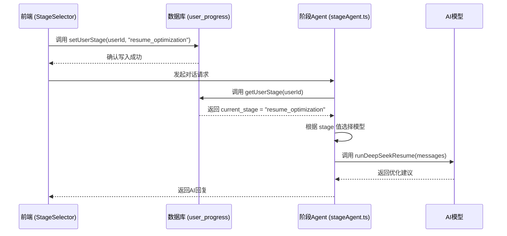
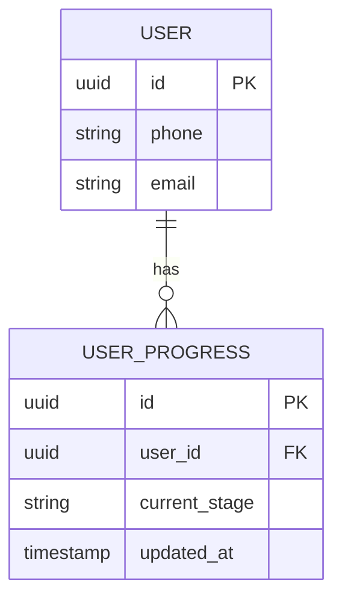
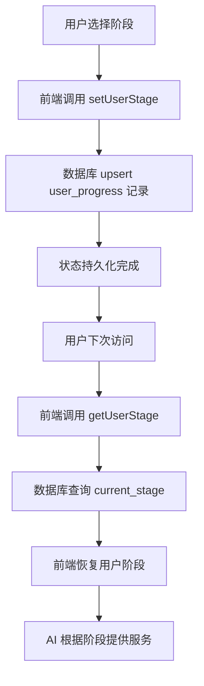

# 用户进度表 (user_progress)

<cite>
**本文档引用的文件**  
- [user_progress 表结构 (Supabase)](file://supabase/schema.sql#L41-L48)
- [user_progress 表结构 (MySQL)](file://mysql/schema.sql#L58-L66)
- [用户阶段定义](file://lib/stage.ts#L6-L85)
- [阶段 Agent 路由](file://lib/orchestrator/stageAgent.ts#L18-L99)
- [数据库操作封装](file://lib/db.ts#L230-L288)
- [阶段选择页面](file://app/onboarding/stage-select/page.tsx#L108-L181)
- [阶段选择器组件](file://components/StageSelector.tsx#L1-L182)
- [API: 阶段开场白](file://app/api/stage-greeting/route.ts#L1-L71)
</cite>

## 目录
1. [用户进度表的核心作用](#用户进度表的核心作用)
2. [current_stage 字段与 AI 行为切换](#current_stage-字段与-ai-行为切换)
3. [UNIQUE(user_id) 约束的设计意图](#uniqueuser_id-约束的设计意图)
4. [updated_at 字段的维护机制](#updated_at-字段的维护机制)
5. [状态持久化与恢复流程](#状态持久化与恢复流程)
6. [个性化求职路径的支撑](#个性化求职路径的支撑)

## 用户进度表的核心作用

`user_progress` 表是整个AI求职教练系统用户流程控制的中枢。它通过一个简洁的结构，持久化地记录了每个用户在求职旅程中的当前所处阶段，从而实现了跨会话、跨设备的流程状态管理。该表的设计确保了系统能够准确地“记住”用户的进度，无论用户何时何地重新进入系统，都能从上次离开的地方无缝继续，为用户提供连贯、个性化的引导体验。

**Section sources**
- [user_progress 表结构 (Supabase)](file://supabase/schema.sql#L41-L48)
- [user_progress 表结构 (MySQL)](file://mysql/schema.sql#L58-L66)

## current_stage 字段与 AI 行为切换

`current_stage` 字段是 `user_progress` 表的核心，它以字符串形式存储用户当前所处的求职阶段，如 `'career_planning'`（职业规划）、`'resume_optimization'`（简历优化）等。这个字段的值直接驱动了AI的行为切换。

系统通过 `lib/stage.ts` 文件中的 `UserStage` 枚举定义了所有可能的阶段值，确保了数据的一致性和类型安全。当用户进入某个阶段时，前端会调用 `lib/db.ts` 中的 `setUserStage` 函数，将用户的 `user_id` 和对应的阶段值（如 `career_planning`）写入 `user_progress` 表。

随后，当AI需要生成回复时，系统会调用 `lib/orchestrator/stageAgent.ts` 中的 `runStageModel` 函数。该函数接收从 `user_progress` 表中读取的 `current_stage` 值，并根据这个值来决定调用哪个具体的AI模型。例如，如果 `current_stage` 是 `resume_optimization`，则系统会路由到简历优化模型，该模型内部嵌入了针对简历优化的特定提示词（prompt），从而生成与该阶段高度相关的、专业的建议。这种基于 `current_stage` 的路由机制，实现了AI行为的精准切换，确保了在不同阶段提供最合适的指导。

**Diagram sources**
- [用户阶段定义](file://lib/stage.ts#L6-L85)
- [阶段 Agent 路由](file://lib/orchestrator/stageAgent.ts#L18-L99)
- [数据库操作封装](file://lib/db.ts#L230-L288)

**Section sources**
- [用户阶段定义](file://lib/stage.ts#L6-L85)
- [阶段 Agent 路由](file://lib/orchestrator/stageAgent.ts#L18-L99)
- [数据库操作封装](file://lib/db.ts#L230-L288)

## UNIQUE(user_id) 约束的设计意图

`user_progress` 表在 `user_id` 字段上设置了 `UNIQUE` 唯一性约束，这是一项关键的设计决策，其核心意图是**确保每个用户在整个系统中仅存在一条进度记录**。

这一设计带来了多重优势：
1.  **数据一致性**：避免了因并发操作或程序错误导致同一个用户产生多条进度记录，从而防止了数据冲突和状态混乱。
2.  **简化逻辑**：在查询用户进度时，系统可以确信 `user_id` 是一个唯一的查找键，无需处理多条记录的情况，简化了 `getUserStage` 等函数的实现逻辑。
3.  **支持 upsert 操作**：该约束使得数据库的 `upsert`（更新或插入）操作成为可能。当调用 `setUserStage` 时，如果用户是首次使用，系统会插入一条新记录；如果用户已存在进度，则会更新其 `current_stage` 字段。这种原子性操作保证了状态更新的可靠性。

**Diagram sources**
- [user_progress 表结构 (Supabase)](file://supabase/schema.sql#L41-L48)

**Section sources**
- [user_progress 表结构 (Supabase)](file://supabase/schema.sql#L41-L48)
- [user_progress 表结构 (MySQL)](file://mysql/schema.sql#L58-L66)

## updated_at 字段的维护机制

`updated_at` 字段用于记录用户进度最后一次被更新的时间，这对于监控用户活跃度和实现某些时间敏感的业务逻辑至关重要。该项目同时支持 PostgreSQL (Supabase) 和 MySQL 两种数据库，两者在维护 `updated_at` 字段上采用了不同的机制，体现了对不同数据库特性的利用。

*   **PostgreSQL (Supabase) 机制**：使用了数据库**触发器 (Trigger)**。在 `supabase/schema.sql` 中，系统创建了一个名为 `update_updated_at_column` 的函数，并为 `user_progress` 表创建了一个 `BEFORE UPDATE` 触发器 `update_progress_updated_at`。这意味着，**无论何时**对 `user_progress` 表的任何记录进行更新操作，数据库都会自动在事务中执行这个函数，将 `NEW.updated_at` 的值设置为当前时间 `NOW()`。这种方式将逻辑封装在数据库层，非常可靠且对应用代码透明。

*   **MySQL 机制**：使用了列定义中的 `ON UPDATE CURRENT_TIMESTAMP` 属性。在 `mysql/schema.sql` 中，`updated_at` 列被定义为 `TIMESTAMP DEFAULT CURRENT_TIMESTAMP ON UPDATE CURRENT_TIMESTAMP`。这表示该字段的默认值是当前时间戳，并且**每当该行被更新时，数据库会自动将其值更新为当前时间戳**。这是一种更简洁的声明式语法，同样能实现自动更新。

两种机制都实现了相同的目标，即自动维护 `updated_at` 字段，但PostgreSQL的触发器提供了更大的灵活性（例如，可以添加更复杂的逻辑），而MySQL的 `ON UPDATE` 语法则更为简洁。

**Section sources**
- [user_progress 表结构 (Supabase)](file://supabase/schema.sql#L57-L83)
- [user_progress 表结构 (MySQL)](file://mysql/schema.sql#L63)

## 状态持久化与恢复流程

`user_progress` 表是实现多阶段引导流程状态持久化与恢复的基础。整个流程如下：

1.  **状态持久化**：当用户在 `onboarding/stage-select` 页面选择一个阶段（如“简历优化”）时，前端组件 `StageSelector` 会捕获用户的 `user_id` 和选中的 `UserStage` 值。随后，它调用 `lib/db.ts` 中的 `setUserStage` 函数，该函数通过 Supabase 客户端执行 `upsert` 操作，将用户的当前阶段写入 `user_progress` 表。此时，用户的进度状态被持久化到数据库中。
2.  **状态恢复**：当用户下次访问系统时，前端（例如在 `chat/page.tsx` 中）会调用 `lib/db.ts` 中的 `getUserStage` 函数。该函数向 `user_progress` 表发起查询，根据 `user_id` 获取 `current_stage` 的值。一旦获取到该值，前端应用的内部状态（如 `userStage`）就会被初始化为这个值，从而将用户“恢复”到他们之前所在的阶段。
3.  **流程衔接**：恢复后的 `current_stage` 值会传递给 `stageAgent.ts`，确保AI从正确的模型开始提供服务，实现了流程的无缝衔接。

**Diagram sources**
- [阶段选择页面](file://app/onboarding/stage-select/page.tsx#L108-L181)
- [数据库操作封装](file://lib/db.ts#L230-L288)
- [阶段选择器组件](file://components/StageSelector.tsx#L1-L182)

**Section sources**
- [阶段选择页面](file://app/onboarding/stage-select/page.tsx#L108-L181)
- [数据库操作封装](file://lib/db.ts#L230-L288)
- [阶段选择器组件](file://components/StageSelector.tsx#L1-L182)

## 个性化求职路径的支撑

`user_progress` 表不仅是一个简单的状态记录器，更是支撑个性化求职路径的基石。通过 `StageOrder` 数组定义的阶段顺序，系统可以引导用户按照“职业规划 -> 项目梳理 -> 简历优化 -> ...”的逻辑流程前进。`getNextStage` 和 `getPrevStage` 等工具函数使得在不同阶段间导航变得简单。

更重要的是，`current_stage` 的值允许系统为不同用户提供差异化的服务。例如，一个处于 `career_planning` 阶段的用户和一个处于 `salary_talk` 阶段的用户，即使他们提出相似的问题，AI也会因为 `current_stage` 的不同而给出截然不同的、符合当前阶段目标的回复。这种基于进度的个性化，使得AI教练能够像真人教练一样，根据用户的实际进展提供精准的指导，从而有效支撑了整个个性化的求职路径。

**Section sources**
- [用户阶段定义](file://lib/stage.ts#L18-L63)
- [阶段选择器组件](file://components/StageSelector.tsx#L1-L182)