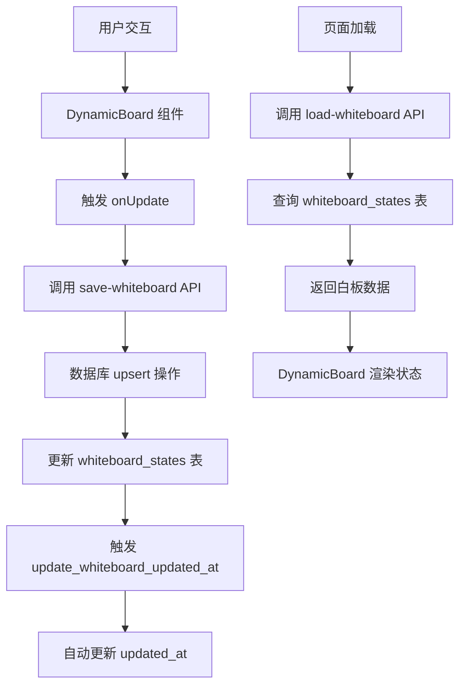

# 白板状态表 (whiteboard_states)

<cite>
**本文档引用的文件**  
- [supabase\schema.sql](file://supabase/schema.sql)
- [mysql\schema.sql](file://mysql/schema.sql)
- [lib\db.ts](file://lib/db.ts)
- [app\api\save-whiteboard\route.ts](file://app/api/save-whiteboard/route.ts)
- [app\api\load-whiteboard\route.ts](file://app/api/load-whiteboard/route.ts)
- [components\DynamicBoard.tsx](file://components/DynamicBoard.tsx)
- [fix-whiteboard-schema.sql](file://fix-whiteboard-schema.sql)
- [lib\whiteboard_implementation.md](file://lib/whiteboard_implementation.md)
</cite>

## 目录
1. [简介](#简介)
2. [表结构与字段说明](#表结构与字段说明)
3. [JSONB与JSON字段类型差异](#jsonb与json字段类型差异)
4. [UNIQUE约束与数据一致性](#unique约束与数据一致性)
5. [动态协作状态的持久化机制](#动态协作状态的持久化机制)
6. [触发器与更新时间维护](#触发器与更新时间维护)
7. [白板状态的加载与保存流程](#白板状态的加载与保存流程)
8. [前端组件与交互实现](#前端组件与交互实现)
9. [数据流与状态同步](#数据流与状态同步)
10. [总结](#总结)

## 简介

白板状态表 `whiteboard_states` 是 AI 求职教练系统中的核心组件之一，用于持久化存储用户在不同会话中的动态协作状态。该表通过结构化方式保存用户在职业规划、项目梳理、简历优化、面试模拟等阶段的交互数据，实现跨会话的状态恢复与实时同步。系统支持 PostgreSQL 和 MySQL 两种数据库后端，分别使用 `JSONB` 和 `JSON` 字段类型存储复杂对象，确保灵活性与性能的平衡。

**Section sources**
- [supabase\schema.sql](file://supabase/schema.sql#L32-L39)
- [mysql\schema.sql](file://mysql/schema.sql#L48-L56)
- [lib\whiteboard_implementation.md](file://lib/whiteboard_implementation.md#L1-L318)

## 表结构与字段说明

`whiteboard_states` 表包含以下核心字段：

| 字段名 | 类型 | 说明 |
|--------|------|------|
| id | UUID/VARCHAR(36) | 主键，唯一标识每条白板状态记录 |
| session_id | UUID/VARCHAR(36) | 外键，关联 `sessions` 表，标识所属会话 |
| whiteboard/data | JSONB/JSON | 存储白板的结构化状态数据 |
| updated_at | TIMESTAMP WITH TIME ZONE/TIMESTAMP | 记录最后更新时间，用于自动维护 |

在 PostgreSQL（Supabase）环境中，该表定义如下：
```sql
CREATE TABLE IF NOT EXISTS whiteboard_states (
  id UUID PRIMARY KEY DEFAULT gen_random_uuid(),
  session_id UUID NOT NULL REFERENCES sessions(id) ON DELETE CASCADE,
  whiteboard JSONB NOT NULL DEFAULT '{}'::jsonb,
  updated_at TIMESTAMP WITH TIME ZONE DEFAULT NOW(),
  UNIQUE(session_id)
);
```

在 MySQL 环境中，该表定义如下：
```sql
CREATE TABLE IF NOT EXISTS whiteboard_states (
  id VARCHAR(36) PRIMARY KEY COMMENT '白板ID（UUID）',
  session_id VARCHAR(36) NOT NULL UNIQUE COMMENT '会话ID（唯一）',
  whiteboard JSON COMMENT '白板状态数据',
  updated_at TIMESTAMP DEFAULT CURRENT_TIMESTAMP ON UPDATE CURRENT_TIMESTAMP COMMENT '更新时间',
  FOREIGN KEY (session_id) REFERENCES sessions(id) ON DELETE CASCADE,
  INDEX idx_session_id (session_id)
);
```

**Section sources**
- [supabase\schema.sql](file://supabase/schema.sql#L32-L39)
- [mysql\schema.sql](file://mysql/schema.sql#L48-L56)

## JSONB与JSON字段类型差异

`whiteboard_states` 表在不同数据库系统中使用了不同的 JSON 类型，以优化性能和功能。

### PostgreSQL 中的 JSONB
在 PostgreSQL 中，`whiteboard` 字段使用 `JSONB` 类型。`JSONB` 是二进制格式的 JSON 存储，具有以下优势：
- **高性能查询**：支持 GIN 索引，允许对 JSON 内部字段进行高效查询。
- **支持修改操作**：可以直接使用 `->` 和 `->>` 操作符访问和修改 JSON 数据。
- **存储效率**：以二进制格式存储，解析速度快，适合频繁读写的场景。

例如，可以通过以下 SQL 查询白板中的特定字段：
```sql
SELECT whiteboard->>'intentRole' FROM whiteboard_states WHERE session_id = '...';
```

### MySQL 中的 JSON
在 MySQL 中，`whiteboard` 字段使用原生 `JSON` 类型。MySQL 的 JSON 类型也支持索引和查询，但性能略逊于 PostgreSQL 的 JSONB：
- **查询语法**：使用 `->` 和 `->>` 操作符，语法与 PostgreSQL 类似。
- **索引支持**：可通过生成列（generated columns）创建索引，但不如 GIN 索引灵活。
- **存储格式**：以文本形式存储，解析开销略高。

尽管类型不同，两种数据库都支持对复杂对象的存储与查询，确保了跨平台的一致性。

**Section sources**
- [supabase\schema.sql](file://supabase/schema.sql#L36)
- [mysql\schema.sql](file://mysql/schema.sql#L52)
- [lib\whiteboard_implementation.md](file://lib/whiteboard_implementation.md#L1-L318)

## UNIQUE约束与数据一致性

`whiteboard_states` 表通过 `UNIQUE(session_id)` 约束确保每个会话仅有一个白板状态记录，防止数据冲突和重复存储。

### 唯一性约束的作用
- **数据完整性**：确保每个 `session_id` 在表中唯一，避免同一会话出现多个白板状态。
- **简化查询**：查询时无需处理多条记录，直接通过 `session_id` 获取唯一白板状态。
- **upsert 操作支持**：在插入或更新时，若 `session_id` 已存在，则执行更新操作而非插入，保证状态的连续性。

在代码层面，`saveWhiteboard` 函数通过 `upsert` 操作实现此逻辑：
```ts
await client.from('whiteboard_states').upsert(upsertData, {
  onConflict: 'session_id',
});
```

当用户在某个会话中进行交互时，系统会自动更新该会话的白板状态，而不会创建新记录，从而确保数据一致性。

**Section sources**
- [supabase\schema.sql](file://supabase/schema.sql#L38)
- [lib\db.ts](file://lib/db.ts#L165)
- [app\api\save-whiteboard\route.ts](file://app/api/save-whiteboard/route.ts#L40)

## 动态协作状态的持久化机制

`whiteboard_states` 表通过与 `save-whiteboard` API 和 `DynamicBoard` 组件的协同工作，实现了用户绘图、文本标注等交互状态的实时同步与恢复。

### 状态持久化流程
1. **前端交互**：用户在 `DynamicBoard` 组件中进行操作（如添加技能、编辑项目）。
2. **状态更新**：组件通过 `onUpdate` 回调将新状态传递给父组件。
3. **API 调用**：父组件调用 `/api/save-whiteboard` 接口，将状态数据发送至后端。
4. **数据库存储**：后端通过 `upsert` 操作将数据持久化到 `whiteboard_states` 表。

### 数据结构示例
白板状态以 JSON 格式存储，包含多个动态字段：
```json
{
  "intent": "产品经理",
  "skills": ["React", "TypeScript"],
  "projects": [
    {
      "id": "proj-001",
      "name": "电商系统",
      "description": "负责前端架构设计"
    }
  ],
  "resumeSummary": "5年经验的全栈开发"
}
```

该结构支持灵活扩展，不同阶段可添加新的字段类型，如面试报告、薪资策略等。

**Section sources**
- [app\api\save-whiteboard\route.ts](file://app/api/save-whiteboard/route.ts#L1-L48)
- [components\DynamicBoard.tsx](file://components/DynamicBoard.tsx#L1-L247)
- [lib\whiteboard_implementation.md](file://lib/whiteboard_implementation.md#L1-L318)

## 触发器与更新时间维护

`whiteboard_states` 表通过数据库触发器 `update_whiteboard_updated_at` 自动维护 `updated_at` 字段，确保每次更新时时间戳自动刷新。

### 触发器实现
在 PostgreSQL 中，触发器定义如下：
```sql
CREATE TRIGGER update_whiteboard_updated_at
  BEFORE UPDATE ON whiteboard_states
  FOR EACH ROW
  EXECUTE FUNCTION update_updated_at_column();
```

该触发器调用 `update_updated_at_column` 函数，将 `NEW.updated_at` 设置为当前时间：
```sql
CREATE OR REPLACE FUNCTION update_updated_at_column()
RETURNS TRIGGER AS $$
BEGIN
  NEW.updated_at = NOW();
  RETURN NEW;
END;
$$ LANGUAGE plpgsql;
```

### 自动更新的优势
- **减少应用层逻辑**：无需在每次更新时手动设置时间戳，降低代码复杂度。
- **数据一致性**：确保所有更新操作都记录准确时间，避免时钟偏差。
- **审计与调试**：`updated_at` 字段可用于追踪状态变更历史，便于问题排查。

**Section sources**
- [supabase\schema.sql](file://supabase/schema.sql#L73-L76)
- [supabase\schema.sql](file://supabase/schema.sql#L58-L64)

## 白板状态的加载与保存流程

白板状态的加载与保存通过 `save-whiteboard` 和 `load-whiteboard` 两个 API 端点实现，形成完整的状态管理闭环。

### 保存流程 (`save-whiteboard`)
1. **认证检查**：API 验证用户身份，确保操作合法性。
2. **数据验证**：检查请求体中是否存在 `data` 字段，并阻止敏感信息（如 API Key）提交。
3. **数据库操作**：调用 `upsert` 将数据写入 `whiteboard_states` 表，以 `user_id` 为冲突键。
4. **响应返回**：成功则返回 `{ ok: true }`，失败则返回错误信息。

```ts
await db.from("whiteboard_states").upsert({
  user_id: user.id,
  data,
  updated_at: new Date().toISOString(),
}, {
  onConflict: 'user_id',
});
```

### 加载流程 (`load-whiteboard`)
1. **认证检查**：验证用户身份。
2. **数据库查询**：根据 `user_id` 从 `whiteboard_states` 表中查询白板数据。
3. **错误处理**：若无记录（`PGRST116` 错误码），返回空对象；其他错误则记录日志。
4. **响应返回**：返回 `{ ok: true, data: {...} }`。

```ts
const { data, error } = await db
  .from("whiteboard_states")
  .select("data")
  .eq("user_id", user.id)
  .single();
```

**Section sources**
- [app\api\save-whiteboard\route.ts](file://app/api/save-whiteboard/route.ts#L1-L48)
- [app\api\load-whiteboard\route.ts](file://app/api/load-whiteboard/route.ts#L1-L39)
- [lib\db.ts](file://lib/db.ts#L144-L228)

## 前端组件与交互实现

`DynamicBoard` 组件是白板功能的前端核心，负责渲染和管理用户交互状态。

### 组件功能
- **动态渲染**：根据 `parsedData` 中的字段类型，动态渲染不同类型的卡片（如技能、项目、简历摘要）。
- **交互支持**：提供可编辑字段（`EditableField`）、可编辑列表（`EditableList`）和可编辑项目（`EditableProjects`），支持用户直接修改内容。
- **路由跳转**：卡片支持点击跳转至详情页（如简历对比、面试报告）。

### 状态管理
组件通过 `onUpdate` 回调将变更传递给父组件，父组件负责调用 `save-whiteboard` API 持久化状态。同时，组件在加载时通过 `load-whiteboard` API 恢复历史状态，实现跨会话一致性。

```tsx
const handleUpdate = (field: keyof ParsedData, value: any) => {
  if (onUpdate && parsedData) {
    const updatedData = { ...parsedData, [field]: value };
    onUpdate(updatedData);
  }
};
```

**Section sources**
- [components\DynamicBoard.tsx](file://components/DynamicBoard.tsx#L1-L247)
- [lib\whiteboard_implementation.md](file://lib/whiteboard_implementation.md#L1-L318)

## 数据流与状态同步

系统的数据流设计确保了白板状态的实时同步与持久化。



**Diagram sources**
- [components\DynamicBoard.tsx](file://components/DynamicBoard.tsx#L1-L247)
- [app\api\save-whiteboard\route.ts](file://app/api/save-whiteboard/route.ts#L1-L48)
- [app\api\load-whiteboard\route.ts](file://app/api/load-whiteboard/route.ts#L1-L39)
- [supabase\schema.sql](file://supabase/schema.sql#L73-L76)

## 总结

`whiteboard_states` 表通过合理的表结构设计、数据库特性利用和前后端协同，实现了动态协作状态的高效持久化。其核心机制包括：
- 使用 `JSONB`/`JSON` 字段灵活存储复杂对象。
- 通过 `UNIQUE(session_id)` 约束确保数据一致性。
- 利用触发器自动维护 `updated_at` 时间戳。
- 通过 `save-whiteboard` 和 `load-whiteboard` API 实现状态的实时同步与恢复。
- 前端 `DynamicBoard` 组件提供直观的交互界面。

该设计不仅支持当前功能需求，还具备良好的扩展性，可适应未来新增的协作场景。