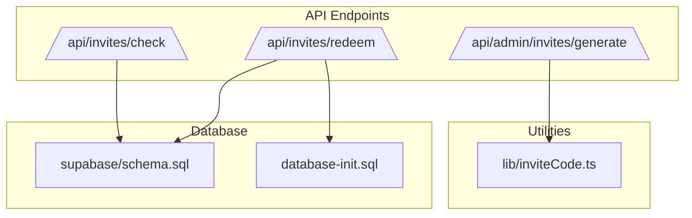
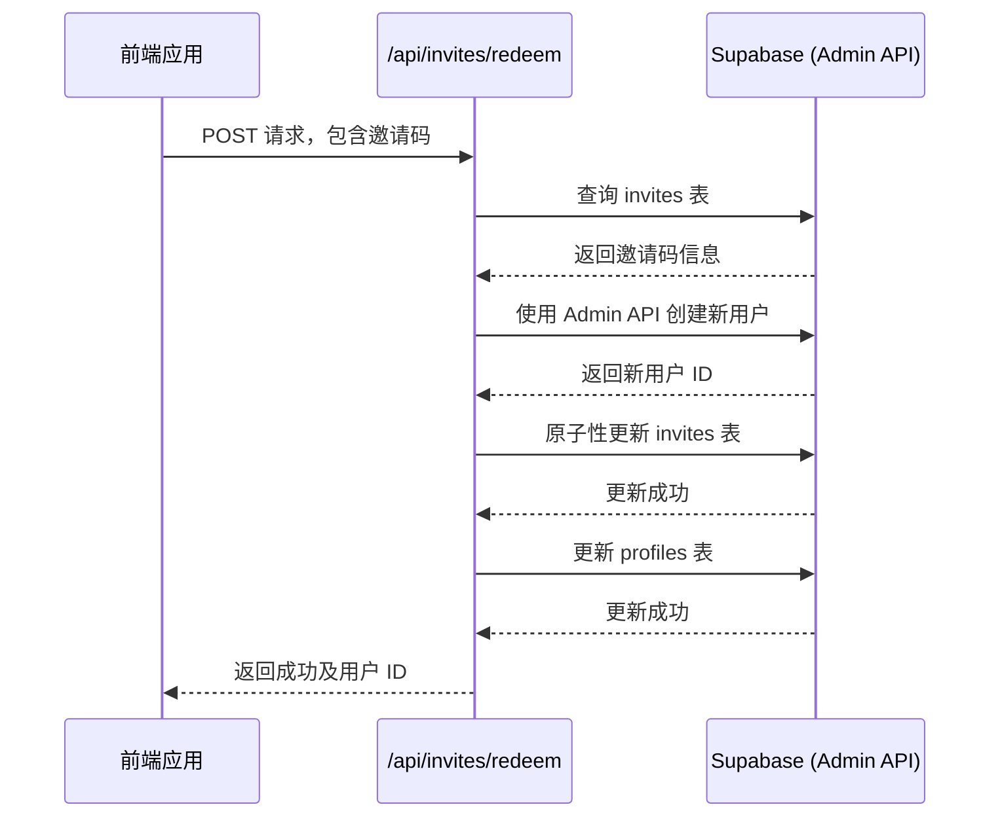
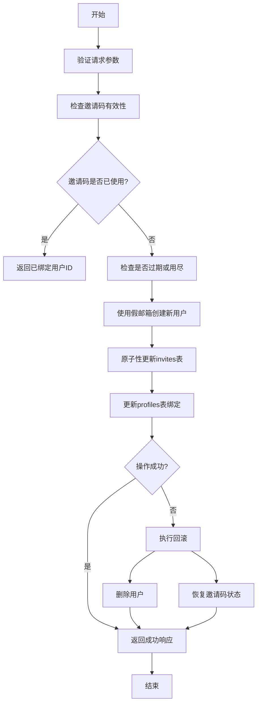
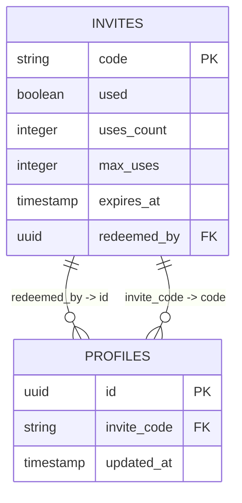
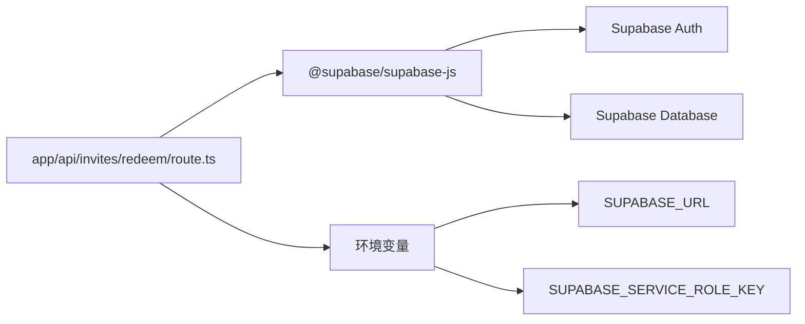

# 邀请码兑换与用户绑定

<cite>
**本文档引用文件**  
- [app/api/invites/redeem/route.ts](file://app/api/invites/redeem/route.ts)
- [app/api/invites/check/route.ts](file://app/api/invites/check/route.ts)
- [app/api/admin/invites/generate/route.ts](file://app/api/admin/invites/generate/route.ts)
- [lib/inviteCode.ts](file://lib/inviteCode.ts)
- [supabase/schema.sql](file://supabase/schema.sql)
- [database-init.sql](file://database-init.sql)
</cite>

## 目录
1. [简介](#简介)
2. [项目结构](#项目结构)
3. [核心组件](#核心组件)
4. [架构概述](#架构概述)
5. [详细组件分析](#详细组件分析)
6. [依赖分析](#依赖分析)
7. [性能考虑](#性能考虑)
8. [故障排除指南](#故障排除指南)
9. [结论](#结论)

## 简介
本文档全面阐述了邀请码兑换（`/api/invites/redeem`）的完整流程及其与用户系统的集成机制。重点分析了如何通过 Supabase Service Role Key 进行高权限操作，实现邀请码验证、用户创建、状态更新和数据绑定的原子性操作。同时，结合数据库模式设计，说明该机制在用户身份绑定与访问控制中的关键作用。

## 项目结构
项目采用基于功能的模块化结构，核心 API 路由位于 `app/api` 目录下。邀请码相关功能集中于 `app/api/invites` 子目录，包括兑换（redeem）、检查（check）和管理（admin/invites/generate）等接口。数据库模式定义在 `supabase/schema.sql` 和 `database-init.sql` 中，而邀请码生成逻辑则封装在 `lib/inviteCode.ts` 工具库中。

**图示来源**
- [app/api/invites/redeem/route.ts](file://app/api/invites/redeem/route.ts)
- [app/api/invites/check/route.ts](file://app/api/invites/check/route.ts)
- [app/api/admin/invites/generate/route.ts](file://app/api/admin/invites/generate/route.ts)
- [lib/inviteCode.ts](file://lib/inviteCode.ts)
- [supabase/schema.sql](file://supabase/schema.sql)
- [database-init.sql](file://database-init.sql)

**章节来源**
- [app/api/invites/redeem/route.ts](file://app/api/invites/redeem/route.ts)
- [supabase/schema.sql](file://supabase/schema.sql)
- [database-init.sql](file://database-init.sql)

## 核心组件
核心组件包括邀请码兑换 API (`/api/invites/redeem`)、邀请码检查 API (`/api/invites/check`) 和邀请码生成 API (`/api/admin/invites/generate`)。这些组件协同工作，实现了从邀请码创建、状态查询到用户绑定的完整生命周期管理。其中，兑换流程是核心，它利用 Supabase Admin API 在高权限下完成用户创建和数据更新。

**章节来源**
- [app/api/invites/redeem/route.ts](file://app/api/invites/redeem/route.ts#L22-L315)
- [app/api/invites/check/route.ts](file://app/api/invites/check/route.ts#L28-L306)
- [app/api/admin/invites/generate/route.ts](file://app/api/admin/invites/generate/route.ts#L25-L201)

## 架构概述
系统采用前后端分离架构，前端通过 API 调用与后端交互。邀请码兑换流程的核心在于使用 Supabase Service Role Key 绕过常规的 RLS（Row Level Security）策略，直接对 `invites` 和 `profiles` 表进行高权限的读写操作。这确保了在用户注册前就能完成关键的数据绑定。

**图示来源**
- [app/api/invites/redeem/route.ts](file://app/api/invites/redeem/route.ts#L22-L315)

## 详细组件分析
### 邀请码兑换流程分析
`/api/invites/redeem` 接口处理 POST 请求，接收邀请码并执行兑换流程。其核心是五个步骤的原子性操作。

#### 兑换流程步骤

**图示来源**
- [app/api/invites/redeem/route.ts](file://app/api/invites/redeem/route.ts#L22-L315)

**章节来源**
- [app/api/invites/redeem/route.ts](file://app/api/invites/redeem/route.ts#L22-L315)

### 数据库表结构分析
`invites` 和 `profiles` 表的设计是实现用户绑定的关键。`invites` 表记录邀请码的元数据，而 `profiles` 表则通过 `invite_code` 字段与之关联。

#### 表结构关系

**图示来源**
- [supabase/schema.sql](file://supabase/schema.sql)
- [database-init.sql](file://database-init.sql)

**章节来源**
- [supabase/schema.sql](file://supabase/schema.sql#L1-L83)
- [database-init.sql](file://database-init.sql#L1-L45)

## 依赖分析
该功能依赖于 Supabase 作为后端即服务（BaaS）平台，利用其身份验证（Auth）和数据库（PostgreSQL）服务。代码层面，`app/api/invites/redeem/route.ts` 依赖于 `@supabase/supabase-js` 客户端库和环境变量（`SUPABASE_URL` 和 `SUPABASE_SERVICE_ROLE_KEY`）。

**图示来源**
- [app/api/invites/redeem/route.ts](file://app/api/invites/redeem/route.ts#L2)
- [app/api/invites/redeem/route.ts](file://app/api/invites/redeem/route.ts#L25-L26)

**章节来源**
- [app/api/invites/redeem/route.ts](file://app/api/invites/redeem/route.ts#L1-L315)

## 性能考虑
- **数据库索引**：`invites` 表的 `code` 字段应有唯一索引以确保快速查找。
- **原子性操作**：使用条件更新（`eq("used", false)`）来防止并发冲突，但高并发下仍可能因失败重试而影响性能。
- **错误回滚**：回滚机制增加了代码复杂性，但在失败时能保证数据一致性。

## 故障排除指南
常见问题及解决方案：
- **500 错误 "SUPABASE_URL 或 SUPABASE_SERVICE_ROLE_KEY 未配置"**：检查环境变量是否正确设置。
- **400 错误 "邀请码不存在"**：确认提供的邀请码拼写正确，并存在于 `invites` 表中。
- **400 错误 "邀请码已被其他用户使用"**：这是并发控制的结果，提示用户刷新页面或稍后重试。
- **500 错误 "创建用户失败"**：检查 Supabase 服务是否正常，以及假邮箱是否因冲突导致创建失败。

**章节来源**
- [app/api/invites/redeem/route.ts](file://app/api/invites/redeem/route.ts#L28-L35)
- [app/api/invites/redeem/route.ts](file://app/api/invites/redeem/route.ts#L91-L98)
- [app/api/invites/redeem/route.ts](file://app/api/invites/redeem/route.ts#L247-L255)

## 结论
邀请码兑换流程是一个精心设计的原子性操作，它通过 Supabase Service Role Key 实现了高权限的数据操作，确保了用户创建与身份绑定的安全性和一致性。`invites` 和 `profiles` 表的结构设计巧妙地利用了邀请码作为连接点，为系统的用户增长和访问控制提供了坚实的基础。该机制在保证功能完整性的同时，也通过回滚策略维护了数据的最终一致性。