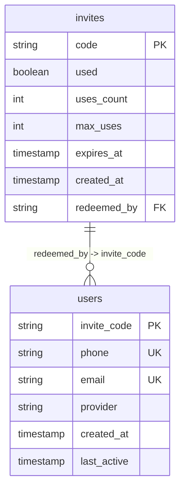

# 邀请码生成机制

<cite>
**本文档引用文件**  
- [lib/inviteCode.ts](file://lib/inviteCode.ts)
- [app/api/admin/invites/generate/route.ts](file://app/api/admin/invites/generate/route.ts)
- [app/api/invites/check/route.ts](file://app/api/invites/check/route.ts)
- [app/api/invites/redeem/route.ts](file://app/api/invites/redeem/route.ts)
- [mysql/schema.sql](file://mysql/schema.sql)
- [supabase/schema.sql](file://supabase/schema.sql)
- [database-init.sql](file://database-init.sql)
</cite>

## 目录
1. [简介](#简介)
2. [核心生成逻辑](#核心生成逻辑)
3. [格式校验机制](#格式校验机制)
4. [唯一性保障策略](#唯一性保障策略)
5. [管理员接口实现](#管理员接口实现)
6. [数据库结构与持久化](#数据库结构与持久化)
7. [使用流程与状态管理](#使用流程与状态管理)
8. [性能分析与碰撞概率](#性能分析与碰撞概率)
9. [调用示例与最佳实践](#调用示例与最佳实践)

## 简介
ai-job-coach 系统采用基于邀请码的用户身份识别机制，邀请码不仅作为用户注册的准入凭证，还作为用户的唯一标识符（User ID）。该机制通过 `lib/inviteCode.ts` 提供核心生成与验证功能，并由多个 API 路由协同完成生成、校验和兑换流程。本文档详细解析其生成逻辑、唯一性保障、接口调用及系统集成。

## 核心生成逻辑
邀请码的生成遵循易读性与唯一性并重的原则。核心函数 `generateInviteCode` 采用预定义字符集，排除了视觉上易混淆的字符（如 `0` 与 `O`，`I` 与 `1`），确保用户在口头或手写传递时不易出错。

生成过程使用 JavaScript 内置的 `Math.random()` 函数，通过循环指定长度，每次从字符集中随机选取一个字符进行拼接。默认长度为 6 位，但系统在实际调用中通常使用 8 位以增强唯一性。

**Section sources**
- [lib/inviteCode.ts](file://lib/inviteCode.ts#L12-L22)

## 格式校验机制
系统通过 `isValidInviteCode` 函数对邀请码的格式进行严格校验。校验规则定义在正则表达式 `/^[A-Z0-9]{6,20}$/` 中，具体包括：
- **字符集限制**：仅允许大写字母（A-Z）和数字（0-9）。
- **长度范围**：邀请码长度必须在 6 到 20 位之间。

此校验是所有邀请码操作的第一道防线，确保后续的数据库查询和业务逻辑处理都基于格式正确的输入。

**Section sources**
- [lib/inviteCode.ts](file://lib/inviteCode.ts#L29-L32)

## 唯一性保障策略
为确保生成的邀请码在系统中全局唯一，`lib/inviteCode.ts` 提供了 `generateUniqueInviteCode` 函数。该函数结合了重试机制和长度自适应策略，有效应对了哈希碰撞问题。

其工作流程如下：
1.  **循环尝试**：函数会进行最多 `maxAttempts` 次（默认10次）尝试。
2.  **可用性检查**：每次生成一个随机码后，都会调用传入的 `checkExists` 异步函数查询数据库，确认该码是否已存在。
3.  **长度自适应**：若在最大尝试次数内仍无法生成唯一码，函数会自动将邀请码长度加1（`length + 1`），并递归调用自身。此策略利用了组合数学原理，长度每增加一位，可用的组合数（32^n）呈指数级增长，极大降低了冲突概率。
4.  **异常终止**：当长度达到10位仍无法生成时，抛出异常，提示系统可能存在问题。

这种“先重试，后加长”的策略在保证效率的同时，也提供了极高的可靠性。

**Section sources**
- [lib/inviteCode.ts](file://lib/inviteCode.ts#L59-L78)

## 管理员接口实现
管理员通过调用 `POST /api/admin/invites/generate` 接口批量生成邀请码。该接口的实现逻辑如下：

1.  **参数验证**：严格校验请求体中的 `count`（生成数量，1-100）和可选的 `max_uses`（最大使用次数）参数。
2.  **数据库预查询**：为避免与现有码冲突，接口首先从 `invites` 表中查询所有已存在的邀请码，并存入内存中的 `Set` 结构，以实现 O(1) 的快速查找。
3.  **批量生成**：使用 `generateInviteCode(8)` 生成8位长的邀请码。在生成每个码时，都会检查其是否存在于预查询的 `Set` 中。若存在，则进行最多100次的重新生成尝试。
4.  **持久化存储**：将生成的邀请码列表与元数据（如 `max_uses`、`created_at`）一起批量插入 `invites` 表。

值得注意的是，该接口并未直接使用 `generateUniqueInviteCode` 函数，而是实现了类似的唯一性检查逻辑，这可能是为了在批量生成场景下获得更好的性能和控制力。

**Section sources**
- [app/api/admin/invites/generate/route.ts](file://app/api/admin/invites/generate/route.ts#L147-L187)

## 数据库结构与持久化
邀请码的持久化依赖于数据库中的 `invites` 表。根据 `mysql/schema.sql` 文件，该表的核心结构如下：

```sql
CREATE TABLE IF NOT EXISTS invites (
  code VARCHAR(20) PRIMARY KEY COMMENT '邀请码',
  used BOOLEAN DEFAULT FALSE COMMENT '是否已被使用',
  uses_count INT DEFAULT 0 COMMENT '已使用次数',
  max_uses INT DEFAULT 1 COMMENT '最大使用次数',
  expires_at TIMESTAMP COMMENT '过期时间',
  created_at TIMESTAMP DEFAULT CURRENT_TIMESTAMP COMMENT '创建时间',
  redeemed_by VARCHAR(20) COMMENT '兑换者ID（用户邀请码）'
);
```

关键字段说明：
- **code**：邀请码本身，作为主键保证唯一性。
- **max_uses** 和 **uses_count**：支持一次邀请码被多次使用（如团队邀请），通过计数器进行管理。
- **expires_at**：可设置邀请码的有效期，过期后无法使用。
- **redeemed_by**：记录成功兑换该邀请码的用户ID（即用户的邀请码）。

**Diagram sources**
- [mysql/schema.sql](file://mysql/schema.sql#L1-L83)



## 使用流程与状态管理
邀请码的完整生命周期由三个核心API管理：

1.  **生成** (`/api/admin/invites/generate`)：由管理员调用，创建新的邀请码记录。
2.  **校验** (`/api/invites/check`)：供前端调用，检查邀请码的状态。其返回的状态包括：
    - `valid`：有效且可使用。
    - `remaining`：有效，但剩余使用次数为1。
    - `expired`：已过期。
    - `redeemed`：已被使用或次数用尽。
    - `invalid`：不存在。
3.  **兑换** (`/api/invites/redeem`)：用户注册时调用。此接口执行一个关键的原子化操作：
    - 查询邀请码。
    - 验证其有效性（未过期、次数未用完）。
    - 在 Supabase 中创建新用户。
    - **原子性更新**：使用数据库的条件更新（`UPDATE ... WHERE code = ? AND used = false`）来确保同一邀请码不会被两个并发请求同时兑换成功，防止了“超卖”问题。

**Section sources**
- [app/api/invites/check/route.ts](file://app/api/invites/check/route.ts#L78-L133)
- [app/api/invites/redeem/route.ts](file://app/api/invites/redeem/route.ts#L84-L235)

## 性能分析与碰撞概率
- **生成效率**：单次生成操作的时间复杂度为 O(n)，其中 n 为邀请码长度。由于长度固定（6-8位），生成速度极快。
- **碰撞概率**：使用32个字符（26字母+6数字）的字符集，6位码的组合数为 32^6 ≈ 10.7亿，8位码为 32^8 ≈ 1.1万亿。在系统用户量远低于此数量级时，碰撞概率极低。`generateUniqueInviteCode` 的重试和加长机制为高并发场景提供了双重保障。

## 调用示例与最佳实践
以下为生成唯一邀请码的标准调用方式：

```typescript
// 定义检查函数
const checkExists = async (code: string): Promise<boolean> => {
  const { count } = await supabase
    .from('invites')
    .select('code', { count: 'exact', head: true })
    .eq('code', code);
  return count > 0;
};

// 生成唯一邀请码
const uniqueCode = await generateUniqueInviteCode(checkExists);
console.log(uniqueCode); // 例如: "A7B8C9D2"
```

**最佳实践建议**：
1.  **使用8位长度**：在 `generateUniqueInviteCode` 中默认使用8位，以获得更长的安全边际。
2.  **设置合理过期时间**：对于时效性强的邀请活动，应设置 `expires_at` 字段。
3.  **监控生成失败**：若 `generateUniqueInviteCode` 抛出异常，应作为严重事件进行告警，可能意味着系统存在异常或被恶意攻击。