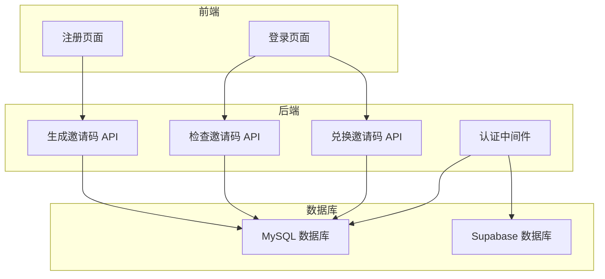
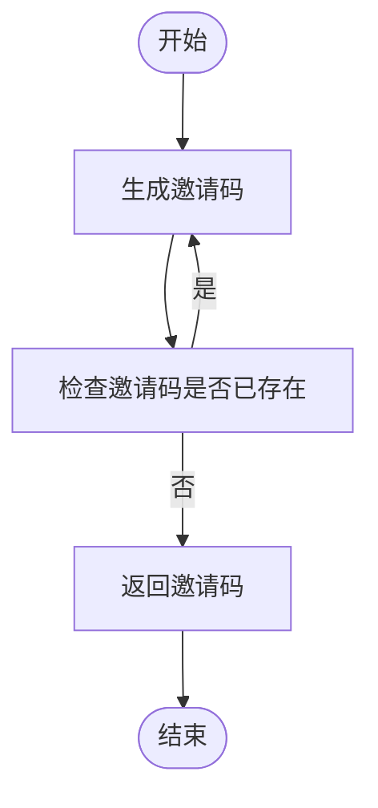
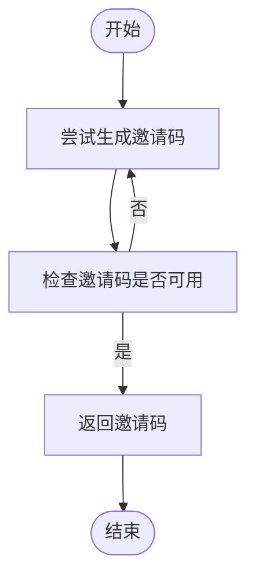
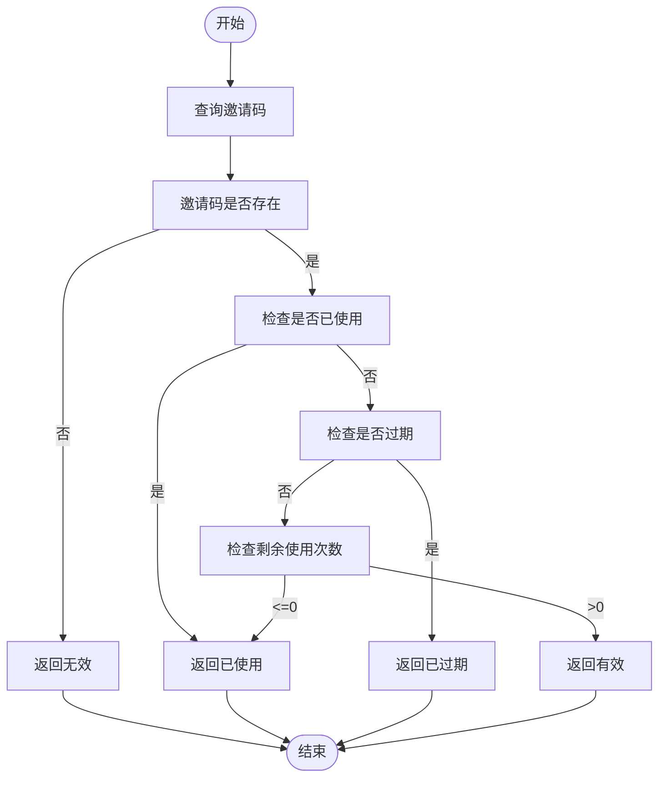
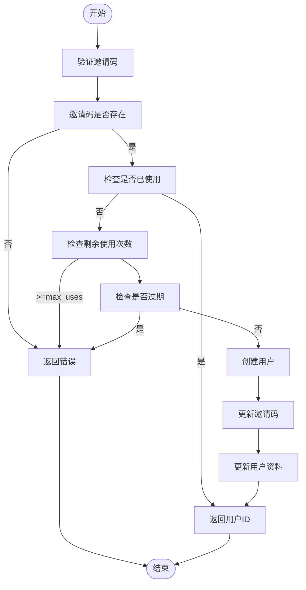
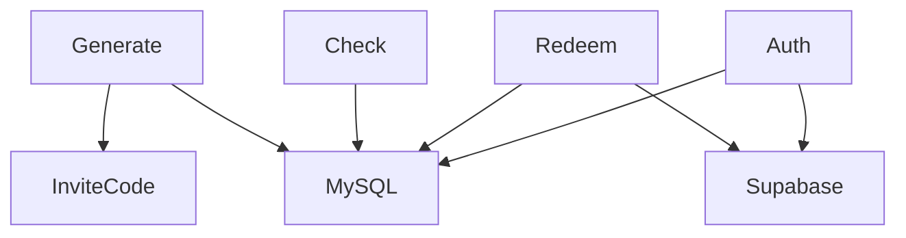

# 邀请码系统设计

<cite>
**本文档引用文件**  
- [schema.sql](file://mysql/schema.sql)
- [generate/route.ts](file://app/api/admin/invites/generate/route.ts)
- [check/route.ts](file://app/api/invites/check/route.ts)
- [redeem/route.ts](file://app/api/invites/redeem/route.ts)
- [inviteCode.ts](file://lib/inviteCode.ts)
- [create-session/route.ts](file://app/api/auth/create-session/route.ts)
- [middleware.ts](file://middleware.ts)
- [login/page.tsx](file://app/login/page.tsx)
- [supabase/schema.sql](file://supabase/schema.sql)
</cite>

## 目录
1. [简介](#简介)
2. [项目结构](#项目结构)
3. [核心组件](#核心组件)
4. [架构概述](#架构概述)
5. [详细组件分析](#详细组件分析)
6. [依赖分析](#依赖分析)
7. [性能考虑](#性能考虑)
8. [故障排除指南](#故障排除指南)
9. [结论](#结论)

## 简介
ai-job-coach 系统采用邀请码作为用户唯一标识，构建了一套完整的注册与认证流程。该系统通过 MySQL 数据库的 users 表以 invite_code 为主键的设计，实现了用户身份的绑定与访问控制。本系统支持灰度发布，并通过 check 和 redeem 等 API 验证和兑换邀请码。此外，系统还提供了生成邀请码的功能，确保邀请码的唯一性和安全性。

## 项目结构
ai-job-coach 项目的结构清晰，主要分为以下几个部分：
- `app/api/admin/invites/generate/route.ts`：生成邀请码的 API。
- `app/api/invites/check/route.ts`：检查邀请码状态的 API。
- `app/api/invites/redeem/route.ts`：兑换邀请码并创建用户的 API。
- `lib/inviteCode.ts`：生成和验证邀请码的工具函数。
- `mysql/schema.sql`：MySQL 数据库的 schema 定义。
- `supabase/schema.sql`：Supabase 数据库的 schema 定义。
- `middleware.ts`：中间件，用于认证拦截。
- `app/login/page.tsx`：登录页面，用户输入邀请码进行登录。

**图表来源**
- [login/page.tsx](file://app/login/page.tsx)
- [generate/route.ts](file://app/api/admin/invites/generate/route.ts)
- [check/route.ts](file://app/api/invites/check/route.ts)
- [redeem/route.ts](file://app/api/invites/redeem/route.ts)
- [mysql/schema.sql](file://mysql/schema.sql)
- [supabase/schema.sql](file://supabase/schema.sql)

## 核心组件
### 生成邀请码
`app/api/admin/invites/generate/route.ts` 文件中的 `POST /api/admin/invites/generate` API 用于生成指定数量的邀请码。该 API 接收一个包含 `count` 和 `max_uses` 参数的请求体，生成指定数量的邀请码并写入 invites 表。生成的邀请码长度为 8 位，字符集为大写字母和数字，排除容易混淆的字符（0, O, I, 1）。为了确保邀请码的唯一性，系统会先查询已存在的邀请码，然后在生成新邀请码时避免重复。

**代码路径**
- [generate/route.ts](file://app/api/admin/invites/generate/route.ts#L1-L232)

### 检查邀请码
`app/api/invites/check/route.ts` 文件中的 `GET /api/invites/check` 和 `POST /api/invites/check` API 用于检查邀请码的状态。这两个 API 接收一个包含 `code` 参数的查询参数或请求体，返回邀请码的状态信息。状态包括 `valid`（有效）、`remaining`（剩余使用次数）、`expired`（已过期）、`redeemed`（已被使用）和 `invalid`（无效）。系统会根据邀请码的使用情况和过期时间来判断其状态。

**代码路径**
- [check/route.ts](file://app/api/invites/check/route.ts#L1-L306)

### 兑换邀请码
`app/api/invites/redeem/route.ts` 文件中的 `POST /api/invites/redeem` API 用于兑换邀请码并创建用户。该 API 接收一个包含 `code` 参数的请求体，验证邀请码的有效性后，创建一个新用户或查找已有用户，并将邀请码与用户绑定。系统会更新 invites 表中的使用次数和 redeemed_by 字段，并更新 profiles 表中的 invite_code 字段。

**代码路径**
- [redeem/route.ts](file://app/api/invites/redeem/route.ts#L1-L317)

### 生成和验证邀请码
`lib/inviteCode.ts` 文件中的 `generateInviteCode` 函数用于生成邀请码，`isValidInviteCode` 函数用于验证邀请码格式，`isInviteCodeAvailable` 函数用于检查邀请码是否已存在，`generateUniqueInviteCode` 函数用于生成唯一的邀请码。这些函数确保了邀请码的生成和验证过程的安全性和唯一性。

**代码路径**
- [inviteCode.ts](file://lib/inviteCode.ts#L1-L84)

## 架构概述
ai-job-coach 系统的架构设计如下：
- **前端**：用户通过登录页面输入邀请码，前端调用 check 和 redeem API 进行验证和兑换。
- **后端**：后端提供生成、检查和兑换邀请码的 API，处理用户请求并更新数据库。
- **数据库**：MySQL 和 Supabase 数据库存储用户信息和邀请码信息，确保数据的一致性和安全性。

**图表来源**
- [login/page.tsx](file://app/login/page.tsx)
- [generate/route.ts](file://app/api/admin/invites/generate/route.ts)
- [check/route.ts](file://app/api/invites/check/route.ts)
- [redeem/route.ts](file://app/api/invites/redeem/route.ts)
- [mysql/schema.sql](file://mysql/schema.sql)
- [supabase/schema.sql](file://supabase/schema.sql)

## 详细组件分析
### 生成邀请码
#### 生成逻辑
`generateInviteCode` 函数生成 8 位长度的邀请码，字符集为大写字母和数字，排除容易混淆的字符（0, O, I, 1）。为了确保邀请码的唯一性，系统会先查询已存在的邀请码，然后在生成新邀请码时避免重复。

**图表来源**
- [inviteCode.ts](file://lib/inviteCode.ts#L12-L22)

#### 唯一性保证
`generateUniqueInviteCode` 函数通过多次尝试生成唯一的邀请码。如果多次尝试都重复，系统会增加邀请码长度再试，直到生成唯一的邀请码。

**图表来源**
- [inviteCode.ts](file://lib/inviteCode.ts#L59-L78)

### 检查邀请码
#### 状态判断
`check/route.ts` 文件中的 `GET /api/invites/check` 和 `POST /api/invites/check` API 通过查询 invites 表来判断邀请码的状态。系统会根据邀请码的使用情况和过期时间来判断其状态。

**图表来源**
- [check/route.ts](file://app/api/invites/check/route.ts#L78-L133)

### 兑换邀请码
#### 创建用户
`redeem/route.ts` 文件中的 `POST /api/invites/redeem` API 通过验证邀请码的有效性后，创建一个新用户或查找已有用户，并将邀请码与用户绑定。系统会更新 invites 表中的使用次数和 redeemed_by 字段，并更新 profiles 表中的 invite_code 字段。

**图表来源**
- [redeem/route.ts](file://app/api/invites/redeem/route.ts#L84-L307)

## 依赖分析
ai-job-coach 系统的依赖关系如下：
- `app/api/admin/invites/generate/route.ts` 依赖于 `lib/inviteCode.ts` 和 `mysql/schema.sql`。
- `app/api/invites/check/route.ts` 依赖于 `mysql/schema.sql`。
- `app/api/invites/redeem/route.ts` 依赖于 `mysql/schema.sql` 和 `supabase/schema.sql`。
- `middleware.ts` 依赖于 `supabase/schema.sql` 和 `mysql/schema.sql`。

**图表来源**
- [generate/route.ts](file://app/api/admin/invites/generate/route.ts)
- [check/route.ts](file://app/api/invites/check/route.ts)
- [redeem/route.ts](file://app/api/invites/redeem/route.ts)
- [mysql/schema.sql](file://mysql/schema.sql)
- [supabase/schema.sql](file://supabase/schema.sql)

## 性能考虑
- **数据库查询优化**：系统在生成和检查邀请码时，会先查询已存在的邀请码，避免重复生成。这减少了数据库的写入操作，提高了性能。
- **并发处理**：系统在生成邀请码时，会使用 `generateUniqueInviteCode` 函数，通过多次尝试生成唯一的邀请码。如果多次尝试都重复，系统会增加邀请码长度再试，确保生成的邀请码是唯一的。
- **缓存机制**：系统在检查邀请码时，会缓存已查询的邀请码状态，减少数据库查询次数，提高响应速度。

## 故障排除指南
- **邀请码生成失败**：检查 `generate/route.ts` 文件中的 `generateInviteCode` 函数，确保字符集和长度设置正确。检查 `generateUniqueInviteCode` 函数，确保多次尝试生成唯一的邀请码。
- **邀请码检查失败**：检查 `check/route.ts` 文件中的 `GET /api/invites/check` 和 `POST /api/invites/check` API，确保查询 invites 表的 SQL 语句正确。检查邀请码的使用情况和过期时间，确保状态判断逻辑正确。
- **邀请码兑换失败**：检查 `redeem/route.ts` 文件中的 `POST /api/invites/redeem` API，确保验证邀请码的有效性后，创建用户和更新数据库的逻辑正确。检查 `updateInvites` 和 `updateProfiles` 函数，确保更新 invites 表和 profiles 表的 SQL 语句正确。

**代码路径**
- [generate/route.ts](file://app/api/admin/invites/generate/route.ts#L1-L232)
- [check/route.ts](file://app/api/invites/check/route.ts#L1-L306)
- [redeem/route.ts](file://app/api/invites/redeem/route.ts#L1-L317)

## 结论
ai-job-coach 系统通过邀请码作为用户唯一标识，构建了一套完整的注册与认证流程。该系统通过 MySQL 数据库的 users 表以 invite_code 为主键的设计，实现了用户身份的绑定与访问控制。系统支持灰度发布，并通过 check 和 redeem 等 API 验证和兑换邀请码。此外，系统还提供了生成邀请码的功能，确保邀请码的唯一性和安全性。通过合理的架构设计和性能优化，系统能够高效地处理用户请求，提供稳定的服务。