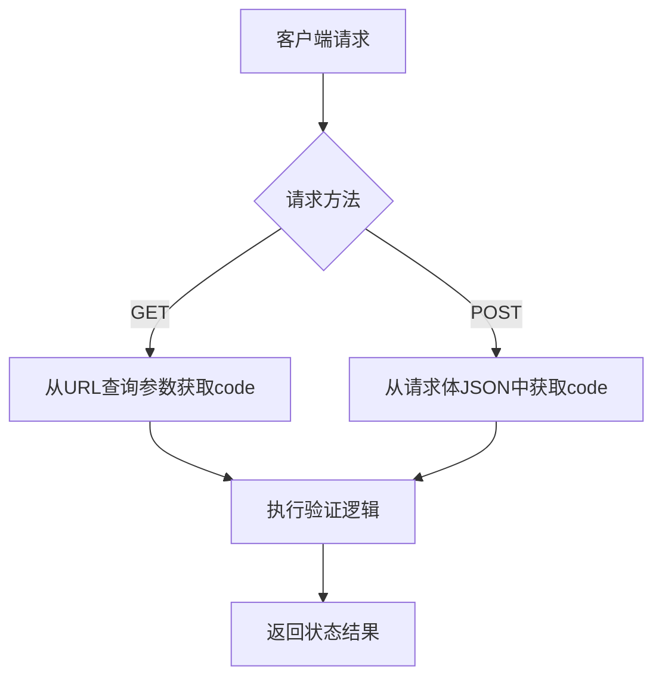
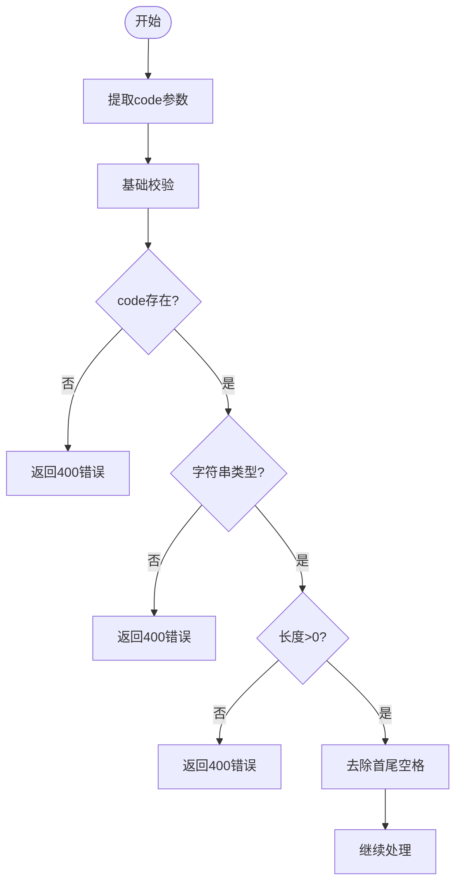
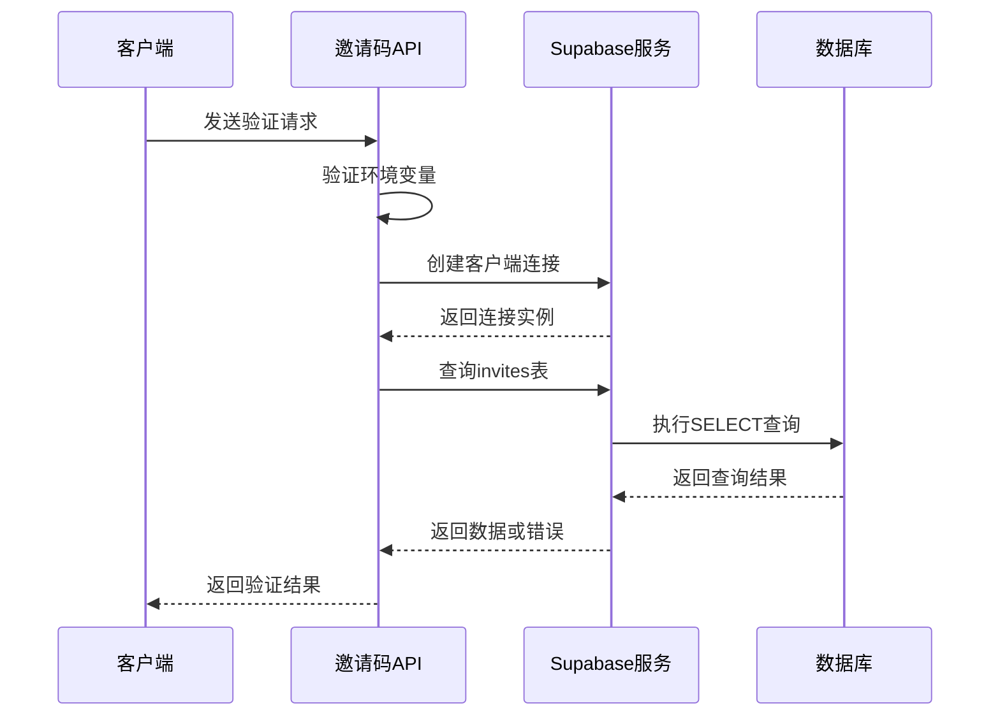
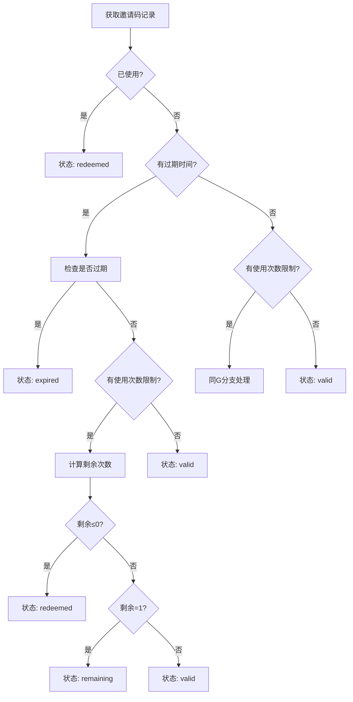
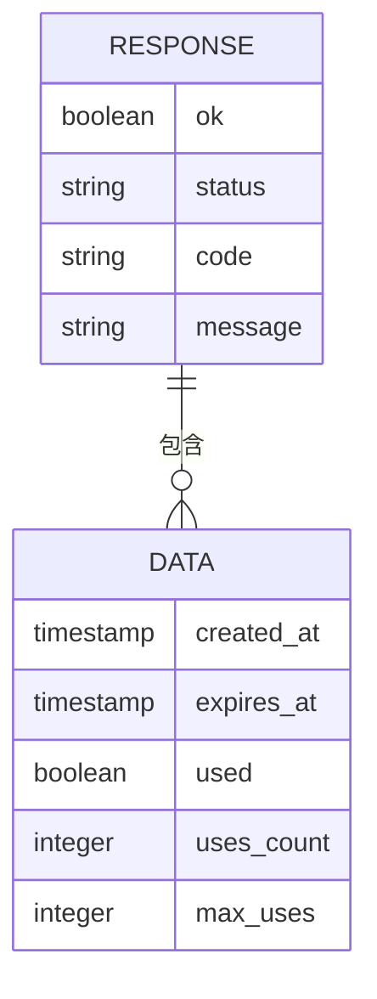

# 邀请码验证流程

<cite>
**本文档引用文件**  
- [route.ts](file://app/api/invites/check/route.ts)
- [inviteCode.ts](file://lib/inviteCode.ts)
- [login/page.tsx](file://app/login/page.tsx)
- [database-init.sql](file://database-init.sql)
- [schema.sql](file://supabase/schema.sql)
</cite>

## 目录
1. [简介](#简介)
2. [请求方式支持](#请求方式支持)
3. [参数提取与基础校验](#参数提取与基础校验)
4. [数据库查询逻辑](#数据库查询逻辑)
5. [状态判断机制](#状态判断机制)
6. [返回信息结构](#返回信息结构)
7. [匿名访问设计](#匿名访问设计)
8. [前端集成方式](#前端集成方式)
9. [典型请求/响应示例](#典型请求响应示例)

## 简介
邀请码验证API（/api/invites/check）用于检查邀请码的有效性及其当前状态。该接口支持GET和POST两种请求方式，允许匿名访问，是用户登录流程中的关键验证环节。系统通过Supabase数据库查询invites表，结合多个字段综合判断邀请码状态。

**Section sources**
- [route.ts](file://app/api/invites/check/route.ts#L1-L306)

## 请求方式支持
该接口同时支持GET和POST两种HTTP请求方法，为前端提供了灵活的调用方式。GET请求通过查询参数传递邀请码，适用于简单场景；POST请求通过请求体传递数据，更适合复杂应用环境。



**Diagram sources**
- [route.ts](file://app/api/invites/check/route.ts#L28-L306)

**Section sources**
- [route.ts](file://app/api/invites/check/route.ts#L28-L306)

## 参数提取与基础校验
接口从请求中提取code字段并进行严格校验。对于GET请求，从URL查询参数中获取code值；对于POST请求，解析JSON格式的请求体获取code字段。基础校验包括：检查参数是否存在、确保为字符串类型、验证非空且去除首尾空格。



**Diagram sources**
- [route.ts](file://app/api/invites/check/route.ts#L44-L56)
- [route.ts](file://app/api/invites/check/route.ts#L184-L212)

**Section sources**
- [route.ts](file://app/api/invites/check/route.ts#L44-L56)
- [route.ts](file://app/api/invites/check/route.ts#L184-L212)

## 数据库查询逻辑
系统使用Supabase客户端连接数据库，查询invites表中与提供的邀请码匹配的记录。查询操作使用.eq()方法进行精确匹配，并通过.single()限定只返回单条记录。若环境变量配置缺失或查询失败，则返回相应的错误响应。



**Diagram sources**
- [route.ts](file://app/api/invites/check/route.ts#L58-L67)
- [route.ts](file://app/api/invites/check/route.ts#L213-L222)

**Section sources**
- [route.ts](file://app/api/invites/check/route.ts#L58-L67)
- [route.ts](file://app/api/invites/check/route.ts#L213-L222)

## 状态判断机制
系统根据invites表中的多个字段综合判断邀请码状态，判定优先级如下：已使用状态 > 过期状态 > 使用次数限制 > 默认有效状态。具体判定条件包括：

- **invalid**: 邀请码不存在
- **redeemed**: used字段为true，或使用次数已耗尽
- **expired**: 存在过期时间且当前时间已超过过期时间
- **remaining**: 有效且剩余1次使用
- **valid**: 其他有效情况



**Diagram sources**
- [route.ts](file://app/api/invites/check/route.ts#L82-L133)
- [route.ts](file://app/api/invites/check/route.ts#L237-L278)

**Section sources**
- [route.ts](file://app/api/invites/check/route.ts#L82-L133)
- [route.ts](file://app/api/invites/check/route.ts#L237-L278)

## 返回信息结构
接口返回标准化的JSON响应，包含基本状态信息和可选的详细数据。响应结构包括ok标志、状态码、原始code值、描述性消息以及包含创建时间、过期时间、使用状态、使用计数和最大使用次数的data对象。



**Diagram sources**
- [route.ts](file://app/api/invites/check/route.ts#L136-L149)
- [route.ts](file://app/api/invites/check/route.ts#L282-L294)

**Section sources**
- [route.ts](file://app/api/invites/check/route.ts#L136-L149)
- [route.ts](file://app/api/invites/check/route.ts#L282-L294)

## 匿名访问设计
接口设计为支持匿名访问，使用Supabase的匿名密钥（SUPABASE_ANON_KEY）进行数据库连接。这种设计允许未认证用户验证邀请码，确保登录流程的顺畅性。安全措施包括阻止客户端提交API密钥等敏感字段，防止潜在的安全风险。

**Section sources**
- [route.ts](file://app/api/invites/check/route.ts#L59-L60)
- [route.ts](file://app/api/invites/check/route.ts#L214-L215)
- [route.ts](file://app/api/invites/check/route.ts#L196-L201)

## 前端集成方式
在登录页面（login/page.tsx）中，用户输入邀请码后，前端通过POST请求调用此API进行验证。验证成功后，根据状态决定是否允许进入下一步（身份选择页）。系统特别处理了redeemed状态，允许已使用过的邀请码继续登录，体现了用户体验优先的设计理念。

**Section sources**
- [login/page.tsx](file://app/login/page.tsx#L37-L63)

## 典型请求/响应示例
以下是常见的请求和响应示例：

### GET请求示例
```
GET /api/invites/check?code=ABC12345
```

### POST请求示例
```json
{
  "code": "ABC12345"
}
```

### 有效邀请码响应
```json
{
  "ok": true,
  "status": "valid",
  "code": "ABC12345",
  "message": "邀请码有效，剩余 5 次使用",
  "data": {
    "created_at": "2024-01-01T00:00:00Z",
    "expires_at": "2024-12-31T23:59:59Z",
    "used": false,
    "uses_count": 2,
    "max_uses": 10
  }
}
```

### 无效邀请码响应
```json
{
  "ok": true,
  "status": "invalid",
  "code": "ABC12345",
  "message": "邀请码不存在"
}
```

**Section sources**
- [route.ts](file://app/api/invites/check/route.ts#L136-L149)
- [route.ts](file://app/api/invites/check/route.ts#L282-L294)
- [login/page.tsx](file://app/login/page.tsx#L37-L63)