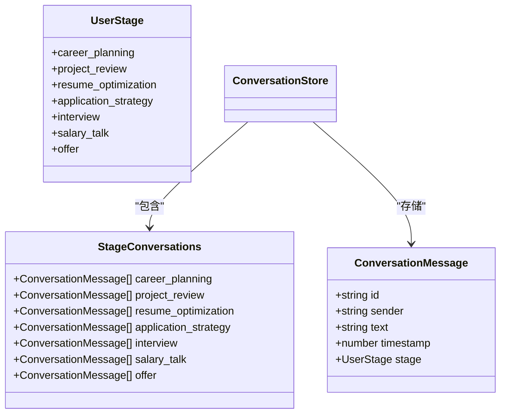
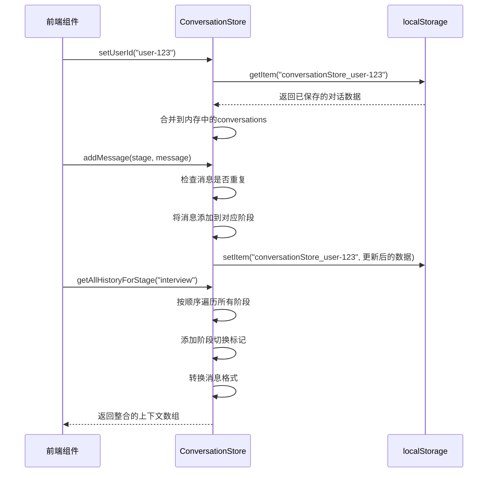
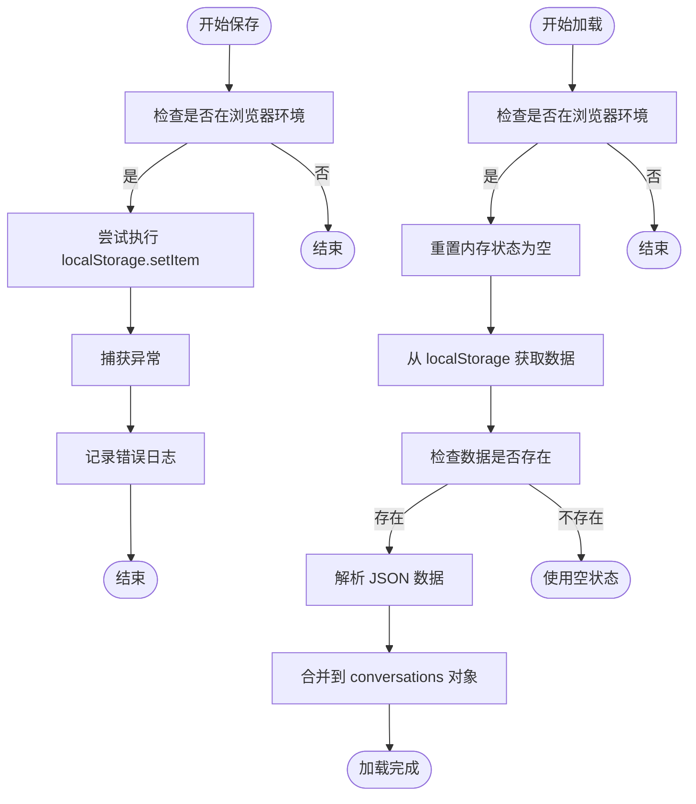

# 对话状态管理器

<cite>
**本文档引用的文件**   
- [conversationStore.ts](file://lib/conversationStore.ts)
- [stage.ts](file://lib/stage.ts)
- [utils.ts](file://lib/utils.ts)
- [ChatFlow.tsx](file://components/ChatFlow.tsx)
</cite>

## 目录
1. [简介](#简介)
2. [核心数据结构](#核心数据结构)
3. [状态管理机制](#状态管理机制)
4. [持久化机制](#持久化机制)
5. [前端交互模式](#前端交互模式)
6. [初始化逻辑](#初始化逻辑)
7. [结论](#结论)

## 简介
`ConversationStore` 是 AI 求职教练应用的核心状态容器，负责管理用户在不同求职阶段（如职业规划、简历优化、模拟面试等）的对话历史。该类实现了基于用户 ID 的数据隔离、跨阶段上下文整合以及浏览器本地存储持久化，确保用户对话历史在会话间保持一致。

**Section sources**
- [conversationStore.ts](file://lib/conversationStore.ts#L1-L258)

## 核心数据结构

### 对话消息类型
`ConversationMessage` 类型定义了对话中每条消息的基本结构，包含唯一标识、发送者角色、文本内容、时间戳和所属求职阶段。

### 阶段对话映射
`StageConversations` 类型使用 TypeScript 的映射类型语法，为每个 `UserStage` 枚举值创建一个 `ConversationMessage` 数组，实现按阶段分组存储对话历史。

### 用户阶段定义
`UserStage` 类型联合了求职流程的七个阶段：职业规划、项目梳理、简历优化、投递策略、模拟面试、薪资沟通和 Offer 评估，这些阶段构成了对话存储的逻辑分区。

**Diagram sources **
- [conversationStore.ts](file://lib/conversationStore.ts#L8-L29)
- [stage.ts](file://lib/stage.ts#L6-L13)

**Section sources**
- [conversationStore.ts](file://lib/conversationStore.ts#L8-L29)
- [stage.ts](file://lib/stage.ts#L6-L13)

## 状态管理机制

### 用户会话管理
`setUserId` 方法是对话状态管理的入口点。当设置用户 ID 时，会自动从 `localStorage` 加载该用户的对话历史；当用户登出（ID 为 null）时，则清空当前对话数据。

### 消息添加逻辑
`addMessage` 方法负责将新消息添加到指定阶段的对话历史中。该方法首先检查消息是否已存在（通过 ID 去重），然后将消息推入对应阶段的数组，并在存在用户 ID 时触发持久化操作。

### 阶段历史查询
`getStageHistory` 方法提供对特定求职阶段对话历史的只读访问，返回指定阶段的 `ConversationMessage` 数组，为空数组时返回空列表。

### 全局上下文构建
`getAllHistoryForStage` 方法是 AI 上下文生成的关键。它按求职流程顺序遍历所有阶段，将各阶段的对话历史整合为统一的 AI 上下文格式，并在阶段切换时插入标记信息，帮助 AI 理解上下文转换。

**Diagram sources **
- [conversationStore.ts](file://lib/conversationStore.ts#L35-L68)
- [conversationStore.ts](file://lib/conversationStore.ts#L56-L68)
- [conversationStore.ts](file://lib/conversationStore.ts#L75-L121)

**Section sources**
- [conversationStore.ts](file://lib/conversationStore.ts#L35-L121)

## 持久化机制

### 数据隔离策略
对话数据通过 `conversationStore_${userId}` 的键名格式存储在 `localStorage` 中，实现了多用户数据的隔离。每个用户都有独立的存储空间，避免了数据混淆。

### 保存与加载流程
`saveToLocalStorage` 和 `loadFromLocalStorage` 方法分别处理对话数据的持久化和恢复。保存操作将内存中的 `conversations` 对象序列化为 JSON 字符串存储；加载操作则先重置内存状态，再从存储中读取并合并数据。

### 异常处理
两个持久化方法都包含 try-catch 块，能够捕获并记录存储操作中的异常（如存储空间不足），确保应用在存储失败时仍能正常运行，只是丢失持久化能力。

**Diagram sources **
- [conversationStore.ts](file://lib/conversationStore.ts#L186-L193)
- [conversationStore.ts](file://lib/conversationStore.ts#L197-L226)

**Section sources**
- [conversationStore.ts](file://lib/conversationStore.ts#L183-L227)

## 前端交互模式

### 组件集成
前端组件通过导入单例 `conversationStore` 来与状态管理器交互。典型的工作流程包括：在组件挂载时读取当前阶段的历史消息，在用户发送消息时调用 `addMessage`，在阶段切换时调用 `getStageHistory`。

### 消息流处理
当用户在聊天界面输入内容并发送时，组件会创建包含唯一 ID、发送者信息、文本内容和时间戳的 `ConversationMessage` 对象，并调用 `addMessage` 方法将其添加到当前求职阶段的对话历史中。

### 状态订阅
虽然 `ConversationStore` 本身不提供观察者模式，但前端组件可以通过 React 的 `useEffect` 钩子监听相关状态变化，实现 UI 的响应式更新。

**Section sources**
- [ChatFlow.tsx](file://components/ChatFlow.tsx#L1-L167)

## 初始化逻辑

### 欢迎消息机制
`initializeWelcomeMessage` 方法负责在用户首次进入某个求职阶段时初始化欢迎消息。该方法检查指定阶段的对话历史是否为空，若为空则添加预设的欢迎语。

### 业务意义
这一机制确保了新用户或首次进入某阶段的用户能够立即获得引导，提升了用户体验的连贯性。欢迎消息作为对话的起点，为后续的 AI 交互奠定了基础。

### 条件触发
欢迎消息仅在阶段对话为空时添加，避免了重复显示。如果用户返回已访问过的阶段，则不会重新显示欢迎消息，保持了对话历史的完整性。

**Section sources**
- [conversationStore.ts](file://lib/conversationStore.ts#L230-L252)

## 结论
`ConversationStore` 类作为 AI 求职教练应用的核心状态管理器，通过精心设计的数据结构和方法接口，实现了跨阶段对话历史的有效管理。其基于用户 ID 的数据隔离机制、完整的持久化策略以及清晰的 API 设计，为前端组件提供了可靠的状态管理基础，确保了用户在复杂求职流程中的对话体验连续性和数据一致性。