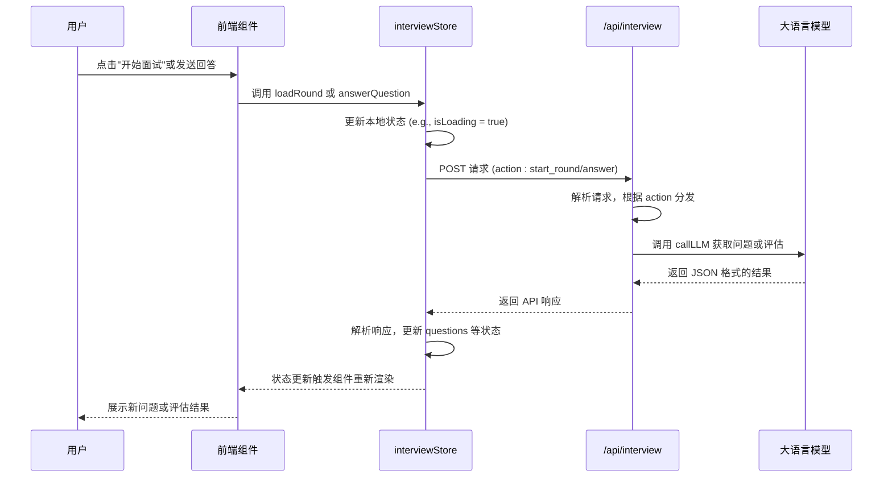
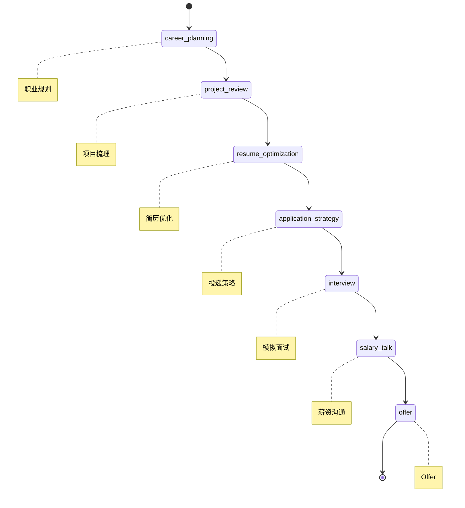

# 数据流与状态管理

<cite>
**本文档引用的文件**   
- [conversationStore.ts](file://lib/conversationStore.ts)
- [interviewStore.tsx](file://store/interviewStore.tsx)
- [fsm.ts](file://lib/fsm.ts)
- [stage.ts](file://lib/stage.ts)
- [types.ts](file://lib/interview/types.ts)
- [route.ts](file://app/api/interview/route.ts)
- [chat/route.ts](file://app/api/chat/route.ts)
- [providers.tsx](file://app/providers.tsx)
- [ChatFlow.tsx](file://components/ChatFlow.tsx)
- [InterviewPanel.tsx](file://components/interview/InterviewPanel.tsx)
</cite>

## 目录
1. [引言](#引言)
2. [状态管理架构概览](#状态管理架构概览)
3. [核心状态管理机制](#核心状态管理机制)
4. [数据流动与用户交互](#数据流动与用户交互)
5. [有限状态机与流程控制](#有限状态机与流程控制)
6. [状态持久化与异常恢复](#状态持久化与异常恢复)
7. [结论](#结论)

## 引言

ai-job-coach 是一个基于人工智能的求职辅导系统，其核心功能依赖于复杂的状态管理和数据流动机制。本权威文档旨在深入剖析系统的数据流与状态管理架构，详细阐述用户操作如何触发前端组件更新，状态如何通过全局状态管理器（如 `conversationStore` 和 `interviewStore`）进行同步，并通过 API 调用与后端服务进行数据交互。文档将重点分析 `conversationStore.ts` 中 `ConversationStore` 类如何管理消息队列、会话 ID 和当前阶段，`interviewStore.tsx` 如何专门处理面试相关的状态，以及 `fsm.ts` 中有限状态机（FSM）的实现原理及其在控制用户流程中的作用。同时，文档将结合 `UserStage` 类型定义展示状态迁移图，并提供状态持久化策略与异常恢复机制的说明。

## 状态管理架构概览

ai-job-coach 采用了混合状态管理模式，结合了全局单例状态和 React Context 状态，以满足不同场景下的需求。系统的核心状态管理由两个主要部分构成：`conversationStore` 和 `interviewStore`。

`conversationStore` 是一个基于单例模式的全局状态管理器，负责管理用户在整个求职流程中所有阶段的对话历史。它独立于 React 组件树，可以在任何需要访问对话历史的地方直接导入和使用。该 store 以 `UserStage` 枚举为键，为每个阶段（如职业规划、简历优化、模拟面试等）维护一个独立的 `ConversationMessage` 数组，实现了对话数据的隔离与组织。

`interviewStore` 则是一个基于 React Context API 的状态管理器，专门用于处理模拟面试这一复杂且状态密集的模块。它通过 `InterviewProvider` 组件包裹需要访问面试状态的组件树，利用 React 的上下文机制将状态和操作方法传递给深层的子组件。这种设计使得面试流程中的状态（如当前轮次、问题列表、用户回答、评估结果）能够被集中管理，并确保 UI 组件能够高效地响应状态变化。

这两种状态管理方案的结合，体现了系统设计的灵活性：`conversationStore` 适用于需要跨组件、跨页面共享的全局数据，而 `interviewStore` 则适用于具有复杂内部逻辑和高频率状态更新的特定功能模块。

**Section sources**
- [conversationStore.ts](file://lib/conversationStore.ts#L1-L258)
- [interviewStore.tsx](file://store/interviewStore.tsx#L1-L789)

## 核心状态管理机制

### conversationStore：全局对话状态管理

`conversationStore` 是系统对话数据的核心枢纽，其实现位于 `lib/conversationStore.ts` 文件中。它通过一个 `ConversationStore` 类来封装所有状态和操作逻辑。

该 store 的核心数据结构是一个 `StageConversations` 类型的对象，它是一个以 `UserStage` 为键的映射，每个键对应一个 `ConversationMessage` 数组。`ConversationMessage` 接口定义了消息的四个基本属性：`id`（唯一标识符）、`sender`（发送者，用户或 AI）、`text`（消息文本）和 `stage`（所属阶段）。这种结构确保了不同求职阶段的对话历史被清晰地分隔开来。

`conversationStore` 提供了丰富的操作方法来管理这些数据。`addMessage` 方法用于向指定阶段添加新消息，它会先检查消息 ID 以避免重复添加，然后将消息推入对应阶段的数组中。`getStageHistory` 方法则用于获取指定阶段的完整对话历史。为了支持 AI 的上下文理解，`getAllHistoryForStage` 方法会按求职流程的顺序（`StageOrder`）遍历所有阶段，将所有非空阶段的对话历史合并成一个统一的数组，并在阶段切换时插入分隔标记，为 AI 提供清晰的上下文线索。

**Section sources**
- [conversationStore.ts](file://lib/conversationStore.ts#L1-L258)

### interviewStore：面试专用状态管理

`interviewStore` 是一个功能更为复杂的专用状态管理器，其实现位于 `store/interviewStore.tsx` 文件中。它使用 React 的 `useState` 和 `useCallback` 等 Hook 来构建一个包含状态和方法的 `InterviewStore` 接口。

该 store 的状态模型围绕一次模拟面试会话展开，包含了 `sessionId`（会话ID）、`userId`（用户ID）、`roundType`（轮次类型，如业务面、技术面）、`questions`（问题列表）、`currentQuestionIndex`（当前问题索引）等关键属性。`InterviewQuestion` 接口不仅包含问题文本，还包含了详细的 `tips`（提示信息）和 `evaluation`（评估结果），使得状态能够承载丰富的业务数据。

`interviewStore` 的核心在于其提供的异步操作方法，这些方法封装了与后端 API 的交互逻辑。例如，`loadRound` 方法用于加载指定轮次的面试题目，它会向 `/api/interview` 发起 POST 请求，携带 `start_round` 动作和轮次类型。`answerQuestion` 方法用于提交用户对当前问题的回答，并触发对回答的评估。`nextQuestion` 方法则用于获取下一题，当题目数量达到上限时，会自动调用 `completeRound` 方法来生成本轮面试的总结报告。这些方法通过 `useCallback` 进行记忆化，确保了函数引用的稳定性，避免了不必要的组件重新渲染。

**Section sources**
- [interviewStore.tsx](file://store/interviewStore.tsx#L1-L789)

## 数据流动与用户交互

用户与 ai-job-coach 系统的交互是一个典型的“用户操作 -> 状态更新 -> API 调用 -> 后端处理 -> 状态更新”的数据流动闭环。

当用户在前端界面（如 `InterviewPanel` 组件）进行操作时，例如点击“开始面试”或输入并发送回答，这些操作会触发相应的事件处理器。这些处理器会调用 `interviewStore` 提供的方法，如 `loadRound` 或 `answerQuestion`。这些方法首先会更新本地的 React 状态（例如，设置 `isLoadingQuestion` 为 `true` 以显示加载动画），然后通过 `fetch` API 向后端发起请求。

后端 API 的入口位于 `app/api/interview/route.ts`。该路由文件根据请求体中的 `action` 字段（如 `start_round`, `answer`, `next_question`）来分发处理逻辑。系统支持两种模式：`stub` 模式（硬编码返回模拟数据）和 `deepseek` 模式（调用外部 LLM 服务）。在 `deepseek` 模式下，`deepseekAnswer` 函数会构建一个包含问题、用户回答和系统提示的上下文，调用 `callLLM` 函数与大语言模型交互，获取对用户回答的评估结果。

后端处理完成后，会将结果以 JSON 格式返回给前端。前端接收到响应后，`interviewStore` 中的异步方法会解析响应数据，并再次更新本地状态。例如，在 `answerQuestion` 方法中，如果收到评估结果，它会调用 `setQuestions` 来更新问题列表，将评估结果和状态（`evaluated`）写入当前问题对象。这个状态的更新会立即触发 React 组件的重新渲染，将评估结果展示给用户，从而完成整个数据流动循环。

**Diagram sources**
- [interviewStore.tsx](file://store/interviewStore.tsx#L1-L789)
- [route.ts](file://app/api/interview/route.ts#L1-L809)

**Section sources**
- [interviewStore.tsx](file://store/interviewStore.tsx#L1-L789)
- [route.ts](file://app/api/interview/route.ts#L1-L809)
- [InterviewPanel.tsx](file://components/interview/InterviewPanel.tsx#L1-L509)

## 有限状态机与流程控制

系统的用户流程控制依赖于一个基于 React Hook 实现的有限状态机（FSM），其代码位于 `lib/fsm.ts` 文件中。

该 FSM 通过 `useStageFSM` Hook 实现。它维护两个核心状态：`current`（当前阶段）和 `historyRef.current`（历史阶段栈）。`current` 状态使用 `useState` 管理，而 `historyRef` 使用 `useRef` 来存储一个不会触发重新渲染的数组，用于记录用户的导航历史。

FSM 的核心方法是 `transition`。当用户需要切换到新阶段时，会调用此方法。`transition` 方法首先通过一个 `stageMap` 对象将可能的字符串输入（如 "planning", "salary"）映射到标准的 `Stage` 枚举值。然后，它会验证目标阶段是否有效（存在于 `STAGE_ORDER` 中），并检查是否与当前阶段相同。如果验证通过，它会更新 `current` 状态，并将新阶段推入 `historyRef` 的历史栈中。这种设计允许用户在任意阶段之间自由跳转。

另一个重要方法是 `back`，它实现了“返回上一步”的功能。该方法会从 `historyRef` 的历史栈中弹出当前阶段，然后将栈顶的阶段设置为新的 `current` 阶段。`canGoBack` 方法则用于判断历史栈的长度是否大于1，从而决定“返回”按钮是否可用。

这个 FSM 与 `UserStage` 类型定义紧密配合。`UserStage` 定义了求职流程的完整阶段序列（`StageOrder`），而 FSM 则负责在这些预定义的状态之间进行安全、可控的转换，确保了用户导航的逻辑一致性。

**Diagram sources**
- [fsm.ts](file://lib/fsm.ts#L1-L125)
- [stage.ts](file://lib/stage.ts#L1-L85)

**Section sources**
- [fsm.ts](file://lib/fsm.ts#L1-L125)
- [stage.ts](file://lib/stage.ts#L1-L85)

## 状态持久化与异常恢复

系统通过 `localStorage` 实现了关键状态的持久化，确保用户在刷新页面或重新登录后，能够恢复之前的对话历史。

`conversationStore` 是状态持久化的主要承担者。当用户登录时，`setUserId` 方法会被调用，传入用户的 ID。该方法会立即调用 `loadFromLocalStorage(userId)`，从 `localStorage` 中读取以 `conversationStore_${userId}` 为键保存的 JSON 数据，并将其解析后合并到内存中的 `conversations` 对象里。同样地，每当有新消息被添加时，`addMessage` 方法会检查 `currentUserId` 是否存在，如果存在，则调用 `saveToLocalStorage(currentUserId)` 将当前的 `conversations` 对象序列化并保存到 `localStorage` 中。这种“读取-合并”和“监听-保存”的模式，保证了用户数据的实时同步。

对于 `interviewStore`，虽然其核心状态（如问题列表）主要依赖于后端会话，但一些辅助状态也实现了持久化。例如，`ensureIdentifiers` 函数会检查 `localStorage` 中是否存在 `ajc_interview_session` 和 `ajc_interview_user`，如果不存在则生成临时 ID 并保存，这确保了即使在未登录状态下，用户的面试会话也能被唯一标识。

在异常恢复方面，系统通过多层次的错误处理机制来保障稳定性。在 `conversationStore` 中，所有对 `localStorage` 的读写操作都被包裹在 `try-catch` 块中，捕获并记录可能发生的异常（如存储空间不足），避免因持久化失败而导致应用崩溃。在 `interviewStore` 的 API 调用中，`fetch` 操作同样被 `try-catch` 包裹，当网络请求失败或后端返回错误时，系统会捕获异常，通过 `addAssistantMessage` 向用户展示友好的错误提示（如“加载题目时出了点问题，请稍后再试”），并最终将 `isLoadingQuestion` 等状态重置，使 UI 恢复到可操作状态，从而实现了优雅的降级和恢复。

**Section sources**
- [conversationStore.ts](file://lib/conversationStore.ts#L1-L258)
- [interviewStore.tsx](file://store/interviewStore.tsx#L1-L789)

## 结论

ai-job-coach 系统的数据流与状态管理机制设计精巧，通过 `conversationStore` 和 `interviewStore` 的分工协作，有效地管理了全局对话历史和复杂的面试流程状态。用户操作通过清晰的数据流动路径，触发前端状态更新，并通过 RESTful API 与后端服务进行交互，后端利用大语言模型生成智能响应，最终反馈到前端完成闭环。基于 React Hook 实现的有限状态机（FSM）为用户导航提供了可靠、可预测的流程控制。结合 `localStorage` 的持久化策略和全面的异常处理机制，系统确保了数据的持久性和用户体验的稳定性。这一套综合的架构为构建一个流畅、智能的 AI 求职辅导应用奠定了坚实的基础。