# 有限状态机与阶段流转

<cite>
**本文引用的文件**
- [lib/fsm.ts](file://lib/fsm.ts)
- [lib/stage.ts](file://lib/stage.ts)
- [app/chat/page.tsx](file://app/chat/page.tsx)
- [lib/conversationStore.ts](file://lib/conversationStore.ts)
- [store/interviewStore.tsx](file://store/interviewStore.tsx)
- [components/StageController.tsx](file://components/StageController.tsx)
- [components/StageSelector.tsx](file://components/StageSelector.tsx)
- [lib/stage_implementation.md](file://lib/stage_implementation.md)
- [lib/stage_selector_implementation.md](file://lib/stage_selector_implementation.md)
- [app/api/chat/route.ts](file://app/api/chat/route.ts)
</cite>

## 目录
1. [简介](#简介)
2. [项目结构](#项目结构)
3. [核心组件](#核心组件)
4. [架构总览](#架构总览)
5. [详细组件分析](#详细组件分析)
6. [依赖关系分析](#依赖关系分析)
7. [性能考量](#性能考量)
8. [故障排查指南](#故障排查指南)
9. [结论](#结论)
10. [附录](#附录)

## 简介
本文件围绕 lib/fsm.ts 与 lib/stage.ts 的协作，系统阐述“有限状态机（FSM）”如何封装求职流程中的阶段迁移逻辑，确保用户在“职业规划 → 项目梳理 → 简历优化 → 投递策略 → 模拟面试 → 薪资沟通 → Offer”的预设路径上有序推进。文档还解释 useStageFSM Hook 如何在 app/chat/page.tsx 等组件中初始化并驱动 UI 渲染；状态变更时的副作用处理（如 conversationStore 数据加载、interviewStore 重置）；异常状态恢复策略（无效跳转拦截与默认状态回退）；以及如何扩展自定义状态行为。

## 项目结构
本项目采用“前端组件 + 业务库 + 状态管理 + API 层”的分层组织方式：
- lib/fsm.ts：前端侧阶段状态机，提供 transition/back/getCurrent 等能力
- lib/stage.ts：用户阶段联合类型与顺序、名称映射、前后阶段查询、有效性校验
- app/chat/page.tsx：聊天主页面，维护 userStage 与 FSM，协调白板分析、阶段切换、消息持久化
- lib/conversationStore.ts：按阶段隔离的对话历史存储，支持跨阶段上下文拼接
- store/interviewStore.tsx：模拟面试全局状态，与阶段流转解耦
- components/StageController.tsx / StageSelector.tsx：阶段控制器与阶段选择器 UI
- app/api/chat/route.ts：后端聊天 API，注入阶段系统 Prompt 并返回回复

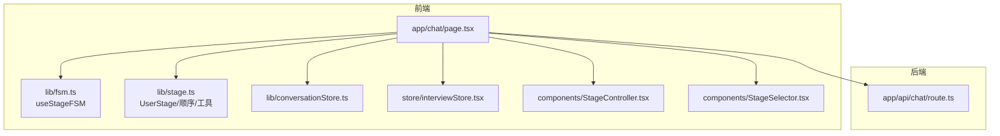

图表来源
- [app/chat/page.tsx](file://app/chat/page.tsx#L1-L200)
- [lib/fsm.ts](file://lib/fsm.ts#L1-L125)
- [lib/stage.ts](file://lib/stage.ts#L1-L85)
- [lib/conversationStore.ts](file://lib/conversationStore.ts#L1-L258)
- [store/interviewStore.tsx](file://store/interviewStore.tsx#L1-L200)
- [components/StageController.tsx](file://components/StageController.tsx#L1-L76)
- [components/StageSelector.tsx](file://components/StageSelector.tsx#L1-L204)
- [app/api/chat/route.ts](file://app/api/chat/route.ts#L1-L238)

章节来源
- [app/chat/page.tsx](file://app/chat/page.tsx#L1-L200)
- [lib/fsm.ts](file://lib/fsm.ts#L1-L125)
- [lib/stage.ts](file://lib/stage.ts#L1-L85)

## 核心组件
- 有限状态机（FSM）
  - 提供 current/history/transition/back/getCurrent/getCurrentName/canGoBack 等方法
  - 支持字符串映射（如 planning → career）、历史记录长度限制、日志输出
- 用户阶段（UserStage）
  - 定义七阶段顺序、中文名称、描述、前后阶段查询、有效性校验
- useStageFSM Hook
  - 在 app/chat/page.tsx 中初始化，驱动 UI 渲染与阶段切换
  - 与 userStage 状态协同，保证业务逻辑与 UI 展示一致
- conversationStore
  - 按阶段隔离存储对话历史，支持跨阶段上下文拼接
- interviewStore
  - 模拟面试全局状态，与阶段流转解耦，必要时在阶段切换时重置

章节来源
- [lib/fsm.ts](file://lib/fsm.ts#L20-L125)
- [lib/stage.ts](file://lib/stage.ts#L1-L85)
- [app/chat/page.tsx](file://app/chat/page.tsx#L1-L120)
- [lib/conversationStore.ts](file://lib/conversationStore.ts#L1-L120)
- [store/interviewStore.tsx](file://store/interviewStore.tsx#L1-L120)

## 架构总览
下图展示从用户输入到阶段推进与 UI 更新的端到端流程，以及阶段切换时的副作用处理。

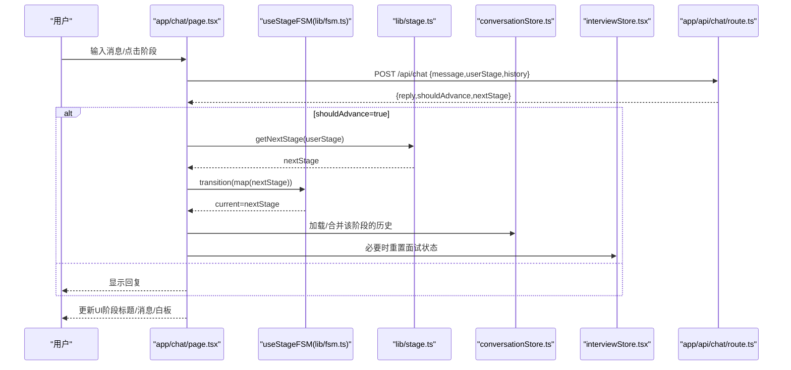

图表来源
- [app/chat/page.tsx](file://app/chat/page.tsx#L700-L900)
- [lib/stage.ts](file://lib/stage.ts#L59-L85)
- [lib/fsm.ts](file://lib/fsm.ts#L30-L125)
- [lib/conversationStore.ts](file://lib/conversationStore.ts#L70-L120)
- [store/interviewStore.tsx](file://store/interviewStore.tsx#L420-L520)
- [app/api/chat/route.ts](file://app/api/chat/route.ts#L145-L238)

## 详细组件分析

### 有限状态机（lib/fsm.ts）
- 设计要点
  - Stage 类型与 STAGE_NAMES/STAGE_ORDER 定义阶段集合与顺序
  - transition(stage) 支持字符串映射（planning → career 等），并校验有效性
  - 历史记录 historyRef 限制长度（最多 10），back() 支持回退
  - getCurrent/getCurrentName/canGoBack 提供稳定的 UI 查询能力
  - useMemo 稳定返回对象引用，避免不必要的重渲染
- 边界条件
  - 无效阶段字符串将被警告并拒绝转换
  - 目标阶段与当前相同则不执行转换
  - 历史记录去重，避免重复推进导致的冗余
- 与 UI 的集成
  - app/chat/page.tsx 通过 useStageFSM 初始化 FSM，将 current 与 UI 阶段标题绑定
  - 通过 stage 名称映射，将业务阶段 UserStage 与 UI 阶段 Stage 对齐

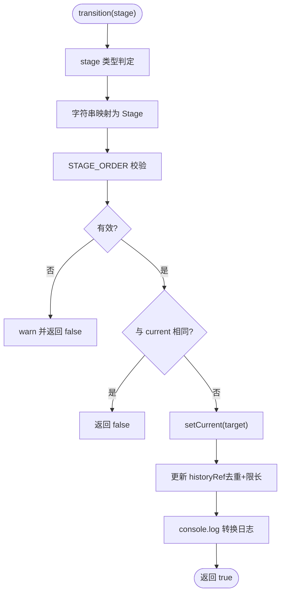

图表来源
- [lib/fsm.ts](file://lib/fsm.ts#L30-L125)

章节来源
- [lib/fsm.ts](file://lib/fsm.ts#L1-L125)

### 用户阶段定义与顺序（lib/stage.ts）
- UserStage 联合类型定义七阶段：career_planning → project_review → resume_optimization → application_strategy → interview → salary_talk → offer
- StageOrder/StageNames/StageDescriptions 提供顺序、中文名与描述
- getNextStage/getPrevStage 支持线性推进与回退
- isValidStage 用于校验字符串是否为有效阶段

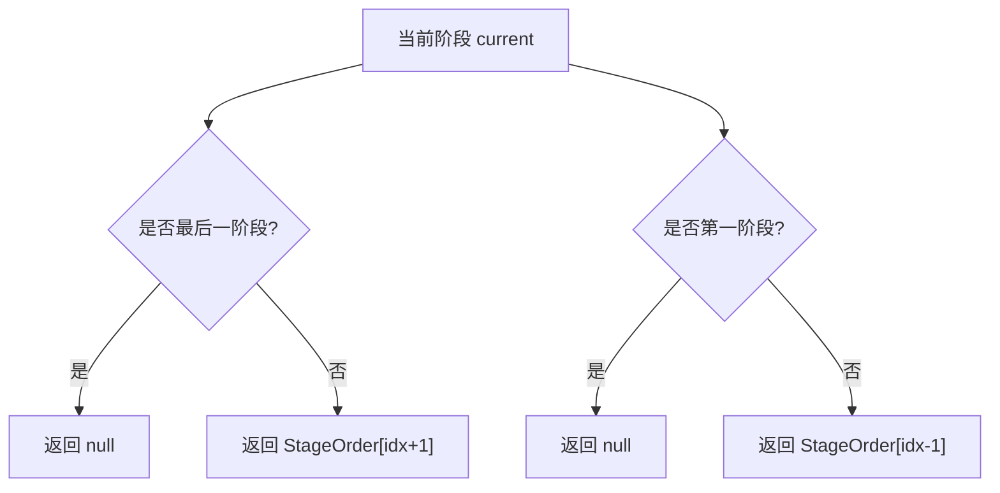

图表来源
- [lib/stage.ts](file://lib/stage.ts#L18-L85)

章节来源
- [lib/stage.ts](file://lib/stage.ts#L1-L85)

### useStageFSM 在 app/chat/page.tsx 中的使用
- 初始化与同步
  - 通过 useStageFSM("career") 初始化，将 current 与 UI 阶段标题绑定
  - 与 userStage 状态协同，确保业务逻辑与 UI 展示一致
- 阶段切换
  - handleSelectStage 中根据 UserStage 计算对应 UI 阶段并调用 fsm.transition
  - 切换后加载该阶段聊天记录，维持上下文连续性
- 副作用处理
  - conversationStore：切换阶段时加载/合并该阶段的历史
  - interviewStore：在面试阶段切换时重置相关状态，避免跨阶段污染
- 会话恢复
  - 从 /api/load-session 恢复 userStage 与 FSM，确保刷新后状态一致

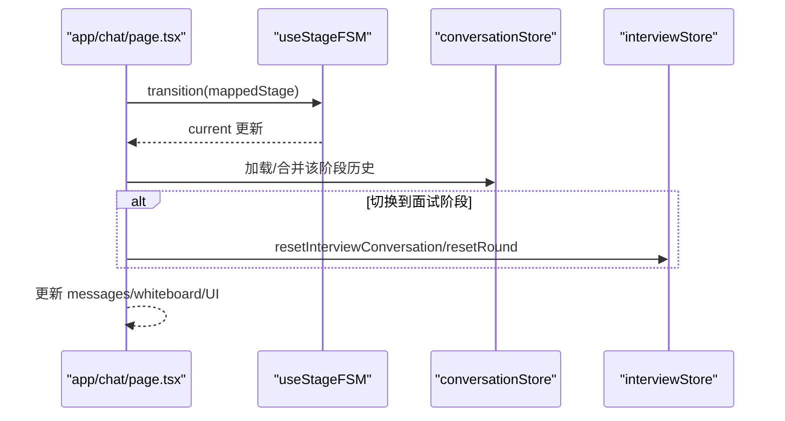

图表来源
- [app/chat/page.tsx](file://app/chat/page.tsx#L409-L448)
- [app/chat/page.tsx](file://app/chat/page.tsx#L449-L520)
- [lib/conversationStore.ts](file://lib/conversationStore.ts#L46-L120)
- [store/interviewStore.tsx](file://store/interviewStore.tsx#L272-L320)

章节来源
- [app/chat/page.tsx](file://app/chat/page.tsx#L1-L200)
- [app/chat/page.tsx](file://app/chat/page.tsx#L409-L520)

### conversationStore 的阶段隔离与上下文拼接
- 阶段隔离
  - 每个 UserStage 对应独立消息数组，避免跨阶段污染
- 上下文拼接
  - getAllHistoryForStage 按 StageOrder 遍历拼接历史，并在阶段切换处插入标记，帮助 AI 理解上下文
- 本地持久化
  - setUserId 后自动加载/保存到 localStorage，支持刷新恢复

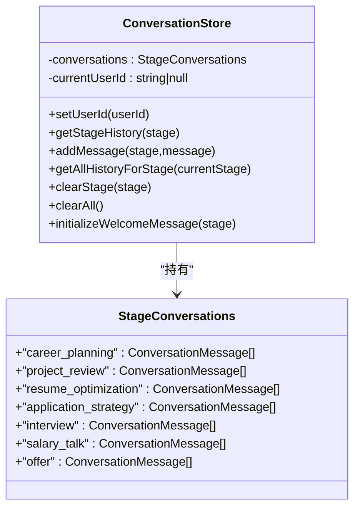

图表来源
- [lib/conversationStore.ts](file://lib/conversationStore.ts#L1-L258)

章节来源
- [lib/conversationStore.ts](file://lib/conversationStore.ts#L1-L258)

### interviewStore 的面试状态与阶段解耦
- 独立状态管理
  - interviewStore.tsx 使用 React Context 管理面试流程，不依赖 zustand
- 阶段切换时的重置
  - 当用户从非面试阶段切换到面试阶段时，调用 resetInterviewConversation/resetRound，避免历史数据干扰
- 与 FSM 的关系
  - FSM 负责 UI 阶段显示，interviewStore 负责面试流程状态，二者通过路由与 UI 控制器解耦

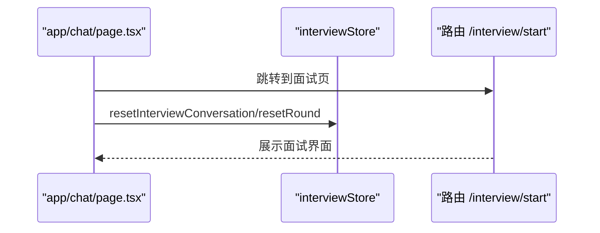

图表来源
- [app/chat/page.tsx](file://app/chat/page.tsx#L416-L420)
- [store/interviewStore.tsx](file://store/interviewStore.tsx#L272-L320)

章节来源
- [store/interviewStore.tsx](file://store/interviewStore.tsx#L1-L200)
- [app/chat/page.tsx](file://app/chat/page.tsx#L416-L420)

### 阶段选择器与控制器（components/StageController.tsx / StageSelector.tsx）
- StageController
  - 提供返回按钮与当前阶段标题，支持 backHref/onBack 回调
- StageSelector
  - 基于 ajc_whiteboardData 与 ajc_chatHistory 判断阶段完成状态
  - 点击阶段卡片触发 onSelectStage，保存当前阶段聊天记录并加载目标阶段

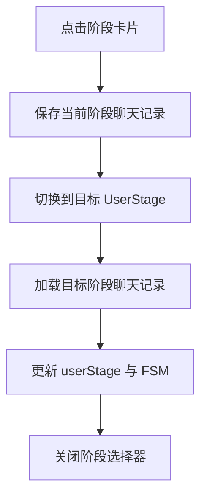

图表来源
- [components/StageSelector.tsx](file://components/StageSelector.tsx#L1-L204)
- [app/chat/page.tsx](file://app/chat/page.tsx#L409-L448)
- [lib/stage_selector_implementation.md](file://lib/stage_selector_implementation.md#L1-L120)

章节来源
- [components/StageController.tsx](file://components/StageController.tsx#L1-L76)
- [components/StageSelector.tsx](file://components/StageSelector.tsx#L1-L204)
- [lib/stage_selector_implementation.md](file://lib/stage_selector_implementation.md#L1-L120)

### 阶段推进条件与后端协作（app/api/chat/route.ts）
- 系统 Prompt 注入
  - 根据 stage 获取对应系统 Prompt，确保 AI 在当前阶段扮演合适角色
- 历史消息构建
  - 自动添加 system message（若缺失），并过滤非法 item
- 返回结构
  - 返回 AI 回复文本，前端据此决定是否推进阶段

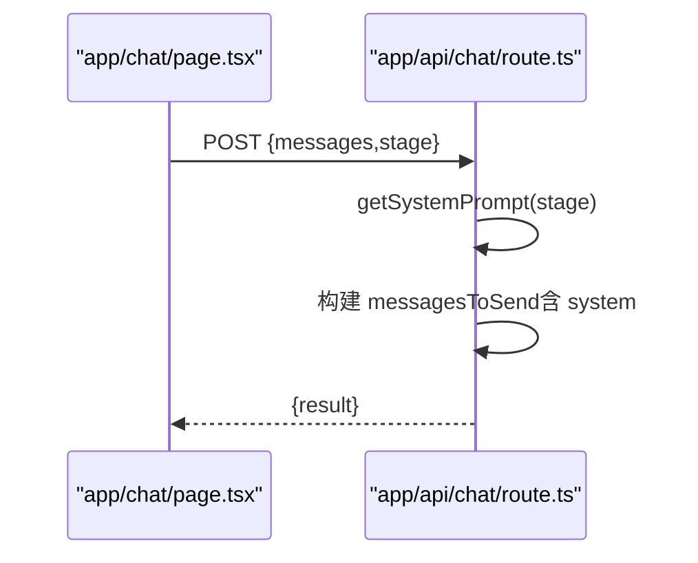

图表来源
- [app/api/chat/route.ts](file://app/api/chat/route.ts#L124-L238)
- [app/chat/page.tsx](file://app/chat/page.tsx#L762-L800)

章节来源
- [app/api/chat/route.ts](file://app/api/chat/route.ts#L1-L238)
- [app/chat/page.tsx](file://app/chat/page.tsx#L762-L800)

## 依赖关系分析
- 组件耦合
  - app/chat/page.tsx 依赖 lib/fsm.ts 与 lib/stage.ts，同时与 UI 组件（StageController/StageSelector）和状态管理（conversationStore/interviewStore）协作
- 外部依赖
  - app/api/chat/route.ts 依赖 lib/llm.ts（通过 callLLM）与 lib/auth.ts（用户认证）
- 潜在循环依赖
  - 无直接循环依赖；FSM 与 Stage 为纯工具库，不依赖 UI；UI 通过 Hook 使用 FSM

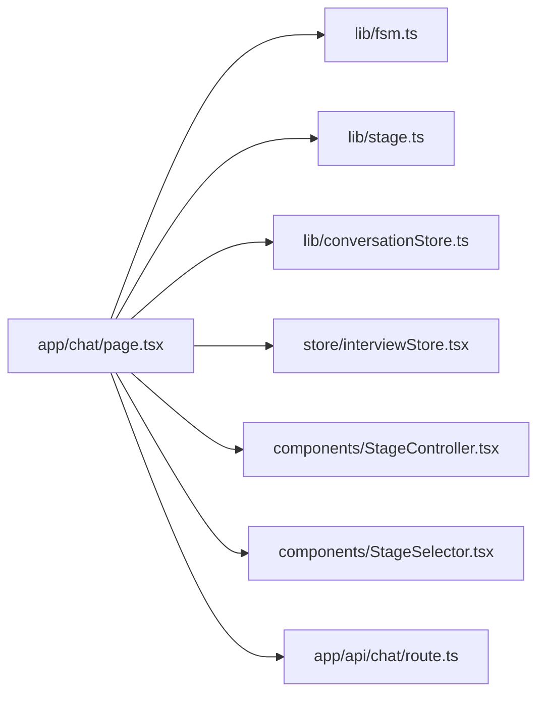

图表来源
- [app/chat/page.tsx](file://app/chat/page.tsx#L1-L120)
- [lib/fsm.ts](file://lib/fsm.ts#L1-L125)
- [lib/stage.ts](file://lib/stage.ts#L1-L85)
- [lib/conversationStore.ts](file://lib/conversationStore.ts#L1-L120)
- [store/interviewStore.tsx](file://store/interviewStore.tsx#L1-L120)
- [components/StageController.tsx](file://components/StageController.tsx#L1-L76)
- [components/StageSelector.tsx](file://components/StageSelector.tsx#L1-L204)
- [app/api/chat/route.ts](file://app/api/chat/route.ts#L1-L120)

章节来源
- [app/chat/page.tsx](file://app/chat/page.tsx#L1-L120)
- [lib/fsm.ts](file://lib/fsm.ts#L1-L125)
- [lib/stage.ts](file://lib/stage.ts#L1-L85)

## 性能考量
- 状态机稳定性
  - useStageFSM 使用 useMemo 稳定返回对象引用，减少不必要的重渲染
- 历史记录与白板分析
  - debounce 分析（1 秒）降低频繁 API 调用频率，合并白板数据避免重复字段
- 本地持久化
  - localStorage 读写在组件挂载时进行，避免阻塞 UI；聊天记录与白板数据按需保存
- 上下文拼接
  - getAllHistoryForStage 按顺序遍历并插入阶段标记，避免过多 token；前端也可限制历史条数

[本节为通用指导，无需具体文件分析]

## 故障排查指南
- 无效跳转
  - 现象：transition 返回 false，控制台打印无效阶段警告
  - 处理：检查传入字符串是否映射到有效 Stage；确认 STAGE_ORDER 包含目标值
- 无法回退
  - 现象：canGoBack=false，back() 返回 false
  - 处理：确认 historyRef 至少包含两个元素；检查是否在初始化后立即调用 back
- 阶段切换未生效
  - 现象：UI 未更新或消息未加载
  - 处理：确认 handleSelectStage 中已调用 fsm.transition；检查 conversationStore 是否加载该阶段历史
- 面试状态残留
  - 现象：切换到非面试阶段后仍有面试状态
  - 处理：在阶段切换时调用 interviewStore.resetInterviewConversation/resetRound
- API 返回异常
  - 现象：/api/chat 返回错误或未推进阶段
  - 处理：检查系统 Prompt 注入与 messages 格式；确认后端未返回非法字段

章节来源
- [lib/fsm.ts](file://lib/fsm.ts#L30-L125)
- [app/chat/page.tsx](file://app/chat/page.tsx#L409-L520)
- [store/interviewStore.tsx](file://store/interviewStore.tsx#L272-L320)
- [app/api/chat/route.ts](file://app/api/chat/route.ts#L145-L238)

## 结论
本系统通过 lib/fsm.ts 与 lib/stage.ts 的协作，将复杂的求职流程抽象为可预测的线性阶段序列。useStageFSM Hook 将状态机能力无缝集成到 UI，配合 conversationStore 的阶段隔离与 interviewStore 的面试状态管理，实现了“阶段推进 + 上下文拼接 + 副作用治理”的闭环。异常状态恢复策略（无效跳转拦截、默认回退、会话恢复）保障了用户体验的连续性与一致性。通过模块化设计与清晰的依赖关系，系统具备良好的可扩展性与可维护性。

## 附录

### 状态转换图（基于 UserStage 顺序）
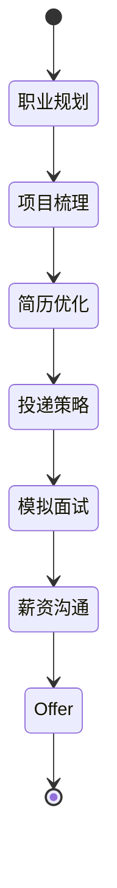

图表来源
- [lib/stage.ts](file://lib/stage.ts#L18-L26)

### 自定义状态行为扩展指南
- 新增阶段
  - 在 lib/stage.ts 中扩展 UserStage 与 StageOrder/StageNames/StageDescriptions
  - 在 app/chat/page.tsx 的阶段映射中增加 UI 阶段映射
  - 在 conversationStore.ts 中为新阶段预留消息数组
- 自定义推进条件
  - 在 app/api/chat/route.ts 中为新阶段补充系统 Prompt
  - 在前端根据业务需求扩展 shouldAdvance 判定逻辑（如基于白板数据或用户显式确认）
- 副作用治理
  - 在阶段切换时统一调用 conversationStore.clearStage 或加载对应历史
  - 对于面试类阶段，确保 interviewStore 重置
- UI 适配
  - 在 components/StageSelector.tsx 中更新图标与描述
  - 在 components/StageController.tsx 中适配标题与返回逻辑

章节来源
- [lib/stage.ts](file://lib/stage.ts#L1-L85)
- [app/chat/page.tsx](file://app/chat/page.tsx#L1-L200)
- [lib/conversationStore.ts](file://lib/conversationStore.ts#L1-L120)
- [store/interviewStore.tsx](file://store/interviewStore.tsx#L1-L200)
- [components/StageSelector.tsx](file://components/StageSelector.tsx#L1-L204)
- [components/StageController.tsx](file://components/StageController.tsx#L1-L76)