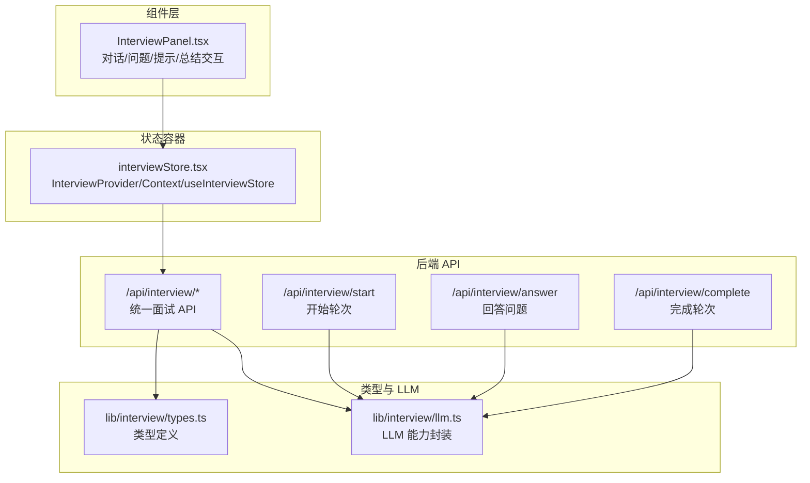
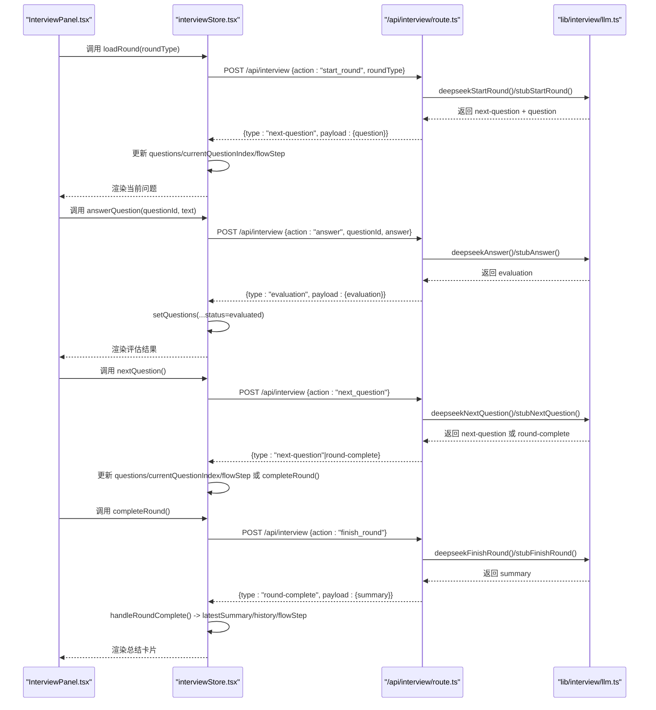
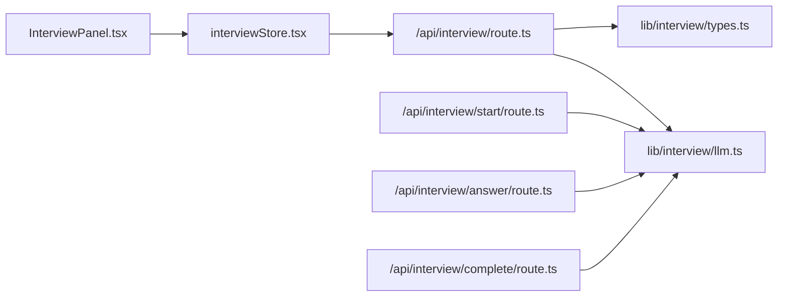

# 面试专用状态管理

<cite>
**本文引用的文件**
- [interviewStore.tsx](file://store/interviewStore.tsx)
- [InterviewPanel.tsx](file://components/interview/InterviewPanel.tsx)
- [route.ts（统一面试 API）](file://app/api/interview/route.ts)
- [route.ts（开始轮次）](file://app/api/interview/start/route.ts)
- [route.ts（回答问题）](file://app/api/interview/answer/route.ts)
- [route.ts（完成轮次）](file://app/api/interview/complete/route.ts)
- [types.ts（面试类型定义）](file://lib/interview/types.ts)
- [llm.ts（面试 LLM 能力封装）](file://lib/interview/llm.ts)
- [interviewStore.example.txt](file://store/interviewStore.example.txt)
</cite>

## 目录
1. [简介](#简介)
2. [项目结构](#项目结构)
3. [核心组件](#核心组件)
4. [架构总览](#架构总览)
5. [详细组件分析](#详细组件分析)
6. [依赖关系分析](#依赖关系分析)
7. [性能考量](#性能考量)
8. [故障排查指南](#故障排查指南)
9. [结论](#结论)
10. [附录](#附录)

## 简介
本文件面向面试专用状态容器 interviewStore.tsx 的完整文档，聚焦其作为 React Context 驱动的面试流程状态管理器，说明其接口字段如何协同维护面试流程，以及 loadRound、answerQuestion、completeRound 等异步方法如何与后端 API 交互并更新本地状态；同时阐述 setEvaluation、getCurrentQuestion 等同步方法的作用机制，解释 conversation、flowStep、mode 等字段支持的交互模式，结合 beginInterviewIntro 与 addAssistantMessage 的 AI 引导流程，提供状态重置与会话清理策略。

## 项目结构
面试状态管理位于 store 层，UI 交互由组件层驱动，后端 API 位于 app/api/interview。整体采用“状态容器 + 组件驱动 + API 服务”的分层架构。

图表来源
- [interviewStore.tsx](file://store/interviewStore.tsx#L187-L789)
- [InterviewPanel.tsx](file://components/interview/InterviewPanel.tsx#L1-L509)
- [route.ts（统一面试 API）](file://app/api/interview/route.ts#L1-L809)
- [route.ts（开始轮次）](file://app/api/interview/start/route.ts#L1-L175)
- [route.ts（回答问题）](file://app/api/interview/answer/route.ts#L1-L205)
- [route.ts（完成轮次）](file://app/api/interview/complete/route.ts#L1-L200)
- [types.ts（面试类型定义）](file://lib/interview/types.ts#L1-L117)
- [llm.ts（面试 LLM 能力封装）](file://lib/interview/llm.ts#L1-L849)

章节来源
- [interviewStore.tsx](file://store/interviewStore.tsx#L187-L789)
- [InterviewPanel.tsx](file://components/interview/InterviewPanel.tsx#L1-L509)
- [route.ts（统一面试 API）](file://app/api/interview/route.ts#L1-L809)

## 核心组件
- InterviewStore 接口与方法
  - 基础信息：sessionId、userId
  - 轮次与问题：roundType、roundIndex、currentQuestionIndex、questions、roundCompleted
  - 历史与摘要：history、latestSummary
  - 对话与引导：conversation、flowStep、mode、targetRole、totalQuestions、isLoadingQuestion、isEvaluating
  - 方法：initInterview、loadRound、answerQuestion、setEvaluation、nextQuestion、prevQuestion、retryCurrentQuestion、completeRound、resetRound、getCurrentQuestion、beginInterviewIntro、addAssistantMessage、addUserMessage、setMode、setFlowStep、setTargetRole、setTotalQuestions、setRound、resetInterviewConversation

- 状态容器实现
  - 使用 React Context 提供 InterviewStore，包含状态与方法的回调封装，确保在组件树内共享状态与行为。
  - 内置会话标识生成与持久化（localStorage），保证首次使用也能正常运行。

章节来源
- [interviewStore.tsx](file://store/interviewStore.tsx#L74-L186)
- [interviewStore.tsx](file://store/interviewStore.tsx#L187-L789)

## 架构总览
面试流程由组件驱动，状态容器负责维护 UI 所需的状态与方法，API 层负责与 LLM 交互并返回结构化数据。统一面试 API route.ts 支持 start_round、answer、next_question、finish_round 四类动作，内部根据环境变量决定使用 stub 模式或 DeepSeek 模式。

图表来源
- [InterviewPanel.tsx](file://components/interview/InterviewPanel.tsx#L150-L300)
- [interviewStore.tsx](file://store/interviewStore.tsx#L430-L789)
- [route.ts（统一面试 API）](file://app/api/interview/route.ts#L675-L800)
- [llm.ts（面试 LLM 能力封装）](file://lib/interview/llm.ts#L1-L849)

## 详细组件分析

### InterviewStore 接口与字段语义
- 基础信息
  - sessionId、userId：会话与用户标识，用于 API 调用与本地持久化。
- 轮次与问题
  - roundType：轮次类型（业务面/技术面/HR面/项目深挖/总监面），决定题目生成与评估维度。
  - roundIndex：轮次编号（从 0 开始），用于历史记录与 UI 展示。
  - currentQuestionIndex：当前问题索引，配合 questions 数组定位当前题。
  - questions：问题数组，包含 id、q、tips、userAnswer、evaluation、status。
  - roundCompleted：轮次完成标志，触发总结生成与 UI 切换。
- 历史与摘要
  - history：历史记录数组，包含 roundType、timestamp、reportId。
  - latestSummary：最新一轮的总结快照，包含 reportId、summary、roundType、questions、timestamp。
- 对话与引导
  - conversation：消息数组，包含 id、role、content、timestamp。
  - flowStep：引导流程步骤（idle/awaitingMode/awaitingRole/awaitingRound/awaitingCount/ready/review）。
  - mode：交互模式（mock/review/null）。
  - targetRole：目标岗位，影响引导文案与题目匹配。
  - totalQuestions：预设题数，影响 nextQuestion 流程。
  - isLoadingQuestion、isEvaluating：UI 加载与评估状态，控制按钮与输入框禁用。

章节来源
- [interviewStore.tsx](file://store/interviewStore.tsx#L74-L186)

### 异步方法：loadRound、answerQuestion、completeRound
- loadRound(roundType)
  - 作用：清空当前问题，向 /api/interview 发起 start_round 动作，接收 next-question 并渲染首题。
  - 关键点：校验 sessionId/roundType；设置 roundType、questions、currentQuestionIndex；更新 flowStep 为 ready；添加 AI 引导消息。
  - 错误处理：网络异常或后端错误时，添加 AI 提示消息并终止流程。
- answerQuestion(questionId, text)
  - 作用：本地写入用户回答并标记状态为 answered，随后向 /api/interview 发起 answer 动作，接收 evaluation 并更新状态为 evaluated。
  - 关键点：构建 recentMessages 传给后端；根据后端返回类型更新 UI；若无评估结果，仍提示“已记录回答”。
  - 错误处理：网络异常或后端错误时，添加 AI 提示消息并终止流程。
- completeRound()
  - 作用：向 /api/interview 发起 finish_round 动作，生成总结并进入轮次完成态。
  - 关键点：buildRecentMessages 汇总历史；handleRoundComplete 统一处理完成后的状态更新（latestSummary/history/flowStep/reset）。
  - 错误处理：网络异常或后端错误时，添加 AI 提示消息并终止流程。

章节来源
- [interviewStore.tsx](file://store/interviewStore.tsx#L430-L789)
- [route.ts（统一面试 API）](file://app/api/interview/route.ts#L675-L800)

### 同步方法：setEvaluation、getCurrentQuestion
- setEvaluation(questionId, evaluationData)
  - 作用：直接设置某题的评估结果与状态为 evaluated，适用于离线或测试场景。
  - 关键点：映射 questions 中对应项，更新 evaluation 与 status。
- getCurrentQuestion()
  - 作用：根据 currentQuestionIndex 返回当前问题对象，越界返回 null。
  - 关键点：配合 UI 渲染问题卡片与提示。

章节来源
- [interviewStore.tsx](file://store/interviewStore.tsx#L578-L699)

### 导航与流程控制：nextQuestion、prevQuestion、retryCurrentQuestion、resetRound
- nextQuestion()
  - 作用：在有预设题数时，按 totalQuestions 判断是否完成；否则发起 next_question 动作，接收 next-question 或 round-complete。
  - 关键点：更新 questions 数组、currentQuestionIndex、flowStep；若到达末尾自动 completeRound。
- prevQuestion()
  - 作用：回退到上一题。
- retryCurrentQuestion()
  - 作用：重置当前题的 userAnswer、evaluation、status，并提示重新作答。
- resetRound()
  - 作用：清空轮次相关状态（roundType、roundIndex、currentQuestionIndex、questions、roundCompleted）。

章节来源
- [interviewStore.tsx](file://store/interviewStore.tsx#L588-L699)

### 引导与对话：beginInterviewIntro、addAssistantMessage、addUserMessage、flowStep、mode
- beginInterviewIntro(context)
  - 作用：在 conversation 为空时，基于上下文（目标岗位、项目）生成引导消息，设置 flowStep 为 awaitingMode，并提示选择模式（模拟面试/面试复盘）。
- addAssistantMessage(content)/addUserMessage(content)
  - 作用：向 conversation 追加消息并返回消息 id，便于 UI 渲染与滚动。
- flowStep/mode/targetRole/totalQuestions/set* 系列方法
  - 作用：驱动引导流程（awaitingMode/awaitingRole/awaitingRound/awaitingCount/ready/review），设置交互模式与轮次、题数等。

章节来源
- [interviewStore.tsx](file://store/interviewStore.tsx#L279-L371)
- [InterviewPanel.tsx](file://components/interview/InterviewPanel.tsx#L150-L300)

### 与后端 API 的交互契约
- 统一面试 API（/api/interview）
  - 支持动作：start_round、answer、next_question、finish_round
  - 支持模式：stub 模式（无 API key）与 deepseek 模式（有 API key）
  - 返回类型：next-question、evaluation、round-complete、error
- 开始轮次（/api/interview/start）
  - 用途：鉴权后创建会话并生成题目，返回 session_id 与 questions
- 回答问题（/api/interview/answer）
  - 用途：鉴权后评估回答并返回 assessment
- 完成轮次（/api/interview/complete）
  - 用途：鉴权后汇总所有评估并生成总结

章节来源
- [route.ts（统一面试 API）](file://app/api/interview/route.ts#L1-L809)
- [route.ts（开始轮次）](file://app/api/interview/start/route.ts#L1-L175)
- [route.ts（回答问题）](file://app/api/interview/answer/route.ts#L1-L205)
- [route.ts（完成轮次）](file://app/api/interview/complete/route.ts#L1-L200)

### 数据模型与类型
- InterviewQuestion、QuestionEvaluation、Assessment、InterviewSummary 等类型定义
- 与 LLM 交互时的 JSON 结构约定（如 tips、evaluation、summary）

章节来源
- [types.ts（面试类型定义）](file://lib/interview/types.ts#L1-L117)
- [llm.ts（面试 LLM 能力封装）](file://lib/interview/llm.ts#L1-L849)

## 依赖关系分析
- 组件依赖
  - InterviewPanel 通过 useInterviewStore 获取状态与方法，驱动 UI 交互。
- 状态容器依赖
  - interviewStore.tsx 依赖 React Context、localStorage、fetch API。
  - 内部通过 buildRecentMessages 将 questions 转换为后端所需的 recentMessages。
- API 依赖
  - /api/interview 路由根据环境变量选择 stub 或 deepseek 实现。
  - deepseek 实现依赖 lib/interview/llm.ts 的 generateInterviewQuestions、evaluateAnswer、summarizeInterview。
- 类型依赖
  - lib/interview/types.ts 提供统一的类型定义，确保前后端一致。

图表来源
- [InterviewPanel.tsx](file://components/interview/InterviewPanel.tsx#L1-L509)
- [interviewStore.tsx](file://store/interviewStore.tsx#L187-L789)
- [route.ts（统一面试 API）](file://app/api/interview/route.ts#L1-L809)
- [route.ts（开始轮次）](file://app/api/interview/start/route.ts#L1-L175)
- [route.ts（回答问题）](file://app/api/interview/answer/route.ts#L1-L205)
- [route.ts（完成轮次）](file://app/api/interview/complete/route.ts#L1-L200)
- [types.ts（面试类型定义）](file://lib/interview/types.ts#L1-L117)
- [llm.ts（面试 LLM 能力封装）](file://lib/interview/llm.ts#L1-L849)

## 性能考量
- 网络与 LLM 调用
  - start_round、answer、next_question、finish_round 均可能涉及 LLM 调用，耗时较长，需设置合理的超时与重试策略（已在 llm.ts 中实现）。
- UI 响应
  - isLoadingQuestion、isEvaluating 控制按钮与输入框禁用，避免并发操作导致状态错乱。
- 状态更新
  - useCallback 包装方法，减少不必要的重渲染；questions 采用不可变更新策略，确保 UI 一致性。

[本节为通用指导，无需特定文件来源]

## 故障排查指南
- 常见问题
  - 会话未初始化：loadRound/answerQuestion 会在缺少 sessionId 或 userId 时提示“会话未设置”，请先调用 initInterview 或等待 ensureIdentifiers 自动创建。
  - 轮次未选择：completeRound 会在 roundType 为空时提示“请先选择面试轮次”。
  - 网络错误：统一捕获 HTTP 错误与 JSON 解析错误，添加 AI 提示消息，可在 UI 中查看。
  - LLM 超时/解析失败：llm.ts 已内置降级到 stub 模式，确保功能可用。
- 调试建议
  - 查看 conversation 中的消息与 flowStep，确认引导流程是否按预期推进。
  - 使用 getCurrentQuestion 与 questions 数组核对当前题与历史题状态。
  - 在 stub 模式下，确认 LLM_STUB 是否被设置为 1。

章节来源
- [interviewStore.tsx](file://store/interviewStore.tsx#L372-L418)
- [interviewStore.tsx](file://store/interviewStore.tsx#L430-L501)
- [interviewStore.tsx](file://store/interviewStore.tsx#L503-L576)
- [interviewStore.tsx](file://store/interviewStore.tsx#L588-L667)
- [llm.ts（面试 LLM 能力封装）](file://lib/interview/llm.ts#L1-L849)

## 结论
interviewStore.tsx 通过 React Context 提供了完整的面试流程状态管理，围绕 sessionId、roundType、currentQuestionIndex 等字段协同维护面试生命周期；loadRound、answerQuestion、completeRound 等方法与 /api/interview 统一 API 交互，结合 LLM 能力实现题目生成、回答评估与总结生成；同步方法 setEvaluation、getCurrentQuestion 保障了 UI 的即时反馈与流程控制；conversation、flowStep、mode 等字段支持引导式对话与交互模式切换；beginInterviewIntro 与 addAssistantMessage 构建了自然的 AI 引导流程；resetRound 与 resetInterviewConversation 提供了状态重置与会话清理策略。整体架构清晰、职责分离，适合在组件层稳定驱动面试体验。

[本节为总结，无需特定文件来源]

## 附录
- 使用示例参考：interviewStore.example.txt 展示了如何在组件中使用 interviewStore 的常用方法与状态读取。

章节来源
- [interviewStore.example.txt](file://store/interviewStore.example.txt#L1-L249)