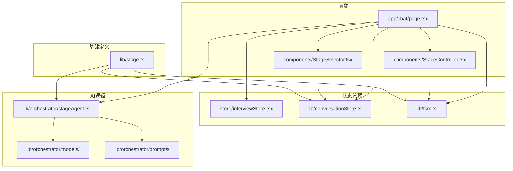
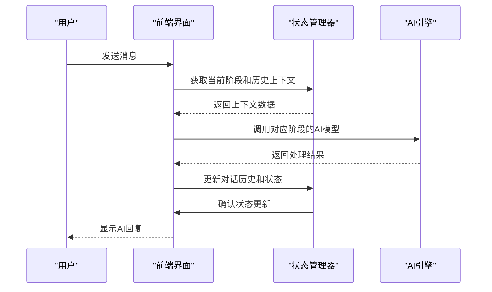
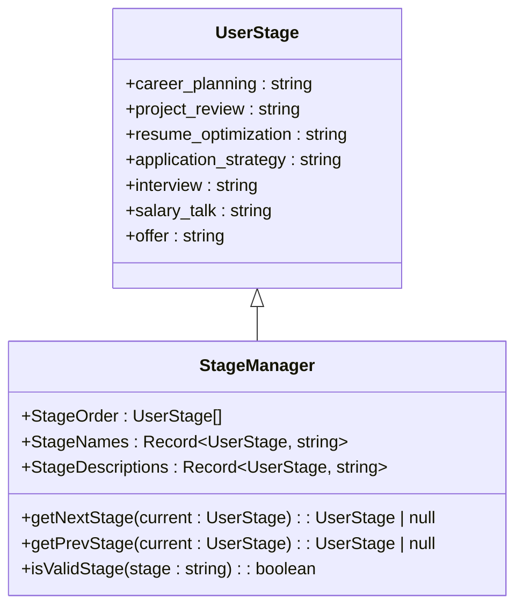
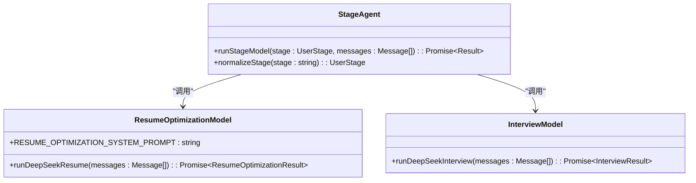
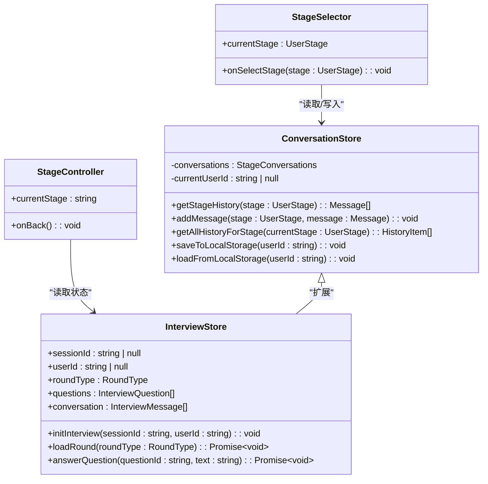
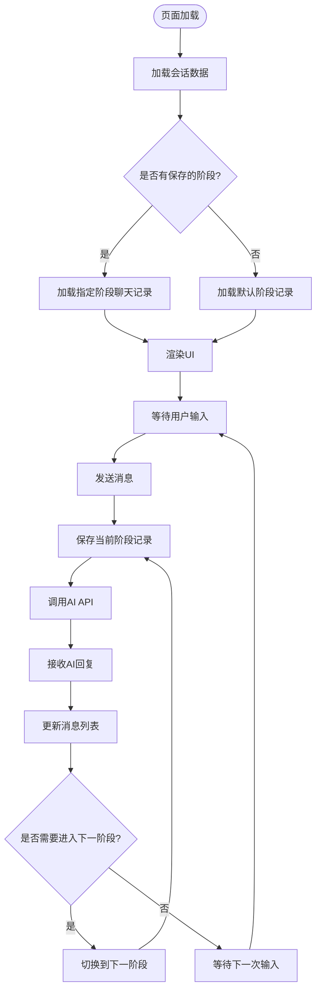
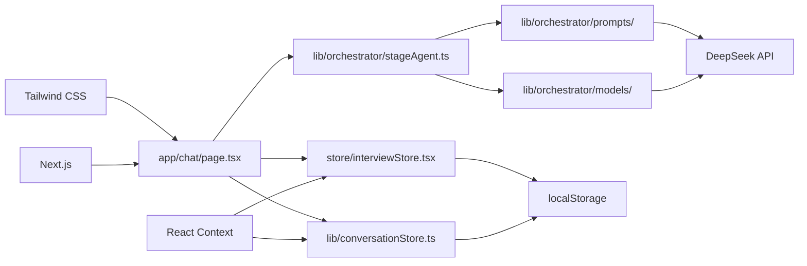

# 多阶段AI引导流程

<cite>
**本文档引用文件**   
- [stage.ts](file://lib/stage.ts)
- [stageAgent.ts](file://lib/orchestrator/stageAgent.ts)
- [resume_optimization.ts](file://lib/orchestrator/models/resume_optimization.ts)
- [resume_optimization.ts](file://lib/orchestrator/prompts/resume_optimization.ts)
- [interviewStore.tsx](file://store/interviewStore.tsx)
- [conversationStore.ts](file://lib/conversationStore.ts)
- [page.tsx](file://app/chat/page.tsx)
- [StageSelector.tsx](file://components/StageSelector.tsx)
- [StageController.tsx](file://components/StageController.tsx)
- [fsm.ts](file://lib/fsm.ts)
- [machine.ts](file://src/lib/state/machine.ts)
- [stage_implementation.md](file://lib/stage_implementation.md)
- [stage_selector_implementation.md](file://lib/stage_selector_implementation.md)
</cite>

## 目录
1. [引言](#引言)
2. [项目结构](#项目结构)
3. [核心组件](#核心组件)
4. [架构概述](#架构概述)
5. [详细组件分析](#详细组件分析)
6. [依赖分析](#依赖分析)
7. [性能考虑](#性能考虑)
8. [故障排除指南](#故障排除指南)
9. [结论](#结论)

## 引言
本系统是一个基于多阶段AI引导的智能求职教练平台，通过结构化的流程设计帮助用户完成职业规划、简历优化、模拟面试、薪资谈判等关键求职环节。系统采用状态机模式管理用户在不同阶段间的流转，结合AI行为模型和提示词模板，为用户提供个性化的指导服务。前端通过Zustand状态管理库（实际为React Context）同步用户进度，并动态渲染不同阶段的交互内容。本文档将深入分析系统的架构设计与运行机制。

## 项目结构
该项目采用Next.js框架构建，整体结构清晰，分为应用层、组件层、逻辑层和存储层。主要目录包括：
- `app/`：Next.js应用入口，包含页面和API路由
- `components/`：可复用的UI组件
- `lib/`：核心业务逻辑和工具函数
- `store/`：全局状态管理
- `src/lib/`：底层状态机和知识库

系统通过模块化设计实现了高内聚低耦合的架构，各层职责分明，便于维护和扩展。

**图源**
- [page.tsx](file://app/chat/page.tsx)
- [StageSelector.tsx](file://components/StageSelector.tsx)
- [StageController.tsx](file://components/StageController.tsx)
- [interviewStore.tsx](file://store/interviewStore.tsx)
- [conversationStore.ts](file://lib/conversationStore.ts)
- [fsm.ts](file://lib/fsm.ts)
- [stageAgent.ts](file://lib/orchestrator/stageAgent.ts)
- [resume_optimization.ts](file://lib/orchestrator/models/resume_optimization.ts)
- [resume_optimization.ts](file://lib/orchestrator/prompts/resume_optimization.ts)
- [stage.ts](file://lib/stage.ts)

## 核心组件
系统的核心组件围绕用户求职流程的七个阶段构建：职业规划、项目梳理、简历优化、投递策略、模拟面试、薪资沟通和Offer。每个阶段都有对应的AI行为模型和提示词模板，确保AI能够根据当前阶段提供恰当的指导。状态管理通过`conversationStore`和`interviewStore`实现，前者管理各阶段的独立对话历史，后者管理模拟面试的特定状态。前端通过`StageSelector`和`StageController`组件提供直观的阶段切换和导航功能。

**章节来源**
- [stage.ts](file://lib/stage.ts#L6-L13)
- [conversationStore.ts](file://lib/conversationStore.ts)
- [interviewStore.tsx](file://store/interviewStore.tsx)

## 架构概述
系统采用分层架构设计，从前端到后端形成了完整的数据流闭环。用户在前端界面进行交互，触发状态变更，这些变更通过状态管理器同步，并在需要时持久化到localStorage。当用户发送消息时，系统会收集当前阶段及历史阶段的上下文，调用相应的AI模型处理请求，然后将结果反馈给用户并更新状态。整个流程体现了清晰的关注点分离原则。

**图源**
- [page.tsx](file://app/chat/page.tsx)
- [conversationStore.ts](file://lib/conversationStore.ts)
- [stageAgent.ts](file://lib/orchestrator/stageAgent.ts)

## 详细组件分析

### 阶段定义与跳转逻辑
系统通过`lib/stage.ts`文件定义了`UserStage`枚举类型，明确列出了求职流程的七个阶段。该文件还提供了`StageOrder`数组来定义阶段的顺序，以及`getNextStage`和`getPrevStage`函数来实现阶段间的跳转。这种设计使得阶段跳转逻辑集中且易于维护。

**图源**
- [stage.ts](file://lib/stage.ts)

**章节来源**
- [stage.ts](file://lib/stage.ts)

### AI行为模型与提示词管理
`stageAgent.ts`文件作为统一的阶段Agent路由，根据用户当前阶段选择对应的AI行为模型。虽然当前代码中LangChain相关逻辑被禁用，但设计上保留了通过`runStageModel`函数调用不同模型的结构。每个模型（如`resume_optimization.ts`）都集成了特定的提示词模板（如`prompts/resume_optimization.ts`），确保AI输出符合该阶段的专业要求。

**图源**
- [stageAgent.ts](file://lib/orchestrator/stageAgent.ts)
- [resume_optimization.ts](file://lib/orchestrator/models/resume_optimization.ts)
- [resume_optimization.ts](file://lib/orchestrator/prompts/resume_optimization.ts)

**章节来源**
- [stageAgent.ts](file://lib/orchestrator/stageAgent.ts)
- [resume_optimization.ts](file://lib/orchestrator/models/resume_optimization.ts)
- [resume_optimization.ts](file://lib/orchestrator/prompts/resume_optimization.ts)

### 前端状态同步机制
前端通过`StageSelector`和`StageController`组件与Zustand状态(store/interviewStore.tsx, conversationStore.ts)同步用户进度。`conversationStore.ts`管理各阶段的独立对话历史，使用`StageConversations`类型确保每个阶段的消息独立存储。`interviewStore.tsx`则专门管理模拟面试的复杂状态，包括问题列表、评估结果和轮次信息。

**图源**
- [conversationStore.ts](file://lib/conversationStore.ts)
- [interviewStore.tsx](file://store/interviewStore.tsx)
- [StageSelector.tsx](file://components/StageSelector.tsx)
- [StageController.tsx](file://components/StageController.tsx)

**章节来源**
- [conversationStore.ts](file://lib/conversationStore.ts)
- [interviewStore.tsx](file://store/interviewStore.tsx)
- [StageSelector.tsx](file://components/StageSelector.tsx)
- [StageController.tsx](file://components/StageController.tsx)

### 主界面动态渲染
`/app/chat/page.tsx`作为主界面，负责动态渲染不同阶段的交互内容。该组件通过`useStageFSM`钩子和`userStage`状态管理当前阶段，结合`StageController`提供导航，`ChatFlow`显示对话，`Whiteboard`展示分析结果。当用户切换阶段时，系统会自动保存当前阶段的聊天记录，并加载目标阶段的历史记录。

**图源**
- [page.tsx](file://app/chat/page.tsx)

**章节来源**
- [page.tsx](file://app/chat/page.tsx)

## 依赖分析
系统内部依赖关系清晰，形成了稳定的技术栈。前端依赖Next.js框架和Tailwind CSS进行UI构建，状态管理依赖React Context API。AI逻辑层依赖自定义的orchestrator模块，而基础定义则集中在lib目录下。外部依赖包括DeepSeek AI API用于智能对话，localStorage用于数据持久化。

**图源**
- [package.json](file://package.json)
- [page.tsx](file://app/chat/page.tsx)
- [interviewStore.tsx](file://store/interviewStore.tsx)
- [conversationStore.ts](file://lib/conversationStore.ts)
- [stageAgent.ts](file://lib/orchestrator/stageAgent.ts)

**章节来源**
- [package.json](file://package.json)

## 性能考虑
系统在性能方面做了多项优化。首先，通过localStorage实现客户端数据持久化，减少了不必要的网络请求。其次，对话历史的管理采用了分阶段存储策略，避免了单一大对象的性能问题。再者，AI调用时采用了debounce技术，防止用户快速输入导致的频繁API调用。最后，状态更新使用了useCallback和useMemo等React优化钩子，减少了不必要的组件重新渲染。

## 故障排除指南
当系统出现异常时，可按以下步骤进行排查：
1. 检查环境变量是否配置正确，特别是DEEPSEEK_API_KEY
2. 清除localStorage中的缓存数据，重新开始会话
3. 检查网络请求，确认API调用是否成功
4. 查看浏览器控制台日志，定位具体错误信息
5. 验证阶段跳转逻辑，确保userStage状态正确更新

对于流程中断的情况，系统具备恢复机制。由于所有阶段的聊天记录都持久化存储在localStorage中，用户刷新页面或重新登录后，系统会自动恢复到上次的进度状态。

**章节来源**
- [README.md](file://README.md)
- [conversationStore.ts](file://lib/conversationStore.ts)

## 结论
本多阶段AI引导系统通过精心设计的架构，实现了求职流程的智能化和结构化。系统以用户为中心，通过清晰的阶段划分和流畅的导航体验，帮助用户逐步完成求职准备。AI模型与提示词的紧密结合确保了指导的专业性，而完善的状态管理和数据持久化机制则保障了用户体验的连续性。未来可进一步优化阶段间的跳转条件，增加更多的自动化判断逻辑，使系统更加智能和人性化。