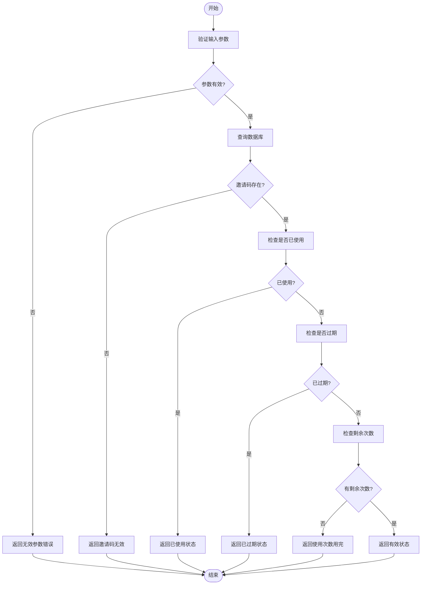
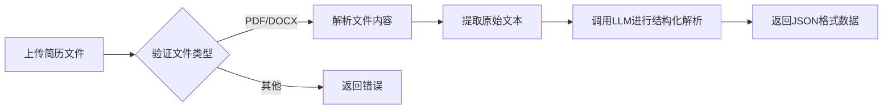
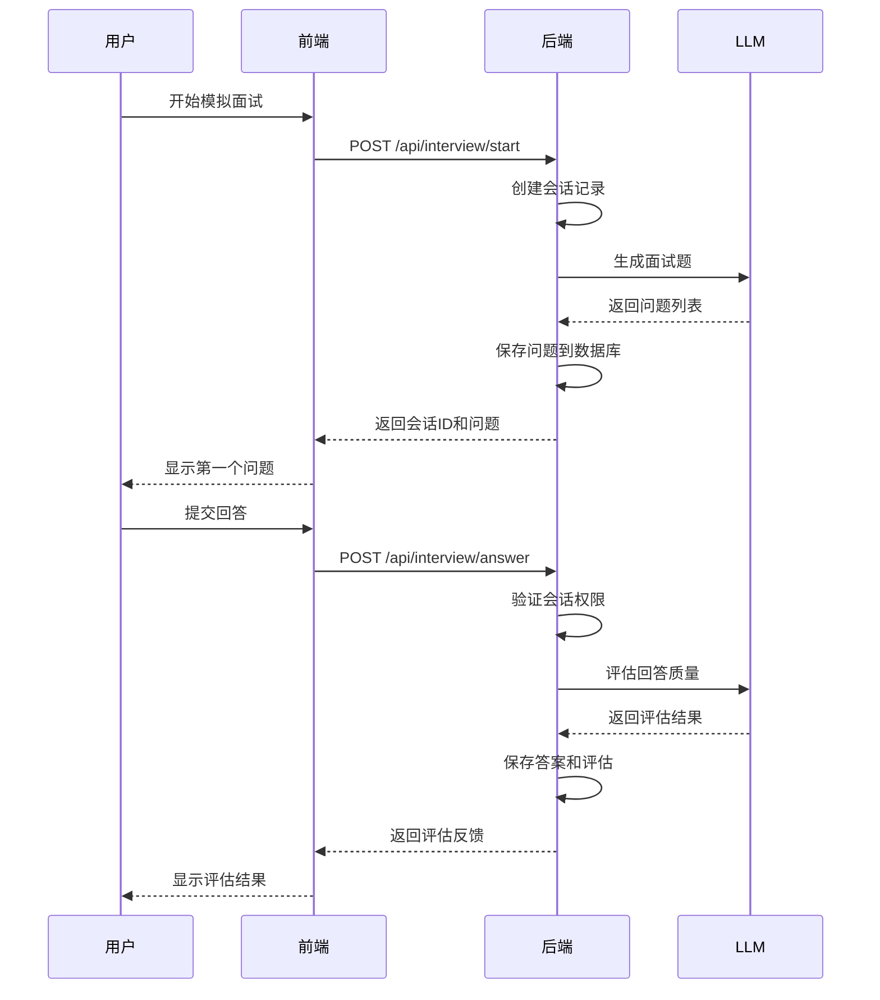
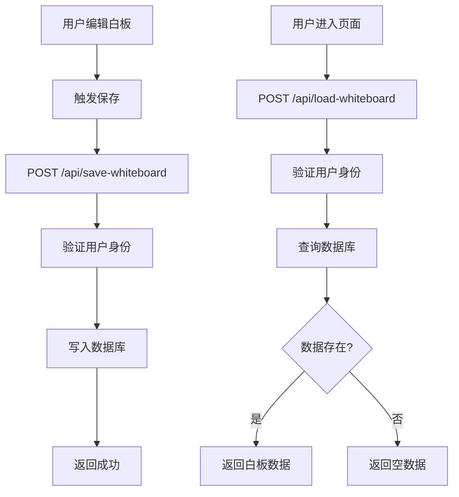
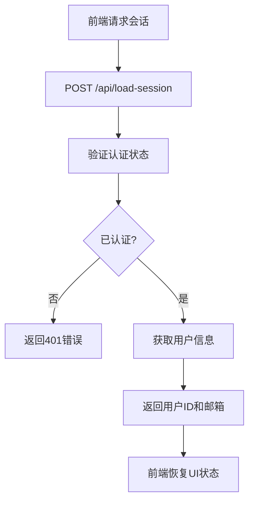

# 核心功能模块

<cite>
**本文档引用文件**  
- [app/api/invites/check/route.ts](file://app/api/invites/check/route.ts)
- [app/api/load-session/route.ts](file://app/api/load-session/route.ts)
- [app/api/resume/upload/route.ts](file://app/api/resume/upload/route.ts)
- [app/api/parse-resume/route.ts](file://app/api/parse-resume/route.ts)
- [app/api/interview/start/route.ts](file://app/api/interview/start/route.ts)
- [app/api/interview/answer/route.ts](file://app/api/interview/answer/route.ts)
- [app/api/interview/assess/route.ts](file://app/api/interview/assess/route.ts)
- [app/api/save-whiteboard/route.ts](file://app/api/save-whiteboard/route.ts)
- [app/api/load-whiteboard/route.ts](file://app/api/load-whiteboard/route.ts)
- [lib/stage.ts](file://lib/stage.ts)
- [lib/auth.ts](file://lib/auth.ts)
- [lib/inviteCode.ts](file://lib/inviteCode.ts)
- [lib/interview/types.ts](file://lib/interview/types.ts)
- [lib/chains/parse_resume.ts](file://lib/chains/parse_resume.ts)
- [lib/llm.ts](file://lib/llm.ts)
</cite>

## 目录
1. [用户注册与认证流程](#用户注册与认证流程)
2. [邀请码系统实现](#邀请码系统实现)
3. [简历上传与解析机制](#简历上传与解析机制)
4. [多阶段AI引导流程](#多阶段ai引导流程)
5. [模拟面试系统生命周期](#模拟面试系统生命周期)
6. [白板持久化机制](#白板持久化机制)
7. [会话恢复机制](#会话恢复机制)

## 用户注册与认证流程

用户从注册到进入主界面的完整流程包括：注册页面提交信息 → 邀请码验证 → 创建会话 → 加载用户状态 → 进入主界面。系统基于Supabase进行身份认证，通过`getCurrentUserFromRequest`函数从请求中提取当前用户信息。

**Section sources**
- [app/api/auth/create-session/route.ts](file://app/api/auth/create-session/route.ts)
- [lib/auth.ts](file://lib/auth.ts)

## 邀请码系统实现

邀请码系统通过`/api/invites/check`接口实现验证功能，支持GET和POST两种请求方式。该接口检查邀请码的有效性、使用状态、过期时间及剩余使用次数，并返回详细的状态信息。

**Diagram sources**
- [app/api/invites/check/route.ts](file://app/api/invites/check/route.ts)

**Section sources**
- [app/api/invites/check/route.ts](file://app/api/invites/check/route.ts)
- [lib/inviteCode.ts](file://lib/inviteCode.ts)

## 简历上传与解析机制

简历上传功能通过`/api/resume/upload`接口实现，支持PDF、DOC、DOCX格式文件。系统使用formidable库解析multipart/form-data，将文件存储至Supabase Storage，并在数据库中记录元数据。

简历内容提取通过`/api/parse-resume`接口实现，采用`pdf-parse`库解析PDF文本，再通过LLM进行结构化信息提取。技术路径如下：

**Diagram sources**
- [app/api/resume/upload/route.ts](file://app/api/resume/upload/route.ts)
- [app/api/parse-resume/route.ts](file://app/api/parse-resume/route.ts)

**Section sources**
- [app/api/resume/upload/route.ts](file://app/api/resume/upload/route.ts)
- [app/api/parse-resume/route.ts](file://app/api/parse-resume/route.ts)
- [lib/chains/parse_resume.ts](file://lib/chains/parse_resume.ts)

## 多阶段AI引导流程

系统采用状态机模式管理用户求职流程，定义了七个核心阶段：职业规划、项目梳理、简历优化、投递策略、模拟面试、薪资沟通、Offer评估。`lib/stage.ts`文件中定义了`UserStage`类型和阶段跳转逻辑。

每个阶段由对应的AI代理处理，通过`getNextStage`和`getPrevStage`函数实现阶段跳转。系统根据当前阶段提供相应的引导内容和交互界面。

**Diagram sources**
- [lib/stage.ts](file://lib/stage.ts)

**Section sources**
- [lib/stage.ts](file://lib/stage.ts)

## 模拟面试系统生命周期

模拟面试系统包含三个核心接口：`/start`触发面试、`/answer`接收回答、`/assess`生成评估。其生命周期如下：

**Diagram sources**
- [app/api/interview/start/route.ts](file://app/api/interview/start/route.ts)
- [app/api/interview/answer/route.ts](file://app/api/interview/answer/route.ts)
- [app/api/interview/assess/route.ts](file://app/api/interview/assess/route.ts)

**Section sources**
- [app/api/interview/start/route.ts](file://app/api/interview/start/route.ts)
- [app/api/interview/answer/route.ts](file://app/api/interview/answer/route.ts)
- [app/api/interview/assess/route.ts](file://app/api/interview/assess/route.ts)
- [lib/interview/types.ts](file://lib/interview/types.ts)

## 白板持久化机制

白板数据通过`/api/save-whiteboard`和`/api/load-whiteboard`接口实现持久化存储。系统使用Supabase数据库的`whiteboard_states`表存储用户白板状态，以用户ID为键进行upsert操作。

**Diagram sources**
- [app/api/save-whiteboard/route.ts](file://app/api/save-whiteboard/route.ts)
- [app/api/load-whiteboard/route.ts](file://app/api/load-whiteboard/route.ts)

**Section sources**
- [app/api/save-whiteboard/route.ts](file://app/api/save-whiteboard/route.ts)
- [app/api/load-whiteboard/route.ts](file://app/api/load-whiteboard/route.ts)

## 会话恢复机制

会话恢复通过`/api/load-session`接口实现，该接口验证用户身份后返回用户基本信息，用于恢复前端会话状态。系统依赖Supabase的认证机制，通过`getCurrentUserFromRequest`函数获取当前用户。

**Diagram sources**
- [app/api/load-session/route.ts](file://app/api/load-session/route.ts)

**Section sources**
- [app/api/load-session/route.ts](file://app/api/load-session/route.ts)
- [lib/auth.ts](file://lib/auth.ts)