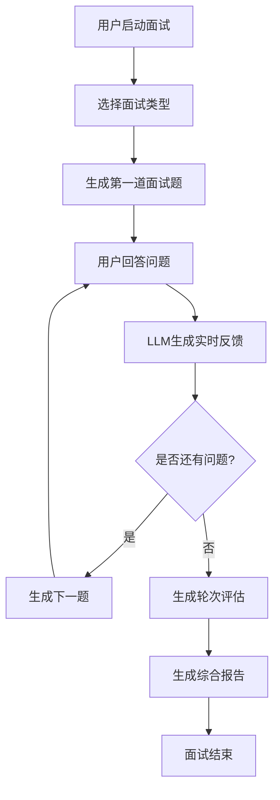
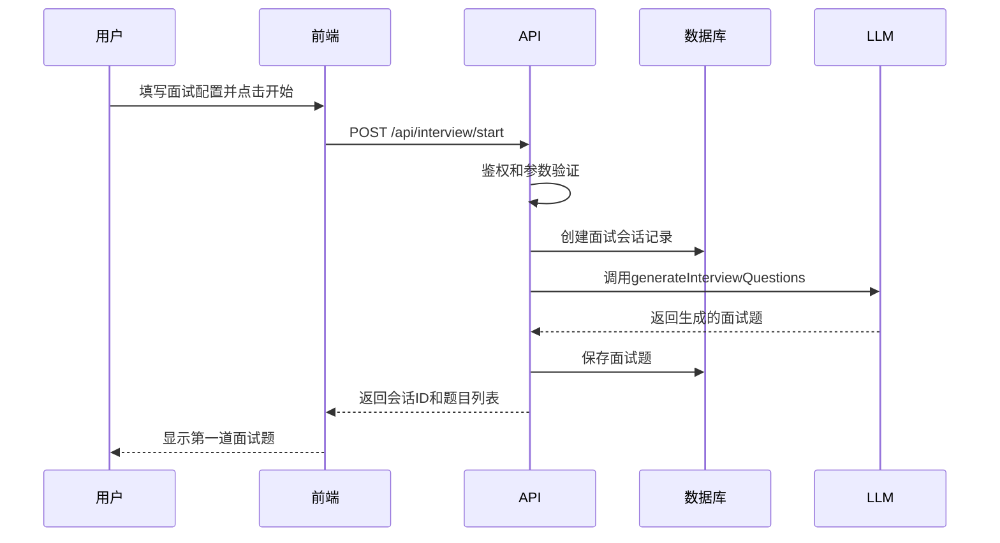
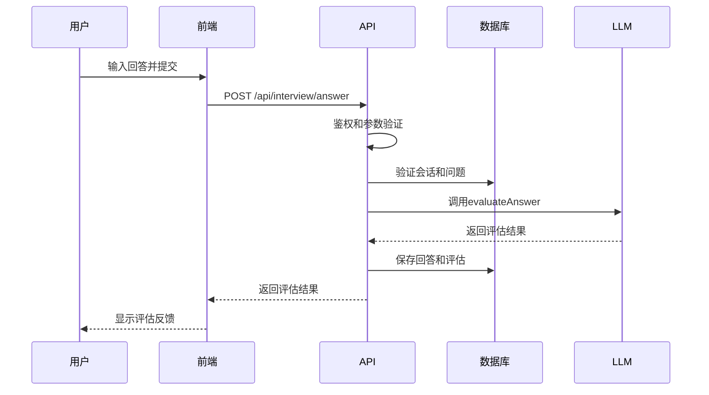
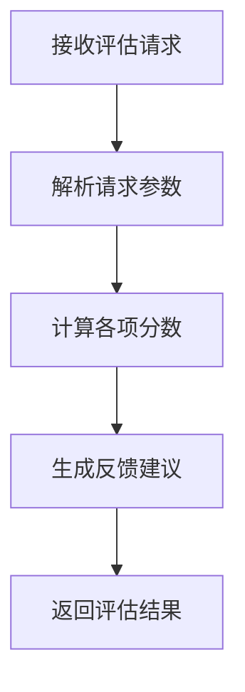
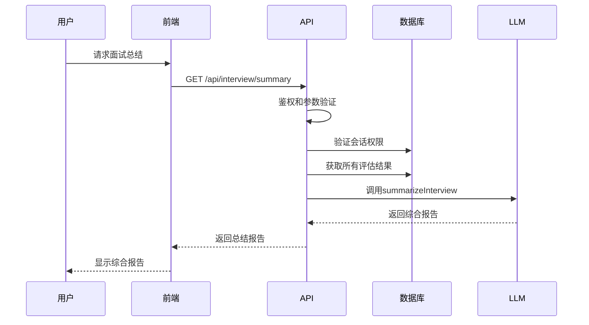
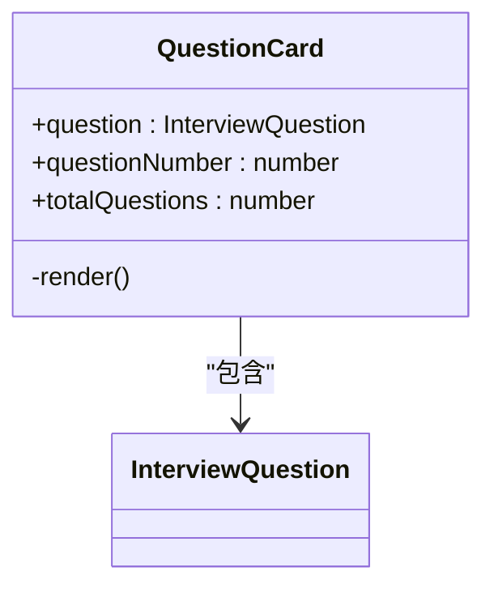
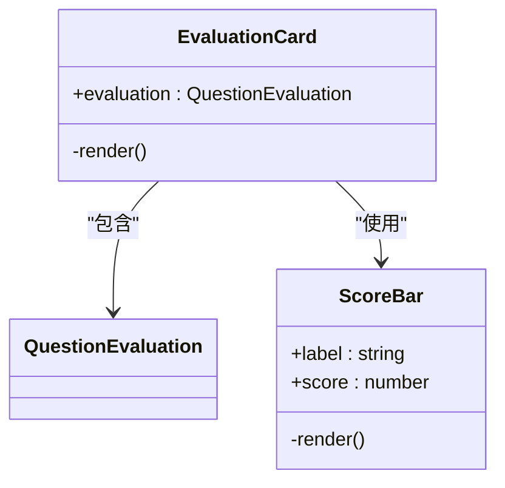
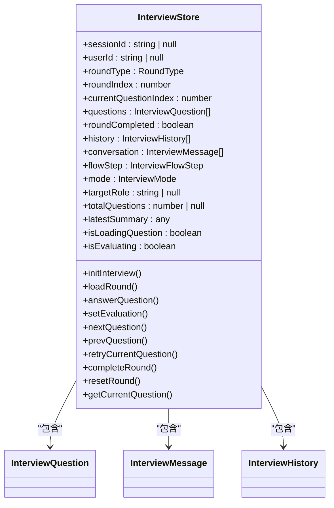
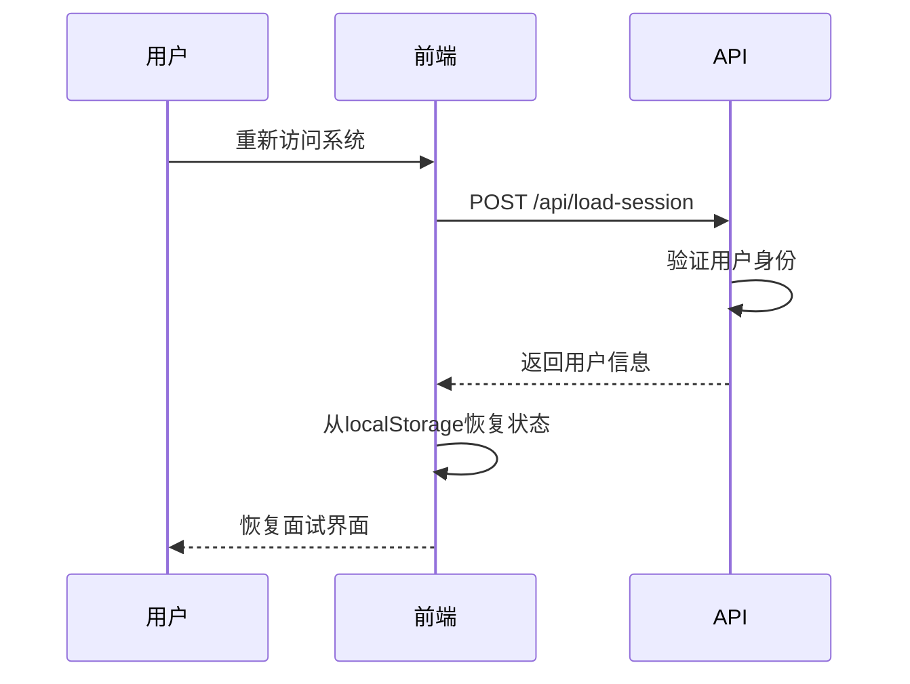
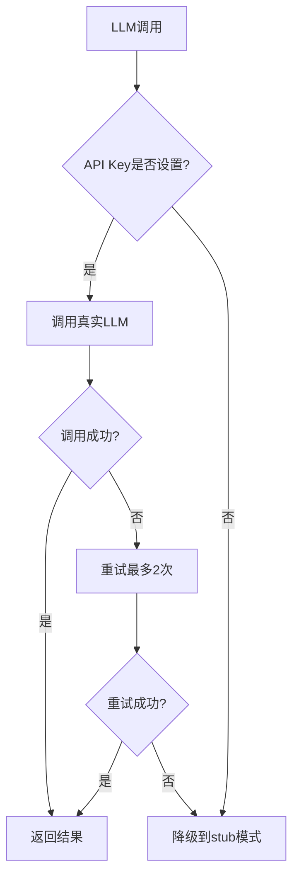

# 模拟面试系统

<cite>
**本文档引用文件**  
- [app/api/interview/start/route.ts](file://app/api/interview/start/route.ts)
- [app/api/interview/answer/route.ts](file://app/api/interview/answer/route.ts)
- [app/api/interview/assess/route.ts](file://app/api/interview/assess/route.ts)
- [app/api/interview/summary/route.ts](file://app/api/interview/summary/route.ts)
- [app/api/interview/route.ts](file://app/api/interview/route.ts)
- [app/api/load-session/route.ts](file://app/api/load-session/route.ts)
- [app/interview/start/page.tsx](file://app/interview/start/page.tsx)
- [components/interview/QuestionCard.tsx](file://components/interview/QuestionCard.tsx)
- [components/interview/EvaluationCard.tsx](file://components/interview/EvaluationCard.tsx)
- [store/interviewStore.tsx](file://store/interviewStore.tsx)
- [lib/interview/types.ts](file://lib/interview/types.ts)
- [lib/interview/llm.ts](file://lib/interview/llm.ts)
- [INTERVIEW_LLM_FIX_SUMMARY.md](file://INTERVIEW_LLM_FIX_SUMMARY.md)
</cite>

## 目录
1. [系统概述](#系统概述)
2. [面试会话生命周期](#面试会话生命周期)
3. [核心API接口分析](#核心api接口分析)
4. [前端组件与交互机制](#前端组件与交互机制)
5. [状态管理机制](#状态管理机制)
6. [会话恢复方案](#会话恢复方案)
7. [错误处理与优化实践](#错误处理与优化实践)

## 系统概述

模拟面试系统是一个完整的全栈应用，提供从面试启动、问题回答、实时评估到综合报告生成的完整生命周期管理。系统通过API接口与前端组件协同工作，利用LLM技术提供智能化的面试体验。系统支持多种面试类型，包括业务面、技术面、HR面、项目深挖和总监面等，能够根据不同的面试轮次生成针对性的问题和评估。

**Section sources**
- [app/api/interview/start/route.ts](file://app/api/interview/start/route.ts)
- [app/interview/start/page.tsx](file://app/interview/start/page.tsx)

## 面试会话生命周期

模拟面试系统的生命周期从用户触发面试会话开始，经历多个阶段直至生成最终的综合报告。整个流程包括面试启动、问题回答、实时反馈、轮次评估和总结报告生成等关键环节。

**Diagram sources**
- [app/api/interview/start/route.ts](file://app/api/interview/start/route.ts)
- [app/api/interview/answer/route.ts](file://app/api/interview/answer/route.ts)
- [app/api/interview/summary/route.ts](file://app/api/interview/summary/route.ts)

## 核心API接口分析

### /api/interview/start 接口

`/api/interview/start` 接口是面试会话的入口点，负责创建新的面试会话并生成面试题目。该接口接收职位描述(JD)、面试轮次类型(roundType)和题目数量(questionCount)作为输入参数。

当用户触发此接口时，系统首先进行用户鉴权，确保只有登录用户才能创建面试会话。然后验证请求参数的完整性和有效性，包括检查JD是否为空、面试轮次类型是否有效以及题目数量是否大于0。

验证通过后，系统会创建一个面试会话记录到数据库中，并调用LLM生成指定数量的面试题目。生成的题目包含问题内容和详细的提示信息(tips)，包括考察意图、关键要点、回答框架、行业特性、避坑点和专业建议等。

**Section sources**
- [app/api/interview/start/route.ts](file://app/api/interview/start/route.ts)
- [lib/interview/llm.ts](file://lib/interview/llm.ts)

### /api/interview/answer 接口

`/api/interview/answer` 接口负责接收用户对面试问题的回答，并调用LLM生成实时反馈。该接口接收会话ID、问题ID和用户回答作为输入参数。

接口首先验证用户是否有权访问指定的面试会话，然后验证问题是否存在且属于该会话。验证通过后，系统调用LLM对用户回答进行评估，生成包含准确性、语法、细节和自信度等维度的评分，以及具体的改进建议。

评估结果会被保存到数据库中，以便后续生成综合报告时使用。系统还实现了降级机制，当LLM调用失败时，会返回基于规则的简单评估结果，确保用户体验不中断。

**Section sources**
- [app/api/interview/answer/route.ts](file://app/api/interview/answer/route.ts)
- [lib/interview/llm.ts](file://lib/interview/llm.ts)

### /api/interview/assess 接口

`/api/interview/assess` 接口在每轮面试结束时执行评分逻辑，对用户的整体表现进行综合评估。该接口接收面试轮次、问题和回答作为输入参数。

接口实现了一套基于规则的评分系统，通过分析回答长度、关键词匹配度和结构完整性等指标，计算出准确性、完整性、逻辑性和表达清晰度等维度的分数。系统还生成具体的反馈建议，包括优点、改进建议和总体评价。

**Section sources**
- [app/api/interview/assess/route.ts](file://app/api/interview/assess/route.ts)

### /api/interview/summary 接口

`/api/interview/summary` 接口负责生成面试的综合报告，通过数据聚合过程整合所有问题的评估结果。该接口接收会话ID作为查询参数。

系统首先验证用户是否有权访问指定的面试会话，然后从数据库中获取该会话的所有回答和评估记录。如果存在有效的评估结果，系统会调用LLM生成综合报告，包括整体得分、优势表现、薄弱环节和改进建议等。

综合报告不仅基于单个问题的评估，还会考虑整体表现趋势，提供更具洞察力的反馈。报告生成后，系统会将其返回给前端，供用户查看和分析。

**Section sources**
- [app/api/interview/summary/route.ts](file://app/api/interview/summary/route.ts)
- [lib/interview/llm.ts](file://lib/interview/llm.ts)

## 前端组件与交互机制

### QuestionCard 组件

`QuestionCard` 组件负责显示当前的面试问题，提供清晰的视觉呈现和交互界面。组件显示问题内容、题号标识和用户回答（如果有）。

组件采用响应式设计，适配不同屏幕尺寸。问题卡片包含题号标识，显示当前题号和总题数，以及问题状态（待回答、已回答或已评估）。用户回答部分以背景色区分，便于识别。

**Section sources**
- [components/interview/QuestionCard.tsx](file://components/interview/QuestionCard.tsx)
- [store/interviewStore.tsx](file://store/interviewStore.tsx)

### EvaluationCard 组件

`EvaluationCard` 组件显示问题的评估结果，包括各项评分和改进建议。组件采用评分进度条的形式直观展示各项得分，使用不同颜色表示评分等级。

组件包含准确性、详细度、逻辑性和自信度等评分项，以及综合评分和改进建议。评分进度条采用动画效果，提升用户体验。改进建议部分突出显示，便于用户重点关注。

**Section sources**
- [components/interview/EvaluationCard.tsx](file://components/interview/EvaluationCard.tsx)
- [store/interviewStore.tsx](file://store/interviewStore.tsx)

## 状态管理机制

### interviewStore.tsx 状态管理

`interviewStore.tsx` 文件实现了模拟面试系统的全局状态管理，使用React Context API管理面试流程的状态和操作。状态管理器不依赖第三方库如zustand，而是使用原生React Context API。

状态管理器维护了面试会话的核心状态，包括会话ID、用户ID、当前轮次信息、问题列表、轮次状态、历史记录和对话内容等。它还提供了丰富的操作方法，如初始化面试、加载轮次、回答问题、设置评估、跳转问题、完成轮次等。

状态管理器实现了多轮次面试的状态管理，支持在不同轮次间切换和恢复。它还处理了面试过程中的各种状态变化，如加载问题、评估回答等，并提供了相应的加载状态指示。

**Section sources**
- [store/interviewStore.tsx](file://store/interviewStore.tsx)

## 会话恢复方案

### /api/load-session 接口

`/api/load-session` 接口提供面试中断后恢复上下文的方案。当用户重新访问系统时，该接口用于验证用户身份并恢复会话状态。

接口首先通过`getCurrentUserFromRequest`函数验证用户身份，确保只有认证用户才能访问。验证通过后，返回用户的基本信息，包括用户ID和邮箱，供前端用于恢复用户界面状态。

系统还利用localStorage存储会话相关数据，如会话ID和用户ID，实现更持久的会话恢复。当用户重新访问时，系统会尝试从localStorage中读取这些信息，并恢复相应的面试状态。

**Section sources**
- [app/api/load-session/route.ts](file://app/api/load-session/route.ts)
- [store/interviewStore.tsx](file://store/interviewStore.tsx)

## 错误处理与优化实践

### 典型错误处理场景

系统实现了完善的错误处理机制，包括超时重试和答案长度限制等。在LLM调用中，系统设置了合理的超时时间（30-60秒）和最大重试次数（2次），确保在网络不稳定时仍能提供服务。

对于用户输入，系统在前端和后端都进行了验证，确保答案不为空且长度合理。当LLM调用失败时，系统会降级到stub模式，返回基于规则的简单评估结果，保证用户体验不中断。

系统还实现了详细的日志记录，便于调试和问题排查。所有关键操作都会记录日志，包括API调用、数据库操作和LLM调用等。

### INTERVIEW_LLM_FIX_SUMMARY.md 优化实践

根据`INTERVIEW_LLM_FIX_SUMMARY.md`文档中的优化实践，系统进行了多项改进：

1. **运行时配置**：在所有面试相关的API路由文件顶部添加了`export const runtime = "nodejs";`，确保使用Node.js运行时而不是Edge Runtime，避免了LLM调用的兼容性问题。

2. **LLM调用机制**：实现了灵活的LLM调用机制，优先使用DeepSeek API，如果没有配置则使用OpenAI API。系统还支持通过环境变量`LLM_STUB=1`强制使用stub模式，便于开发和测试。

3. **降级策略**：当API key未设置或LLM调用失败时，系统会自动降级到stub模式，返回预定义的评估结果，确保服务可用性。

4. **超时和重试**：为不同的LLM调用设置了合理的超时时间和重试策略，生成题目30秒超时，评估答案20秒超时，确保在各种网络条件下都能正常工作。

5. **环境变量管理**：明确要求配置`DEEPSEEK_API_KEY`或`OPENAI_API_KEY`环境变量，并提供了详细的测试步骤，便于部署和维护。

**Section sources**
- [INTERVIEW_LLM_FIX_SUMMARY.md](file://INTERVIEW_LLM_FIX_SUMMARY.md)
- [lib/interview/llm.ts](file://lib/interview/llm.ts)
- [app/api/interview/route.ts](file://app/api/interview/route.ts)