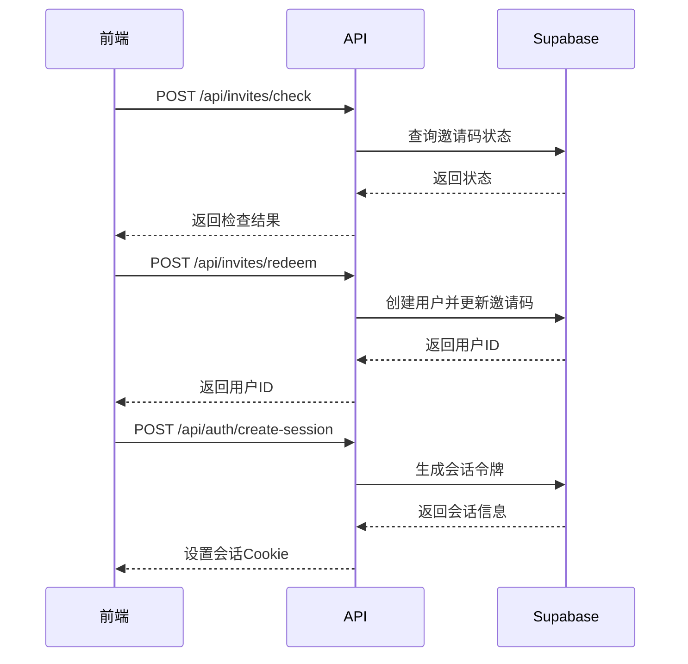
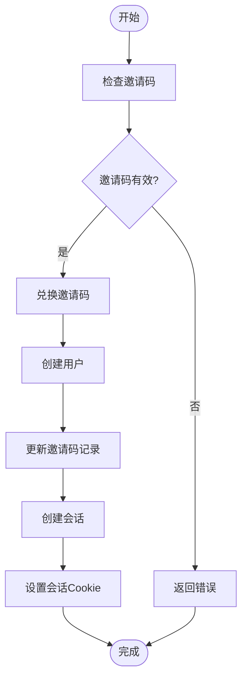
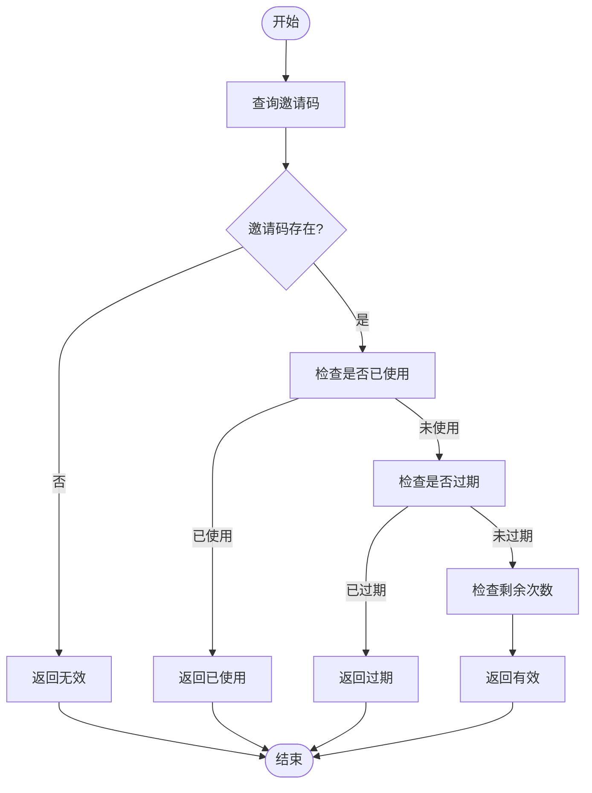
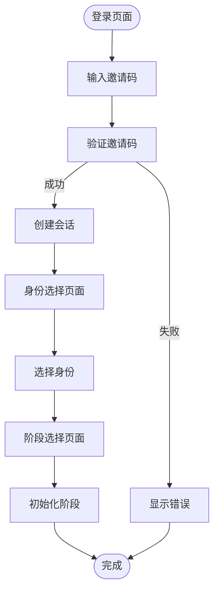
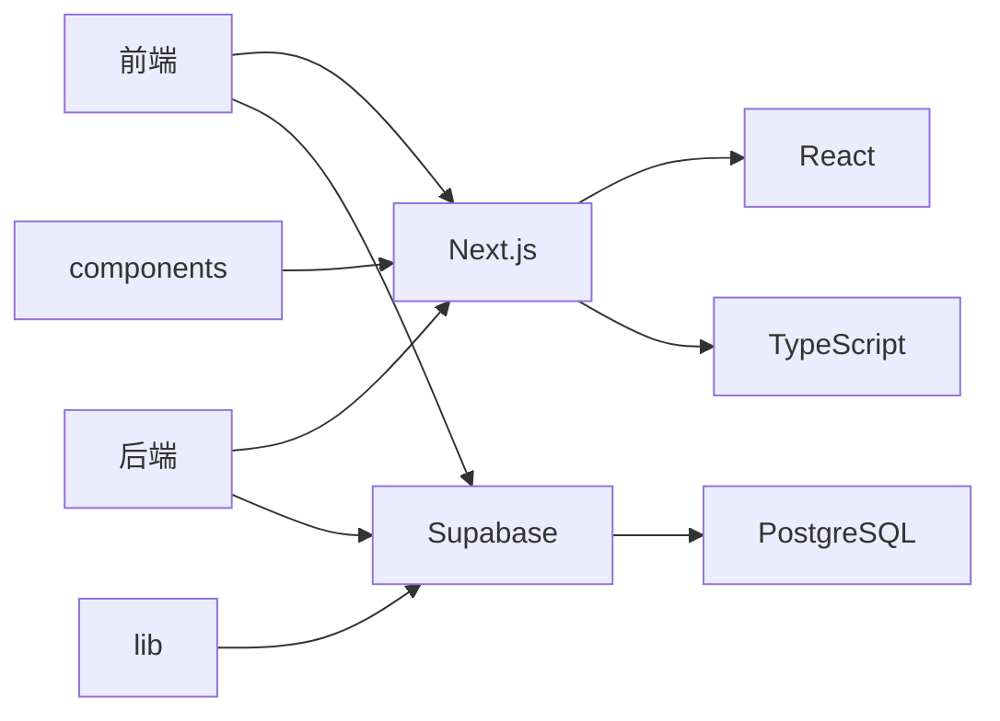

# 用户认证与邀请码系统

<cite>
**本文档引用的文件**   
- [create-session/route.ts](file://app/api/auth/create-session/route.ts)
- [invites/check/route.ts](file://app/api/invites/check/route.ts)
- [invites/redeem/route.ts](file://app/api/invites/redeem/route.ts)
- [verify/route.ts](file://app/api/verify/route.ts)
- [verify-invite/route.ts](file://app/api/verify-invite/route.ts)
- [auth.ts](file://lib/auth.ts)
- [inviteCode.ts](file://lib/inviteCode.ts)
- [login/page.tsx](file://app/login/page.tsx)
- [register/page.tsx](file://app/register/page.tsx)
- [identity-select/page.tsx](file://app/onboarding/identity-select/page.tsx)
- [stage-select/page.tsx](file://app/onboarding/stage-select/page.tsx)
- [admin/invites/generate/route.ts](file://app/api/admin/invites/generate/route.ts)
- [useAuth.ts](file://lib/useAuth.ts)
- [彻底解决403问题.md](file://彻底解决403问题.md)
</cite>

## 目录
1. [简介](#简介)
2. [项目结构](#项目结构)
3. [核心组件](#核心组件)
4. [架构概述](#架构概述)
5. [详细组件分析](#详细组件分析)
6. [依赖分析](#依赖分析)
7. [性能考虑](#性能考虑)
8. [故障排除指南](#故障排除指南)
9. [结论](#结论)

## 简介
本项目是一个AI求职教练平台，采用Next.js框架构建，通过Supabase实现用户认证与邀请码系统。系统核心机制包括用户注册、登录、邀请码验证与兑换、验证码校验等功能。前端页面包括登录、注册和用户身份选择等交互界面。认证状态由lib/auth.ts管理，邀请码生成策略在lib/inviteCode.ts中定义。系统设计注重安全性，防止前端提交敏感密钥，并通过环境变量配置关键参数。

## 项目结构
项目采用Next.js App Router架构，主要功能模块分布在app目录下。api子目录包含所有后端API路由，如认证、邀请码、短信验证等。前端页面按功能组织，如登录、注册和入职流程。lib目录存放核心工具库，包括认证和邀请码生成逻辑。components目录包含可复用的UI组件。系统通过Supabase进行数据存储和用户管理，邀请码相关数据存储在invites表中，用户资料存储在profiles表中。

```mermaid
graph TB
subgraph "前端页面"
Login[/login]
Register[/register]
Onboarding[/onboarding]
end
subgraph "API路由"
Auth[/api/auth]
Invites[/api/invites]
Verify[/api/verify]
Admin[/api/admin/invites/generate]
end
subgraph "核心库"
AuthLib[lib/auth.ts]
InviteCodeLib[lib/inviteCode.ts]
end
Login --> Auth
Register --> Invites
Onboarding --> Auth
Auth --> AuthLib
Invites --> InviteCodeLib
Admin --> InviteCodeLib
AuthLib --> Supabase[(Supabase)]
InviteCodeLib --> Supabase
```

**Diagram sources**
- [login/page.tsx](file://app/login/page.tsx)
- [register/page.tsx](file://app/register/page.tsx)
- [onboarding/identity-select/page.tsx](file://app/onboarding/identity-select/page.tsx)
- [create-session/route.ts](file://app/api/auth/create-session/route.ts)
- [invites/check/route.ts](file://app/api/invites/check/route.ts)
- [invites/redeem/route.ts](file://app/api/invites/redeem/route.ts)
- [verify/route.ts](file://app/api/verify/route.ts)
- [admin/invites/generate/route.ts](file://app/api/admin/invites/generate/route.ts)
- [auth.ts](file://lib/auth.ts)
- [inviteCode.ts](file://lib/inviteCode.ts)

**Section sources**
- [app](file://app)
- [lib](file://lib)

## 核心组件
系统核心组件包括用户认证、邀请码管理和前端交互三大模块。用户认证模块处理会话创建和用户状态管理，邀请码模块负责邀请码的生成、验证和兑换，前端交互模块提供用户友好的界面和流程引导。这些组件通过API路由进行通信，确保前后端分离和职责清晰。

**Section sources**
- [auth.ts](file://lib/auth.ts)
- [inviteCode.ts](file://lib/inviteCode.ts)
- [create-session/route.ts](file://app/api/auth/create-session/route.ts)
- [invites/check/route.ts](file://app/api/invites/check/route.ts)
- [invites/redeem/route.ts](file://app/api/invites/redeem/route.ts)

## 架构概述
系统采用分层架构，前端通过API路由与后端交互，后端利用Supabase进行数据存储和用户管理。认证流程从邀请码验证开始，经过兑换创建用户，最后创建会话。邀请码系统支持多种状态检查，包括有效、已使用、过期等。前端页面通过状态管理实现流畅的用户引导，从登录到身份选择再到阶段初始化。



**Diagram sources**
- [invites/check/route.ts](file://app/api/invites/check/route.ts)
- [invites/redeem/route.ts](file://app/api/invites/redeem/route.ts)
- [create-session/route.ts](file://app/api/auth/create-session/route.ts)
- [auth.ts](file://lib/auth.ts)

## 详细组件分析

### 用户认证流程分析
用户认证流程从邀请码验证开始，经过兑换创建用户，最后创建会话。系统通过Supabase Admin API创建用户，并生成会话令牌。会话信息通过Cookie存储，确保用户状态持久化。

#### 认证流程


**Diagram sources**
- [create-session/route.ts](file://app/api/auth/create-session/route.ts)
- [invites/redeem/route.ts](file://app/api/invites/redeem/route.ts)

**Section sources**
- [create-session/route.ts](file://app/api/auth/create-session/route.ts)
- [invites/redeem/route.ts](file://app/api/invites/redeem/route.ts)

### 邀请码系统分析
邀请码系统支持生成、验证和兑换功能。邀请码状态包括有效、剩余、过期、已使用和无效。系统通过数据库记录邀请码的使用次数和过期时间，确保资源合理分配。

#### 邀请码状态检查


**Diagram sources**
- [invites/check/route.ts](file://app/api/invites/check/route.ts)

**Section sources**
- [invites/check/route.ts](file://app/api/invites/check/route.ts)

### 前端交互流程分析
前端交互流程从登录页面开始，用户输入邀请码后进行验证，通过后进入身份选择页面，最后进入阶段选择页面。系统通过localStorage存储用户状态，确保流程连续性。

#### 用户身份选择流程


**Diagram sources**
- [login/page.tsx](file://app/login/page.tsx)
- [identity-select/page.tsx](file://app/onboarding/identity-select/page.tsx)
- [stage-select/page.tsx](file://app/onboarding/stage-select/page.tsx)

**Section sources**
- [login/page.tsx](file://app/login/page.tsx)
- [identity-select/page.tsx](file://app/onboarding/identity-select/page.tsx)
- [stage-select/page.tsx](file://app/onboarding/stage-select/page.tsx)

## 依赖分析
系统主要依赖Supabase进行用户认证和数据存储，Next.js框架提供前后端一体化开发能力。前端依赖React进行UI构建，通过TypeScript确保类型安全。系统通过环境变量配置关键参数，如Supabase URL和密钥，确保配置灵活性和安全性。



**Diagram sources**
- [package.json](file://package.json)
- [next.config.ts](file://next.config.ts)
- [lib/auth.ts](file://lib/auth.ts)
- [lib/inviteCode.ts](file://lib/inviteCode.ts)

**Section sources**
- [package.json](file://package.json)
- [next.config.ts](file://next.config.ts)

## 性能考虑
系统性能主要考虑API响应时间和数据库查询效率。邀请码验证和兑换操作通过Supabase的高效查询实现，减少响应延迟。会话创建通过预生成令牌和缓存机制优化，提高用户体验。前端通过懒加载和代码分割减少初始加载时间，确保快速响应。

## 故障排除指南
常见问题包括403错误、邀请码无效和会话创建失败。403错误通常由权限配置不当引起，需检查Supabase策略设置。邀请码无效可能由于过期或使用次数耗尽，需检查邀请码状态。会话创建失败可能由于环境变量配置错误，需确认SUPABASE_URL和SUPABASE_SERVICE_ROLE_KEY正确设置。

**Section sources**
- [彻底解决403问题.md](file://彻底解决403问题.md)
- [create-session/route.ts](file://app/api/auth/create-session/route.ts)
- [invites/check/route.ts](file://app/api/invites/check/route.ts)

## 结论
本系统通过Next.js和Supabase构建了一个完整的用户认证与邀请码管理系统。系统设计合理，功能完整，安全性高。通过清晰的API设计和前端交互，提供了良好的用户体验。未来可进一步优化性能，增加更多安全措施，提升系统稳定性和可靠性。