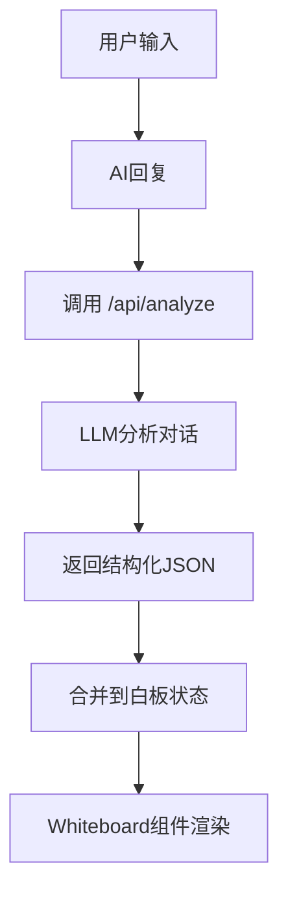
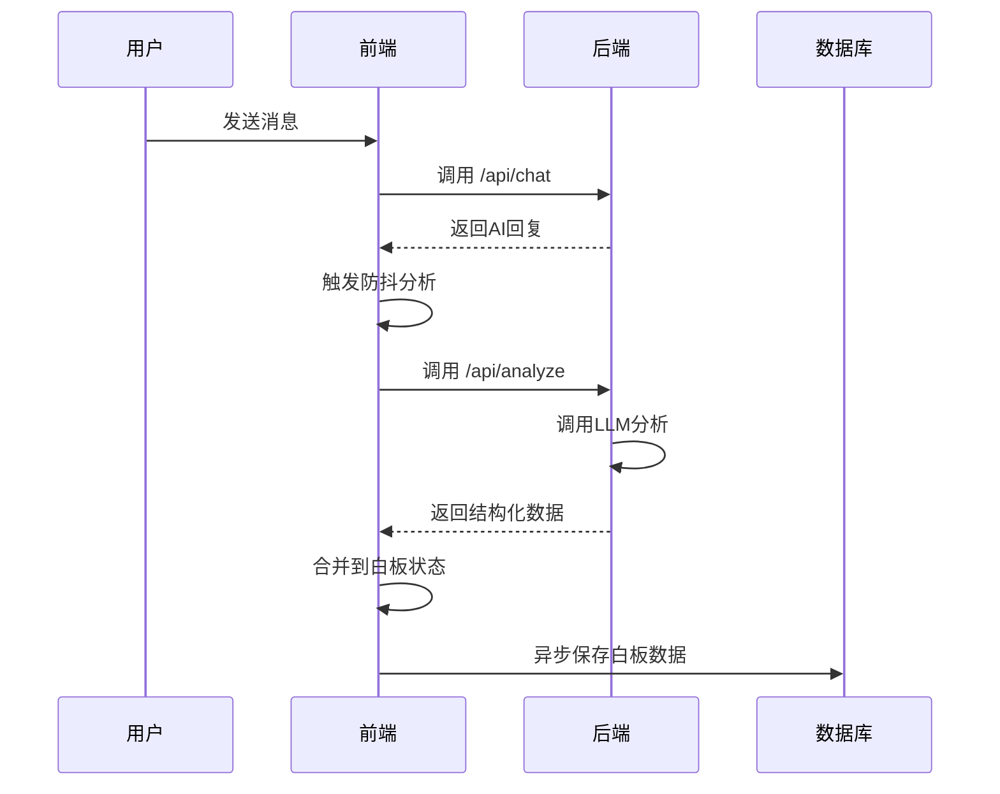

# 白板编辑与持久化

<cite>
**本文档引用文件**  
- [Whiteboard.tsx](file://components/Whiteboard.tsx)
- [DynamicBoard.tsx](file://components/DynamicBoard.tsx)
- [interviewStore.tsx](file://store/interviewStore.tsx)
- [save-whiteboard/route.ts](file://app/api/save-whiteboard/route.ts)
- [load-whiteboard/route.ts](file://app/api/load-whiteboard/route.ts)
- [db.ts](file://lib/db.ts)
- [whiteboard_implementation.md](file://lib/whiteboard_implementation.md)
- [analyze/route.ts](file://app/api/analyze/route.ts)
- [page.tsx](file://app/chat/page.tsx)
</cite>

## 目录
1. [引言](#引言)
2. [白板系统实现原理](#白板系统实现原理)
3. [数据同步机制](#数据同步机制)
4. [关键技术选型](#关键技术选型)
5. [并发编辑冲突处理](#并发编辑冲突处理)
6. [前端优化建议](#前端优化建议)
7. [结论](#结论)

## 引言
白板系统是AI求职教练应用的核心功能之一，用于在用户与AI的交互过程中动态提取、展示和持久化关键信息。该系统通过智能分析对话内容，将非结构化文本转化为结构化数据，并提供可交互的界面供用户查看和编辑。本文档详细说明白板系统的实现原理、数据同步机制、关键技术选型以及优化建议。

## 白板系统实现原理

白板系统由前端组件、状态管理、后端API和数据库持久化四部分构成，形成一个完整的数据闭环。

### Whiteboard与DynamicBoard组件

`Whiteboard` 组件是白板系统的展示层，负责根据当前阶段渲染不同类型的信息卡片。它接收 `WhiteboardData` 类型的数据，该数据结构包含多个可选字段，对应不同阶段的信息：

- **职业规划阶段**：意向岗位（`intentRole`）和核心技能（`keySkills`）
- **项目梳理阶段**：STAR项目列表（`starProjects`）
- **简历优化阶段**：简历优化建议（`resumeInsights`）
- **面试辅导阶段**：面试报告（`interviewReports`）
- **投递策略阶段**：目标公司列表（`targetCompanies`）
- **谈薪策略阶段**：薪资策略（`salaryStrategy`）
- **Offer阶段**：Offer列表（`offers`）

`DynamicBoard` 组件则提供了可编辑的白板功能，允许用户手动修改白板内容。它通过 `EditableField`、`EditableList` 和 `EditableProjects` 等子组件实现文本和列表的编辑功能。当用户编辑内容时，会触发 `onUpdate` 回调，将更新后的数据传递给父组件。



**Diagram sources**
- [Whiteboard.tsx](file://components/Whiteboard.tsx#L8-L87)
- [DynamicBoard.tsx](file://components/DynamicBoard.tsx#L9-L15)
- [analyze/route.ts](file://app/api/analyze/route.ts#L22-L87)

**Section sources**
- [Whiteboard.tsx](file://components/Whiteboard.tsx#L1-L541)
- [DynamicBoard.tsx](file://components/DynamicBoard.tsx#L1-L247)

### Zustand状态管理

尽管项目中使用了自定义的React Context进行状态管理，但其设计思想与Zustand等状态管理库相似。`interviewStore.tsx` 文件定义了 `InterviewStore` 接口，包含了面试流程所需的所有状态和操作方法。

状态管理的核心是 `useInterviewStore` Hook，它通过 `useContext` 访问全局状态。状态更新通过 `useCallback` 优化的函数实现，如 `answerQuestion`、`loadRound` 等。这些函数在执行异步操作（如API调用）后，通过 `setState` 更新状态，触发UI重新渲染。

本地状态变更通过事件驱动的方式进行管理。例如，当用户回答一个问题时，`answerQuestion` 函数会：
1. 更新本地状态中的问题回答
2. 调用后端API提交回答
3. 接收评估结果并更新状态
4. 触发UI更新

这种模式确保了状态的一致性和可预测性。

**Section sources**
- [interviewStore.tsx](file://store/interviewStore.tsx#L74-L788)

## 数据同步机制

白板系统的数据同步机制分为客户端同步和服务器端持久化两个层面。

### 客户端数据同步

在 `app/chat/page.tsx` 中，通过 `useState` 管理 `whiteboardData` 状态。每当AI回复后，系统会通过防抖（debounce）机制调用 `/api/analyze` API，分析最新对话内容并获取结构化数据。

数据合并策略如下：
- **数组字段**：追加新项，基于ID去重，避免重复
- **非数组字段**：直接覆盖旧值
- **空值处理**：字段缺失时不返回或设为null/空数组



**Diagram sources**
- [page.tsx](file://app/chat/page.tsx#L17-L20)
- [analyze/route.ts](file://app/api/analyze/route.ts#L89-L447)

### 服务器端持久化

#### 保存白板状态

`/api/save-whiteboard/route.ts` 接口负责将白板状态持久化到Supabase数据库。该接口：
1. 验证用户认证状态
2. 接收前端提交的 `data` 字段
3. 阻止前端提交敏感信息（如API key）
4. 使用Supabase的 `upsert` 操作将数据写入 `whiteboard_states` 表

```typescript
await db.from("whiteboard_states").upsert({
  user_id: user.id,
  data,
  updated_at: new Date().toISOString(),
}, {
  onConflict: 'user_id',
});
```

**Section sources**
- [save-whiteboard/route.ts](file://app/api/save-whiteboard/route.ts#L8-L47)

#### 加载白板状态

`/api/load-whiteboard/route.ts` 接口在会话恢复时从数据库加载白板数据。该接口：
1. 验证用户认证
2. 从 `whiteboard_states` 表查询对应用户的数据
3. 处理查询错误（如无记录）
4. 返回白板数据或空对象

```typescript
const { data, error } = await db
  .from("whiteboard_states")
  .select("data")
  .eq("user_id", user.id)
  .single();
```

**Section sources**
- [load-whiteboard/route.ts](file://app/api/load-whiteboard/route.ts#L8-L38)

### 数据结构设计

数据结构设计支持增量更新与版本控制：
- **增量更新**：通过 `onConflict: 'user_id'` 实现UPSERT操作，确保每次保存都是对现有记录的更新而非插入新记录
- **版本控制**：`updated_at` 字段记录最后更新时间，可用于实现历史版本比较
- **数据隔离**：以 `user_id` 作为主键，确保用户数据隔离

`lib/db.ts` 提供了统一的数据库访问接口，封装了Supabase客户端的初始化和错误处理，使上层代码无需关心数据库连接细节。

**Section sources**
- [db.ts](file://lib/db.ts#L140-L228)

## 关键技术选型

根据 `lib/whiteboard_implementation.md` 文档，关键技术选型考量如下：

| 技术 | 选型理由 |
|------|----------|
| **Supabase** | Vercel部署兼容，提供实时数据库和认证服务，简化后端开发 |
| **Next.js API Routes** | 内置API路由，无需额外服务器，与前端同构 |
| **Framer Motion** | 提供流畅的动画效果，提升用户体验 |
| **TypeScript** | 提供静态类型检查，减少运行时错误 |
| **React Context** | 轻量级状态管理，避免引入额外依赖 |

**Section sources**
- [whiteboard_implementation.md](file://lib/whiteboard_implementation.md#L1-L318)

## 并发编辑冲突处理

当前系统未显式处理并发编辑冲突，但可通过以下策略进行优化：

1. **乐观锁**：在白板数据中添加版本号字段，每次更新时检查版本号，若不匹配则提示用户刷新
2. **操作队列**：将用户的编辑操作加入队列，按顺序提交，避免并发写入
3. **实时同步**：使用WebSocket实现实时数据同步，所有客户端即时看到最新状态
4. **冲突检测**：比较本地和服务器数据的 `updated_at` 时间戳，若服务器数据更新，则提示用户解决冲突

**Section sources**
- [whiteboard_implementation.md](file://lib/whiteboard_implementation.md#L269-L270)

## 前端优化建议

### 防抖保存

当前系统已在 `page.tsx` 中实现防抖分析，但可进一步优化：
- 将防抖时间从1秒调整为500毫秒，提升响应速度
- 在用户主动操作（如点击"保存"）时立即触发保存，不等待防抖

### 加载状态提示

建议在以下场景添加加载状态提示：
- 调用 `/api/analyze` 时显示"正在分析对话..."
- 保存白板数据时显示"正在保存..."
- 加载白板数据时显示"正在恢复会话..."

可通过在 `Whiteboard` 组件中添加加载状态，或使用全局加载指示器实现。

### 其他优化

1. **错误边界**：为白板组件添加错误边界，防止因数据解析错误导致整个应用崩溃
2. **离线支持**：增强 `localStorage` 的使用，在数据库不可用时仍能提供基本功能
3. **性能监控**：添加性能监控，记录API响应时间，及时发现性能瓶颈

**Section sources**
- [whiteboard_implementation.md](file://lib/whiteboard_implementation.md#L18-L19)
- [page.tsx](file://app/chat/page.tsx#L485-L487)

## 结论

白板系统通过前端组件、状态管理、后端API和数据库的协同工作，实现了从对话中自动提取、展示和持久化关键信息的功能。系统采用增量更新策略，支持数据的版本控制。通过防抖机制和异步保存，平衡了用户体验和系统性能。未来可通过实现并发冲突处理和增强加载提示进一步提升系统健壮性和用户体验。