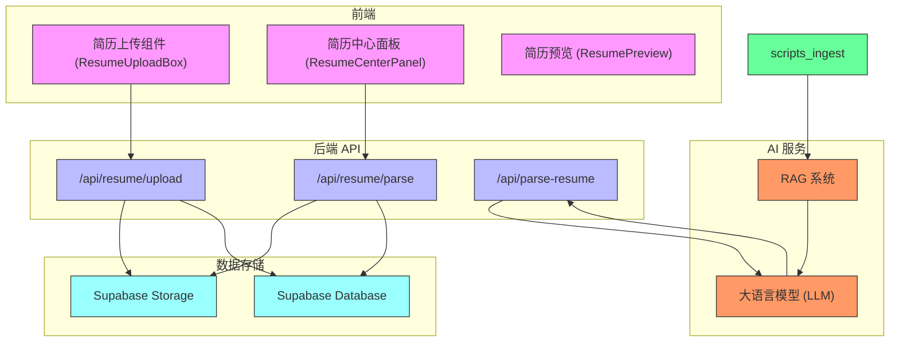
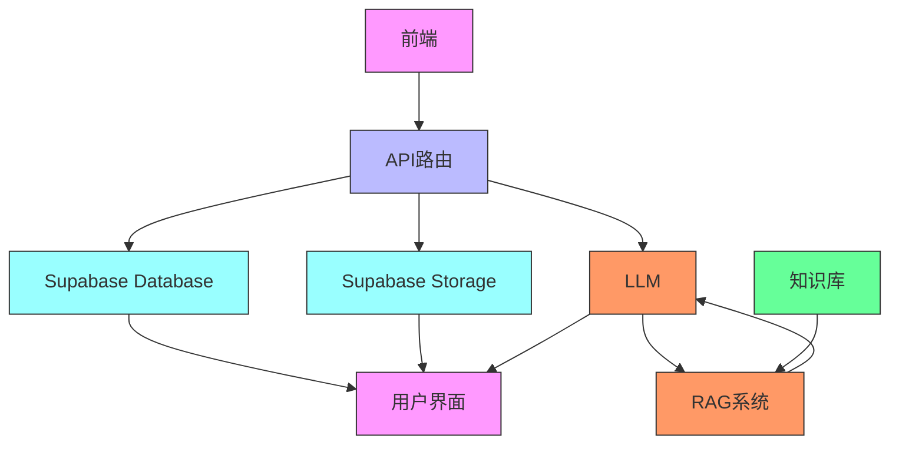
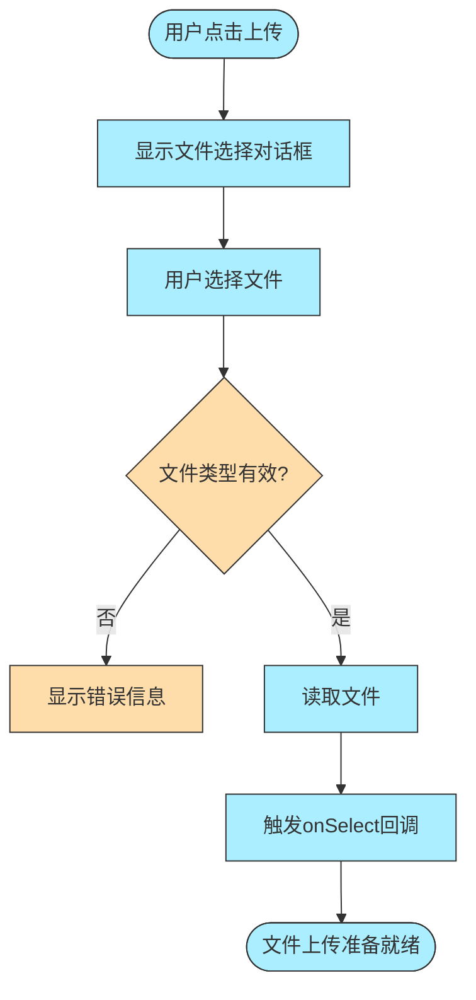
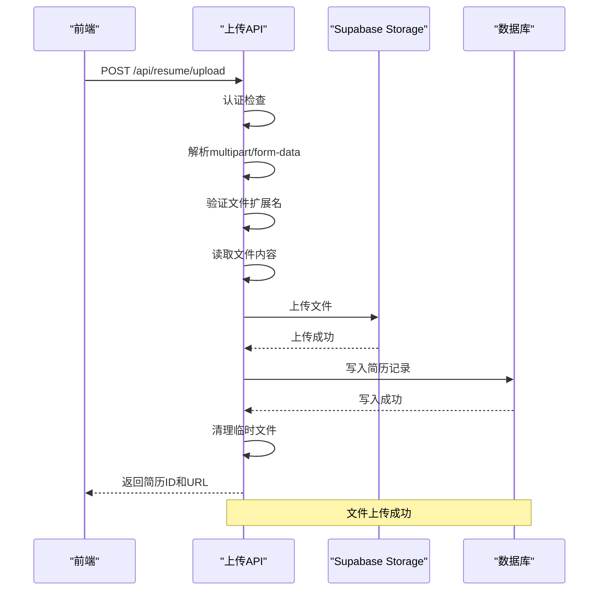
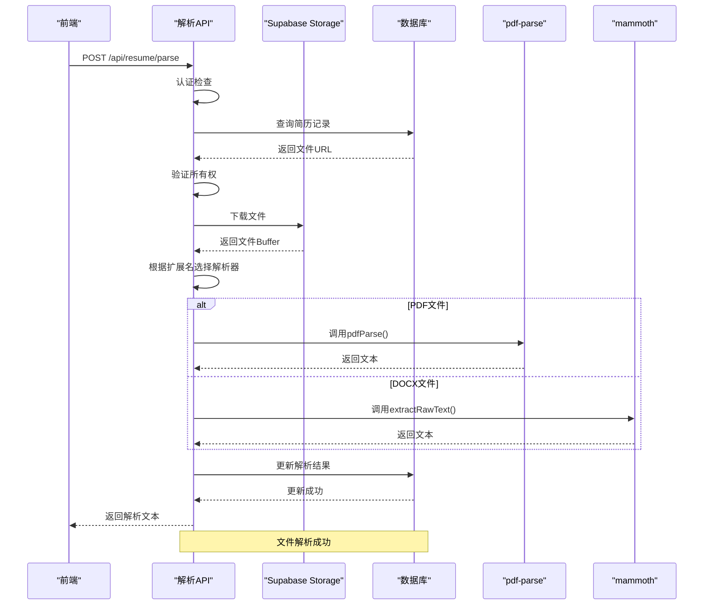
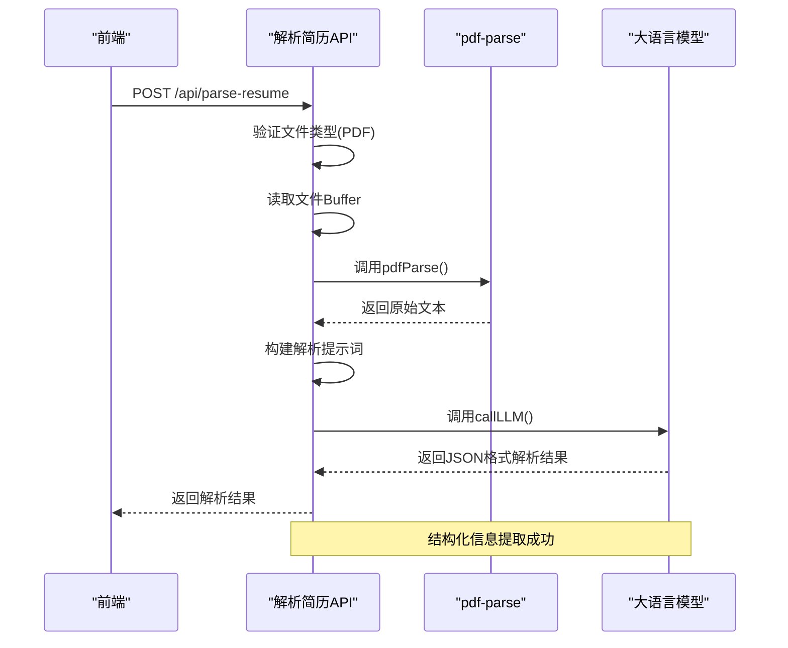
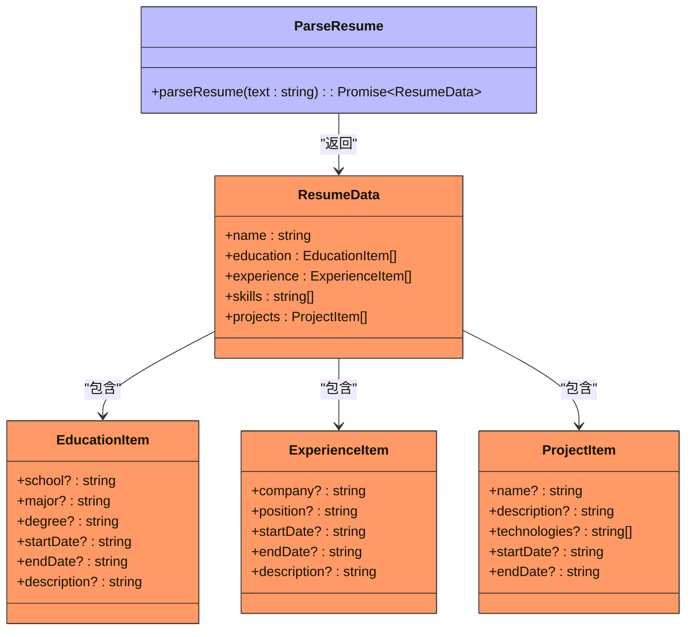
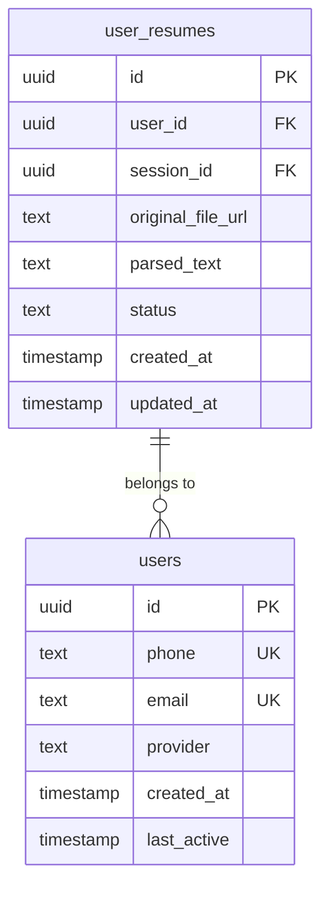
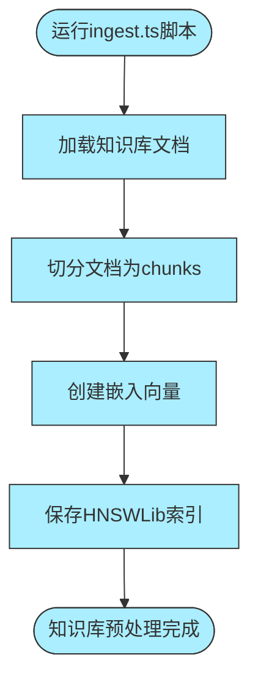
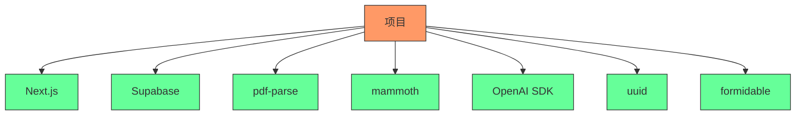

# 简历上传与解析

<cite>
**本文档引用文件**  
- [ResumeUploadBox.tsx](file://components/resume/ResumeUploadBox.tsx)
- [upload/route.ts](file://app/api/resume/upload/route.ts)
- [parse/route.ts](file://app/api/resume/parse/route.ts)
- [parse-resume/route.ts](file://app/api/parse-resume/route.ts)
- [parse_resume.ts](file://lib/chains/parse_resume.ts)
- [db.ts](file://lib/db.ts)
- [llm.ts](file://lib/llm.ts)
- [ingest.ts](file://scripts/ingest.ts)
- [loader.ts](file://src/lib/rag/loader.ts)
- [schema.sql](file://supabase/schema.sql)
- [ResumeCenterPanel.tsx](file://components/resume/ResumeCenterPanel.tsx)
- [ResumePreview.tsx](file://components/resume/ResumePreview.tsx)
</cite>

## 目录
1. [简介](#简介)
2. [项目结构](#项目结构)
3. [核心组件](#核心组件)
4. [架构概述](#架构概述)
5. [详细组件分析](#详细组件分析)
6. [依赖分析](#依赖分析)
7. [性能考虑](#性能考虑)
8. [故障排除指南](#故障排除指南)
9. [结论](#结论)

## 简介
本项目是一个AI求职教练系统，核心功能之一是简历处理。系统允许用户上传简历文件（PDF/DOCX），通过后端服务进行解析，并利用大语言模型（LLM）提取结构化信息。解析结果用于简历优化、面试准备等场景，并与RAG（检索增强生成）系统集成以提供更智能的求职建议。整个流程涉及前端组件、API路由、文件存储、数据库操作和AI模型调用等多个环节。

## 项目结构
项目采用Next.js作为前端框架，API路由位于`app/api`目录下，前端组件位于`components`目录，核心逻辑封装在`lib`目录，知识库和脚本分别位于`src/lib/knowledge`和`scripts`目录。数据库使用Supabase，文件存储也由Supabase提供。整体结构清晰，前后端分离，便于维护和扩展。

**Diagram sources**
- [ResumeUploadBox.tsx](file://components/resume/ResumeUploadBox.tsx)
- [upload/route.ts](file://app/api/resume/upload/route.ts)
- [parse/route.ts](file://app/api/resume/parse/route.ts)
- [parse-resume/route.ts](file://app/api/parse-resume/route.ts)
- [db.ts](file://lib/db.ts)
- [llm.ts](file://lib/llm.ts)
- [ingest.ts](file://scripts/ingest.ts)
- [loader.ts](file://src/lib/rag/loader.ts)
- [schema.sql](file://supabase/schema.sql)

**Section sources**
- [ResumeUploadBox.tsx](file://components/resume/ResumeUploadBox.tsx)
- [upload/route.ts](file://app/api/resume/upload/route.ts)
- [parse/route.ts](file://app/api/resume/parse/route.ts)
- [parse-resume/route.ts](file://app/api/parse-resume/route.ts)
- [db.ts](file://lib/db.ts)
- [llm.ts](file://lib/llm.ts)
- [ingest.ts](file://scripts/ingest.ts)
- [loader.ts](file://src/lib/rag/loader.ts)
- [schema.sql](file://supabase/schema.sql)

## 核心组件
核心组件包括前端的简历上传和预览组件，后端的文件上传、解析API，以及用于AI解析的LLM调用和知识库处理脚本。这些组件协同工作，实现了从文件上传到信息提取的完整流程。

**Section sources**
- [ResumeUploadBox.tsx](file://components/resume/ResumeUploadBox.tsx)
- [ResumeCenterPanel.tsx](file://components/resume/ResumeCenterPanel.tsx)
- [ResumePreview.tsx](file://components/resume/ResumePreview.tsx)
- [upload/route.ts](file://app/api/resume/upload/route.ts)
- [parse/route.ts](file://app/api/resume/parse/route.ts)
- [parse-resume/route.ts](file://app/api/parse-resume/route.ts)
- [parse_resume.ts](file://lib/chains/parse_resume.ts)
- [llm.ts](file://lib/llm.ts)
- [ingest.ts](file://scripts/ingest.ts)

## 架构概述
系统架构分为前端、后端API、数据存储和AI服务四层。前端负责用户交互和文件上传；后端API处理文件上传、解析和数据库操作；数据存储使用Supabase的Storage和Database服务；AI服务通过LLM进行结构化信息提取，并与RAG系统集成提供智能建议。

**Diagram sources**
- [ResumeUploadBox.tsx](file://components/resume/ResumeUploadBox.tsx)
- [upload/route.ts](file://app/api/resume/upload/route.ts)
- [parse/route.ts](file://app/api/resume/parse/route.ts)
- [parse-resume/route.ts](file://app/api/parse-resume/route.ts)
- [db.ts](file://lib/db.ts)
- [llm.ts](file://lib/llm.ts)
- [ingest.ts](file://scripts/ingest.ts)
- [loader.ts](file://src/lib/rag/loader.ts)
- [schema.sql](file://supabase/schema.sql)

## 详细组件分析
### 前端上传组件分析
前端上传组件`ResumeUploadBox`提供了一个用户友好的界面，允许用户选择简历文件。组件使用`<input type="file">`元素，并通过`accept=".pdf,.doc,.docx"`限制文件类型。选择文件后，通过回调函数将文件传递给父组件进行后续处理。

**Diagram sources**
- [ResumeUploadBox.tsx](file://components/resume/ResumeUploadBox.tsx)

**Section sources**
- [ResumeUploadBox.tsx](file://components/resume/ResumeUploadBox.tsx)

### 文件上传API分析
`/api/resume/upload` API负责处理简历文件的上传。流程包括认证检查、解析multipart/form-data、验证文件扩展名、读取文件内容、上传到Supabase Storage、写入数据库记录和清理临时文件。

**Diagram sources**
- [upload/route.ts](file://app/api/resume/upload/route.ts)

**Section sources**
- [upload/route.ts](file://app/api/resume/upload/route.ts)

### 文件解析API分析
`/api/resume/parse` API负责解析已上传的简历文件。流程包括认证检查、验证简历所有权、从Supabase Storage下载文件、根据文件类型调用相应的解析库（pdf-parse或mammoth）、更新数据库记录。

**Diagram sources**
- [parse/route.ts](file://app/api/resume/parse/route.ts)

**Section sources**
- [parse/route.ts](file://app/api/resume/parse/route.ts)

### LLM解析流程分析
`/api/parse-resume` API直接接收简历文件，使用pdf-parse解析PDF内容，然后调用LLM进行结构化信息提取。该流程不经过数据库存储，适用于实时解析场景。

**Diagram sources**
- [parse-resume/route.ts](file://app/api/parse-resume/route.ts)
- [llm.ts](file://lib/llm.ts)

**Section sources**
- [parse-resume/route.ts](file://app/api/parse-resume/route.ts)
- [llm.ts](file://lib/llm.ts)

### 解析链集成分析
`src/lib/chains/parse_resume.ts`文件定义了简历解析链，提供了一个结构化的接口用于解析简历文本。虽然当前实现是基于规则的简单解析，但为未来升级为AI驱动的解析提供了接口。

**Diagram sources**
- [parse_resume.ts](file://lib/chains/parse_resume.ts)

**Section sources**
- [parse_resume.ts](file://lib/chains/parse_resume.ts)

### 数据库存储分析
简历信息存储在Supabase数据库的`user_resumes`表中。表结构包括简历ID、用户ID、会话ID、原始文件URL、解析文本、状态和时间戳等字段。

**Diagram sources**
- [schema.sql](file://supabase/schema.sql)
- [db.ts](file://lib/db.ts)

**Section sources**
- [schema.sql](file://supabase/schema.sql)
- [db.ts](file://lib/db.ts)

### 知识库预处理分析
`scripts/ingest.ts`脚本负责知识库的预处理，将`src/lib/knowledge`目录下的文档加载、切分、嵌入并保存到向量数据库中，为RAG系统提供支持。

**Diagram sources**
- [ingest.ts](file://scripts/ingest.ts)
- [loader.ts](file://src/lib/rag/loader.ts)

**Section sources**
- [ingest.ts](file://scripts/ingest.ts)
- [loader.ts](file://src/lib/rag/loader.ts)

## 依赖分析
项目依赖主要包括Next.js框架、Supabase客户端、pdf-parse、mammoth、OpenAI SDK等。这些依赖通过`package.json`管理，确保了项目的可维护性和可扩展性。

**Diagram sources**
- [package.json](file://package.json)

**Section sources**
- [package.json](file://package.json)

## 性能考虑
系统在性能方面考虑了文件大小限制（10MB）、超时处理、重试机制和错误捕获。对于大文件或复杂解析任务，建议使用异步处理和进度反馈，以提升用户体验。

## 故障排除指南
常见问题包括文件格式不支持、解析失败、LLM调用超时等。解决方案包括检查文件格式、确保API密钥正确配置、增加超时时间等。

**Section sources**
- [upload/route.ts](file://app/api/resume/upload/route.ts)
- [parse/route.ts](file://app/api/resume/parse/route.ts)
- [parse-resume/route.ts](file://app/api/parse-resume/route.ts)
- [llm.ts](file://lib/llm.ts)

## 结论
本系统实现了完整的简历处理功能，从前端上传到后端解析，再到AI信息提取和知识库集成。架构清晰，组件职责明确，为用户提供了一站式的求职辅导服务。