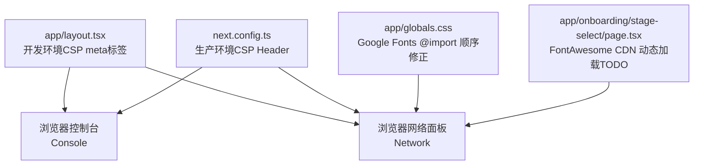
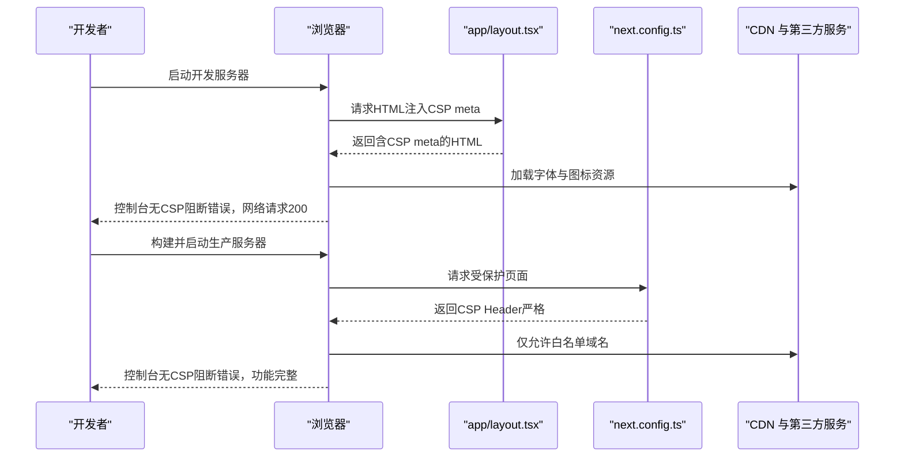
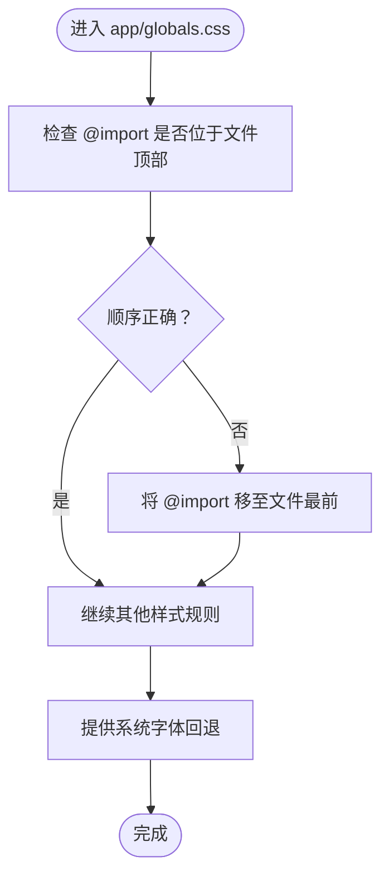
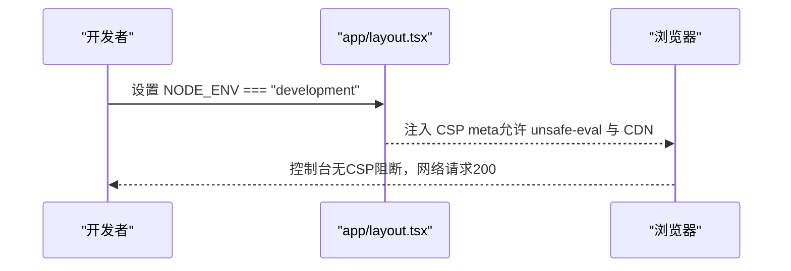
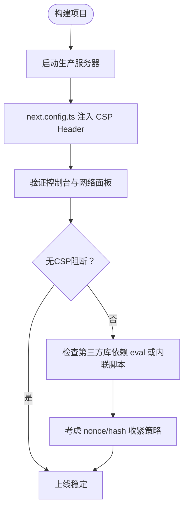
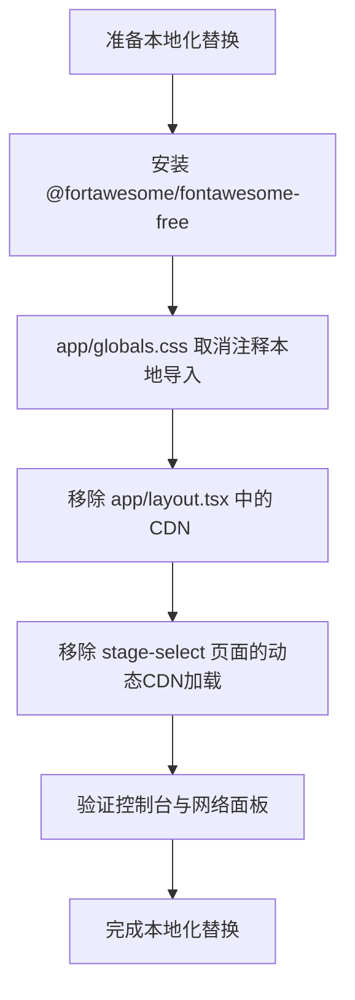
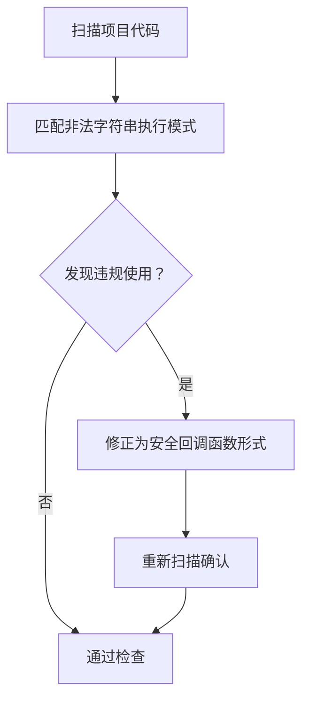
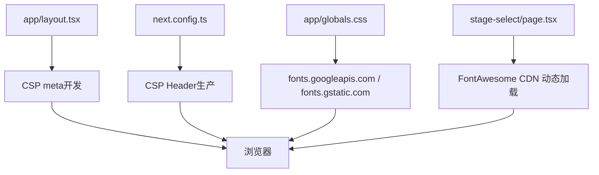

# CSP问题排查

<cite>
**本文引用的文件**
- [CSP修复报告.md](file://CSP_FIX_REPORT.md)
- [app/globals.css](file://app/globals.css)
- [app/layout.tsx](file://app/layout.tsx)
- [next.config.ts](file://next.config.ts)
- [app/onboarding/stage-select/page.tsx](file://app/onboarding/stage-select/page.tsx)
</cite>

## 目录
1. [引言](#引言)
2. [项目结构](#项目结构)
3. [核心组件](#核心组件)
4. [架构总览](#架构总览)
5. [详细组件分析](#详细组件分析)
6. [依赖关系分析](#依赖关系分析)
7. [性能考量](#性能考量)
8. [故障排查指南](#故障排查指南)
9. [结论](#结论)
10. [附录](#附录)

## 引言
本文件基于仓库中的CSP修复报告，系统性说明如何通过调整CSS中Google Fonts的@import顺序、在应用布局中添加开发环境临时CSP元标签、以及在Next.js配置中设置生产环境严格CSP Header，来解决资源加载阻断问题。同时，报告提供了非法字符串执行检查（eval、new Function等）的验证流程、CDN依赖（如cdnjs.cloudflare.com、fonts.googleapis.com）的白名单配置示例，并给出在开发与生产环境中验证CSP有效性的方法，包括控制台日志检查、网络请求追踪与功能测试。最后，报告还给出了FontAwesome本地化替换的长期优化方案与实施步骤。

## 项目结构
围绕CSP修复的关键文件与职责如下：
- app/globals.css：负责全局样式与字体导入，已将Google Fonts的@import置于最前，避免构建期网络请求导致的阻断。
- app/layout.tsx：在开发环境下注入临时CSP meta标签，同时保留必要的CDN链接以保障开发期可用性；生产环境由next.config.ts统一管理CSP。
- next.config.ts：集中配置生产环境的严格CSP Header，包含脚本、样式、字体、连接等白名单域名。
- app/onboarding/stage-select/page.tsx：当前仍使用CDN加载FontAwesome，报告中标记为TODO，后续需替换为本地依赖。

图表来源
- [app/layout.tsx](file://app/layout.tsx#L12-L46)
- [next.config.ts](file://next.config.ts#L12-L34)
- [app/globals.css](file://app/globals.css#L1-L10)
- [app/onboarding/stage-select/page.tsx](file://app/onboarding/stage-select/page.tsx#L32-L46)

章节来源
- [CSP修复报告.md](file://CSP_FIX_REPORT.md#L1-L167)
- [app/globals.css](file://app/globals.css#L1-L10)
- [app/layout.tsx](file://app/layout.tsx#L12-L46)
- [next.config.ts](file://next.config.ts#L12-L34)
- [app/onboarding/stage-select/page.tsx](file://app/onboarding/stage-select/page.tsx#L32-L46)

## 核心组件
- CSS字体导入顺序修正：将Google Fonts的@import移动到文件最前，确保在其他规则之前加载，避免因构建期网络请求造成的阻断。
- 开发环境临时CSP meta标签：在app/layout.tsx中按环境变量条件注入CSP meta，允许unsafe-eval与必要CDN，便于开发调试。
- 生产环境严格CSP Header：在next.config.ts中设置严格的CSP，移除unsafe-eval，仅放行必需的CDN与API域名。
- CDN依赖替换准备：在多个文件中添加TODO注释，标记需要替换的FontAwesome CDN链接，为后续本地化做准备。

章节来源
- [CSP修复报告.md](file://CSP_FIX_REPORT.md#L1-L167)
- [app/globals.css](file://app/globals.css#L1-L10)
- [app/layout.tsx](file://app/layout.tsx#L12-L46)
- [next.config.ts](file://next.config.ts#L12-L34)
- [app/onboarding/stage-select/page.tsx](file://app/onboarding/stage-select/page.tsx#L32-L46)

## 架构总览
下图展示了CSP在开发与生产环境中的作用路径与关键交互点。

图表来源
- [app/layout.tsx](file://app/layout.tsx#L12-L46)
- [next.config.ts](file://next.config.ts#L12-L34)

## 详细组件分析

### CSS字体导入顺序修正（app/globals.css）
- 问题背景：构建期对Google Fonts的网络请求可能导致资源加载阻断或超时。
- 修复要点：将@import置于文件最前，确保字体资源优先加载。
- 额外优化：在主题中提供系统字体回退，减少对外部网络的依赖。

图表来源
- [app/globals.css](file://app/globals.css#L1-L10)

章节来源
- [CSP修复报告.md](file://CSP_FIX_REPORT.md#L5-L10)
- [app/globals.css](file://app/globals.css#L1-L10)

### 开发环境临时CSP meta标签（app/layout.tsx）
- 作用：在开发环境注入CSP meta，允许unsafe-eval与必要CDN，便于调试。
- 注意：此meta仅在开发环境生效，部署到dev后需验证资源是否恢复加载；验证通过后可考虑移除临时meta，统一使用next.config.ts的Header。

图表来源
- [app/layout.tsx](file://app/layout.tsx#L12-L46)

章节来源
- [CSP修复报告.md](file://CSP_FIX_REPORT.md#L17-L30)
- [app/layout.tsx](file://app/layout.tsx#L12-L46)

### 生产环境严格CSP Header（next.config.ts）
- 作用：集中配置生产环境的CSP，移除unsafe-eval，仅放行必需的CDN与API域名。
- 白名单域名示例：cdnjs.cloudflare.com、cdn.jsdelivr.net、fonts.googleapis.com、fonts.gstatic.com、api.openai.com、api.deepseek.com、*.supabase.co。
- 重要提示：生产环境不包含unsafe-eval；若出现CSP错误，需检查是否存在第三方库依赖eval，必要时考虑nonce或hash收紧策略。

图表来源
- [next.config.ts](file://next.config.ts#L12-L34)

章节来源
- [CSP修复报告.md](file://CSP_FIX_REPORT.md#L31-L45)
- [next.config.ts](file://next.config.ts#L12-L34)

### CDN依赖替换（FontAwesome本地化）与白名单配置
- 现状：当前页面通过CDN加载FontAwesome，报告中标记为TODO，等待本地化替换。
- 本地化步骤（待执行）：
  1) 安装本地依赖（参考报告中的命令与后续步骤）。
  2) 在app/globals.css中取消注释本地FontAwesome导入。
  3) 移除app/layout.tsx中的CDN<link>标签。
  4) 移除app/onboarding/stage-select/page.tsx中的动态CDN加载代码。
- 白名单域名：fonts.googleapis.com、fonts.gstatic.com、cdnjs.cloudflare.com、cdn.jsdelivr.net等已在CSP中明确放行。

图表来源
- [CSP修复报告.md](file://CSP_FIX_REPORT.md#L46-L63)
- [app/globals.css](file://app/globals.css#L1-L10)
- [app/layout.tsx](file://app/layout.tsx#L36-L46)
- [app/onboarding/stage-select/page.tsx](file://app/onboarding/stage-select/page.tsx#L32-L46)

章节来源
- [CSP修复报告.md](file://CSP_FIX_REPORT.md#L46-L63)
- [app/globals.css](file://app/globals.css#L1-L10)
- [app/layout.tsx](file://app/layout.tsx#L36-L46)
- [app/onboarding/stage-select/page.tsx](file://app/onboarding/stage-select/page.tsx#L32-L46)

### 非法字符串执行检查（eval、new Function等）
- 检查范围：全项目代码库。
- 检查模式：eval(、new Function、setTimeout("、setInterval("。
- 结果：未发现任何字符串执行；所有setTimeout与setInterval均使用回调函数形式；未发现eval()或new Function()使用。

图表来源
- [CSP修复报告.md](file://CSP_FIX_REPORT.md#L10-L16)

章节来源
- [CSP修复报告.md](file://CSP_FIX_REPORT.md#L10-L16)

## 依赖关系分析
- app/layout.tsx与next.config.ts共同决定CSP生效路径：开发期由meta注入，生产期由Header注入。
- app/globals.css与CDN依赖（fonts.googleapis.com、fonts.gstatic.com）存在耦合，需通过本地化替换降低外部依赖。
- app/onboarding/stage-select/page.tsx对CDN FontAwesome的动态加载形成额外耦合点，需同步移除。

图表来源
- [app/layout.tsx](file://app/layout.tsx#L12-L46)
- [next.config.ts](file://next.config.ts#L12-L34)
- [app/globals.css](file://app/globals.css#L1-L10)
- [app/onboarding/stage-select/page.tsx](file://app/onboarding/stage-select/page.tsx#L32-L46)

章节来源
- [app/layout.tsx](file://app/layout.tsx#L12-L46)
- [next.config.ts](file://next.config.ts#L12-L34)
- [app/globals.css](file://app/globals.css#L1-L10)
- [app/onboarding/stage-select/page.tsx](file://app/onboarding/stage-select/page.tsx#L32-L46)

## 性能考量
- 通过将Google Fonts的@import置于最前，可减少构建期网络请求带来的阻断风险，提升首屏渲染稳定性。
- 生产环境严格CSP有助于减少不必要的资源加载与潜在的安全风险，建议配合缓存策略与CDN优化进一步提升性能。
- 本地化替换FontAwesome可降低跨域与第三方依赖带来的延迟与不可控因素。

## 故障排查指南
- 开发环境验证
  - 启动开发服务器，打开浏览器DevTools。
  - 检查Console：应看到CSP meta已生效，不应出现CSP blocked错误。
  - 检查Network标签：所有资源应返回200状态码，不应出现blocked的资源。
  - 功能测试：模拟面试流程，验证UI正常显示，不再出现空卡片，且无流式输出残留。
- 生产环境验证
  - 构建并启动生产服务器。
  - 检查CSP Header：应看到严格的CSP（不包含unsafe-eval）。
  - 功能完整性测试：确保所有核心功能正常。
- 常见问题与对策
  - 若出现CSP阻断：检查控制台错误信息，确认是否遗漏了必要的CDN或API域名；必要时考虑nonce或hash收紧策略。
  - 若FontAwesome图标缺失：确认本地化替换步骤是否完成，或检查CDN链接是否仍存在于页面中。

章节来源
- [CSP修复报告.md](file://CSP_FIX_REPORT.md#L82-L121)

## 结论
通过将Google Fonts的@import顺序前置、在开发环境注入临时CSP meta标签、并在生产环境集中配置严格CSP Header，项目成功解决了资源加载阻断问题。同时，报告完成了对非法字符串执行的全面检查，并为FontAwesome本地化替换提供了清晰的实施步骤与白名单域名配置示例。建议在后续迭代中尽快完成本地化替换，进一步降低对外部CDN的依赖，提升系统的安全性与稳定性。

## 附录
- 白名单域名清单（来自生产环境CSP配置）：
  - 脚本与样式：cdnjs.cloudflare.com、cdn.jsdelivr.net、fonts.googleapis.com
  - 字体文件：fonts.gstatic.com
  - API连接：api.openai.com、api.deepseek.com、*.supabase.co
- 本地化替换步骤（待执行）：
  - 安装本地FontAwesome依赖（参考报告中的命令与后续步骤）。
  - 在app/globals.css中取消注释本地FontAwesome导入。
  - 移除app/layout.tsx中的CDN<link>标签。
  - 移除app/onboarding/stage-select/page.tsx中的动态CDN加载代码。

章节来源
- [CSP修复报告.md](file://CSP_FIX_REPORT.md#L31-L63)
- [next.config.ts](file://next.config.ts#L12-L34)
- [app/globals.css](file://app/globals.css#L1-L10)
- [app/layout.tsx](file://app/layout.tsx#L36-L46)
- [app/onboarding/stage-select/page.tsx](file://app/onboarding/stage-select/page.tsx#L32-L46)