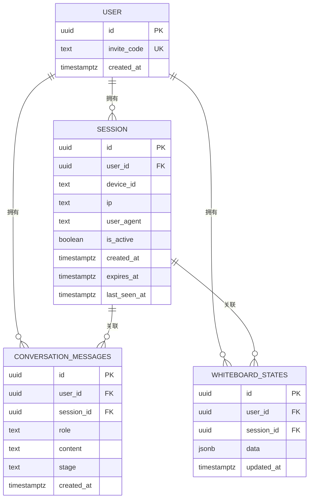
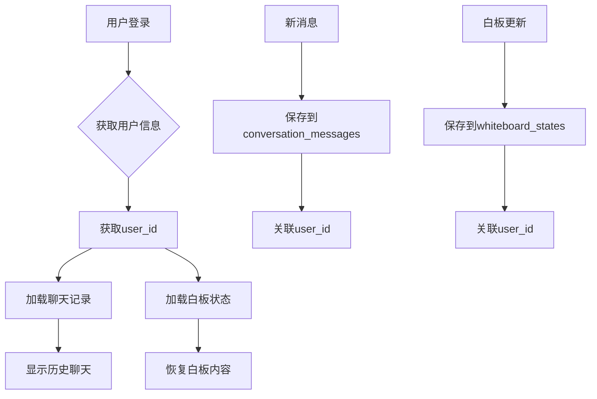
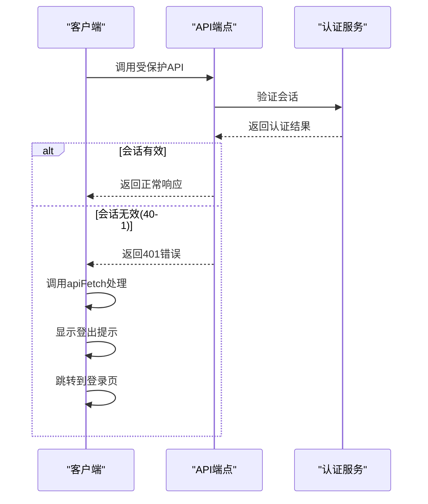

# 会话管理问题

<cite>
**本文档引用的文件**   
- [SESSION_SYSTEM_README.md](file://SESSION_SYSTEM_README.md)
- [database-init.sql](file://database-init.sql)
- [lib/api-client.ts](file://lib/api-client.ts)
- [lib/auth.ts](file://lib/auth.ts)
- [app/api/auth/create-session/route.ts](file://app/api/auth/create-session/route.ts)
- [app/api/chat/route.ts](file://app/api/chat/route.ts)
- [app/api/load-session/route.ts](file://app/api/load-session/route.ts)
- [app/api/save-whiteboard/route.ts](file://app/api/save-whiteboard/route.ts)
- [app/api/load-whiteboard/route.ts](file://app/api/load-whiteboard/route.ts)
- [lib/db.ts](file://lib/db.ts)
- [fix-whiteboard-schema.sql](file://fix-whiteboard-schema.sql)
</cite>

## 目录
1. [问题根源分析](#问题根源分析)
2. [会话系统架构](#会话系统架构)
3. [数据同步机制](#数据同步机制)
4. [API认证与错误处理](#api认证与错误处理)
5. [数据库初始化与修复](#数据库初始化与修复)
6. [会话系统测试清单](#会话系统测试清单)

## 问题根源分析

会话丢失与数据不同步问题主要源于会话管理机制的不完善。根据SESSION_SYSTEM_README.md文档，系统通过users表与sessions表的关联实现了完整的会话控制。当用户使用邀请码登录时，系统会在users表中创建或查找对应的用户记录，并在sessions表中创建新的会话记录。

会话丢失的核心机制在于单设备登录控制：当同一邀请码在新设备上登录时，系统会自动将该用户在旧设备上的所有活跃会话标记为非活跃（is_active = false）。这一机制通过在auth/create-session路由中实现，确保了同一账号只能在一个设备上保持活跃状态。

数据不同步问题则主要出现在conversation_messages和whiteboard_states表缺少user_id外键的情况下。如果没有user_id字段，系统无法正确地将聊天记录和白板状态与特定用户关联，导致跨设备数据同步失败。

**Section sources**
- [SESSION_SYSTEM_README.md](file://SESSION_SYSTEM_README.md#L1-L205)
- [app/api/auth/create-session/route.ts](file://app/api/auth/create-session/route.ts#L1-L219)

## 会话系统架构

系统采用基于Supabase的会话管理架构，通过users表和sessions表实现7天免登录和单设备登录控制。



**Diagram sources**
- [SESSION_SYSTEM_README.md](file://SESSION_SYSTEM_README.md#L39-L60)
- [database-init.sql](file://database-init.sql#L5-L23)

**Section sources**
- [SESSION_SYSTEM_README.md](file://SESSION_SYSTEM_README.md#L37-L66)
- [database-init.sql](file://database-init.sql#L1-L45)

## 数据同步机制

为了确保聊天记录和白板状态能够正确地跟随用户在不同设备间同步，系统要求conversation_messages和whiteboard_states表必须包含user_id外键。

当用户登录后，系统通过getCurrentUserFromRequest函数获取当前用户信息，并将user_id作为关键字段存储在各种数据表中。这种设计使得数据与用户而非会话直接关联，从而实现跨设备的数据同步。

在保存聊天消息时，saveMessage函数会检查是否提供了userId参数，如果提供则将其与消息一起存储。同样，saveWhiteboard函数也会在保存白板状态时存储user_id。这种设计确保了即使用户在不同设备上登录，只要使用相同的邀请码，就能访问到之前保存的聊天记录和白板内容。



**Diagram sources**
- [lib/db.ts](file://lib/db.ts#L58-L87)
- [lib/db.ts](file://lib/db.ts#L144-L188)

**Section sources**
- [SESSION_SYSTEM_README.md](file://SESSION_SYSTEM_README.md#L63-L66)
- [lib/db.ts](file://lib/db.ts#L58-L228)

## API认证与错误处理

所有受保护的API端点（如chat、interview、load-session、save-whiteboard等）都实现了会话验证机制。当客户端请求这些API时，系统会通过getCurrentUserFromRequest函数验证会话的有效性。

验证过程包括检查会话是否存在、is_active是否为true以及expires_at是否未过期。如果新设备登录导致旧会话被标记为非活跃，旧设备再次调用API时将收到401未认证错误。

系统通过lib/api-client.ts中的apiFetch工具自动处理401错误。当API返回401状态码时，apiFetch函数会：
1. 显示提示消息："当前账号已在其他设备登录，你已被登出"
2. 自动跳转到/login登录页面

这种机制确保了用户体验的一致性，避免了用户在不知情的情况下继续操作已失效的会话。



**Diagram sources**
- [lib/api-client.ts](file://lib/api-client.ts#L10-L35)
- [app/api/chat/route.ts](file://app/api/chat/route.ts#L148-L151)

**Section sources**
- [SESSION_SYSTEM_README.md](file://SESSION_SYSTEM_README.md#L96-L105)
- [lib/api-client.ts](file://lib/api-client.ts#L1-L62)

## 数据库初始化与修复

为确保会话系统正常工作，必须正确执行数据库初始化和修复脚本。

首先，需要执行database-init.sql脚本创建users和sessions表：
```sql
-- 执行database-init.sql创建基础表结构
-- 包含users表和sessions表的创建语句
```

如果conversation_messages或whiteboard_states表缺少user_id字段，需要手动添加：
```sql
ALTER TABLE conversation_messages ADD COLUMN IF NOT EXISTS user_id UUID REFERENCES users(id) ON DELETE CASCADE;
ALTER TABLE whiteboard_states ADD COLUMN IF NOT EXISTS user_id UUID REFERENCES users(id) ON DELETE CASCADE;
```

对于whiteboard_states表的结构问题，可以执行fix-whiteboard-schema.sql脚本进行修复。该脚本会：
1. 检查并添加缺失的user_id字段
2. 修正字段类型不匹配问题
3. 确保data字段为JSONB类型
4. 添加updated_at时间戳字段
5. 创建唯一索引确保每个用户只有一条记录

这些脚本确保了数据库表结构的完整性和一致性，为会话管理和数据同步提供了基础支持。

**Section sources**
- [database-init.sql](file://database-init.sql#L1-L45)
- [fix-whiteboard-schema.sql](file://fix-whiteboard-schema.sql#L1-L146)

## 会话系统测试清单

为确保会话系统功能正常，开发者应执行以下测试：

- [ ] 登录成功后，在sessions表中验证会话记录的创建
- [ ] 使用同一邀请码在设备A登录后，再在设备B登录
- [ ] 验证设备A的会话被标记为is_active = false
- [ ] 设备A再次调用API应返回401错误并跳转到登录页
- [ ] 验证聊天记录可在不同设备间同步加载
- [ ] 验证白板内容根据user_id正确加载和保存
- [ ] 确认面试流程不受会话系统影响
- [ ] 验证前端UI布局未被破坏
- [ ] 确保无TypeScript编译错误
- [ ] 验证Vercel构建成功

这些测试项目覆盖了会话管理的核心功能，确保系统在各种场景下都能正常工作。

**Section sources**
- [SESSION_SYSTEM_README.md](file://SESSION_SYSTEM_README.md#L188-L199)