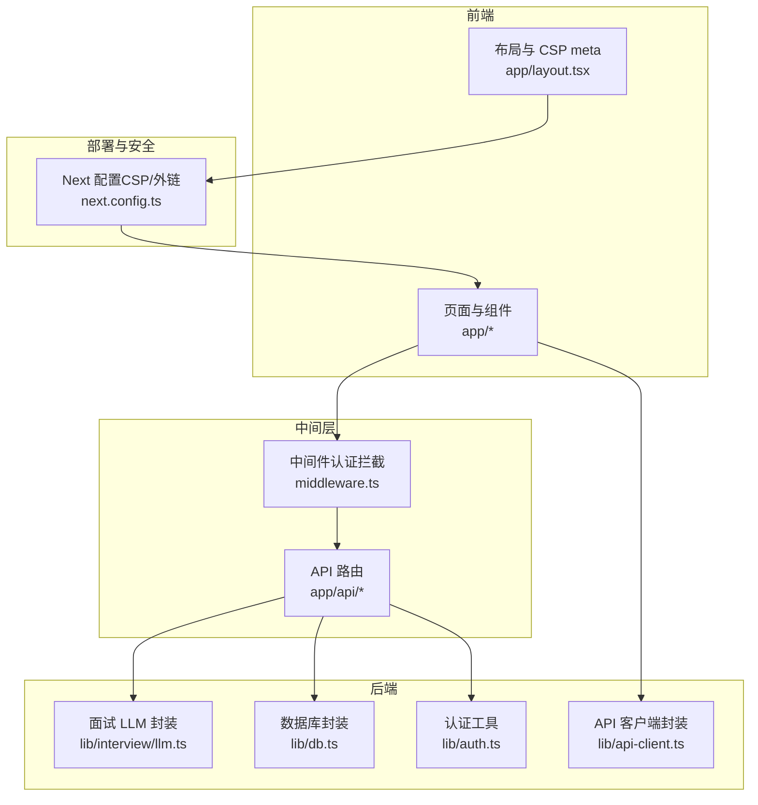
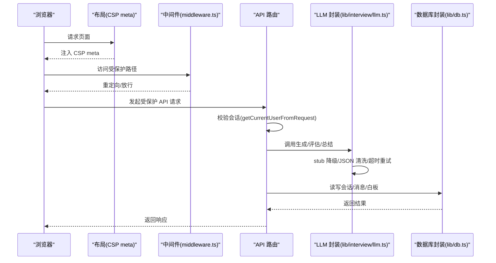
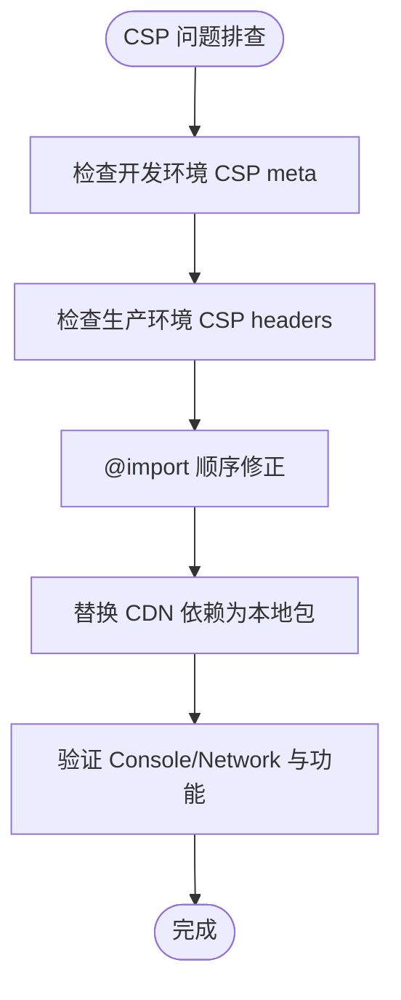
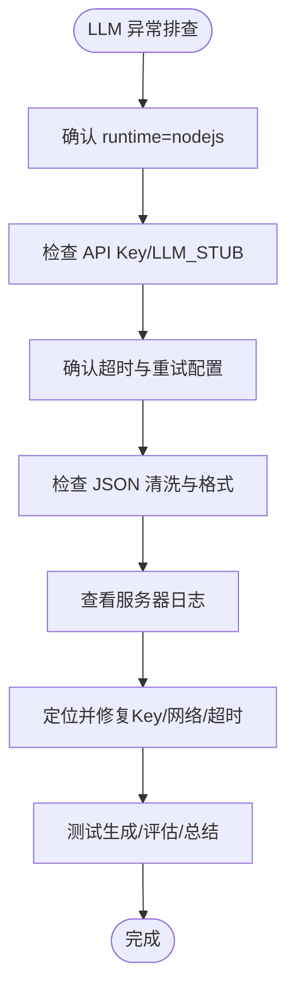
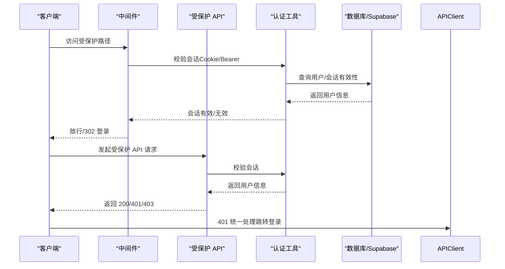
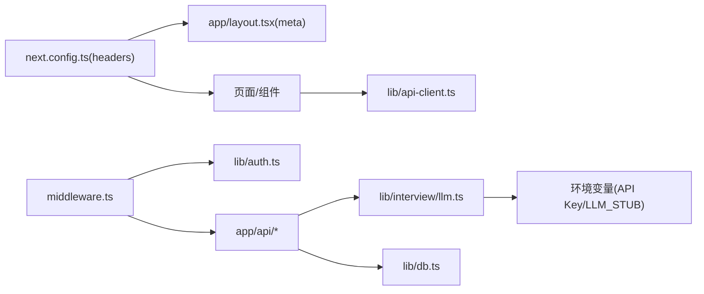

# 测试与故障排除

<cite>
**本文引用的文件**
- [CSP 修复报告](file://CSP_FIX_REPORT.md)
- [面试功能 LLM 调用修复总结](file://INTERVIEW_LLM_FIX_SUMMARY.md)
- [彻底解决403问题.md](file://彻底解决403问题.md)
- [会话系统说明](file://SESSION_SYSTEM_README.md)
- [项目总览与故障排除](file://README.md)
- [面试开始 API](file://app/api/interview/start/route.ts)
- [面试答题 API](file://app/api/interview/answer/route.ts)
- [面试 LLM 封装](file://lib/interview/llm.ts)
- [认证工具](file://lib/auth.ts)
- [API 客户端封装](file://lib/api-client.ts)
- [数据库封装](file://lib/db.ts)
- [Next 配置（CSP/外链）](file://next.config.ts)
- [中间件（认证拦截）](file://middleware.ts)
- [布局（CSP meta）](file://app/layout.tsx)
</cite>

## 目录
1. [简介](#简介)
2. [项目结构](#项目结构)
3. [核心组件](#核心组件)
4. [架构总览](#架构总览)
5. [详细组件分析](#详细组件分析)
6. [依赖关系分析](#依赖关系分析)
7. [性能注意事项](#性能注意事项)
8. [故障排除指南](#故障排除指南)
9. [结论](#结论)
10. [附录](#附录)

## 简介
本手册面向开发者与运维人员，系统化梳理 ai-job-coach 在 CSP、LLM 调用、认证与会话、网络与日志等方面的常见问题与修复路径。通过文档化的方式，帮助快速定位并解决构建失败、资源加载被阻断、LLM 响应异常、403/401 认证失败、会话丢失与跨设备冲突等问题，并提供本地复现与验证建议。

## 项目结构
- 前端与路由集中在 app/ 目录，API 路由位于 app/api/*，面试相关逻辑在 lib/interview/ 与 app/api/interview/*。
- 安全与网络策略通过 next.config.ts 的 headers 与 app/layout.tsx 的 CSP meta 组合实现；中间件 middleware.ts 控制访问拦截。
- 认证与会话通过 Supabase Auth 与自定义中间件、API 路由校验共同保障；lib/api-client.ts 统一封装 401 处理。
- 数据持久化通过 lib/db.ts 封装 Supabase 客户端，支持按用户维度保存聊天与白板数据。

图表来源
- [面试开始 API](file://app/api/interview/start/route.ts#L1-L175)
- [面试答题 API](file://app/api/interview/answer/route.ts#L1-L205)
- [面试 LLM 封装](file://lib/interview/llm.ts#L1-L849)
- [数据库封装](file://lib/db.ts#L1-L327)
- [认证工具](file://lib/auth.ts#L1-L40)
- [API 客户端封装](file://lib/api-client.ts#L1-L62)
- [Next 配置（CSP/外链）](file://next.config.ts#L1-L55)
- [中间件（认证拦截）](file://middleware.ts#L1-L170)
- [布局（CSP meta）](file://app/layout.tsx#L1-L58)

章节来源
- [项目总览与故障排除](file://README.md#L1-L191)

## 核心组件
- CSP 与资源加载：通过 next.config.ts 的 headers 与 app/layout.tsx 的 CSP meta 双轨配置，开发环境允许宽松策略便于调试，生产环境采用严格 CSP，避免资源被阻断。
- LLM 调用与降级：lib/interview/llm.ts 统一封装 generateInterviewQuestions、evaluateAnswer、summarizeInterview，并内置 stub 降级与 JSON 清洗、超时与重试策略。
- 认证与会话：middleware.ts 与 lib/auth.ts 配合，API 路由在关键接口添加会话校验；lib/api-client.ts 统一处理 401 并跳转登录。
- 数据持久化：lib/db.ts 封装 Supabase 客户端，支持按 user_id 保存聊天与白板数据，保证跨设备同步。

章节来源
- [CSP 修复报告](file://CSP_FIX_REPORT.md#L1-L167)
- [面试功能 LLM 调用修复总结](file://INTERVIEW_LLM_FIX_SUMMARY.md#L1-L111)
- [会话系统说明](file://SESSION_SYSTEM_README.md#L1-L205)
- [面试 LLM 封装](file://lib/interview/llm.ts#L1-L849)
- [认证工具](file://lib/auth.ts#L1-L40)
- [API 客户端封装](file://lib/api-client.ts#L1-L62)
- [数据库封装](file://lib/db.ts#L1-L327)
- [Next 配置（CSP/外链）](file://next.config.ts#L1-L55)
- [中间件（认证拦截）](file://middleware.ts#L1-L170)
- [布局（CSP meta）](file://app/layout.tsx#L1-L58)

## 架构总览
下图展示从浏览器到 API、再到 LLM 与数据库的关键调用链，以及认证与 CSP 的影响面。

图表来源
- [布局（CSP meta）](file://app/layout.tsx#L1-L58)
- [中间件（认证拦截）](file://middleware.ts#L1-L170)
- [面试开始 API](file://app/api/interview/start/route.ts#L1-L175)
- [面试答题 API](file://app/api/interview/answer/route.ts#L1-L205)
- [面试 LLM 封装](file://lib/interview/llm.ts#L1-L849)
- [数据库封装](file://lib/db.ts#L1-L327)

## 详细组件分析

### CSP 与资源加载（Content Security Policy）
- 问题症状：构建或运行时出现资源加载被阻断、字体/脚本/样式/连接被拒绝。
- 修复要点：
  - 开发环境：app/layout.tsx 添加 CSP meta，允许 unsafe-eval 与必要 CDN，便于调试。
  - 生产环境：next.config.ts 的 headers 返回严格 CSP，connect-src 指定 Supabase 与 LLM API 域名。
  - CSS @import 顺序：确保 Google Fonts 等导入在最前，避免样式失效。
  - 依赖替换：逐步移除 CDN 依赖，替换为本地包，减少外链风险。
- 验证步骤：开发环境启动后检查 Console/Network，确认无 CSP blocked；生产环境构建后检查响应头 CSP。

图表来源
- [CSP 修复报告](file://CSP_FIX_REPORT.md#L1-L167)
- [布局（CSP meta）](file://app/layout.tsx#L1-L58)
- [Next 配置（CSP/外链）](file://next.config.ts#L1-L55)

章节来源
- [CSP 修复报告](file://CSP_FIX_REPORT.md#L1-L167)
- [布局（CSP meta）](file://app/layout.tsx#L1-L58)
- [Next 配置（CSP/外链）](file://next.config.ts#L1-L55)

### LLM 响应异常（面试相关）
- 问题症状：面试生成/评估/总结卡住、返回非 JSON、或循环输出固定文案。
- 修复要点：
  - 运行时：在面试 API 路由顶部添加 runtime = "nodejs"，避免 Edge Runtime 限制。
  - 环境变量：确保 DEEPSEEK_API_KEY 或 OPENAI_API_KEY 配置，或设置 LLM_STUB=1 使用 stub 模式。
  - 超时与重试：generateInterviewQuestions/evaluateAnswer/summarizeInterview 已内置超时与重试策略。
  - JSON 清洗：封装中包含 Markdown 代码块剥离、非法字符清洗、尾随逗号清理与严格格式校验。
- 调试路径：
  - 重启开发服务器，确认环境变量加载。
  - 观察服务器日志，记录具体错误信息。
  - 如仍失败，检查 API Key 有效性与网络连通性。

图表来源
- [面试功能 LLM 调用修复总结](file://INTERVIEW_LLM_FIX_SUMMARY.md#L1-L111)
- [面试开始 API](file://app/api/interview/start/route.ts#L1-L175)
- [面试答题 API](file://app/api/interview/answer/route.ts#L1-L205)
- [面试 LLM 封装](file://lib/interview/llm.ts#L1-L849)

章节来源
- [面试功能 LLM 调用修复总结](file://INTERVIEW_LLM_FIX_SUMMARY.md#L1-L111)
- [面试开始 API](file://app/api/interview/start/route.ts#L1-L175)
- [面试答题 API](file://app/api/interview/answer/route.ts#L1-L205)
- [面试 LLM 封装](file://lib/interview/llm.ts#L1-L849)

### 认证失败与 403/401（JWT/会话）
- 403 常见原因：会话过期、权限不足、中间件拦截、Cookie 未携带或被覆盖。
- 401 常见原因：会话无效、跨设备登录被踢、前端未携带 Cookie。
- 修复要点：
  - 中间件：middleware.ts 对受保护路径进行拦截，支持从 Cookie 或 Authorization Bearer 验证。
  - API 路由：面试/聊天/白板等接口均调用 getCurrentUserFromRequest 校验会话。
  - 前端：lib/api-client.ts 统一处理 401，弹窗提示并跳转登录页。
  - 会话策略：同一邀请码仅允许单设备登录，新登录会踢掉旧设备会话。
- GitHub 推送 403 专项：Token 格式、权限范围、仓库名/用户名匹配、旧凭据干扰等。

图表来源
- [中间件（认证拦截）](file://middleware.ts#L1-L170)
- [认证工具](file://lib/auth.ts#L1-L40)
- [面试开始 API](file://app/api/interview/start/route.ts#L1-L175)
- [面试答题 API](file://app/api/interview/answer/route.ts#L1-L205)
- [API 客户端封装](file://lib/api-client.ts#L1-L62)

章节来源
- [彻底解决403问题.md](file://彻底解决403问题.md#L1-L329)
- [会话系统说明](file://SESSION_SYSTEM_README.md#L1-L205)
- [中间件（认证拦截）](file://middleware.ts#L1-L170)
- [认证工具](file://lib/auth.ts#L1-L40)
- [API 客户端封装](file://lib/api-client.ts#L1-L62)

### 会话丢失与跨设备冲突
- 现象：切换设备后无法继续聊天/白板，或被提示“已在其他设备登录”。
- 原因与修复：
  - 同一邀请码仅允许单设备登录，新登录会将旧设备会话标记为非活跃。
  - 前端统一使用 apiFetch/apiFetchJson，自动携带 Cookie 并处理 401。
  - 数据库侧按 user_id 保存聊天与白板，确保跨设备同步。
- 建议：登录后检查 Cookie 是否携带，确认 Supabase 环境变量配置正确。

章节来源
- [会话系统说明](file://SESSION_SYSTEM_README.md#L1-L205)
- [API 客户端封装](file://lib/api-client.ts#L1-L62)
- [数据库封装](file://lib/db.ts#L1-L327)

## 依赖关系分析
- CSP 依赖：next.config.ts headers 与 app/layout.tsx meta 双轨，开发/生产策略不同。
- 认证依赖：middleware.ts 依赖 Supabase 环境变量；API 路由依赖 lib/auth.ts；前端依赖 lib/api-client.ts。
- LLM 依赖：lib/interview/llm.ts 依赖 lib/llm.ts 与环境变量；API 路由依赖该封装。
- 数据依赖：lib/db.ts 依赖 Supabase URL/Key；面试 API 路由依赖数据库写入。

图表来源
- [Next 配置（CSP/外链）](file://next.config.ts#L1-L55)
- [布局（CSP meta）](file://app/layout.tsx#L1-L58)
- [中间件（认证拦截）](file://middleware.ts#L1-L170)
- [认证工具](file://lib/auth.ts#L1-L40)
- [面试 LLM 封装](file://lib/interview/llm.ts#L1-L849)
- [数据库封装](file://lib/db.ts#L1-L327)
- [API 客户端封装](file://lib/api-client.ts#L1-L62)

章节来源
- [Next 配置（CSP/外链）](file://next.config.ts#L1-L55)
- [布局（CSP meta）](file://app/layout.tsx#L1-L58)
- [中间件（认证拦截）](file://middleware.ts#L1-L170)
- [认证工具](file://lib/auth.ts#L1-L40)
- [面试 LLM 封装](file://lib/interview/llm.ts#L1-L849)
- [数据库封装](file://lib/db.ts#L1-L327)
- [API 客户端封装](file://lib/api-client.ts#L1-L62)

## 性能注意事项
- LLM 调用：生成题目/评估答案/总结均设置超时与重试，建议在网络波动环境下适当放宽超时阈值。
- CSP 严格策略：生产环境 CSP 更严格，避免不必要的外链，减少阻断概率。
- 中间件：尽量减少对 Supabase 的频繁查询，必要时缓存用户信息。

[本节为通用指导，无需源文件引用]

## 故障排除指南

### 一、CSP 与资源加载被阻断
- 症状：字体/脚本/样式/图片/WebSocket 连接被阻断。
- 快速检查：
  - 开发环境：确认 app/layout.tsx 的 CSP meta 是否注入。
  - 生产环境：确认 next.config.ts headers 是否返回严格 CSP。
  - CSS：确认 @import 顺序正确。
  - CDN：逐步替换为本地包，减少外链。
- 验证：打开浏览器 DevTools 的 Console/Network，确认无 CSP blocked；功能正常。

章节来源
- [CSP 修复报告](file://CSP_FIX_REPORT.md#L1-L167)
- [布局（CSP meta）](file://app/layout.tsx#L1-L58)
- [Next 配置（CSP/外链）](file://next.config.ts#L1-L55)

### 二、LLM 响应异常（面试功能）
- 症状：生成/评估/总结卡住、返回非 JSON、循环输出固定文案。
- 快速检查：
  - 确认面试 API 路由已设置 runtime = "nodejs"。
  - 确认 DEEPSEEK_API_KEY 或 OPENAI_API_KEY 已配置，或设置 LLM_STUB=1。
  - 观察服务器日志，记录错误信息。
  - 如超时，适当增加超时阈值。
- 验证：重启开发服务器，测试生成题目/评估答案/总结流程。

章节来源
- [面试功能 LLM 调用修复总结](file://INTERVIEW_LLM_FIX_SUMMARY.md#L1-L111)
- [面试开始 API](file://app/api/interview/start/route.ts#L1-L175)
- [面试答题 API](file://app/api/interview/answer/route.ts#L1-L205)
- [面试 LLM 封装](file://lib/interview/llm.ts#L1-L849)

### 三、认证失败（403/401）
- 403：
  - 检查会话是否属于当前用户（面试答题 API 会对会话归属进行校验）。
  - 确认 Supabase 环境变量配置正确。
- 401：
  - 确认 Cookie 是否携带（apiFetch 默认 include credentials）。
  - 若跨设备登录，旧设备会被踢，需重新登录。
  - 中间件会优先从 Cookie/Bearer 验证，失败则重定向至登录页。
- 验证：登录后检查 Cookie 与重定向行为，确认前端统一使用 apiFetch/apiFetchJson。

章节来源
- [会话系统说明](file://SESSION_SYSTEM_README.md#L1-L205)
- [中间件（认证拦截）](file://middleware.ts#L1-L170)
- [认证工具](file://lib/auth.ts#L1-L40)
- [API 客户端封装](file://lib/api-client.ts#L1-L62)
- [面试答题 API](file://app/api/interview/answer/route.ts#L1-L205)

### 四、GitHub 推送 403（与项目无关，但与认证相关）
- 症状：推送时报 403。
- 快速检查：
  - Token 格式与权限范围（repo 权限）。
  - 仓库名/用户名是否匹配。
  - 旧凭据是否干扰（Git 凭据缓存/Windows 凭据）。
- 验证：使用诊断脚本或 PowerShell 测试 Token 与仓库访问权限。

章节来源
- [彻底解决403问题.md](file://彻底解决403问题.md#L1-L329)

### 五、会话丢失与跨设备冲突
- 症状：切换设备后聊天/白板不可用，或提示“已在其他设备登录”。
- 快速检查：
  - 同一邀请码仅允许单设备登录，新登录会踢旧设备。
  - 前端统一使用 apiFetch/apiFetchJson，确保携带 Cookie。
  - 数据库按 user_id 保存聊天与白板，确保跨设备同步。
- 验证：登录后检查 Cookie、数据库 user_id 字段是否存在，确认跨设备同步。

章节来源
- [会话系统说明](file://SESSION_SYSTEM_README.md#L1-L205)
- [API 客户端封装](file://lib/api-client.ts#L1-L62)
- [数据库封装](file://lib/db.ts#L1-L327)

### 六、错误日志分析与网络请求追踪
- 日志：
  - 服务器控制台：记录 API Error、数据库错误、LLM 调用异常。
  - 前端：401 统一处理并跳转登录，可在浏览器控制台查看网络与状态码。
- 网络追踪：
  - 使用浏览器 DevTools Network 标签，过滤 XHR/Fetch，查看请求头/响应头/状态码。
  - 关注 CSP meta/headers 是否正确注入，connect-src 是否包含所需域名。
- 本地复现建议：
  - 重启开发服务器，确保环境变量加载。
  - 使用最小化请求体复现问题，逐步缩小范围。
  - 在面试 API 路由中加入更详细的日志输出，定位具体环节。

章节来源
- [面试开始 API](file://app/api/interview/start/route.ts#L1-L175)
- [面试答题 API](file://app/api/interview/answer/route.ts#L1-L205)
- [布局（CSP meta）](file://app/layout.tsx#L1-L58)
- [Next 配置（CSP/外链）](file://next.config.ts#L1-L55)

## 结论
通过双轨 CSP 策略、严格的认证拦截、统一的 API 客户端封装与完善的日志/网络追踪手段，ai-job-coach 能够稳定地定位并解决 CSP 资源阻断、LLM 响应异常、认证失败与会话丢失等问题。建议在开发与生产环境中分别验证 CSP 与认证链路，并持续优化 LLM 调用的超时与重试策略，确保用户体验与系统稳定性。

[本节为总结，无需源文件引用]

## 附录
- 常用检查清单：
  - CSP：开发/生产策略是否正确；@import 顺序；CDN 依赖替换。
  - LLM：runtime=nodejs；API Key/LLM_STUB；超时与重试；JSON 清洗。
  - 认证：Supabase 环境变量；中间件拦截；Cookie 携带；401 统一处理。
  - 会话：单设备登录；user_id 绑定；跨设备同步。
  - 日志与网络：服务器日志；浏览器 Network；CSP meta/headers。

[本节为通用附录，无需源文件引用]