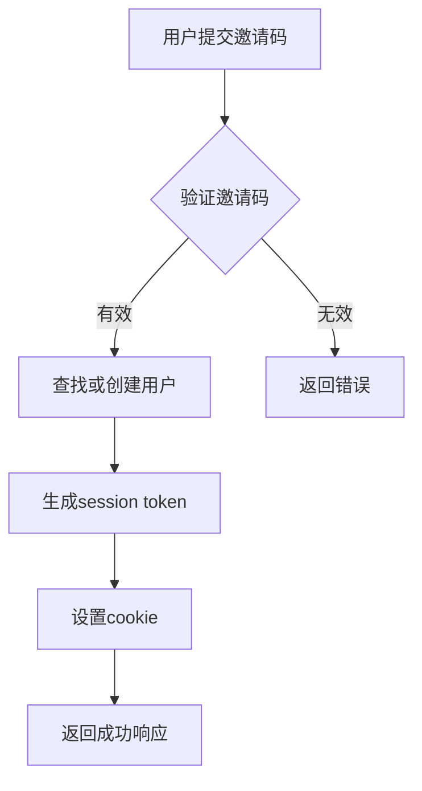
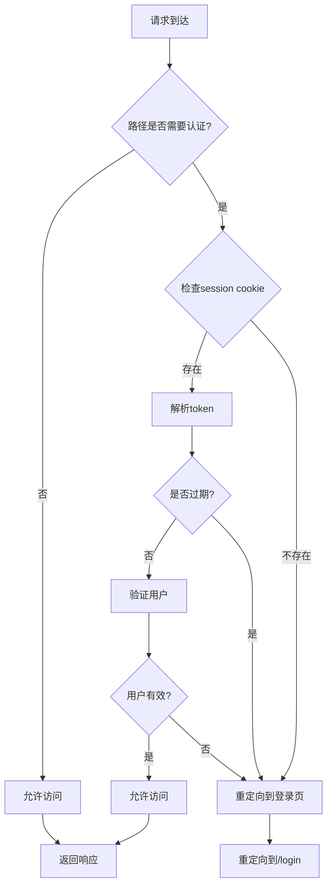
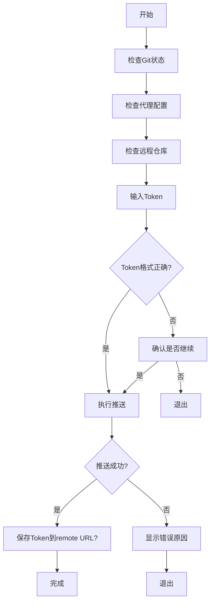
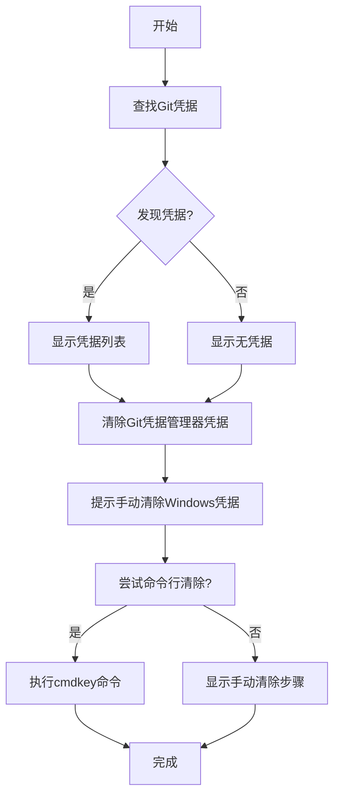

# 认证错误排查

<cite>
**本文档引用的文件**   
- [彻底解决403问题.md](file://彻底解决403问题.md)
- [SESSION_SYSTEM_README.md](file://SESSION_SYSTEM_README.md)
- [auth.ts](file://lib\auth.ts)
- [useAuth.ts](file://lib\useAuth.ts)
- [middleware.ts](file://middleware.ts)
- [api-client.ts](file://lib\api-client.ts)
- [create-session\route.ts](file://app\api\auth\create-session\route.ts)
- [database-init.sql](file://database-init.sql)
- [db.ts](file://lib\db.ts)
- [chat\route.ts](file://app\api\chat\route.ts)
- [interview\start\route.ts](file://app\api\interview\start\route.ts)
- [load-session\route.ts](file://app\api\load-session\route.ts)
- [推送代码.ps1](file://推送代码.ps1)
- [清除旧凭据.ps1](file://清除旧凭据.ps1)
</cite>

## 目录
1. [引言](#引言)
2. [403错误系统化排查方案](#403错误系统化排查方案)
3. [会话系统工作机制](#会话系统工作机制)
4. [401/403响应处理](#401403响应处理)
5. [PowerShell诊断脚本使用流程](#powershell诊断脚本使用流程)
6. [Supabase认证集成配置](#supabase认证集成配置)
7. [结论](#结论)

## 引言

本文档旨在系统化整理认证失败的排查方案，重点解决403错误。基于“彻底解决403问题.md”文档，指导开发者验证GitHub Token格式、权限范围及有效性测试方法。结合SESSION_SYSTEM_README.md说明会话系统的工作机制，包括基于invite_code的用户绑定、session cookie的生成与验证流程。解释单设备登录限制如何导致旧设备被踢出，并指导如何处理401/403响应。提供使用PowerShell脚本诊断Token权限、远程URL匹配、凭据缓存冲突的完整流程。涵盖Supabase认证集成中环境变量的正确配置要求。

## 403错误系统化排查方案

### GitHub Token格式验证

根据“彻底解决403问题.md”文档，GitHub Token必须满足以下格式要求：

- 必须以 `ghp_` 开头
- 长度约为40-50个字符
- 不能包含空格或换行等不可见字符
- 必须完整复制，不能部分复制

**Section sources**
- [彻底解决403问题.md](file://彻底解决403问题.md#L33-L37)

### GitHub Token权限范围检查

Token必须具有足够的权限才能访问仓库：

- 必须勾选 `repo` 权限
- 确保 `repo` 下的所有子权限都已勾选
- Token不能过期

建议重新生成Token以确保权限正确：

1. 访问 https://github.com/settings/tokens
2. 删除旧Token
3. 创建新Token，名称为 `ai-job-coach-full-repo`
4. 勾选 `repo` 权限（确保展开后所有子权限都已勾选）
5. 有效期选择90天或"无过期"
6. 生成后立即完整复制Token

**Section sources**
- [彻底解决403问题.md](file://彻底解决403问题.md#L147-L163)

### GitHub Token有效性测试

使用PowerShell脚本测试Token是否有效：

```powershell
# 测试 Token 是否有效
$token = "YOUR_TOKEN"
$headers = @{
    "Authorization" = "token $token"
    "Accept" = "application/vnd.github.v3+json"
}
try {
    $response = Invoke-RestMethod -Uri "https://api.github.com/user" -Headers $headers
    Write-Host "✓ Token 有效！用户: $($response.login)" -ForegroundColor Green
} catch {
    Write-Host "✗ Token 无效或已过期: $_" -ForegroundColor Red
}
```

同时测试仓库访问权限：

```powershell
# 测试是否有仓库访问权限
$token = "YOUR_TOKEN"
$headers = @{
    "Authorization" = "token $token"
    "Accept" = "application/vnd.github.v3+json"
}
try {
    $response = Invoke-RestMethod -Uri "https://api.github.com/repos/velmavalienteqejimu22-jpg/ai-job-coach" -Headers $headers
    Write-Host "✓ 可以访问仓库: $($response.full_name)" -ForegroundColor Green
    Write-Host "  权限: $($response.permissions.push)" -ForegroundColor Green
} catch {
    Write-Host "✗ 无法访问仓库或权限不足: $_" -ForegroundColor Red
}
```

**Section sources**
- [彻底解决403问题.md](file://彻底解决403问题.md#L41-L75)

### 用户名和仓库名匹配检查

确保GitHub用户名和仓库名正确匹配：

1. 确认GitHub用户名是：`velmavalienteqejimu22-jpg`
2. 确认仓库名是：`ai-job-coach`（不是 `ai-job-coach.git`）
3. 验证仓库URL是否匹配

使用以下命令检查远程仓库：

```powershell
git remote -v
```

应该显示：

```
origin  https://github.com/velmavalienteqejimu22-jpg/ai-job-coach.git (fetch)
origin  https://github.com/velmavalienteqejimu22-jpg/ai-job-coach.git (push)
```

如果不匹配，更新remote URL：

```powershell
git remote set-url origin https://github.com/正确用户名/正确仓库名.git
```

**Section sources**
- [彻底解决403问题.md](file://彻底解决403问题.md#L78-L110)

### 旧凭据干扰清除

旧的Git凭据可能会干扰新的认证：

**方法A：清除Git凭据缓存**

```powershell
# 方法1：清除所有Git凭据
git credential-manager erase <<< @"
protocol=https
host=github.com
"@

# 方法2：清除Windows凭据管理器
# 按Win + R，输入：control /name Microsoft.CredentialManager
# 找到包含"git"或"github"的条目并删除
```

**方法B：使用环境变量方式（绕过凭据缓存）**

```powershell
# 1. 设置环境变量
$env:GIT_ASKPASS = "echo"

# 2. 在URL中直接使用token
git push https://YOUR_TOKEN@github.com/velmavalienteqejimu22-jpg/ai-job-coach.git main

# 3. 推送后清除环境变量
Remove-Item Env:\GIT_ASKPASS
```

**Section sources**
- [彻底解决403问题.md](file://彻底解决403问题.md#L116-L141)

## 会话系统工作机制

### 会话系统概述

会话系统实现了完整的登录会话管理，主要功能包括：

- 邀请码可重复登录（不再"一次性"）
- 7天免登录（cookie + 会话）
- 同一邀请码只能同时登录一个设备（新设备登录会自动踢下旧设备）
- 聊天记录和白板跟随用户（invite_code → user_id）保存与加载
- 所有受保护API检查session

**Section sources**
- [SESSION_SYSTEM_README.md](file://SESSION_SYSTEM_README.md#L3-L11)

### 基于invite_code的用户绑定

系统使用invite_code将用户与账户绑定：

1. 用户使用邀请码登录
2. 系统根据invite_code查找或创建用户记录
3. 用户信息存储在users表中，invite_code作为唯一标识

users表结构：

```sql
CREATE TABLE IF NOT EXISTS users (
  id UUID PRIMARY KEY DEFAULT gen_random_uuid(),
  invite_code TEXT UNIQUE NOT NULL,
  created_at TIMESTAMPTZ DEFAULT NOW()
);
```

**Section sources**
- [SESSION_SYSTEM_README.md](file://SESSION_SYSTEM_README.md#L39-L45)
- [database-init.sql](file://database-init.sql#L6-L10)

### session cookie生成与验证流程

#### session cookie生成

当用户成功登录时，系统生成session cookie：

1. 创建Supabase Admin客户端
2. 根据invite_code获取或创建用户
3. 生成session token并设置为cookie
4. 设置有效期为7天



**Diagram sources**
- [create-session\route.ts](file://app\api\auth\create-session\route.ts#L22-L217)

#### session cookie验证

系统通过middleware验证session cookie：

1. 检查session cookie是否存在
2. 解析session token
3. 验证token是否过期
4. 验证用户是否存在于Supabase
5. 如果验证失败，重定向到登录页



**Diagram sources**
- [middleware.ts](file://middleware.ts#L14-L152)

### 单设备登录限制

系统实现了单设备登录限制，确保同一邀请码只能在一个设备上保持登录状态：

1. 新设备登录时，系统将旧设备的所有活跃session设为`is_active = false`
2. 旧设备再次调用API时，会收到401错误
3. 前端自动处理401错误，显示提示并跳转到登录页

sessions表结构：

```sql
CREATE TABLE IF NOT EXISTS sessions (
  id UUID PRIMARY KEY DEFAULT gen_random_uuid(),
  user_id UUID REFERENCES users(id) ON DELETE CASCADE,
  device_id TEXT,
  ip TEXT,
  user_agent TEXT,
  is_active BOOLEAN DEFAULT TRUE,
  created_at TIMESTAMPTZ DEFAULT NOW(),
  expires_at TIMESTAMPTZ NOT NULL,
  last_seen_at TIMESTAMPTZ DEFAULT NOW()
);
```

**Section sources**
- [SESSION_SYSTEM_README.md](file://SESSION_SYSTEM_README.md#L159-L162)
- [database-init.sql](file://database-init.sql#L13-L23)

## 401/403响应处理

### 401未认证错误处理

当API返回401错误时，前端会自动处理：

1. 显示提示："当前账号已在其他设备登录，你已被登出"
2. 跳转到 `/login` 页面

这是通过`lib/api-client.ts`中的封装函数实现的：

```typescript
export async function apiFetch(
  url: string,
  options?: RequestInit
): Promise<Response> {
  const response = await fetch(url, {
    ...options,
    credentials: "include", // 确保发送cookie
  });

  // 处理401未认证错误
  if (response.status === 401) {
    // 显示提示
    alert("当前账号已在其他设备登录，你已被登出");
    
    // 跳转到登录页
    window.location.href = "/login";
    
    return response;
  }

  return response;
}
```

**Section sources**
- [SESSION_SYSTEM_README.md](file://SESSION_SYSTEM_README.md#L125-L129)
- [api-client.ts](file://lib\api-client.ts#L10-L35)

### 受保护API列表

以下API需要有效的session cookie（`app_session_id`）：

- `/api/chat` - 聊天API
- `/api/interview/start` - 开始面试
- `/api/interview/answer` - 提交答案
- `/api/interview/complete` - 完成面试
- `/api/load-session` - 加载会话
- `/api/save-whiteboard` - 保存白板

如果未认证，这些API将返回401错误。

**Section sources**
- [SESSION_SYSTEM_README.md](file://SESSION_SYSTEM_README.md#L96-L104)

### 前端认证检查

前端使用`useAuth` Hook进行认证检查：

```typescript
export function useAuth() {
  const router = useRouter();

  useEffect(() => {
    const checkAuth = () => {
      // 检查cookie
      const cookies = document.cookie.split(';');
      const hasSessionCookie = cookies.some(cookie => 
        cookie.trim().startsWith('sb-access-token=') || 
        cookie.trim().startsWith('sb-session-user-id=')
      );

      // 检查localStorage
      const sessionId = localStorage.getItem("sessionId");
      const inviteCode = localStorage.getItem("inviteCode");

      // 如果既没有cookie也没有localStorage，重定向到登录页
      if (!hasSessionCookie && (!sessionId || !inviteCode)) {
        router.push("/login");
        return false;
      }

      return true;
    };

    // 立即检查
    if (!checkAuth()) {
      return;
    }

    // 定期检查（每30秒检查一次）
    const interval = setInterval(() => {
      if (!checkAuth()) {
        clearInterval(interval);
      }
    }, 30000);

    return () => clearInterval(interval);
  }, [router]);
}
```

**Section sources**
- [useAuth.ts](file://lib\useAuth.ts#L1-L59)

## PowerShell诊断脚本使用流程

### 推送代码诊断脚本

`推送代码.ps1`脚本提供了一套完整的诊断流程：

1. 检查Git状态
2. 检查代理配置
3. 检查远程仓库
4. 提示输入Token
5. 验证Token格式
6. 执行推送

脚本会自动检测并移除代理配置，验证Token格式（是否以`ghp_`开头），并在推送成功后询问是否将Token保存到remote URL。



**Diagram sources**
- [推送代码.ps1](file://推送代码.ps1#L1-L116)

### 清除旧凭据脚本

`清除旧凭据.ps1`脚本用于清除旧的Git凭据：

1. 查找Git相关的凭据
2. 清除Git凭据管理器的凭据
3. 提示手动清除Windows凭据管理器中的旧凭据

脚本会尝试使用`git credential-manager erase`命令清除凭据，并提供手动清除的步骤说明。



**Diagram sources**
- [清除旧凭据.ps1](file://清除旧凭据.ps1#L1-L85)

### 完整诊断脚本

"彻底解决403问题.md"中提供了一个详细的诊断脚本，可以自动诊断以下问题：

1. 代理配置
2. 远程仓库
3. 用户配置
4. 本地提交
5. Token有效性
6. 仓库访问权限

脚本会提示输入Token并测试其有效性，然后给出推送建议。

**Section sources**
- [彻底解决403问题.md](file://彻底解决403问题.md#L218-L290)

## Supabase认证集成配置

### 环境变量配置

Supabase认证需要正确配置以下环境变量：

- `SUPABASE_URL` - Supabase项目URL
- `SUPABASE_ANON_KEY` - Supabase匿名密钥
- `SUPABASE_SERVICE_ROLE_KEY` - Supabase服务角色密钥（可选）

在`middleware.ts`中检查这些环境变量：

```typescript
// 检查环境变量
const supabaseUrl = process.env.SUPABASE_URL;
const supabaseServiceKey = process.env.SUPABASE_SERVICE_ROLE_KEY;
const supabaseAnonKey = process.env.SUPABASE_ANON_KEY || process.env.SUPABASE_KEY;

if (!supabaseUrl || !supabaseAnonKey) {
  console.error("Middleware: SUPABASE_URL 或 SUPABASE_ANON_KEY 未配置");
  return NextResponse.next();
}
```

**Section sources**
- [middleware.ts](file://middleware.ts#L48-L56)

### Supabase客户端创建

系统创建两种Supabase客户端：

1. **Anon客户端**：用于基本验证
2. **Admin客户端**：用于用户验证

```typescript
// 创建Supabase客户端（使用Anon Key用于基本验证）
const supabase = createClient(supabaseUrl, supabaseAnonKey, {
  auth: {
    persistSession: false,
    autoRefreshToken: false,
  },
});

// 如果有Service Role Key，创建Admin客户端用于用户验证
let supabaseAdmin = null;
if (supabaseServiceKey) {
  supabaseAdmin = createClient(supabaseUrl, supabaseServiceKey, {
    auth: {
      persistSession: false,
      autoRefreshToken: false,
    },
  });
}
```

**Section sources**
- [middleware.ts](file://middleware.ts#L58-L75)

### 数据库初始化

部署前需要执行数据库初始化脚本`database-init.sql`，创建必要的表：

1. `users`表：存储用户信息
2. `sessions`表：存储会话信息
3. 确保`conversation_messages`和`whiteboard_states`表有`user_id`字段

```sql
-- 创建users表
CREATE TABLE IF NOT EXISTS users (
  id UUID PRIMARY KEY DEFAULT gen_random_uuid(),
  invite_code TEXT UNIQUE NOT NULL,
  created_at TIMESTAMPTZ DEFAULT NOW()
);

-- 创建sessions表
CREATE TABLE IF NOT EXISTS sessions (
  id UUID PRIMARY KEY DEFAULT gen_random_uuid(),
  user_id UUID REFERENCES users(id) ON DELETE CASCADE,
  device_id TEXT,
  ip TEXT,
  user_agent TEXT,
  is_active BOOLEAN DEFAULT TRUE,
  created_at TIMESTAMPTZ DEFAULT NOW(),
  expires_at TIMESTAMPTZ NOT NULL,
  last_seen_at TIMESTAMPTZ DEFAULT NOW()
);
```

**Section sources**
- [database-init.sql](file://database-init.sql#L1-L45)

## 结论

本文档系统化整理了认证失败的排查方案，重点解决了403错误。通过验证GitHub Token格式、权限范围及有效性，检查用户名和仓库名匹配，清除旧凭据干扰，可以有效解决403错误。会话系统通过基于invite_code的用户绑定、session cookie的生成与验证流程，以及单设备登录限制，确保了系统的安全性。前端通过`api-client.ts`中的封装函数自动处理401/403响应，提升了用户体验。PowerShell脚本提供了完整的诊断流程，帮助开发者快速定位和解决问题。正确配置Supabase认证集成的环境变量是确保系统正常运行的关键。