# API路由详解

<cite>
**本文档引用文件**   
- [app/api/auth/create-session/route.ts](file://app/api/auth/create-session/route.ts)
- [app/api/resume/upload/route.ts](file://app/api/resume/upload/route.ts)
- [app/api/parse-resume/route.ts](file://app/api/parse-resume/route.ts)
- [app/api/interview/start/route.ts](file://app/api/interview/start/route.ts)
- [app/api/interview/answer/route.ts](file://app/api/interview/answer/route.ts)
- [app/api/interview/assess/route.ts](file://app/api/interview/assess/route.ts)
- [app/api/interview/complete/route.ts](file://app/api/interview/complete/route.ts)
- [app/api/interview/summary/route.ts](file://app/api/interview/summary/route.ts)
- [app/api/load-session/route.ts](file://app/api/load-session/route.ts)
- [app/api/save-whiteboard/route.ts](file://app/api/save-whiteboard/route.ts)
- [app/api/load-whiteboard/route.ts](file://app/api/load-whiteboard/route.ts)
- [app/api/resume/parse/route.ts](file://app/api/resume/parse/route.ts)
- [app/api/README.md](file://app/api/README.md)
- [app/api/health/route.ts](file://app/api/health/route.ts)
- [app/api/verify/route.ts](file://app/api/verify/route.ts)
- [app/api/verify-invite/route.ts](file://app/api/verify-invite/route.ts)
- [app/api/invites/check/route.ts](file://app/api/invites/check/route.ts)
- [app/api/invites/redeem/route.ts](file://app/api/invites/redeem/route.ts)
- [app/api/admin/invites/generate/route.ts](file://app/api/admin/invites/generate/route.ts)
</cite>

## 目录

1. [项目结构概述](#项目结构概述)
2. [认证与会话管理](#认证与会话管理)
3. [简历处理流程](#简历处理流程)
4. [面试流程控制](#面试流程控制)
5. [状态管理机制](#状态管理机制)
6. [安全与错误处理](#安全与错误处理)
7. [API调用示例与测试](#api调用示例与测试)
8. [性能优化建议](#性能优化建议)

## 项目结构概述

AI求职教练项目的API路由采用Next.js App Router架构，所有后端接口均位于`app/api/`目录下，通过文件系统路由自动生成RESTful端点。每个API功能模块以独立子目录组织，包含`route.ts`文件定义请求处理逻辑。

```mermaid
graph TB
subgraph "API路由结构"
A[app/api]
A --> B[auth]
A --> C[resume]
A --> D[interview]
A --> E[session]
A --> F[invites]
A --> G[health]
B --> B1[create-session]
C --> C1[upload]
C --> C2[parse]
C --> C3[delete[resume_id]]
D --> D1[start]
D --> D2[answer]
D --> D3[assess]
D --> D4[complete]
D --> D5[summary]
E --> E1[load-session]
E --> E2[save-whiteboard]
E --> E3[load-whiteboard]
F --> F1[check]
F --> F2[redeem]
F --> F3[generate]
end
```

**图示来源**
- [app/api/README.md](file://app/api/README.md)

## 认证与会话管理

### 认证流程实现

系统采用基于邀请码的认证机制，通过Supabase身份验证服务管理用户会话。核心流程包括邀请码验证、用户创建和会话令牌生成。

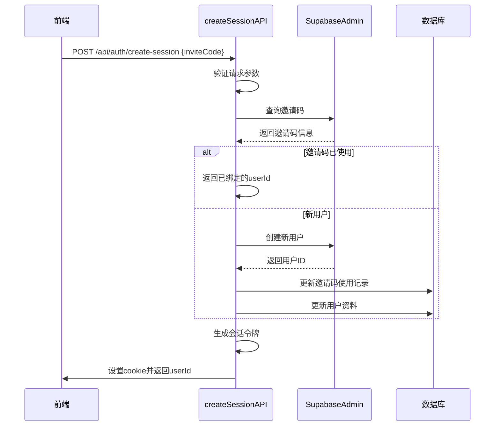

**图示来源**
- [app/api/auth/create-session/route.ts](file://app/api/auth/create-session/route.ts)

### 会话生命周期管理

系统通过`load-session`和`create-session`接口管理用户会话状态，确保前后端状态同步。

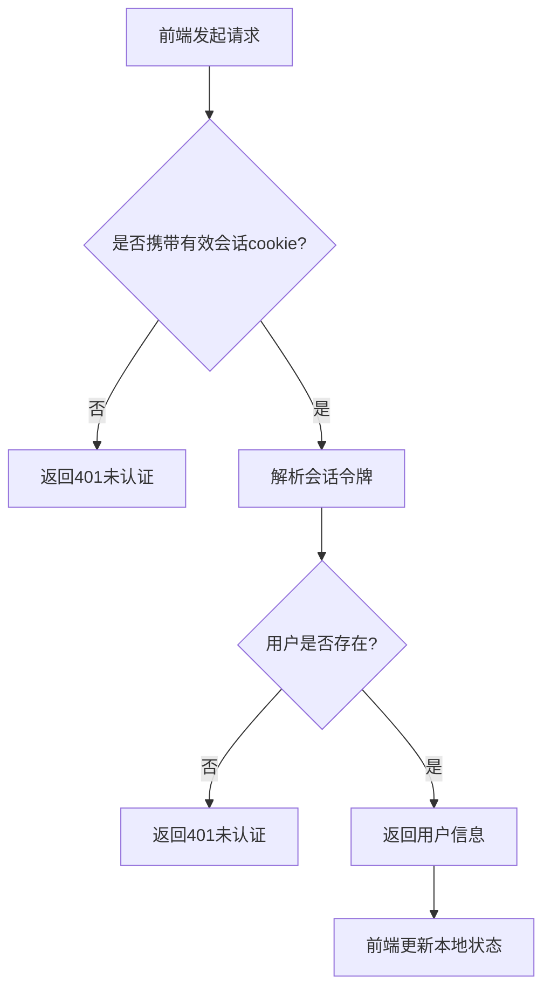

**图示来源**
- [app/api/load-session/route.ts](file://app/api/load-session/route.ts)

## 简历处理流程

### 简历上传与存储

简历上传流程涉及文件解析、云存储和数据库记录三个主要步骤，确保文件安全存储和元数据持久化。

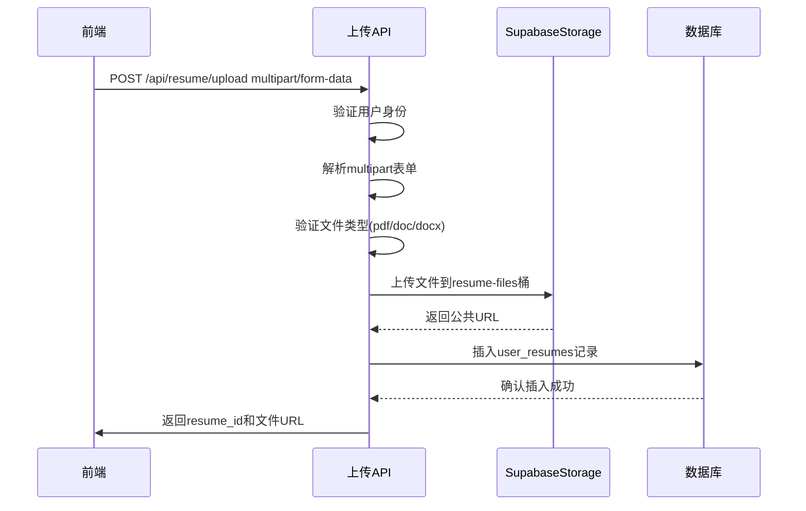

**图示来源**
- [app/api/resume/upload/route.ts](file://app/api/resume/upload/route.ts)

### 简历解析与结构化

简历解析流程结合PDF/Word文件解析库和LLM技术，将非结构化简历内容转换为结构化JSON数据。

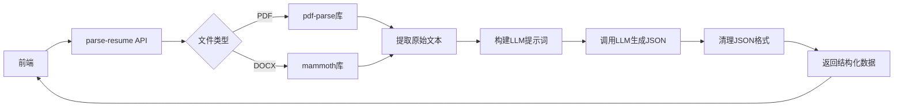

**图示来源**
- [app/api/parse-resume/route.ts](file://app/api/parse-resume/route.ts)

### 动态路径参数处理

系统使用动态API路径处理简历删除等操作，通过方括号语法`delete[resume_id]`实现参数化路由。

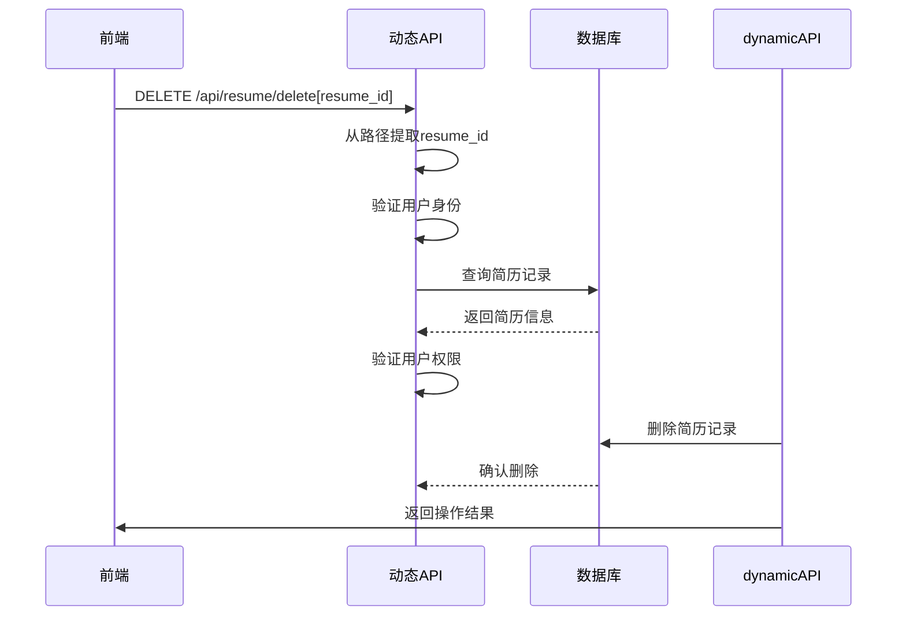

**图示来源**
- [app/api/resume/parse/route.ts](file://app/api/resume/parse/route.ts)

## 面试流程控制

### 面试会话初始化

`/api/interview/start`接口负责创建新的面试会话，生成面试题目并持久化会话状态。

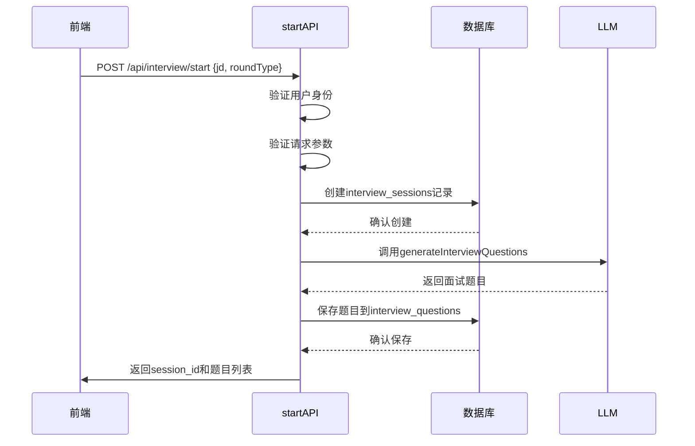

**图示来源**
- [app/api/interview/start/route.ts](file://app/api/interview/start/route.ts)

### 答题与评估流程

面试答题流程通过`answer`和`assess`两个接口实现，分别处理答案提交和质量评估。

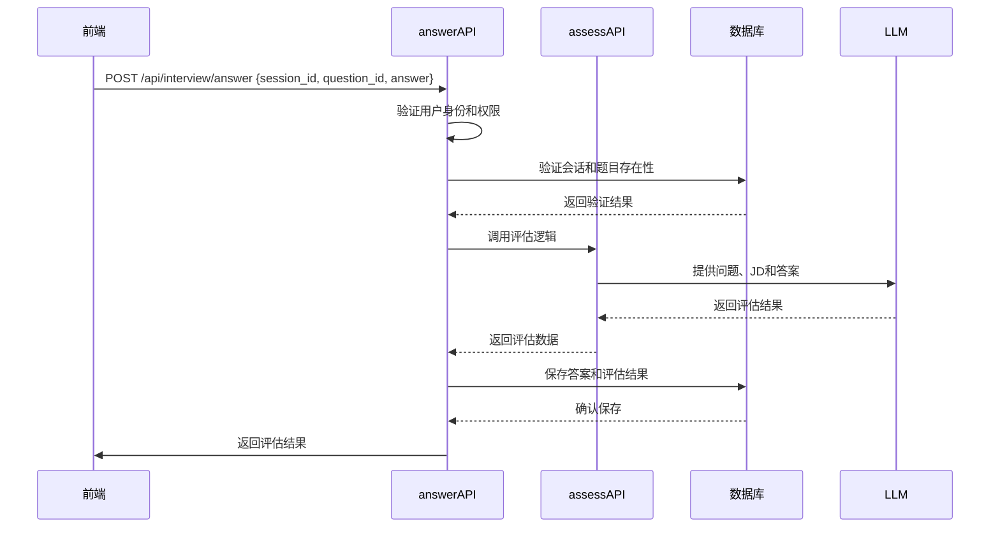

**图示来源**
- [app/api/interview/answer/route.ts](file://app/api/interview/answer/route.ts)
- [app/api/interview/assess/route.ts](file://app/api/interview/assess/route.ts)

### 面试总结生成

面试完成后，系统通过`complete`和`summary`接口生成综合评估报告。

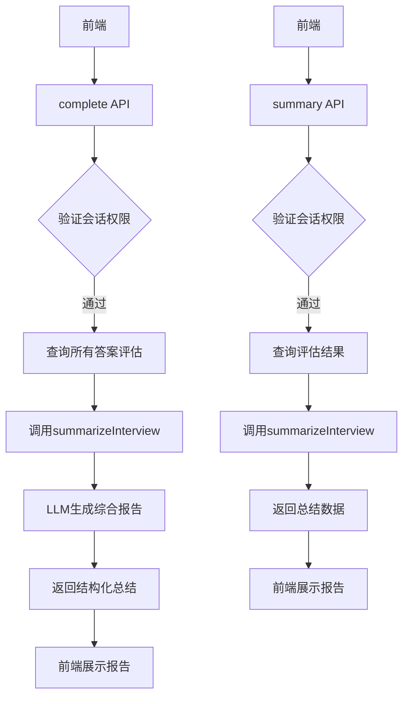

**图示来源**
- [app/api/interview/complete/route.ts](file://app/api/interview/complete/route.ts)
- [app/api/interview/summary/route.ts](file://app/api/interview/summary/route.ts)

## 状态管理机制

### 白板数据持久化

系统通过`save-whiteboard`和`load-whiteboard`接口实现白板数据的实时同步和持久化存储。

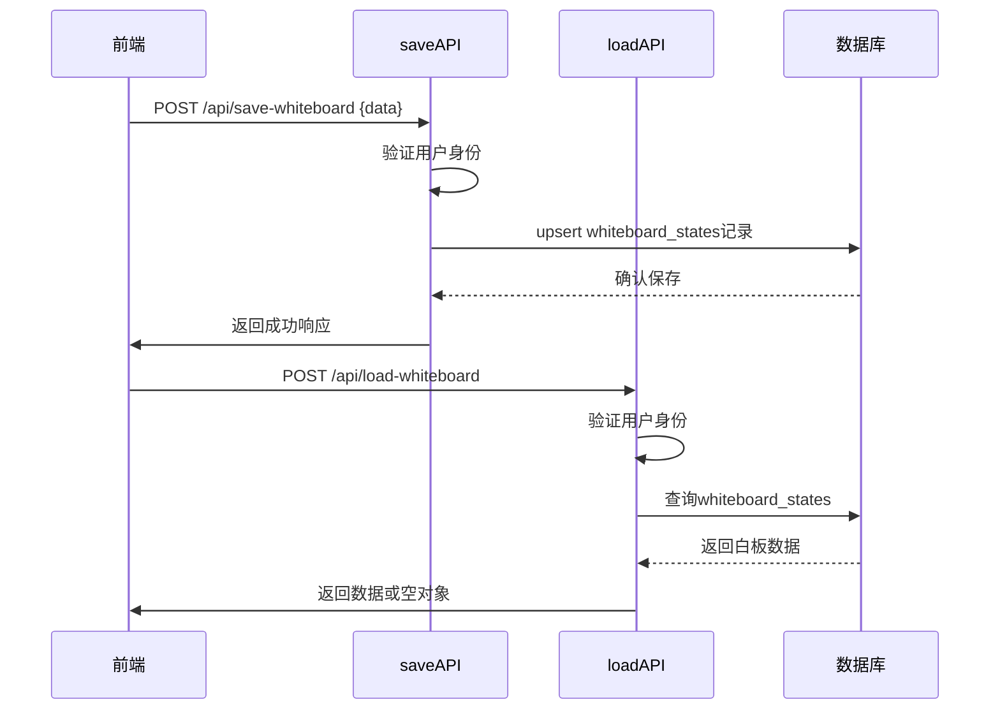

**图示来源**
- [app/api/save-whiteboard/route.ts](file://app/api/save-whiteboard/route.ts)
- [app/api/load-whiteboard/route.ts](file://app/api/load-whiteboard/route.ts)

## 安全与错误处理

### 安全防护机制

系统实施多层安全防护，防止恶意请求和数据泄露。

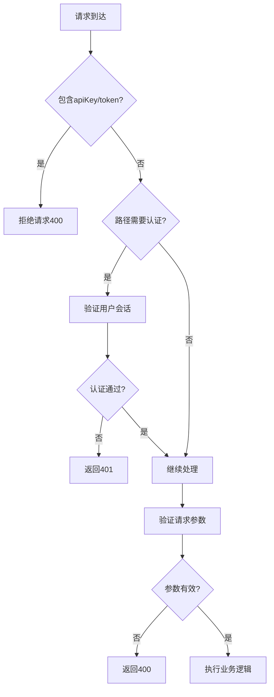

**图示来源**
- [app/api/auth/create-session/route.ts](file://app/api/auth/create-session/route.ts)
- [app/api/parse-resume/route.ts](file://app/api/parse-resume/route.ts)

### 错误处理策略

系统采用统一的错误处理模式，确保API响应的一致性和可预测性。

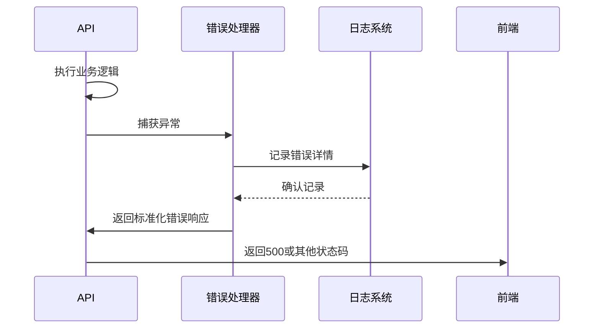

**图示来源**
- [app/api/interview/start/route.ts](file://app/api/interview/start/route.ts)
- [app/api/resume/upload/route.ts](file://app/api/resume/upload/route.ts)

## API调用示例与测试

### 核心API调用示例

以下是关键API接口的调用示例，可用于测试和集成。

```typescript
// 创建会话
async function createSession(inviteCode: string) {
  const response = await fetch('/api/auth/create-session', {
    method: 'POST',
    headers: { 'Content-Type': 'application/json' },
    body: JSON.stringify({ inviteCode })
  });
  return await response.json();
}

// 上传简历
async function uploadResume(file: File) {
  const formData = new FormData();
  formData.append('file', file);
  
  const response = await fetch('/api/resume/upload', {
    method: 'POST',
    body: formData
  });
  return await response.json();
}

// 开始面试
async function startInterview(jd: string, roundType: string) {
  const response = await fetch('/api/interview/start', {
    method: 'POST',
    headers: { 'Content-Type': 'application/json' },
    body: JSON.stringify({ jd, roundType, questionCount: 5 })
  });
  return await response.json();
}
```

**代码来源**
- [app/api/README.md](file://app/api/README.md)

## 性能优化建议

### 数据库查询优化

- 为常用查询字段创建索引，如`user_resumes.user_id`、`interview_sessions.user_id`
- 使用批量操作减少数据库往返次数
- 实现查询结果缓存，避免重复计算

### LLM调用优化

- 实现LLM响应缓存，避免重复请求相同内容
- 使用流式响应减少用户等待时间
- 优化提示词工程，提高首次响应准确率

### 文件处理优化

- 实现文件上传进度跟踪
- 添加文件大小限制和类型验证
- 使用CDN加速文件访问

### 并发控制

- 实现API请求节流，防止滥用
- 使用分布式锁处理并发修改
- 监控API响应时间，及时发现性能瓶颈