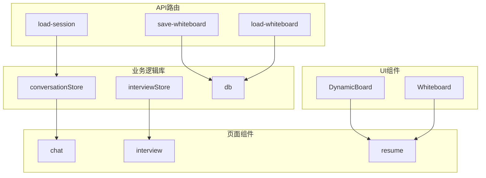
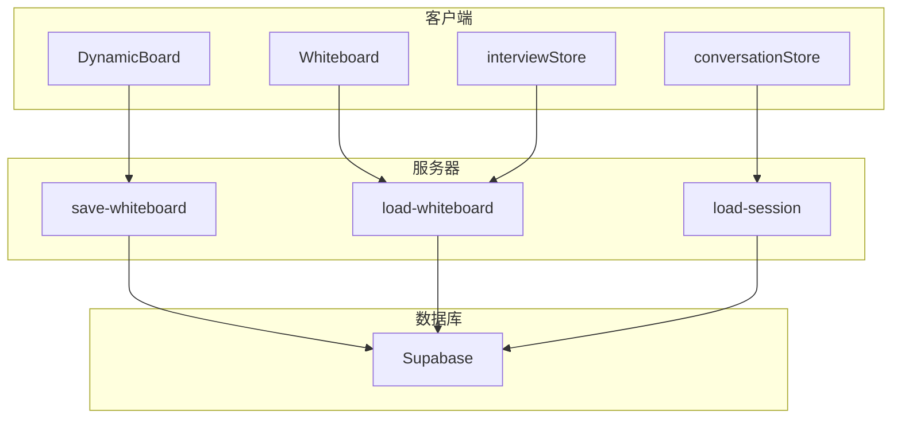
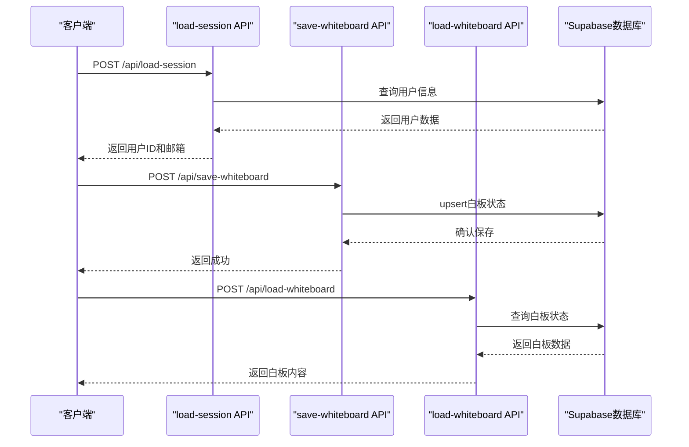
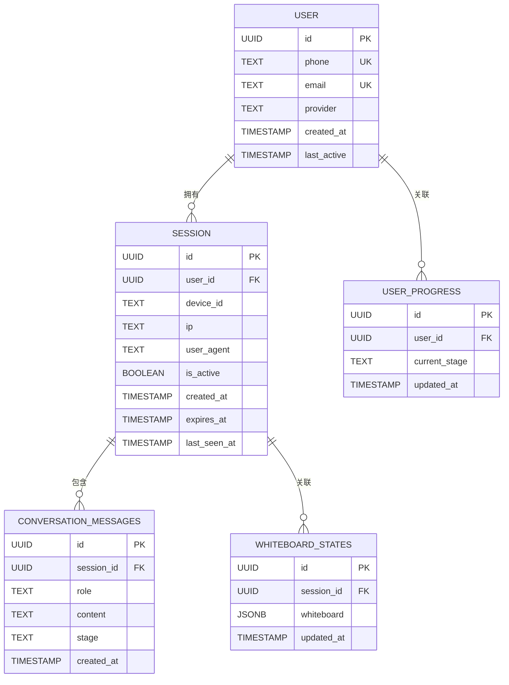
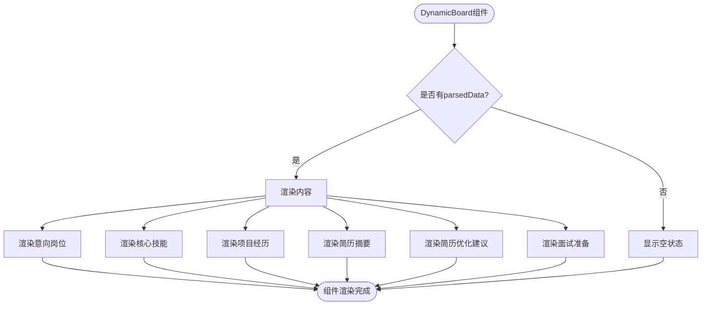
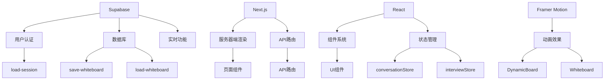

# 会话与白板状态管理API

<cite>
**本文档引用的文件**   
- [load-session/route.ts](file://app/api/load-session/route.ts)
- [save-whiteboard/route.ts](file://app/api/save-whiteboard/route.ts)
- [load-whiteboard/route.ts](file://app/api/load-whiteboard/route.ts)
- [conversationStore.ts](file://lib/conversationStore.ts)
- [interviewStore.tsx](file://store/interviewStore.tsx)
- [db.ts](file://lib/db.ts)
- [auth.ts](file://lib/auth.ts)
- [DynamicBoard.tsx](file://components/DynamicBoard.tsx)
- [Whiteboard.tsx](file://components/Whiteboard.tsx)
- [schema.sql](file://supabase/schema.sql)
</cite>

## 目录
1. [简介](#简介)
2. [项目结构](#项目结构)
3. [核心组件](#核心组件)
4. [架构概述](#架构概述)
5. [详细组件分析](#详细组件分析)
6. [依赖分析](#依赖分析)
7. [性能考虑](#性能考虑)
8. [故障排除指南](#故障排除指南)
9. [结论](#结论)

## 简介
本项目是一个AI求职教练系统，提供从职业规划到Offer评估的全流程求职辅导。系统通过会话管理、白板状态持久化、模拟面试等核心功能，帮助用户系统化地准备求职过程。会话与白板状态管理是系统的核心，确保用户在不同设备和会话间能够无缝恢复对话历史和关键信息。

## 项目结构
项目采用Next.js框架构建，主要分为API路由、页面组件、业务逻辑库和UI组件四个部分。API路由处理会话加载、白板保存/加载等核心状态管理操作；页面组件实现用户界面；lib目录包含状态管理、数据库操作等核心业务逻辑；components目录提供可复用的UI组件。



**图表来源**
- [load-session/route.ts](file://app/api/load-session/route.ts)
- [save-whiteboard/route.ts](file://app/api/save-whiteboard/route.ts)
- [load-whiteboard/route.ts](file://app/api/load-whiteboard/route.ts)
- [conversationStore.ts](file://lib/conversationStore.ts)
- [interviewStore.tsx](file://store/interviewStore.tsx)
- [db.ts](file://lib/db.ts)
- [DynamicBoard.tsx](file://components/DynamicBoard.tsx)
- [Whiteboard.tsx](file://components/Whiteboard.tsx)

**章节来源**
- [app/api](file://app/api)
- [app/chat](file://app/chat)
- [lib](file://lib)
- [components](file://components)

## 核心组件
系统的核心组件包括会话管理、白板状态管理、对话存储和面试状态管理。会话管理通过`load-session` API恢复用户身份和会话状态；白板状态管理通过`save-whiteboard`和`load-whiteboard` API实现跨会话的数据持久化；`conversationStore`管理各阶段的对话历史；`interviewStore`管理模拟面试的完整状态。

**章节来源**
- [load-session/route.ts](file://app/api/load-session/route.ts#L1-L30)
- [save-whiteboard/route.ts](file://app/api/save-whiteboard/route.ts#L1-L50)
- [load-whiteboard/route.ts](file://app/api/load-whiteboard/route.ts#L1-L39)
- [conversationStore.ts](file://lib/conversationStore.ts#L1-L258)
- [interviewStore.tsx](file://store/interviewStore.tsx#L1-L789)

## 架构概述
系统采用客户端-服务器架构，客户端通过API与服务器通信，服务器通过Supabase数据库持久化用户数据。会话管理基于Supabase Auth实现用户认证，白板状态和对话历史通过Supabase的PostgreSQL数据库存储。客户端使用React Context和单例模式管理本地状态，确保状态的一致性和可预测性。



**图表来源**
- [DynamicBoard.tsx](file://components/DynamicBoard.tsx)
- [Whiteboard.tsx](file://components/Whiteboard.tsx)
- [conversationStore.ts](file://lib/conversationStore.ts)
- [interviewStore.tsx](file://store/interviewStore.tsx)
- [load-session/route.ts](file://app/api/load-session/route.ts)
- [save-whiteboard/route.ts](file://app/api/save-whiteboard/route.ts)
- [load-whiteboard/route.ts](file://app/api/load-whiteboard/route.ts)
- [db.ts](file://lib/db.ts)

## 详细组件分析

### 会话与白板状态管理分析
系统通过`load-session`、`save-whiteboard`和`load-whiteboard`三个API实现会话和白板状态的管理。`load-session`恢复用户身份，`save-whiteboard`和`load-whiteboard`实现白板内容的持久化同步。

#### API组件分析


**图表来源**
- [load-session/route.ts](file://app/api/load-session/route.ts#L1-L30)
- [save-whiteboard/route.ts](file://app/api/save-whiteboard/route.ts#L1-L50)
- [load-whiteboard/route.ts](file://app/api/load-whiteboard/route.ts#L1-L39)
- [db.ts](file://lib/db.ts#L1-L327)

#### 数据模型分析


**图表来源**
- [schema.sql](file://supabase/schema.sql#L1-L84)

### 状态管理机制分析
系统采用两种状态管理机制：`conversationStore`用于管理多阶段对话历史，`interviewStore`用于管理模拟面试的复杂状态。

#### conversationStore分析
```mermaid
classDiagram
class ConversationStore {
-conversations : StageConversations
-currentUserId : string | null
+setUserId(userId : string | null) : void
+getStageHistory(stage : UserStage) : ConversationMessage[]
+addMessage(stage : UserStage, message : ConversationMessage) : void
+getAllHistoryForStage(currentStage : UserStage) : Array<{role : "user" | "assistant", content : string}>
+clearStage(stage : UserStage) : void
+clearAll() : void
+clearUserData(userId : string) : void
+saveToLocalStorage(userId : string) : void
+loadFromLocalStorage(userId : string) : void
+initializeWelcomeMessage(stage : UserStage) : void
}
class ConversationMessage {
+id : string
+sender : "user" | "ai"
+text : string
+timestamp : number
+stage : UserStage
}
class StageConversations {
+career_planning : ConversationMessage[]
+project_review : ConversationMessage[]
+resume_optimization : ConversationMessage[]
+application_strategy : ConversationMessage[]
+interview : ConversationMessage[]
+salary_talk : ConversationMessage[]
+offer : ConversationMessage[]
}
ConversationStore --> ConversationMessage : "包含"
ConversationStore --> StageConversations : "使用"
```

**图表来源**
- [conversationStore.ts](file://lib/conversationStore.ts#L1-L258)

#### interviewStore分析
```mermaid
classDiagram
class InterviewStore {
+sessionId : string | null
+userId : string | null
+roundType : RoundType
+roundIndex : number
+currentQuestionIndex : number
+questions : InterviewQuestion[]
+roundCompleted : boolean
+history : InterviewHistory[]
+conversation : InterviewMessage[]
+flowStep : InterviewFlowStep
+mode : InterviewMode
+targetRole : string | null
+totalQuestions : number | null
+latestSummary : any
+isLoadingQuestion : boolean
+isEvaluating : boolean
+initInterview(sessionId : string, userId : string, suggestedRound? : RoundType) : void
+loadRound(roundType : RoundType) : Promise<void>
+answerQuestion(questionId : string, text : string) : Promise<void>
+setEvaluation(questionId : string, evaluationData : QuestionEvaluation) : void
+nextQuestion() : Promise<void>
+prevQuestion() : void
+retryCurrentQuestion() : void
+completeRound() : Promise<void>
+resetRound() : void
+getCurrentQuestion() : InterviewQuestion | null
+beginInterviewIntro(context : {intentRole? : string | null, projectNames? : string[]}) : void
+addAssistantMessage(content : string) : string
+addUserMessage(content : string) : string
+setMode(mode : InterviewMode) : void
+setFlowStep(step : InterviewFlowStep) : void
+setTargetRole(role : string | null) : void
+setTotalQuestions(count : number | null) : void
+setRound(round : RoundType) : void
+resetInterviewConversation() : void
}
class InterviewQuestion {
+id : string
+q : string
+tips : QuestionTips
+userAnswer? : string
+evaluation? : QuestionEvaluation
+status : QuestionStatus
}
class QuestionTips {
+intent : string
+keyPoints : string[]
+framework : string
+industryNotes? : string
+pitfalls? : string[]
+proTips? : string[]
}
class QuestionEvaluation {
+accuracy : number
+detail : number
+logic : number
+confidence : number
+tips : string
}
class InterviewMessage {
+id : string
+role : InterviewMessageRole
+content : string
+timestamp : number
}
InterviewStore --> InterviewQuestion : "包含"
InterviewStore --> QuestionTips : "使用"
InterviewStore --> QuestionEvaluation : "使用"
InterviewStore --> InterviewMessage : "包含"
```

**图表来源**
- [interviewStore.tsx](file://store/interviewStore.tsx#L1-L789)

### DynamicBoard组件分析
`DynamicBoard`组件是白板功能的前端实现，负责展示和编辑从对话中提取的关键信息。



**图表来源**
- [DynamicBoard.tsx](file://components/DynamicBoard.tsx#L1-L247)

**章节来源**
- [DynamicBoard.tsx](file://components/DynamicBoard.tsx#L1-L247)
- [Whiteboard.tsx](file://components/Whiteboard.tsx#L1-L541)

## 依赖分析
系统依赖Supabase作为后端服务，提供用户认证、数据库存储和实时功能。前端依赖Next.js框架、React、Framer Motion等库。各组件之间通过API和状态管理机制进行通信，确保数据的一致性和可维护性。



**图表来源**
- [auth.ts](file://lib/auth.ts#L1-L40)
- [db.ts](file://lib/db.ts#L1-L327)
- [app/api](file://app/api)
- [components](file://components)
- [lib](file://lib)
- [store](file://store)

**章节来源**
- [auth.ts](file://lib/auth.ts#L1-L40)
- [db.ts](file://lib/db.ts#L1-L327)
- [app/api](file://app/api)
- [components](file://components)
- [lib](file://lib)
- [store](file://store)

## 性能考虑
系统在性能方面做了多项优化：使用localStorage缓存会话数据，减少不必要的数据库查询；采用upsert操作确保数据一致性；对大体积白板数据进行JSON序列化存储；通过索引优化数据库查询性能。此外，客户端状态管理避免了不必要的重新渲染，提升了用户体验。

## 故障排除指南
常见问题包括会话加载失败、白板数据不同步、数据库连接错误等。解决方案包括检查Supabase配置、验证用户认证状态、确保数据库表结构正确。对于白板数据问题，可检查`whiteboard_states`表的`user_id`和`data`字段是否正确更新。

**章节来源**
- [load-session/route.ts](file://app/api/load-session/route.ts#L1-L30)
- [save-whiteboard/route.ts](file://app/api/save-whiteboard/route.ts#L1-L50)
- [load-whiteboard/route.ts](file://app/api/load-whiteboard/route.ts#L1-L39)
- [db.ts](file://lib/db.ts#L1-L327)
- [fix-whiteboard-schema.sql](file://fix-whiteboard-schema.sql#L1-L146)

## 结论
本系统通过精心设计的会话与白板状态管理机制，实现了用户数据的持久化和跨设备同步。基于Supabase的后端架构确保了数据的安全性和可靠性，而客户端的状态管理机制则提供了流畅的用户体验。未来可进一步优化大体积数据的处理性能，增强冲突解决机制，提升系统的可扩展性和稳定性。