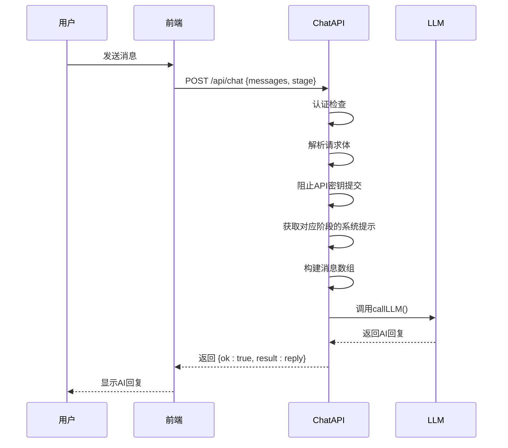
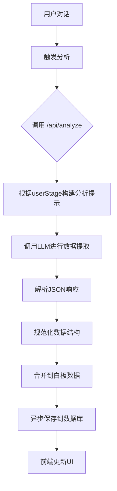
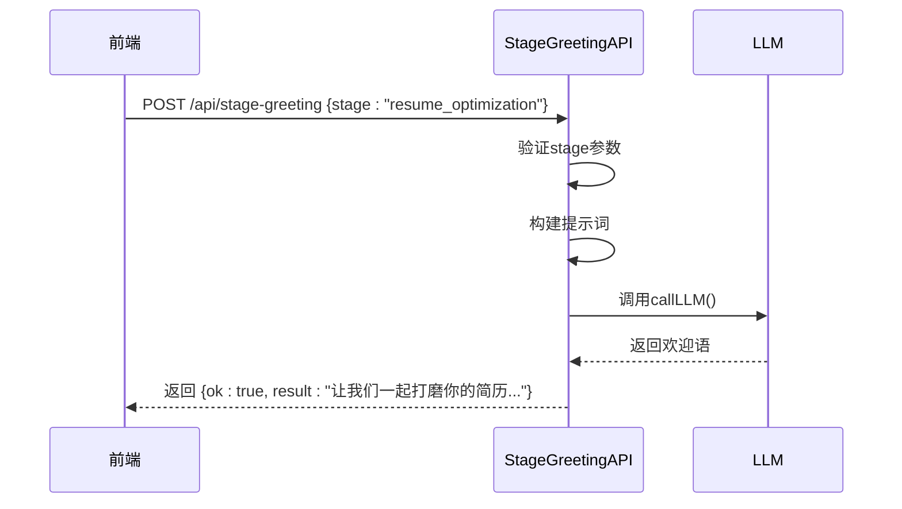

# 其他辅助API

<cite>
**本文档引用的文件**  
- [chat\route.ts](file://app/api/chat/route.ts)
- [analyze\route.ts](file://app/api/analyze/route.ts)
- [stage-greeting\route.ts](file://app/api/stage-greeting/route.ts)
- [health\route.ts](file://app/api/health/route.ts)
- [stage.ts](file://lib/stage.ts)
- [db.ts](file://lib/db.ts)
- [llm.ts](file://lib/llm.ts)
- [conversationStore.ts](file://lib/conversationStore.ts)
- [DEPLOY.md](file://DEPLOY.md)
- [app\api\README.md](file://app/api/README.md)
</cite>

## 目录
1. [介绍](#介绍)
2. [核心API功能分析](#核心api功能分析)
   1. [主聊天接口 (chat)](#主聊天接口-chat)
   2. [用户画像分析接口 (analyze)](#用户画像分析接口-analyze)
   3. [阶段问候语生成接口 (stage-greeting)](#阶段问候语生成接口-stage-greeting)
   4. [健康检查接口 (health)](#健康检查接口-health)
3. [API调用频率与缓存策略](#api调用频率与缓存策略)
4. [在用户旅程中的作用](#在用户旅程中的作用)
5. [部署与监控](#部署与监控)

## 介绍

本文档详细说明AI求职教练项目中的其他核心辅助API，包括主聊天接口`chat`、用户画像分析`analyze`、阶段问候语生成`stage-greeting`及健康检查`health`。这些API构成了系统的核心功能，支持用户在求职旅程中的各个阶段，从职业规划到Offer评估。文档将详细描述每个API的功能、实现逻辑、调用方式及其在整体系统中的作用。

**Section sources**
- [app\api\README.md](file://app/api/README.md#L1-L10)

## 核心API功能分析

### 主聊天接口 (chat)

主聊天接口`chat`是系统的默认对话入口，负责处理用户与AI教练之间的所有对话交互。该接口根据用户当前所处的求职阶段（如职业规划、简历优化等）动态调整AI的对话策略和系统提示（system prompt），确保对话内容与用户当前需求高度相关。

接口通过`POST`方法接收包含用户消息和阶段信息的请求体，首先进行用户认证检查，然后根据`userStage`参数从预定义的`STAGE_PROMPTS`映射中获取相应的系统提示。这些提示定义了AI在不同阶段的角色设定、核心指令和交互逻辑，例如在职业规划阶段，AI扮演"温柔、睿智且专业的职业咨询师"，使用短句和emoji来营造亲切的对话氛围。

消息处理流程包括：验证JSON格式、阻止前端提交LLM密钥、过滤非法消息项、构建包含系统提示和用户消息的消息数组，最后调用`callLLM`函数与大语言模型交互并返回AI的回复。



**Diagram sources**
- [chat\route.ts](file://app/api/chat/route.ts#L1-L238)

**Section sources**
- [chat\route.ts](file://app/api/chat/route.ts#L1-L238)

### 用户画像分析接口 (analyze)

用户画像分析接口`analyze`是一个强大的数据提取和结构化工具，它基于用户的对话历史和简历项目数据，自动生成职业洞察并更新用户的"白板"（whiteboard）数据。该接口是实现个性化辅导和进度追踪的核心。

接口接收包含对话消息、用户阶段和会话ID的请求体。其核心逻辑是根据`userStage`参数构建一个特定的分析提示（analysis prompt），该提示指令LLM从对话中提取与当前阶段相关的结构化信息。例如，在`career_planning`阶段，它会提取用户的意向岗位和核心技能；在`project_review`阶段，它会提取符合STAR法则的项目经历。

分析结果以严格的JSON格式返回，包含`intentRole`、`keySkills`、`starProjects`、`resumeInsights`等字段。这些数据随后被合并到用户的白板状态中，并通过`saveWhiteboard`函数异步保存到数据库，实现了用户画像的持续更新和持久化。



**Diagram sources**
- [analyze\route.ts](file://app/api/analyze/route.ts#L1-L448)
- [db.ts](file://lib/db.ts#L144-L188)

**Section sources**
- [analyze\route.ts](file://app/api/analyze/route.ts#L1-L448)
- [db.ts](file://lib/db.ts#L144-L188)
- [conversationStore.ts](file://lib/conversationStore.ts#L75-L121)

### 阶段问候语生成接口 (stage-greeting)

阶段问候语生成接口`stage-greeting`负责为用户在进入新阶段时生成个性化、自然友好的欢迎语。这增强了用户体验，使AI教练的引导更加人性化和流畅。

该接口接收一个包含`stage`字段的POST请求。它使用一个简洁的提示词，要求LLM扮演"专业职业教练"，为指定阶段生成一句简短、有温度的开场白。例如，当用户进入"简历优化"阶段时，AI可能会生成"让我们一起打磨你的简历，让它闪闪发光吧！✨"。

此接口的实现非常高效，它不依赖于复杂的上下文，而是通过一个通用的系统提示和用户提供的阶段名称，直接生成符合品牌调性的欢迎语，确保了响应的快速和一致性。



**Diagram sources**
- [stage-greeting\route.ts](file://app/api/stage-greeting/route.ts#L1-L71)

**Section sources**
- [stage-greeting\route.ts](file://app/api/stage-greeting/route.ts#L1-L71)

### 健康检查接口 (health)

健康检查接口`health`是一个用于部署监控和系统调试的简单但关键的端点。它通过一个无参数的`GET`请求，返回一个表示系统基本运行状态的JSON响应。

该接口的实现极其简洁，仅返回`{ ok: true }`，表明API服务器正在运行且可以响应请求。尽管它不进行复杂的系统检测（如数据库连接或LLM服务可用性），但在当前代码中，它作为部署平台（如Railway）进行健康检查的标准方式，用于判断应用实例是否存活。

根据部署文档，该接口是生产环境检查清单中的重要一环，通过`curl`命令测试此端点是验证部署成功与否的首要步骤。

```mermaid
flowchart LR
A[监控系统] --> B(GET /api/health)
B --> C{Health API}
C --> D[返回 {ok: true}]
D --> E[监控系统: 状态正常]
```

**Diagram sources**
- [health\route.ts](file://app/api/health/route.ts#L1-L15)

**Section sources**
- [health\route.ts](file://app/api/health/route.ts#L1-L15)
- [DEPLOY.md](file://DEPLOY.md#L98-L101)

## API调用频率与缓存策略

本系统目前未在API层面实现显式的调用频率限制（rate limiting），其稳定性主要依赖于底层LLM服务提供商的配额和速率限制。然而，系统通过前端的防抖（debounce）机制实现了间接的调用控制。

对于`analyze`接口，前端在用户每次发送消息后，会启动一个1秒的防抖定时器。这意味着在用户连续输入时，分析请求不会被频繁触发，而是在用户停止输入约1秒后才发送。这有效减少了对LLM和数据库的不必要调用，优化了性能和成本。

在缓存策略方面，系统采用了多层数据持久化方案：
1.  **内存缓存**：使用`conversationStore`在客户端内存中管理各阶段的对话历史。
2.  **本地存储**：将对话历史和白板数据同步到浏览器的`localStorage`，确保页面刷新后数据不丢失。
3.  **数据库持久化**：通过`saveWhiteboard`等函数，将关键的用户画像数据（如项目经历、简历建议）异步保存到Supabase数据库，实现跨设备的数据同步和长期存储。

这种策略平衡了响应速度和数据可靠性，确保了良好的用户体验。

**Section sources**
- [app\chat\page.tsx](file://app/chat/page.tsx#L572-L663)
- [conversationStore.ts](file://lib/conversationStore.ts#L186-L193)
- [db.ts](file://lib/db.ts#L144-L188)

## 在用户旅程中的作用

这些辅助API共同构成了AI求职教练的核心引擎，贯穿用户的整个求职旅程。

`chat`接口是用户交互的主入口，它根据用户所处的阶段（由`stage.ts`中的`UserStage`类型定义）提供定制化的对话体验，引导用户完成从职业规划到薪资谈判的每一步。

`analyze`接口则扮演了"幕后大脑"的角色。它持续分析对话内容，自动提取和结构化关键信息（如用户的意向岗位、项目成果），并更新用户的数字白板。这使得系统能够记住用户的进展，并在后续对话中提供连贯、个性化的建议，极大地提升了辅导的深度和效率。

`stage-greeting`接口增强了用户体验的流畅性。当用户在`StageSelector`组件中切换到新阶段时，该接口会生成一个温暖的欢迎语，平滑地过渡到新的对话主题，使整个流程感觉更加自然和人性化。

最后，`health`接口作为系统的"生命体征监测器"，为运维和部署提供了基础保障。它确保了服务的可用性，是自动化监控和CI/CD流程中不可或缺的一环。

**Section sources**
- [stage.ts](file://lib/stage.ts#L6-L13)
- [app\chat\page.tsx](file://app/chat/page.tsx#L486-L659)
- [components\StageSelector.tsx](file://components/StageSelector.tsx#L187-L192)

## 部署与监控

系统的部署和监控高度依赖`health`接口。根据`DEPLOY.md`文档，部署到Railway平台后，首要的验证步骤就是通过`curl`命令测试`/api/health`端点。一个成功的响应（`{"ok":true}`）是确认应用实例已成功启动并可访问的标志。

此外，部署文档还列出了测试`/api/chat`和`/api/parse-resume`等核心API的命令，形成了一个完整的生产环境检查清单。虽然`health`接口本身不检测数据库或LLM服务，但它作为最基础的健康信号，是整个监控体系的起点。如果此接口失败，则表明服务器进程已崩溃，需要立即介入。

**Section sources**
- [DEPLOY.md](file://DEPLOY.md#L98-L107)
- [app\api\README.md](file://app/api/README.md#L1168-L1197)