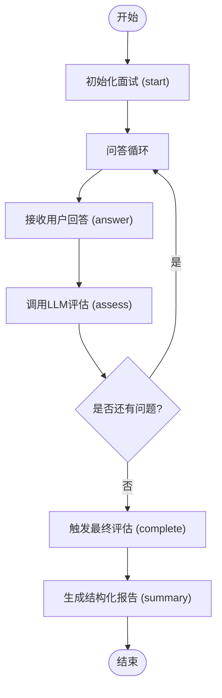
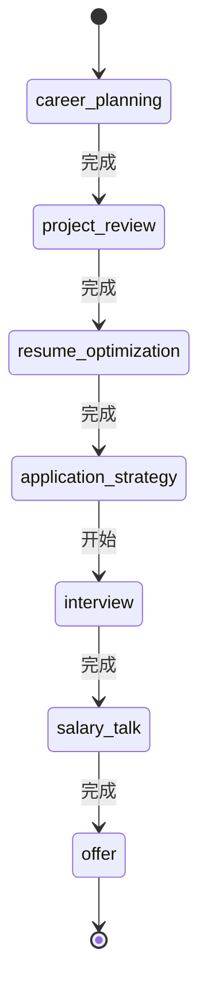
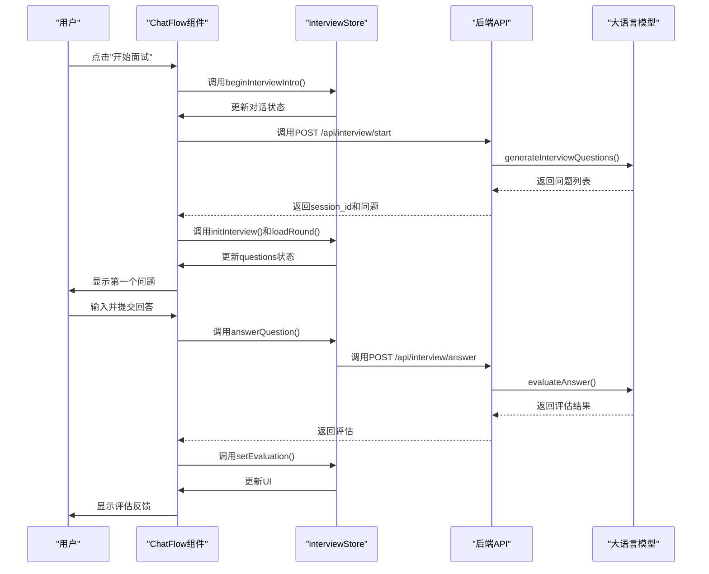

# 模拟面试系统API

<cite>
**本文档引用文件**   
- [interview/route.ts](file://app/api/interview/route.ts)
- [interview/start/route.ts](file://app/api/interview/start/route.ts)
- [interview/answer/route.ts](file://app/api/interview/answer/route.ts)
- [interview/assess/route.ts](file://app/api/interview/assess/route.ts)
- [interview/complete/route.ts](file://app/api/interview/complete/route.ts)
- [interview/summary/route.ts](file://app/api/interview/summary/route.ts)
- [interview/types.ts](file://lib/interview/types.ts)
- [conversationStore.ts](file://lib/conversationStore.ts)
- [stageAgent.ts](file://lib/orchestrator/stageAgent.ts)
- [llm.ts](file://lib/interview/llm.ts)
- [ChatFlow.tsx](file://components/ChatFlow.tsx)
- [interviewStore.tsx](file://store/interviewStore.tsx)
- [stage.ts](file://lib/stage.ts)
</cite>

## 目录
1. [API概览](#api概览)
2. [核心流程详解](#核心流程详解)
3. [接口详细说明](#接口详细说明)
4. [状态管理机制](#状态管理机制)
5. [评分标准与评估逻辑](#评分标准与评估逻辑)
6. [超时与错误处理](#超时与错误处理)
7. [与ChatFlow组件的交互](#与chatflow组件的交互)

## API概览

模拟面试系统提供了一套完整的RESTful API，用于支持从面试初始化到最终报告生成的完整流程。系统通过一系列API端点协调面试流程，包括`start`、`answer`、`assess`、`complete`和`summary`等关键操作。这些API共同构成了一个闭环的面试体验，允许用户进行多轮次的模拟面试，并获得详细的反馈和总结。

系统采用分层架构，前端通过`ChatFlow`组件与后端API进行交互，后端则利用`stageAgent`状态机和`conversationStore`对话存储来管理面试状态和上下文。所有与大语言模型（LLM）的交互都被封装在`llm.ts`模块中，确保了业务逻辑与AI能力的解耦。

**Section sources**
- [interview/route.ts](file://app/api/interview/route.ts)
- [interview/types.ts](file://lib/interview/types.ts)
- [ChatFlow.tsx](file://components/ChatFlow.tsx)

## 核心流程详解

模拟面试的核心流程遵循一个清晰的生命周期，从用户发起面试请求开始，到最终生成结构化报告结束。整个流程可以分为四个主要阶段：初始化、问答交互、最终评估和报告生成。



**Diagram sources**
- [interview/start/route.ts](file://app/api/interview/start/route.ts)
- [interview/answer/route.ts](file://app/api/interview/answer/route.ts)
- [interview/complete/route.ts](file://app/api/interview/complete/route.ts)
- [interview/summary/route.ts](file://app/api/interview/summary/route.ts)

### 初始化阶段

面试流程始于`start`接口的调用。当用户在前端点击“开始面试”时，`interviewStore`会调用`start` API，传递职位描述（JD）、面试轮次类型（如“业务面”、“技术面”）和问题数量等参数。后端接收到请求后，首先进行用户鉴权，然后在数据库中创建一个新的面试会话记录，并生成一个唯一的`session_id`。

随后，系统调用`generateInterviewQuestions`函数，该函数会根据提供的JD和轮次类型，通过LLM生成一组针对性的面试问题。这些问题不仅包含问题文本，还附带了详细的提示信息（TIPS），如考察意图、关键要点和回答框架。生成的问题会被保存到数据库，并随`session_id`一起返回给前端，标志着面试初始化的完成。

**Section sources**
- [interview/start/route.ts](file://app/api/interview/start/route.ts)
- [interview/llm.ts](file://lib/interview/llm.ts)
- [interviewStore.tsx](file://store/interviewStore.tsx)

### 问答与评估阶段

初始化完成后，系统进入问答交互阶段。用户每回答一个问题，前端就会调用`answer`接口。该接口接收`session_id`、`question_id`和用户的回答内容。后端首先验证会话和问题的归属，然后调用`evaluateAnswer`函数。

`evaluateAnswer`是评估逻辑的核心，它会将问题、JD、用户回答和轮次类型打包，发送给LLM进行多维度评分。LLM会从准确性、完整性、逻辑性和表达清晰度等多个维度进行分析，并生成详细的反馈和改进建议。评估结果被保存到数据库，并立即返回给前端，为用户提供即时反馈。

**Section sources**
- [interview/answer/route.ts](file://app/api/interview/answer/route.ts)
- [interview/llm.ts](file://lib/interview/llm.ts)

### 最终评估与报告生成

当用户回答完所有预设问题或主动选择结束面试时，`complete`接口被触发。该接口会查询数据库，获取该`session_id`下所有的回答和评估结果。然后，`summarizeInterview`函数被调用，它会综合所有单题的评估结果，生成一份全面的面试总结报告。

这份报告包含综合得分、优势表现、薄弱环节和具体的改进建议。报告生成后，其ID和内容会被返回给前端。用户之后可以通过`summary`接口，仅凭`session_id`来重新获取这份报告，便于后续回顾和分享。

**Section sources**
- [interview/complete/route.ts](file://app/api/interview/complete/route.ts)
- [interview/summary/route.ts](file://app/api/interview/summary/route.ts)
- [interview/llm.ts](file://lib/interview/llm.ts)

## 接口详细说明

本节详细描述了模拟面试系统中各个核心API的请求和响应格式。

### start: 初始化面试

此接口用于创建新的面试会话并生成面试题目。

**请求**
- **方法**: `POST`
- **路径**: `/api/interview/start`
- **请求体**:
```json
{
  "jd": "产品经理岗位描述...",
  "roundType": "业务面",
  "questionCount": 5
}
```

**响应**
- **成功 (200)**:
```json
{
  "session_id": "uuid-123",
  "questions": [
    {
      "id": "q-1",
      "session_id": "uuid-123",
      "question_text": "请介绍一下你最近负责的一个产品项目...",
      "tips": {
        "intent": "考察产品思维、项目管理和结果导向能力",
        "keyPoints": ["项目背景和目标要清晰", "突出个人在项目中的核心贡献"],
        "framework": "背景 → 目标 → 我的角色 → 关键决策 → 执行过程 → 结果指标"
      }
    }
  ]
}
```

**Section sources**
- [interview/start/route.ts](file://app/api/interview/start/route.ts)
- [interview/types.ts](file://lib/interview/types.ts)

### answer: 提交答案并获得评价

此接口用于提交用户对单个问题的回答，并获取AI的评估。

**请求**
- **方法**: `POST`
- **路径**: `/api/interview/answer`
- **请求体**:
```json
{
  "session_id": "uuid-123",
  "question_id": "q-1",
  "answer": "我最近负责了一个用户增长项目..."
}
```

**响应**
- **成功 (200)**:
```json
{
  "question_id": "q-1",
  "assessment": {
    "accuracy": 75,
    "grammar": 80,
    "detail": 70,
    "confidence": 85,
    "tips": "回答很好，数据支撑充分。建议在逻辑结构上可以更清晰一些。",
    "exemplarAnswer": "这是一个示范回答..."
  }
}
```

**Section sources**
- [interview/answer/route.ts](file://app/api/interview/answer/route.ts)
- [interview/types.ts](file://lib/interview/types.ts)

### complete: 完成面试并生成总结

此接口用于完成当前面试会话，并触发最终总结报告的生成。

**请求**
- **方法**: `POST`
- **路径**: `/api/interview/complete`
- **请求体**:
```json
{
  "session_id": "uuid-123"
}
```

**响应**
- **成功 (200)**:
```json
{
  "type": "session-summary",
  "payload": {
    "session_id": "uuid-123",
    "summary": {
      "overallScore": 85,
      "strengths": ["表达清晰", "思路完整"],
      "weaknesses": ["缺少量化指标", "项目细节不足"],
      "suggestions": ["补充数据指标", "提前准备关键案例"]
    }
  }
}
```

**Section sources**
- [interview/complete/route.ts](file://app/api/interview/complete/route.ts)
- [interview/types.ts](file://lib/interview/types.ts)

### summary: 获取面试总结

此接口用于根据`session_id`获取已生成的面试总结报告。

**请求**
- **方法**: `GET`
- **路径**: `/api/interview/summary?session_id=uuid-123`

**响应**
- **成功 (200)**:
```json
{
  "session_id": "uuid-123",
  "overallScore": 85,
  "strengths": ["表达清晰", "思路完整"],
  "weaknesses": ["缺少量化指标", "项目细节不足"],
  "suggestions": ["补充数据指标", "提前准备关键案例"]
}
```

**Section sources**
- [interview/summary/route.ts](file://app/api/interview/summary/route.ts)
- [interview/types.ts](file://lib/interview/types.ts)

## 状态管理机制

系统的状态管理由`stageAgent`状态机和`conversationStore`对话存储共同实现，确保了面试流程的连贯性和上下文的持久性。

### stageAgent状态机

`stageAgent`是系统的核心状态机，它定义了用户在求职流程中的不同阶段，如`career_planning`（职业规划）、`project_review`（项目梳理）和`interview`（模拟面试）等。它通过`runStageModel`函数，根据当前阶段路由到相应的处理逻辑。

在模拟面试场景中，`stageAgent`确保了只有当用户处于`interview`阶段时，相关的面试API才能被正确调用。它还负责管理阶段间的跳转逻辑，例如，在完成简历优化后，自动引导用户进入模拟面试阶段。



**Diagram sources**
- [stageAgent.ts](file://lib/orchestrator/stageAgent.ts)
- [stage.ts](file://lib/stage.ts)

### conversationStore对话存储

`conversationStore`负责维护用户在各个阶段的对话历史。它是一个基于React Context的全局状态管理器，为`ChatFlow`组件提供数据支持。

该存储器将对话按`UserStage`进行分组，确保了不同阶段的对话不会混淆。当用户在模拟面试中回答问题时，`conversationStore`会将用户和AI的消息按时间顺序记录下来。这些历史记录不仅用于前端展示，还会在调用`assess`和`complete`接口时，作为上下文传递给LLM，使评估更加连贯和准确。

**Section sources**
- [conversationStore.ts](file://lib/conversationStore.ts)
- [ChatFlow.tsx](file://components/ChatFlow.tsx)
- [interviewStore.tsx](file://store/interviewStore.tsx)

## 评分标准与评估逻辑

系统的评估逻辑分为两个层面：单题评估和最终总结。

### 单题评估维度

当调用`assess`或`answer`接口时，LLM会从以下四个核心维度对用户的回答进行评分（0-100分）：

| 评估维度 | 说明 |
| :--- | :--- |
| **准确性** | 回答是否切题，信息是否准确，是否回答了问题的核心。 |
| **语法** | 表达是否流畅，语法是否正确，用词是否恰当。 |
| **细节** | 回答是否充分，是否有具体细节，是否有数据支撑。 |
| **自信度** | 表达是否自信，是否有说服力，语气是否坚定。 |

此外，系统还会生成“改进建议”和“示范回答”，为用户提供具体的优化方向。

**Section sources**
- [interview/assess/route.ts](file://app/api/interview/assess/route.ts)
- [interview/llm.ts](file://lib/interview/llm.ts)

### 最终总结生成

`summarizeInterview`函数会综合所有单题的评估结果，计算出一个综合得分，并提炼出整体的优势、薄弱环节和建议。这个过程不仅仅是简单的分数平均，而是LLM对整个面试表现的深度分析和归纳。

## 超时与错误处理

系统实现了完善的超时和错误处理策略，以保障用户体验。

- **超时处理**：所有调用LLM的API（如`start`、`answer`、`complete`）都设置了较长的超时时间（30-60秒），以应对LLM生成内容可能需要的较长时间。前端会显示加载动画，避免用户误操作。
- **降级策略**：当LLM服务不可用或API密钥缺失时，系统会自动降级到`stub`模式。在`stub`模式下，系统会返回预设的、基于规则的模拟数据，确保核心功能依然可用。
- **错误响应**：所有API都遵循统一的错误响应格式，返回`4xx`或`5xx`状态码及详细的错误信息，便于前端进行错误提示和日志记录。

**Section sources**
- [interview/route.ts](file://app/api/interview/route.ts)
- [interview/llm.ts](file://lib/interview/llm.ts)

## 与ChatFlow组件的交互

`ChatFlow`是前端的核心UI组件，它与后端API和状态管理器紧密协作，为用户提供流畅的对话式面试体验。



**Diagram sources**
- [ChatFlow.tsx](file://components/ChatFlow.tsx)
- [interviewStore.tsx](file://store/interviewStore.tsx)
- [interview/answer/route.ts](file://app/api/interview/answer/route.ts)
- [interview/llm.ts](file://lib/interview/llm.ts)

`ChatFlow`通过`useInterviewStore` Hook订阅`interviewStore`的状态变化，当`questions`或`conversation`更新时，它会自动重新渲染，向用户展示最新的问题和反馈。这种基于状态的驱动模式，使得UI与业务逻辑高度解耦，易于维护和扩展。