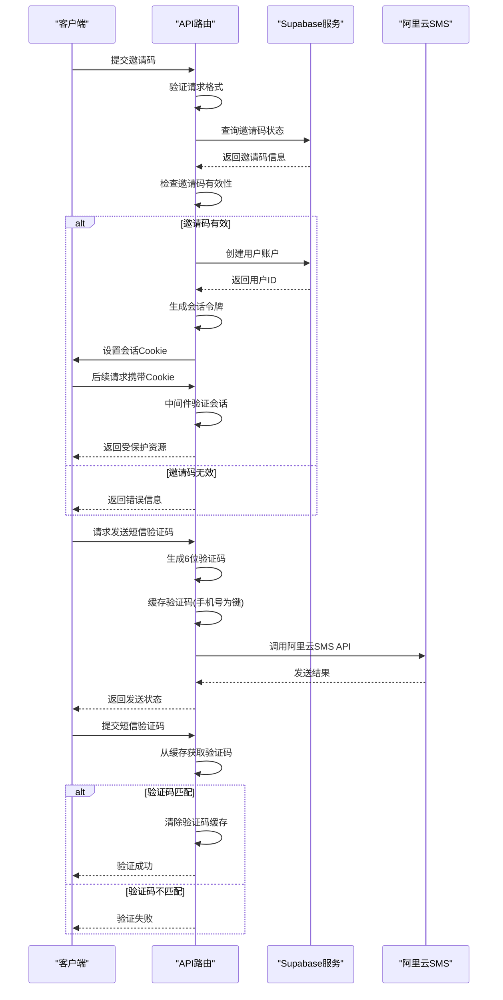
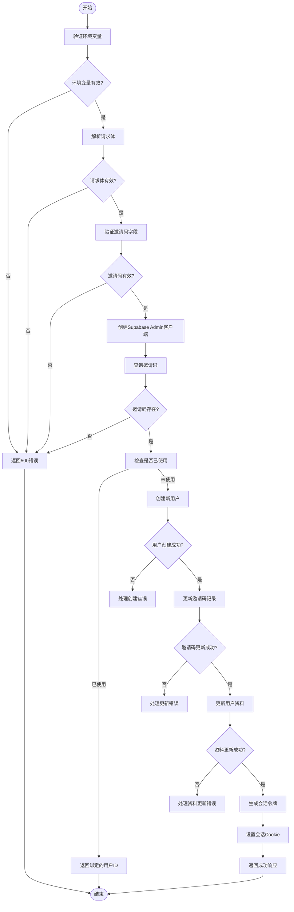
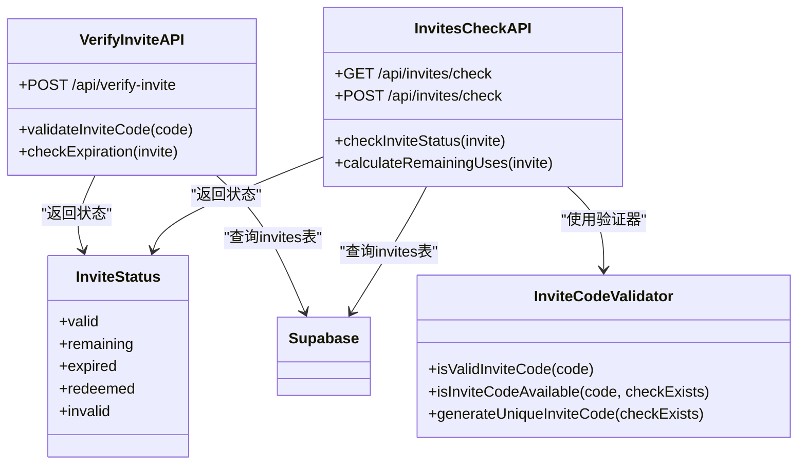
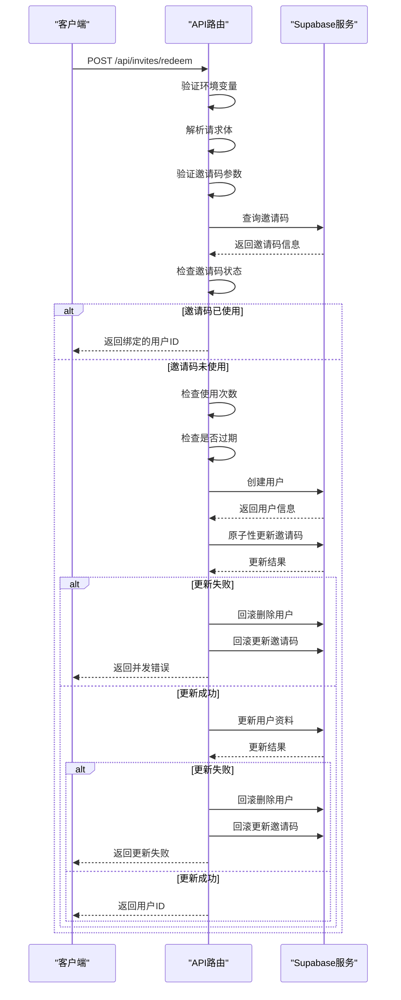
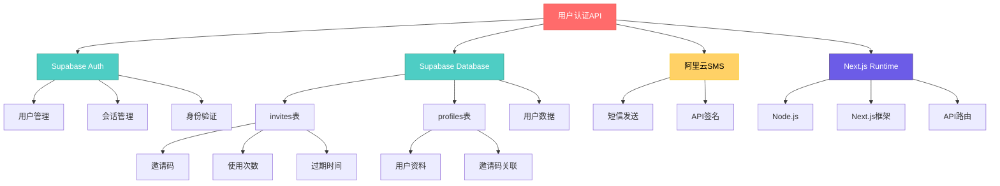

# 用户认证API

<cite>
**本文档引用的文件**  
- [create-session/route.ts](file://app/api/auth/create-session/route.ts)
- [verify/route.ts](file://app/api/verify/route.ts)
- [verify-invite/route.ts](file://app/api/verify-invite/route.ts)
- [invites/check/route.ts](file://app/api/invites/check/route.ts)
- [invites/redeem/route.ts](file://app/api/invites/redeem/route.ts)
- [sms/route.ts](file://app/api/sms/route.ts)
- [sms/utils.ts](file://app/api/sms/utils.ts)
- [load-session/route.ts](file://app/api/load-session/route.ts)
- [auth.ts](file://lib/auth.ts)
- [useAuth.ts](file://lib/useAuth.ts)
- [middleware.ts](file://middleware.ts)
- [inviteCode.ts](file://lib/inviteCode.ts)
- [login/page.tsx](file://app/login/page.tsx)
- [register/page.tsx](file://app/register/page.tsx)
- [RegisterForm.tsx](file://components/RegisterForm.tsx)
</cite>

## 目录
1. [简介](#简介)
2. [项目结构](#项目结构)
3. [核心组件](#核心组件)
4. [架构概述](#架构概述)
5. [详细组件分析](#详细组件分析)
6. [依赖分析](#依赖分析)
7. [性能考虑](#性能考虑)
8. [故障排除指南](#故障排除指南)
9. [结论](#结论)

## 简介
本文档详细介绍了AI求职教练项目的用户认证API系统，涵盖注册会话、身份验证、邀请码验证与短信服务等核心功能。系统基于Next.js和Supabase构建，采用多层安全验证机制，确保用户身份的合法性和系统的安全性。文档将深入分析create-session如何结合Supabase Auth创建用户会话，verify与verify-invite的JWT验证机制，以及invites/check和redeem的邀请码状态校验流程。同时，将详细解析SMS发送接口的实现逻辑及其在用户注册中的作用，并结合代码示例说明中间件拦截、错误处理、速率限制等安全措施。

## 项目结构
用户认证API位于`app/api`目录下，采用Next.js App Router的路由处理模式。系统通过模块化设计将不同功能分离，确保代码的可维护性和可扩展性。

```mermaid
graph TB
subgraph "API Endpoints"
A[/api/auth/create-session] --> |创建用户会话| B[Supabase Auth]
C[/api/verify] --> |验证短信验证码| D[SMS缓存]
E[/api/verify-invite] --> |验证邀请码有效性| F[Supabase invites表]
G[/api/invites/check] --> |检查邀请码状态| F
H[/api/invites/redeem] --> |兑换邀请码| F
I[/api/sms] --> |发送短信验证码| J[阿里云SMS]
K[/api/load-session] --> |加载当前用户| B
end
subgraph "辅助模块"
L[lib/auth.ts] --> |用户认证工具| B
M[lib/useAuth.ts] --> |客户端认证检查| N[浏览器Cookie]
O[middleware.ts] --> |全局认证拦截| P[受保护路由]
end
Q[前端页面] --> A
Q --> C
Q --> G
Q --> H
Q --> I
B --> |用户数据| R[Supabase profiles表]
F --> |邀请码数据| S[Supabase数据库]
style A fill:#4CAF50,stroke:#388E3C,color:white
style C fill:#2196F3,stroke:#1976D2,color:white
style E fill:#2196F3,stroke:#1976D2,color:white
style G fill:#2196F3,stroke:#1976D2,color:white
style H fill:#2196F3,stroke:#1976D2,color:white
style I fill:#FF9800,stroke:#F57C00,color:white
style K fill:#9C27B0,stroke:#7B1FA2,color:white
```

**图源**  
- [create-session/route.ts](file://app/api/auth/create-session/route.ts)
- [verify/route.ts](file://app/api/verify/route.ts)
- [verify-invite/route.ts](file://app/api/verify-invite/route.ts)
- [invites/check/route.ts](file://app/api/invites/check/route.ts)
- [invites/redeem/route.ts](file://app/api/invites/redeem/route.ts)
- [sms/route.ts](file://app/api/sms/route.ts)
- [load-session/route.ts](file://app/api/load-session/route.ts)
- [middleware.ts](file://middleware.ts)

**章节来源**  
- [app/api](file://app/api#L1-L50)
- [lib](file://lib#L1-L30)

## 核心组件
用户认证系统由多个核心组件构成，包括会话创建、邀请码验证、短信服务和全局中间件。`create-session`组件负责在邀请码验证后创建Supabase会话并设置cookie，`verify`和`verify-invite`组件分别处理短信验证码和邀请码的验证，`invites/check`和`redeem`组件管理邀请码的状态校验和兑换流程。`sms`组件集成阿里云短信服务，实现验证码的发送功能。全局`middleware`组件拦截所有受保护路由的请求，确保用户已通过身份验证。

**章节来源**  
- [create-session/route.ts](file://app/api/auth/create-session/route.ts#L1-L219)
- [verify/route.ts](file://app/api/verify/route.ts#L1-L39)
- [verify-invite/route.ts](file://app/api/verify-invite/route.ts#L1-L149)
- [invites/check/route.ts](file://app/api/invites/check/route.ts#L1-L306)
- [invites/redeem/route.ts](file://app/api/invites/redeem/route.ts#L1-L317)
- [sms/route.ts](file://app/api/sms/route.ts#L1-L123)
- [middleware.ts](file://middleware.ts#L1-L170)

## 架构概述
用户认证系统采用分层架构设计，从前端页面到后端API再到数据库和第三方服务，形成完整的认证流程。系统通过Next.js的API路由处理HTTP请求，利用Supabase作为身份验证和数据存储的核心服务，同时集成阿里云短信服务提供验证码功能。



**图源**  
- [create-session/route.ts](file://app/api/auth/create-session/route.ts#L1-L219)
- [verify/route.ts](file://app/api/verify/route.ts#L1-L39)
- [sms/route.ts](file://app/api/sms/route.ts#L1-L123)
- [middleware.ts](file://middleware.ts#L1-L170)

## 详细组件分析

### 会话创建分析
`create-session`组件是用户认证流程的核心，负责在邀请码验证后创建Supabase会话并设置cookie。该组件首先验证环境变量和请求体，然后使用Supabase Admin客户端查询邀请码信息。如果邀请码已被使用，则直接返回绑定的用户ID；否则创建新用户并更新邀请码使用记录。



**图源**  
- [create-session/route.ts](file://app/api/auth/create-session/route.ts#L1-L219)

**章节来源**  
- [create-session/route.ts](file://app/api/auth/create-session/route.ts#L1-L219)

### 邀请码验证分析
邀请码验证系统由`verify-invite`和`invites/check`两个组件构成，分别提供简化版和完整版的验证功能。`verify-invite`仅检查邀请码的存在性和过期时间，而`invites/check`则全面检查邀请码的状态，包括是否已使用、是否过期、剩余使用次数等。



**图源**  
- [verify-invite/route.ts](file://app/api/verify-invite/route.ts#L1-L149)
- [invites/check/route.ts](file://app/api/invites/check/route.ts#L1-L306)
- [inviteCode.ts](file://lib/inviteCode.ts#L1-L84)

**章节来源**  
- [verify-invite/route.ts](file://app/api/verify-invite/route.ts#L1-L149)
- [invites/check/route.ts](file://app/api/invites/check/route.ts#L1-L306)
- [inviteCode.ts](file://lib/inviteCode.ts#L1-L84)

### 短信服务分析
短信服务组件`sms/route.ts`负责生成和发送验证码，`sms/utils.ts`提供验证码的缓存管理功能。系统使用内存缓存存储验证码，设置5分钟的有效期，确保验证码的安全性。

```mermaid
flowchart LR
A[客户端] --> B[发送短信请求]
B --> C{验证手机号}
C --> |无效| D[返回错误]
C --> |有效| E[生成6位验证码]
E --> F[缓存验证码]
F --> G[构建阿里云SMS请求]
G --> H[签名请求]
H --> I[发送HTTP请求]
I --> J{发送成功?}
J --> |否| K[返回发送失败]
J --> |是| L[返回发送成功]
D --> M[结束]
K --> M
L --> M
subgraph "缓存管理"
N[smsCache Map] --> O[getCachedCode(phone)]
N --> P[setCachedCode(phone, code)]
N --> Q[clearCachedCode(phone)]
end
subgraph "阿里云SMS"
R[AccessKeyId]
S[Signature]
T[TemplateParam]
U[PhoneNumbers]
end
F --> N
P --> N
O --> N
Q --> N
G --> R
G --> S
G --> T
G --> U
```

**图源**  
- [sms/route.ts](file://app/api/sms/route.ts#L1-L123)
- [sms/utils.ts](file://app/api/sms/utils.ts#L1-L42)

**章节来源**  
- [sms/route.ts](file://app/api/sms/route.ts#L1-L123)
- [sms/utils.ts](file://app/api/sms/utils.ts#L1-L42)

### 兑换流程分析
邀请码兑换流程`invites/redeem`是一个复杂的原子性操作，涉及用户创建、邀请码状态更新和用户资料更新等多个步骤。系统采用条件更新和错误回滚机制，确保操作的原子性和数据一致性。



**图源**  
- [invites/redeem/route.ts](file://app/api/invites/redeem/route.ts#L1-L317)

**章节来源**  
- [invites/redeem/route.ts](file://app/api/invites/redeem/route.ts#L1-L317)

## 依赖分析
用户认证系统依赖多个外部服务和库，形成复杂的依赖网络。系统通过环境变量配置外部服务的访问凭证，确保配置的安全性。



**图源**  
- [create-session/route.ts](file://app/api/auth/create-session/route.ts#L1-L219)
- [invites/redeem/route.ts](file://app/api/invites/redeem/route.ts#L1-L317)
- [sms/route.ts](file://app/api/sms/route.ts#L1-L123)
- [middleware.ts](file://middleware.ts#L1-L170)

**章节来源**  
- [create-session/route.ts](file://app/api/auth/create-session/route.ts#L1-L219)
- [invites/redeem/route.ts](file://app/api/invites/redeem/route.ts#L1-L317)
- [sms/route.ts](file://app/api/sms/route.ts#L1-L123)
- [middleware.ts](file://middleware.ts#L1-L170)

## 性能考虑
用户认证系统的性能主要受数据库查询、外部API调用和加密操作的影响。系统通过缓存验证码、使用Supabase Admin API批量操作和优化数据库查询来提高性能。

**章节来源**  
- [sms/utils.ts](file://app/api/sms/utils.ts#L1-L42)
- [middleware.ts](file://middleware.ts#L1-L170)
- [create-session/route.ts](file://app/api/auth/create-session/route.ts#L1-L219)

## 故障排除指南
### 403错误
403错误通常表示用户未通过身份验证或会话已失效。可能的原因包括：
- 会话Cookie已过期（有效期7天）
- 用户被注销或删除
- 浏览器Cookie被清除
- 中间件验证失败

**解决方案**：
1. 检查`sb-access-token`和`sb-session-user-id`Cookie是否存在
2. 尝试重新登录
3. 检查Supabase用户是否存在
4. 验证环境变量配置

### 会话失效
会话失效可能由以下原因引起：
- 会话令牌过期（7天有效期）
- 用户在其他设备上登录导致会话被替换
- 安全策略强制会话过期

**解决方案**：
1. 实现会话刷新机制
2. 增加会话过期前的提醒
3. 优化用户重新登录体验

### 邀请码相关问题
常见问题包括邀请码无效、已过期或使用次数已用完。

**解决方案**：
1. 使用`/api/invites/check`检查邀请码状态
2. 验证邀请码格式是否正确
3. 检查邀请码是否已过期
4. 确认邀请码使用次数限制

### 短信发送失败
短信发送失败可能由以下原因引起：
- 阿里云SMS配置错误
- 手机号格式不正确
- 短信模板问题
- 网络连接问题

**解决方案**：
1. 检查`ALIYUN_ACCESS_KEY_ID`等环境变量
2. 验证手机号格式
3. 检查短信模板代码
4. 查看API调用日志

**章节来源**  
- [middleware.ts](file://middleware.ts#L1-L170)
- [useAuth.ts](file://lib/useAuth.ts#L1-L59)
- [login/page.tsx](file://app/login/page.tsx#L1-L388)

## 结论
用户认证API系统通过精心设计的架构和安全机制，为AI求职教练项目提供了可靠的用户身份验证功能。系统采用分层设计，将不同功能模块分离，提高了代码的可维护性和可扩展性。通过Supabase和阿里云SMS的集成，实现了高效的用户管理和短信验证功能。中间件和客户端Hook的双重验证机制确保了系统的安全性。未来可以考虑增加会话刷新、多因素认证和更详细的错误日志等功能，进一步提升用户体验和系统安全性。