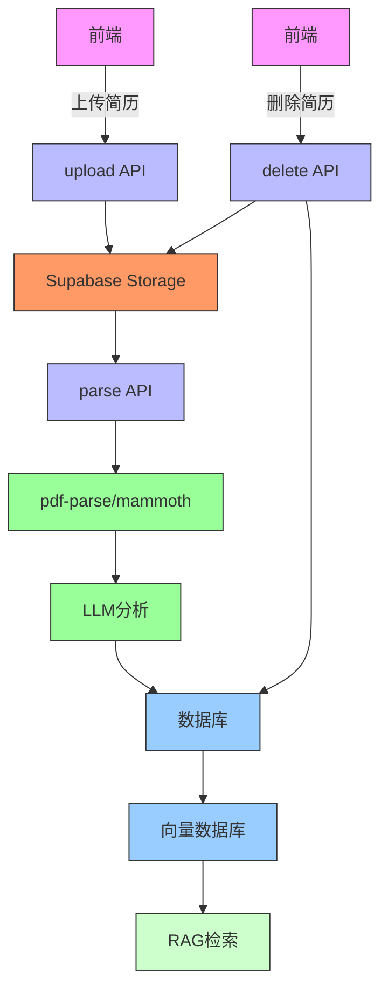
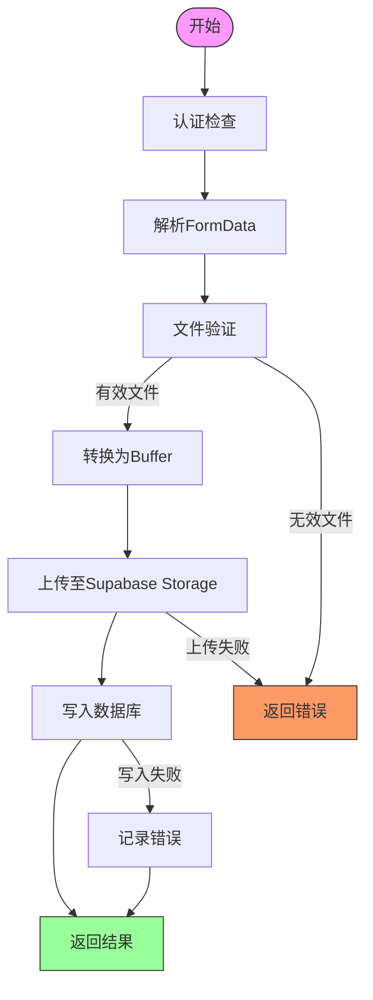
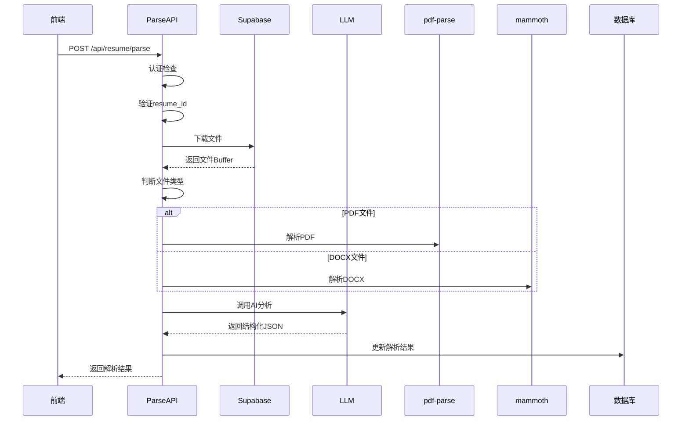
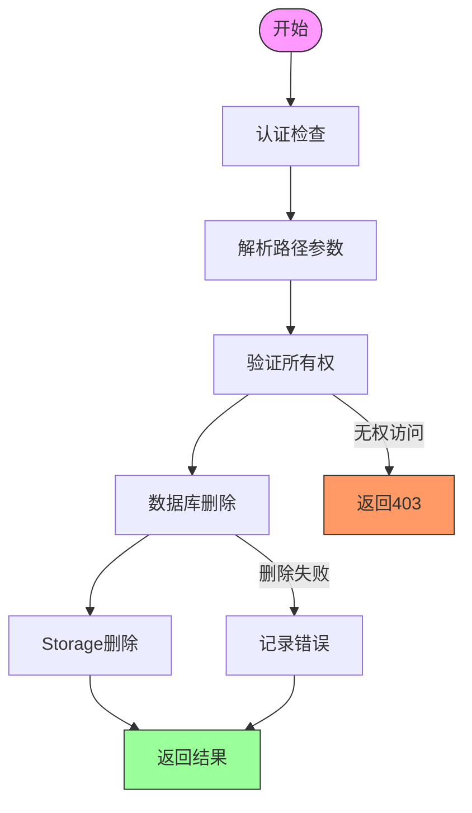
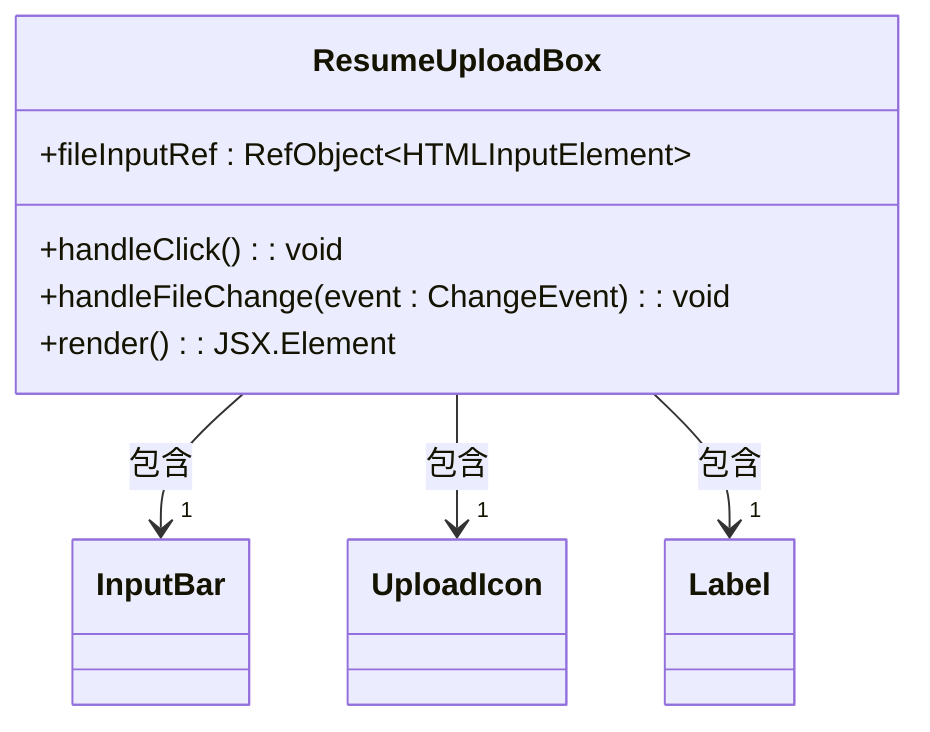
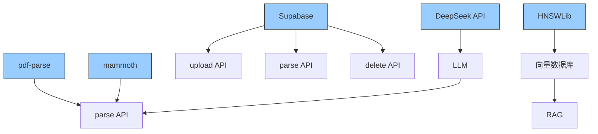

# 简历处理服务API

<cite>
**本文档引用文件**   
- [upload\route.ts](file://app/api/resume/upload/route.ts)
- [parse\route.ts](file://app/api/resume/parse/route.ts)
- [delete\[resume_id]\route.ts](file://app/api/resume/delete[resume_id]/route.ts)
- [ResumeUploadBox.tsx](file://components/resume/ResumeUploadBox.tsx)
- [db.ts](file://lib/db.ts)
- [llm.ts](file://lib/llm.ts)
- [parse_resume.ts](file://lib/chains/parse_resume.ts)
- [supabase\schema.sql](file://supabase/schema.sql)
- [hnswlib.ts](file://src/lib/vectorstore/hnswlib.ts)
- [ingest.ts](file://scripts/ingest.ts)
</cite>

## 目录
1. [简介](#简介)
2. [项目结构](#项目结构)
3. [核心组件](#核心组件)
4. [架构概述](#架构概述)
5. [详细组件分析](#详细组件分析)
6. [依赖分析](#依赖分析)
7. [性能考虑](#性能考虑)
8. [故障排除指南](#故障排除指南)
9. [结论](#结论)

## 简介
本项目是一个AI求职教练系统，专注于简历处理服务。系统提供简历上传、内容解析与删除功能，支持PDF和DOCX格式文件。上传的简历存储在Supabase Storage中，并通过AI进行结构化分析。解析结果用于支持RAG（检索增强生成）功能，为用户提供个性化的求职建议。

## 项目结构

```mermaid
graph TD
A[app] --> B[api]
B --> C[resume]
C --> D[upload]
C --> E[parse]
C --> F[delete[resume_id]]
A --> G[components]
G --> H[resume]
H --> I[ResumeUploadBox]
J[lib] --> K[db]
J --> L[llm]
J --> M[chains]
M --> N[parse_resume]
```

**图示来源**
- [app/api/resume/upload/route.ts](file://app/api/resume/upload/route.ts#L1-L154)
- [components/resume/ResumeUploadBox.tsx](file://components/resume/ResumeUploadBox.tsx#L1-L56)

## 核心组件

简历处理服务包含三个核心API端点：上传、解析和删除。上传功能接收PDF/DOCX文件并存储至Supabase Storage；解析功能调用pdf-parse与mammoth库提取文本，并通过LLM进行结构化处理；删除功能实现动态路径参数解析及数据库级联删除逻辑。

**组件来源**
- [app/api/resume/upload/route.ts](file://app/api/resume/upload/route.ts#L1-L154)
- [app/api/resume/parse/route.ts](file://app/api/resume/parse/route.ts#L1-L344)
- [app/api/resume/delete[resume_id]/route.ts](file://app/api/resume/delete[resume_id]/route.ts#L1-L50)

## 架构概述



**图示来源**
- [app/api/resume/upload/route.ts](file://app/api/resume/upload/route.ts#L1-L154)
- [app/api/resume/parse/route.ts](file://app/api/resume/parse/route.ts#L1-L344)
- [app/api/resume/delete[resume_id]/route.ts](file://app/api/resume/delete[resume_id]/route.ts#L1-L50)
- [lib/db.ts](file://lib/db.ts#L1-L327)
- [lib/llm.ts](file://lib/llm.ts#L1-L163)

## 详细组件分析

### 上传功能分析



**图示来源**
- [app/api/resume/upload/route.ts](file://app/api/resume/upload/route.ts#L1-L154)

**组件来源**
- [app/api/resume/upload/route.ts](file://app/api/resume/upload/route.ts#L1-L154)

### 解析功能分析



**图示来源**
- [app/api/resume/parse/route.ts](file://app/api/resume/parse/route.ts#L1-L344)
- [lib/llm.ts](file://lib/llm.ts#L1-L163)

**组件来源**
- [app/api/resume/parse/route.ts](file://app/api/resume/parse/route.ts#L1-L344)

### 删除功能分析



**图示来源**
- [app/api/resume/delete[resume_id]/route.ts](file://app/api/resume/delete[resume_id]/route.ts#L1-L50)

**组件来源**
- [app/api/resume/delete[resume_id]/route.ts](file://app/api/resume/delete[resume_id]/route.ts#L1-L50)

### 前端集成分析



**图示来源**
- [components/resume/ResumeUploadBox.tsx](file://components/resume/ResumeUploadBox.tsx#L1-L56)

**组件来源**
- [components/resume/ResumeUploadBox.tsx](file://components/resume/ResumeUploadBox.tsx#L1-L56)

## 依赖分析



**图示来源**
- [package-lock.json](file://package-lock.json#L1306-L1337)
- [app/api/resume/upload/route.ts](file://app/api/resume/upload/route.ts#L1-L154)
- [app/api/resume/parse/route.ts](file://app/api/resume/parse/route.ts#L1-L344)
- [lib/llm.ts](file://lib/llm.ts#L1-L163)
- [src/lib/vectorstore/hnswlib.ts](file://src/lib/vectorstore/hnswlib.ts#L1-L139)

**组件来源**
- [package-lock.json](file://package-lock.json#L1306-L1337)
- [app/api/resume/upload/route.ts](file://app/api/resume/upload/route.ts#L1-L154)
- [app/api/resume/parse/route.ts](file://app/api/resume/parse/route.ts#L1-L344)
- [lib/llm.ts](file://lib/llm.ts#L1-L163)

## 性能考虑

系统在处理大文件时需要考虑性能优化。上传功能限制文件大小为10MB，防止过大的文件影响系统性能。解析功能采用异步处理方式，避免阻塞主线程。对于LLM调用，设置了60秒超时和重试机制，确保在高负载情况下仍能稳定运行。

**组件来源**
- [app/api/resume/upload/route.ts](file://app/api/resume/upload/route.ts#L11)
- [app/api/resume/parse/route.ts](file://app/api/resume/parse/route.ts#L161)

## 故障排除指南

### 错误码说明
- **400**: 请求参数错误或文件格式不支持
- **401**: 未认证，需要登录
- **403**: 无权访问指定资源
- **404**: 指定的简历不存在
- **500**: 服务器内部错误，可能是Supabase配置缺失或数据库不可用

### 常见问题
1. **文件上传失败**: 检查Supabase配置是否正确，确保SUPABASE_URL和SUPABASE_SERVICE_ROLE_KEY环境变量已设置
2. **解析失败**: 确认文件为可编辑的PDF或DOCX格式，扫描版PDF无法提取文本
3. **LLM调用超时**: 检查DEEPSEEK_API_KEY是否正确配置，确认API配额充足

**组件来源**
- [app/api/resume/upload/route.ts](file://app/api/resume/upload/route.ts#L18-L21)
- [app/api/resume/parse/route.ts](file://app/api/resume/parse/route.ts#L207-L208)
- [app/api/resume/delete[resume_id]/route.ts](file://app/api/resume/delete[resume_id]/route.ts#L28-L29)

## 结论
简历处理服务实现了完整的上传、解析和删除功能，通过Supabase Storage和数据库的结合，确保了数据的安全性和持久性。利用LLM进行结构化分析，为后续的RAG检索提供了高质量的数据支持。系统设计考虑了性能和错误处理，能够稳定地处理用户请求。