# app 目录详解

<cite>
**本文档引用的文件**   
- [layout.tsx](file://app/layout.tsx)
- [providers.tsx](file://app/providers.tsx)
- [page.tsx](file://app/page.tsx)
- [chat/page.tsx](file://app/chat/page.tsx)
- [interview/start/page.tsx](file://app/interview/start/page.tsx)
- [onboarding/identity-select/page.tsx](file://app/onboarding/identity-select/page.tsx)
- [api/chat/route.ts](file://app/api/chat/route.ts)
- [store/interviewStore.tsx](file://store/interviewStore.tsx)
- [lib/stage.ts](file://lib/stage.ts)
- [lib/fsm.ts](file://lib/fsm.ts)
</cite>

## 目录
1. [引言](#引言)
2. [项目结构](#项目结构)
3. [核心组件](#核心组件)
4. [架构概述](#架构概述)
5. [详细组件分析](#详细组件分析)
6. [依赖分析](#依赖分析)
7. [性能考虑](#性能考虑)
8. [故障排除指南](#故障排除指南)
9. [结论](#结论)
10. [附录](#附录)（如有必要）

## 引言
本项目是一个基于Next.js App Router的AI求职助手应用，通过智能化的对话式交互帮助用户完成职业规划、简历优化、模拟面试等求职全流程。应用采用现代化的架构设计，充分利用Next.js App Router的特性，实现了清晰的路由分离、全局布局管理、状态注入和前后端一体化开发。

## 项目结构
该应用的`app`目录作为Next.js App Router的核心入口，组织了整个应用的页面和API路由。目录结构清晰地分离了不同功能模块，包括主交互界面、面试流程、用户引导等。

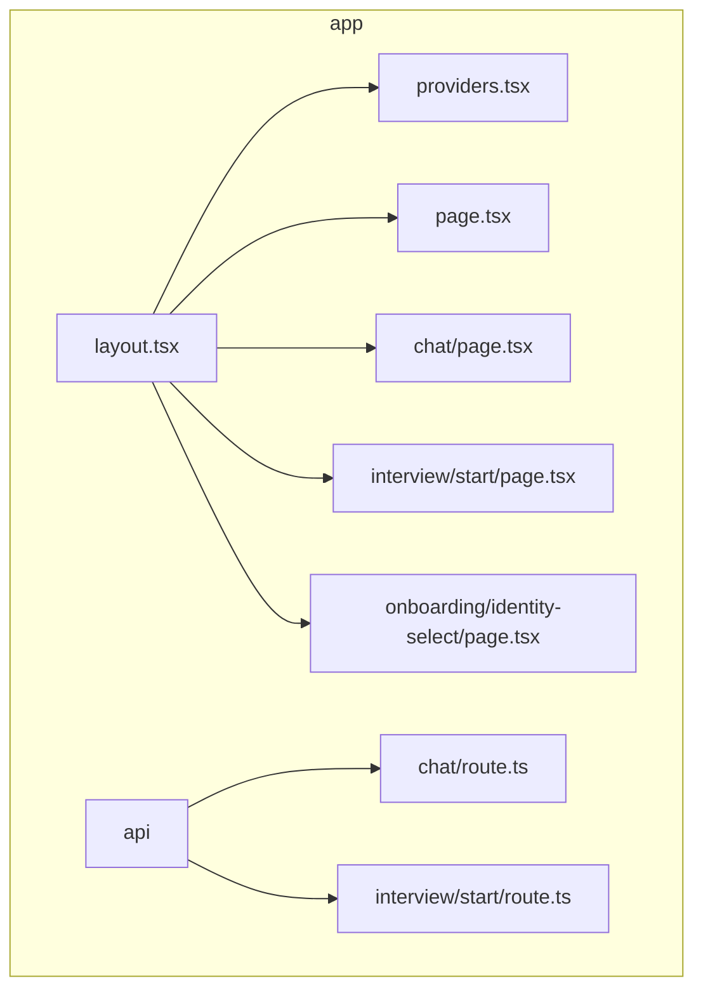

**图表来源**
- [layout.tsx](file://app/layout.tsx)
- [providers.tsx](file://app/providers.tsx)
- [page.tsx](file://app/page.tsx)
- [chat/page.tsx](file://app/chat/page.tsx)
- [interview/start/page.tsx](file://app/interview/start/page.tsx)
- [api/chat/route.ts](file://app/api/chat/route.ts)

**章节来源**
- [layout.tsx](file://app/layout.tsx)
- [providers.tsx](file://app/providers.tsx)
- [page.tsx](file://app/page.tsx)
- [chat/page.tsx](file://app/chat/page.tsx)
- [interview/start/page.tsx](file://app/interview/start/page.tsx)
- [api/chat/route.ts](file://app/api/chat/route.ts)

## 核心组件
`app`目录中的核心组件包括全局布局`layout.tsx`、状态提供器`providers.tsx`以及各个功能页面。这些组件共同构成了应用的基础架构，实现了页面渲染、状态管理和用户交互。

**章节来源**
- [layout.tsx](file://app/layout.tsx)
- [providers.tsx](file://app/providers.tsx)
- [page.tsx](file://app/page.tsx)

## 架构概述
该应用采用Next.js App Router的现代化架构，实现了页面路由与API路由的完全分离。通过`app/layout.tsx`定义全局布局，`app/providers.tsx`注入全局状态，形成了清晰的应用架构。

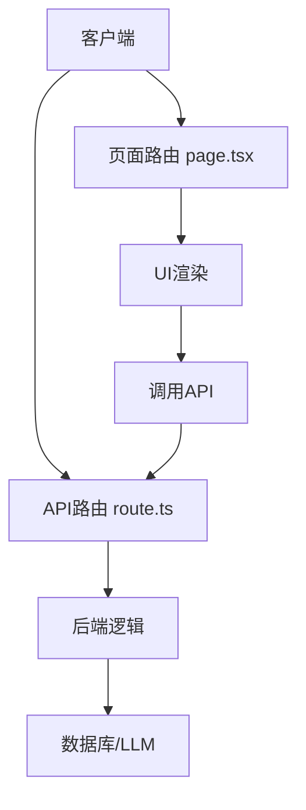

**图表来源**
- [layout.tsx](file://app/layout.tsx)
- [providers.tsx](file://app/providers.tsx)
- [api/chat/route.ts](file://app/api/chat/route.ts)

## 详细组件分析

### 页面路由与API路由分离
Next.js App Router的核心设计原则之一是将页面路由（负责UI渲染）与API路由（负责数据处理）完全分离。这种设计模式提高了代码的可维护性和安全性。

#### 页面路由分析
页面路由文件（以`page.tsx`结尾）负责定义用户界面和交互逻辑。这些组件通常是客户端组件，使用React的useState、useEffect等hooks管理状态。

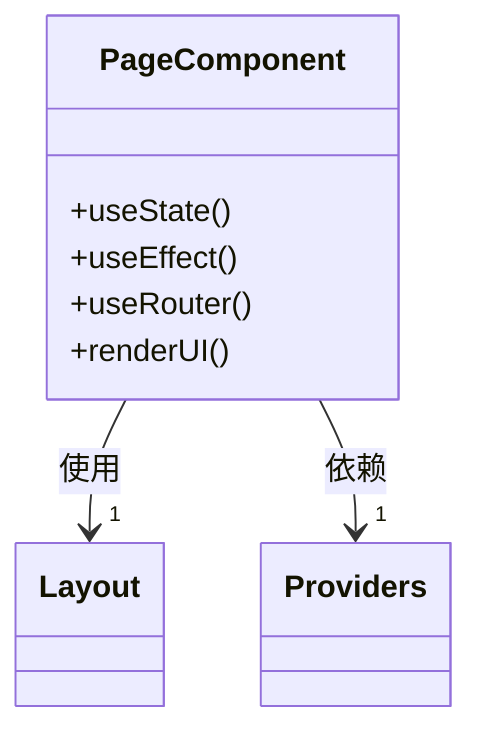

**图表来源**
- [page.tsx](file://app/page.tsx)
- [chat/page.tsx](file://app/chat/page.tsx)
- [interview/start/page.tsx](file://app/interview/start/page.tsx)

#### API路由分析
API路由文件（以`route.ts`结尾）负责处理HTTP请求，实现后端业务逻辑。这些路由运行在服务器端，可以安全地访问数据库、调用外部API等。

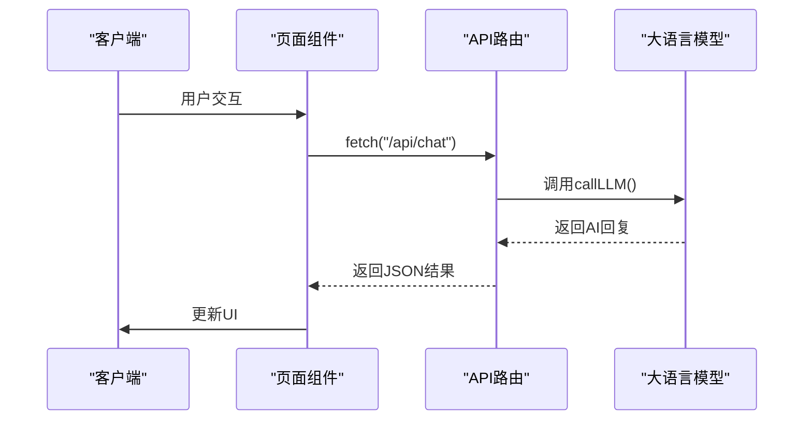

**图表来源**
- [api/chat/route.ts](file://app/api/chat/route.ts)
- [lib/llm.ts](file://lib/llm.ts)

**章节来源**
- [api/chat/route.ts](file://app/api/chat/route.ts)

### 全局布局与状态注入
应用通过`app/layout.tsx`和`app/providers.tsx`实现了全局布局和状态管理的解耦设计。

#### 全局布局机制
`app/layout.tsx`文件定义了应用的根布局，包括HTML文档结构、全局样式和元数据。该布局被所有页面共享，确保了应用的一致性。

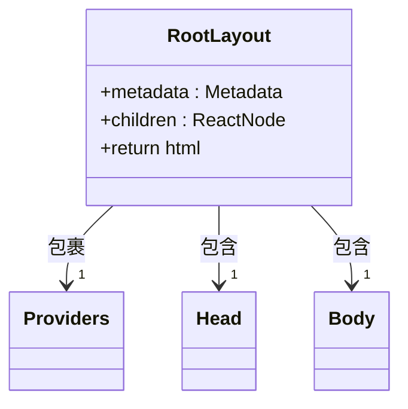

**图表来源**
- [layout.tsx](file://app/layout.tsx)

#### 状态注入机制
`app/providers.tsx`文件实现了状态注入模式，通过React Context为整个应用提供全局状态。当前主要注入了面试状态管理器。

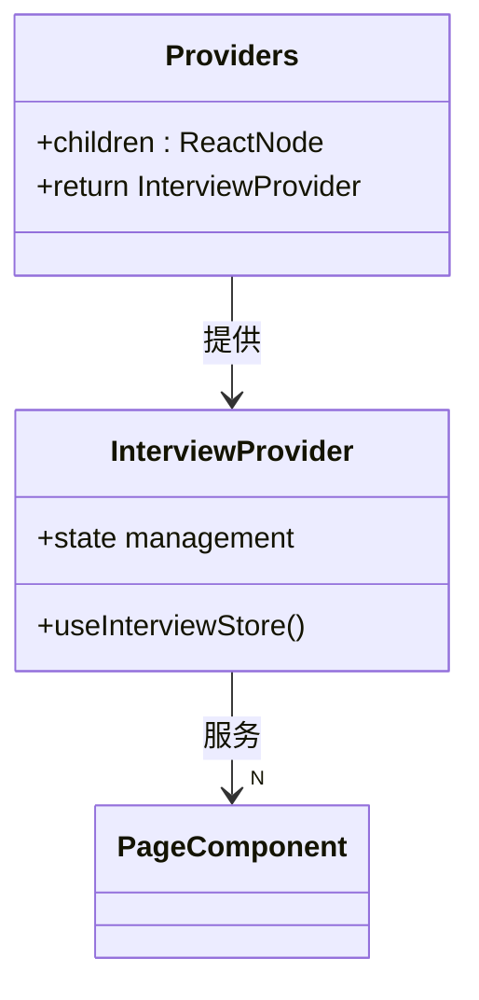

**图表来源**
- [providers.tsx](file://app/providers.tsx)
- [store/interviewStore.tsx](file://store/interviewStore.tsx)

**章节来源**
- [layout.tsx](file://app/layout.tsx)
- [providers.tsx](file://app/providers.tsx)

### 子路径职责分析

#### app/chat/ - 主交互界面
`app/chat/`目录承载了应用的核心AI对话功能，支持多阶段的求职辅导。该界面通过状态管理实现了不同求职阶段的无缝切换。

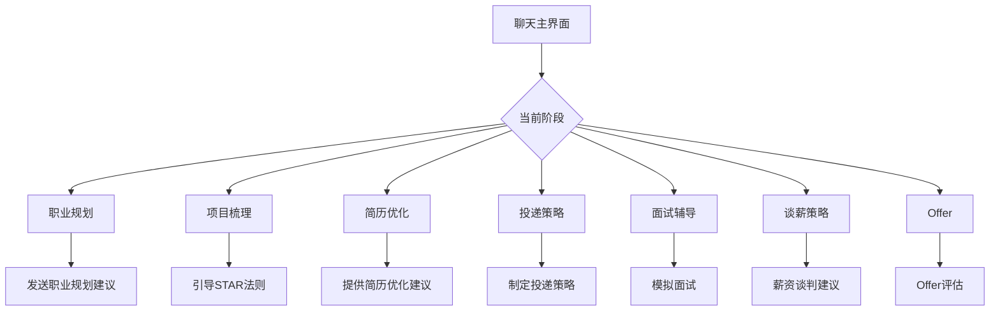

**图表来源**
- [chat/page.tsx](file://app/chat/page.tsx)
- [lib/stage.ts](file://lib/stage.ts)

**章节来源**
- [chat/page.tsx](file://app/chat/page.tsx)

#### app/interview/start/ - 面试启动入口
`app/interview/start/`目录是面试流程的专用入口，提供了独立的面试配置界面和交互流程，与主聊天界面分离。

```mermaid
flowchart TD
A[面试启动页] --> B[配置面试]
B --> C[岗位/JD]
B --> D[面试轮次]
B --> E[题目数量]
C --> F[保存到localStorage]
D --> F
E --> F
F --> G[开始面试]
G --> H[获取问题]
H --> I[逐题回答]
I --> J[提交答案]
J --> K[获取评估]
K --> L[生成总结]
```

**图表来源**
- [interview/start/page.tsx](file://app/interview/start/page.tsx)

**章节来源**
- [interview/start/page.tsx](file://app/interview/start/page.tsx)

#### app/onboarding/ - 用户引导流程
`app/onboarding/`目录处理新用户的引导流程，通过一系列步骤收集用户基本信息，为后续的个性化服务做准备。

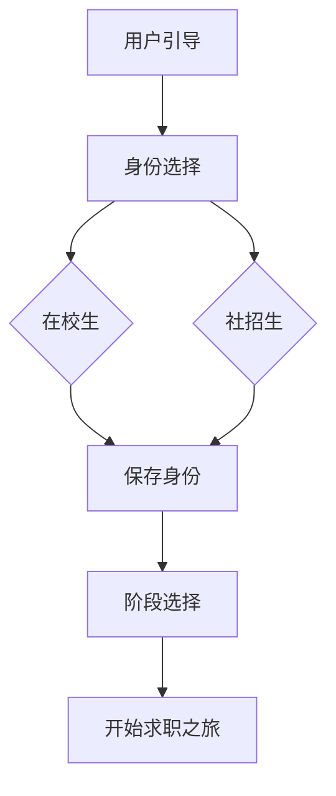

**图表来源**
- [onboarding/identity-select/page.tsx](file://app/onboarding/identity-select/page.tsx)

**章节来源**
- [onboarding/identity-select/page.tsx](file://app/onboarding/identity-select/page.tsx)

### 前后端一体化请求处理
以`app/api/chat/route.ts`为例，展示了前后端一体化的请求处理流程。API路由接收客户端请求，进行认证和数据验证，然后调用业务逻辑层，最终返回结果。

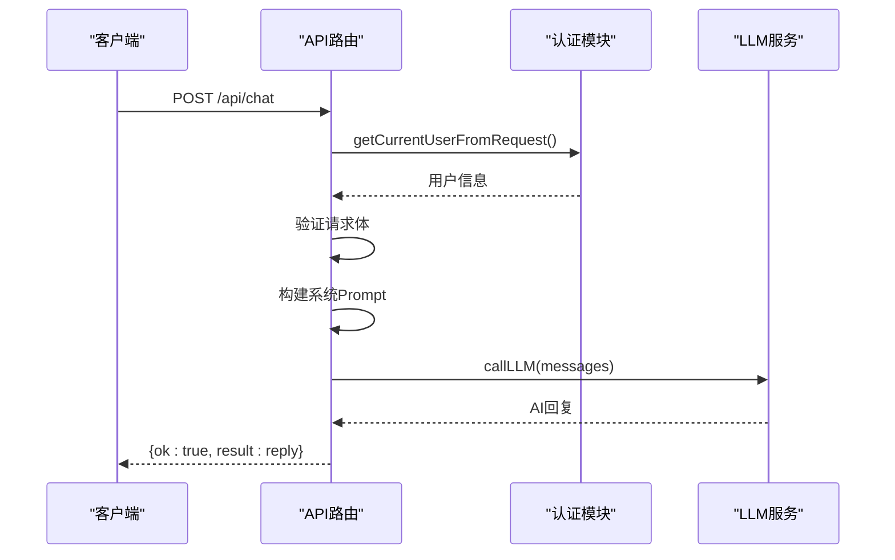

**图表来源**
- [api/chat/route.ts](file://app/api/chat/route.ts)
- [lib/llm.ts](file://lib/llm.ts)
- [lib/auth.ts](file://lib/auth.ts)

**章节来源**
- [api/chat/route.ts](file://app/api/chat/route.ts)

### 动态路由使用方式
应用使用了动态路由参数如`[round]`和`[id]`来处理面试轮次和简历模块的个性化内容。

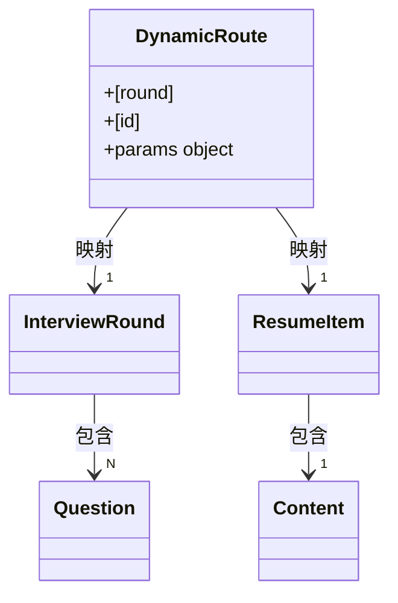

**图表来源**
- [chat/interview/[round]/page.tsx](file://app/chat/interview/[round]/page.tsx)
- [chat/resume/[id]/page.tsx](file://app/chat/resume/[id]/page.tsx)

**章节来源**
- [chat/interview/[round]/page.tsx](file://app/chat/interview/[round]/page.tsx)
- [chat/resume/[id]/page.tsx](file://app/chat/resume/[id]/page.tsx)

### 状态管理器集成模式
应用通过`store/interviewStore.tsx`实现了面试状态的集中管理，采用React Context模式提供全局状态访问。

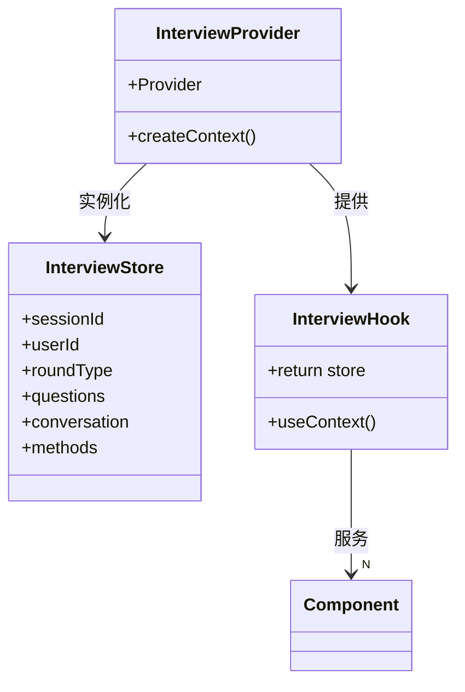

**图表来源**
- [store/interviewStore.tsx](file://store/interviewStore.tsx)
- [providers.tsx](file://app/providers.tsx)

**章节来源**
- [store/interviewStore.tsx](file://store/interviewStore.tsx)

## 依赖分析
应用的组件之间存在清晰的依赖关系，形成了一个层次化的架构。

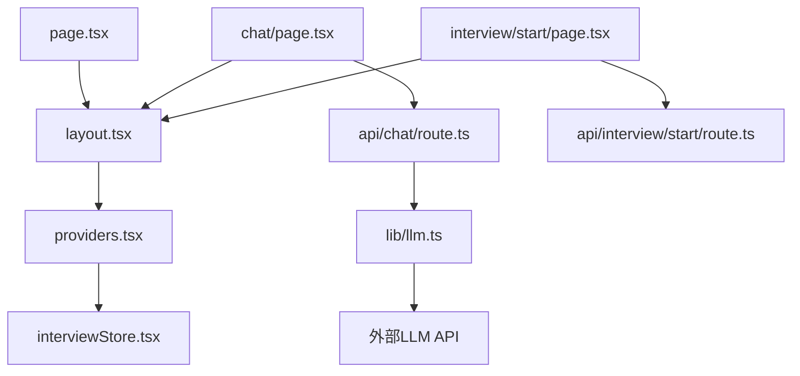

**图表来源**
- [layout.tsx](file://app/layout.tsx)
- [providers.tsx](file://app/providers.tsx)
- [store/interviewStore.tsx](file://store/interviewStore.tsx)
- [api/chat/route.ts](file://app/api/chat/route.ts)
- [lib/llm.ts](file://lib/llm.ts)

**章节来源**
- [layout.tsx](file://app/layout.tsx)
- [providers.tsx](file://app/providers.tsx)
- [store/interviewStore.tsx](file://store/interviewStore.tsx)

## 性能考虑
应用在性能方面进行了多项优化，包括请求防抖、状态持久化和资源预加载等。

**章节来源**
- [chat/page.tsx](file://app/chat/page.tsx)
- [interview/start/page.tsx](file://app/interview/start/page.tsx)

## 故障排除指南
当遇到问题时，可以检查以下常见问题点：

**章节来源**
- [api/chat/route.ts](file://app/api/chat/route.ts)
- [lib/auth.ts](file://lib/auth.ts)

## 结论
该应用通过Next.js App Router的现代化架构，实现了清晰的路由分离、有效的状态管理和流畅的用户体验。页面路由与API路由的分离确保了关注点的分离，全局布局和状态注入机制提供了应用的一致性和可维护性，而动态路由和状态管理器的集成则支持了复杂的应用逻辑。