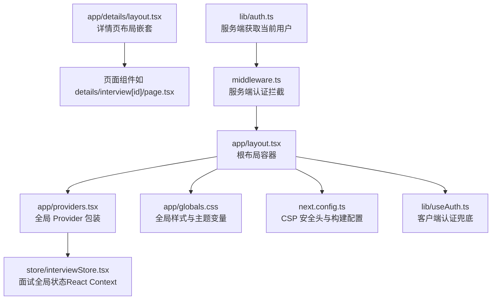
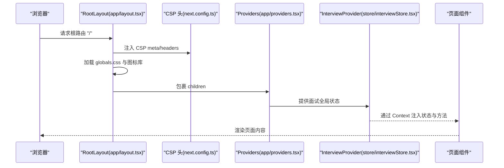
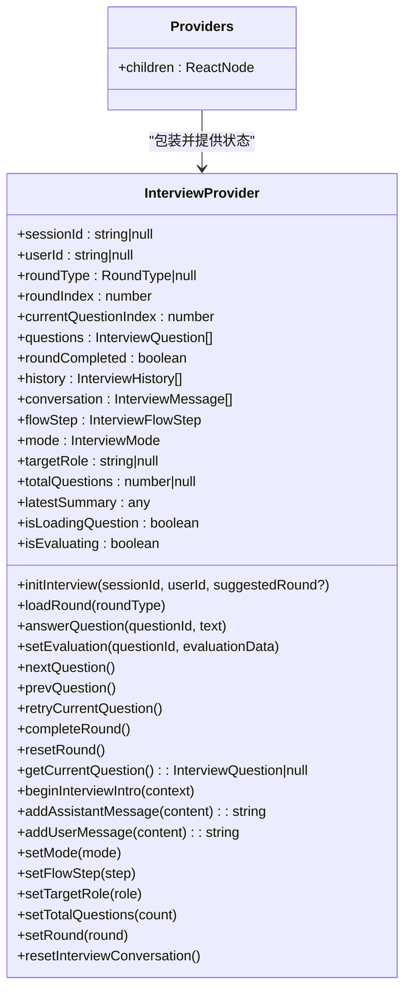
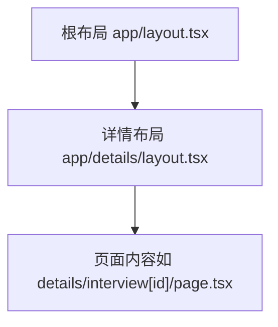
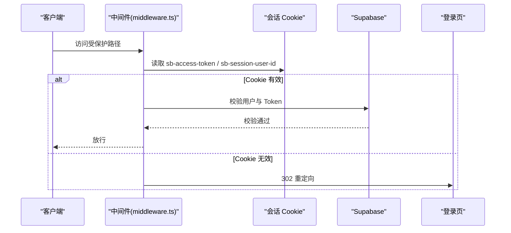
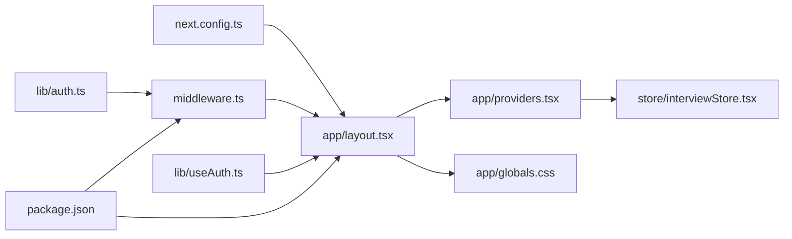

# 布局与全局配置

<cite>
**本文引用的文件**
- [app/layout.tsx](file://app/layout.tsx)
- [app/globals.css](file://app/globals.css)
- [app/providers.tsx](file://app/providers.tsx)
- [app/details/layout.tsx](file://app/details/layout.tsx)
- [next.config.ts](file://next.config.ts)
- [store/interviewStore.tsx](file://store/interviewStore.tsx)
- [lib/useAuth.ts](file://lib/useAuth.ts)
- [middleware.ts](file://middleware.ts)
- [lib/auth.ts](file://lib/auth.ts)
- [package.json](file://package.json)
</cite>

## 目录
1. [简介](#简介)
2. [项目结构](#项目结构)
3. [核心组件](#核心组件)
4. [架构总览](#架构总览)
5. [详细组件分析](#详细组件分析)
6. [依赖分析](#依赖分析)
7. [性能考虑](#性能考虑)
8. [故障排查指南](#故障排查指南)
9. [结论](#结论)
10. [附录](#附录)

## 简介
本文件围绕 Next.js 应用的全局布局与全局配置展开，重点解析以下方面：
- app/layout.tsx 作为根布局容器的设计原理与实现方式，以及其在所有页面间共享 UI 元素（如导航栏、主题样式）的作用机制。
- app/globals.css 中定义的 Tailwind CSS 全局样式规则及其与组件样式的优先级关系。
- app/providers.tsx 中全局状态与服务注入模式，说明其如何通过 React Context Provider 实现跨页面状态共享。
- 结合代码示例展示布局嵌套（如 details/layout.tsx 与根 layout.tsx 的继承关系）与性能优化策略（如懒加载 Provider）。
- 字体加载、元数据配置等全局设置的最佳实践。

## 项目结构
本项目采用 App Router 结构，根布局位于 app/layout.tsx，全局样式位于 app/globals.css，全局状态通过 app/providers.tsx 注入，部分页面级布局（如详情页）通过 app/details/layout.tsx 进行局部嵌套。

图表来源
- [app/layout.tsx](file://app/layout.tsx#L1-L58)
- [app/providers.tsx](file://app/providers.tsx#L1-L13)
- [store/interviewStore.tsx](file://store/interviewStore.tsx#L1-L789)
- [app/globals.css](file://app/globals.css#L1-L517)
- [app/details/layout.tsx](file://app/details/layout.tsx#L1-L39)
- [next.config.ts](file://next.config.ts#L1-L55)
- [lib/useAuth.ts](file://lib/useAuth.ts#L1-L59)
- [middleware.ts](file://middleware.ts#L1-L168)
- [lib/auth.ts](file://lib/auth.ts#L1-L39)

章节来源
- [app/layout.tsx](file://app/layout.tsx#L1-L58)
- [app/globals.css](file://app/globals.css#L1-L517)
- [app/providers.tsx](file://app/providers.tsx#L1-L13)
- [app/details/layout.tsx](file://app/details/layout.tsx#L1-L39)
- [next.config.ts](file://next.config.ts#L1-L55)

## 核心组件
- 根布局容器（app/layout.tsx）
  - 定义全局元数据（title/description），注入 CSP 安全头，加载全局样式与图标库，包裹 Providers 以提供全局状态。
  - 使用 CSS 变量控制主题色板，并在暗色模式下切换变量值。
  - 通过 body 类名绑定主题变量，使 Tailwind 与自定义样式协同工作。
- 全局样式（app/globals.css）
  - 引入字体与 Tailwind，定义 CSS 变量主题，提供动画与通用布局类，包含复杂两栏布局与白板固定定位的修复规则。
- 全局 Provider（app/providers.tsx）
  - 通过 InterviewProvider 提供面试全局状态（React Context），作为跨页面状态共享的入口。
- 详情页布局嵌套（app/details/layout.tsx）
  - 在根布局基础上增加顶部导航栏与容器结构，形成页面级布局嵌套。
- 构建与安全（next.config.ts）
  - 配置 CSP 头，禁用 Lightning CSS 优化，处理原生模块外部化（hnswlib-node）。
- 认证与拦截（middleware.ts、lib/auth.ts、lib/useAuth.ts）
  - 服务端中间件拦截非匿名路径，校验会话有效性；客户端 Hook 作为兜底；服务端工具获取当前用户。

章节来源
- [app/layout.tsx](file://app/layout.tsx#L1-L58)
- [app/globals.css](file://app/globals.css#L1-L517)
- [app/providers.tsx](file://app/providers.tsx#L1-L13)
- [app/details/layout.tsx](file://app/details/layout.tsx#L1-L39)
- [next.config.ts](file://next.config.ts#L1-L55)
- [lib/useAuth.ts](file://lib/useAuth.ts#L1-L59)
- [middleware.ts](file://middleware.ts#L1-L168)
- [lib/auth.ts](file://lib/auth.ts#L1-L39)

## 架构总览
全局布局与状态的协作关系如下：

图表来源
- [app/layout.tsx](file://app/layout.tsx#L1-L58)
- [next.config.ts](file://next.config.ts#L12-L34)
- [app/providers.tsx](file://app/providers.tsx#L1-L13)
- [store/interviewStore.tsx](file://store/interviewStore.tsx#L187-L739)

## 详细组件分析

### 根布局容器（app/layout.tsx）设计原理与实现
- 元数据与安全头
  - 定义标题与描述，确保 SEO 与分享卡片一致性。
  - 注入 CSP meta 标签，与 next.config.ts 中 headers CSP 保持一致，避免构建/运行时阻断。
- 字体与图标
  - 通过 link 标签引入第三方图标库（待替换为本地包）。
  - 通过 CSS 变量与 @theme inline 定义系统字体族，避免构建时网络请求。
- 主题与样式
  - 使用 CSS 变量定义主题色板，并在暗色模式下切换变量值。
  - body 类名绑定变量，使 Tailwind 与自定义样式协同工作。
- Provider 包装
  - 在 body 内部包裹 Providers，确保全局状态在所有页面可用。
- Hydration 警告
  - 使用 suppressHydrationWarning 降低水合不一致风险（需谨慎使用）。

章节来源
- [app/layout.tsx](file://app/layout.tsx#L1-L58)

### 全局样式（app/globals.css）与 Tailwind 优先级
- 字体与主题
  - 引入字体与 Tailwind，定义 :root 与 @theme inline 变量，支持明/暗主题切换。
- 动画与通用类
  - 定义通用动画类与滚动条样式，提升交互体验。
- 复杂布局修复
  - 包含针对聊天与白板的两栏布局修复规则，确保 fixed 定位不受父容器影响，独立滚动且不遮挡。
- 与组件样式的优先级
  - 全局样式在组件样式之前加载，Tailwind 生成的类通常具有较高优先级；若需覆盖，可在组件内使用 !important 或更高特异性选择器（需谨慎）。
  - CSS 变量与 @theme inline 为全局主题提供统一入口，组件可通过 var(--variable) 使用。

章节来源
- [app/globals.css](file://app/globals.css#L1-L517)

### 全局状态注入（app/providers.tsx 与 InterviewProvider）
- Provider 设计
  - app/providers.tsx 仅导出 Providers 组件，内部使用 InterviewProvider 提供面试全局状态。
- InterviewProvider（store/interviewStore.tsx）
  - 使用 React Context API 管理面试流程状态与方法，包含会话标识、轮次信息、问题列表、对话与引导、历史记录等。
  - 提供初始化、加载轮次、回答问题、评估、翻页、重置等完整方法集合。
  - 使用 localStorage 生成并持久化会话与用户标识，便于无后端场景下的状态恢复。
  - 提供 useInterviewStore Hook，缺失 Provider 时返回默认实现，便于开发调试。
- 跨页面共享
  - 通过根布局包裹 Providers，使任意页面均可通过 useInterviewStore 访问状态与方法。

图表来源
- [app/providers.tsx](file://app/providers.tsx#L1-L13)
- [store/interviewStore.tsx](file://store/interviewStore.tsx#L187-L739)

章节来源
- [app/providers.tsx](file://app/providers.tsx#L1-L13)
- [store/interviewStore.tsx](file://store/interviewStore.tsx#L1-L789)

### 布局嵌套（details/layout.tsx 与根 layout.tsx）
- 继承关系
  - details/layout.tsx 作为页面级布局，继承根布局的全局样式与 Provider，同时在内部增加顶部导航栏与容器结构。
- 交互与导航
  - 提供“返回对话”按钮，使用 useRouter 进行页面跳转，保持统一的导航体验。
- 作用机制
  - 通过 children 接收具体页面内容，形成“根布局 -> 页面布局 -> 页面内容”的层级渲染链路。

图表来源
- [app/layout.tsx](file://app/layout.tsx#L1-L58)
- [app/details/layout.tsx](file://app/details/layout.tsx#L1-L39)

章节来源
- [app/details/layout.tsx](file://app/details/layout.tsx#L1-L39)
- [app/layout.tsx](file://app/layout.tsx#L1-L58)

### 字体加载与元数据配置最佳实践
- 字体加载
  - 全局样式中引入 Google Fonts 与 FontAwesome CDN，但存在 TODO 注释提示替换为本地包，以减少构建时网络请求与提升隐私性。
  - 根布局通过 link 标签引入图标库，建议尽快迁移到本地依赖。
- 元数据
  - 根布局定义 title 与 description，确保 SEO 与社交分享卡片一致。
- 系统字体
  - 使用 @theme inline 定义系统字体族，避免构建时网络请求，提升首屏性能与隐私合规性。

章节来源
- [app/globals.css](file://app/globals.css#L1-L517)
- [app/layout.tsx](file://app/layout.tsx#L1-L58)

### 全局安全头与 CSP 配置
- next.config.ts
  - headers 中设置 Content-Security-Policy，与根布局 meta CSP 保持一致，确保开发与生产环境一致。
  - connect-src 包含 Supabase 与 OpenAI 等必要域名，ws/wss 支持实时连接。
- 根布局
  - 同步注入 CSP meta 标签，便于开发调试与构建产物的一致性。

章节来源
- [next.config.ts](file://next.config.ts#L12-L34)
- [app/layout.tsx](file://app/layout.tsx#L1-L58)

### 认证与拦截（服务端与客户端）
- 服务端中间件（middleware.ts）
  - 对非匿名路径进行会话校验，支持三种校验方式：cookie、Authorization Bearer、userId cookie + Admin 客户端验证。
  - 无效会话时重定向至登录页，并保留原始路径以便登录后回跳。
- 客户端 Hook（lib/useAuth.ts）
  - 作为中间件的兜底检查，定期检测会话状态，缺失时跳转登录页。
- 服务端工具（lib/auth.ts）
  - 通过 createRouteHandlerClient 从 Supabase 获取当前用户信息，便于服务端渲染与权限判断。

图表来源
- [middleware.ts](file://middleware.ts#L1-L168)
- [lib/useAuth.ts](file://lib/useAuth.ts#L1-L59)
- [lib/auth.ts](file://lib/auth.ts#L1-L39)

章节来源
- [middleware.ts](file://middleware.ts#L1-L168)
- [lib/useAuth.ts](file://lib/useAuth.ts#L1-L59)
- [lib/auth.ts](file://lib/auth.ts#L1-L39)

## 依赖分析
- 依赖关系
  - app/layout.tsx 依赖 app/globals.css 与 app/providers.tsx。
  - app/providers.tsx 依赖 store/interviewStore.tsx。
  - next.config.ts 影响构建与运行时的安全头。
  - 认证相关依赖 @supabase/supabase-js、@supabase/auth-helpers-nextjs。
- 外部依赖
  - package.json 中包含 React、Next.js、Tailwind、Framer Motion、Lucide 等依赖，以及 zustand（尽管当前未在 providers 中直接使用）。

图表来源
- [app/layout.tsx](file://app/layout.tsx#L1-L58)
- [app/providers.tsx](file://app/providers.tsx#L1-L13)
- [store/interviewStore.tsx](file://store/interviewStore.tsx#L1-L789)
- [app/globals.css](file://app/globals.css#L1-L517)
- [next.config.ts](file://next.config.ts#L1-L55)
- [middleware.ts](file://middleware.ts#L1-L168)
- [lib/useAuth.ts](file://lib/useAuth.ts#L1-L59)
- [lib/auth.ts](file://lib/auth.ts#L1-L39)
- [package.json](file://package.json#L1-L42)

章节来源
- [package.json](file://package.json#L1-L42)
- [next.config.ts](file://next.config.ts#L1-L55)

## 性能考虑
- 字体与图标
  - 建议将 FontAwesome 与 Google Fonts 替换为本地依赖，减少构建时网络请求与首屏阻塞。
- CSS 优化
  - next.config.ts 中关闭 Lightning CSS 优化，避免与 Tailwind 4 的 @import 冲突；如需优化，建议在迁移完成后重新评估。
- Provider 懒加载
  - 当前 Providers 在根布局中直接包裹，若 Provider 内部存在重型初始化逻辑，可考虑按需加载（例如在首次进入特定页面时再挂载）以减少初始渲染负担。
- 两栏布局与 fixed 定位
  - 全局样式中针对白板固定定位与独立滚动进行了大量修复，确保 fixed 元素不受父容器 transform/perspective/filter 影响，避免布局抖动与重排。

章节来源
- [app/globals.css](file://app/globals.css#L206-L326)
- [next.config.ts](file://next.config.ts#L1-L55)
- [app/layout.tsx](file://app/layout.tsx#L1-L58)

## 故障排查指南
- CSP 相关问题
  - 若出现资源被阻止或 React 报错，检查根布局 meta 与 next.config.ts headers 是否一致，确保 connect-src、font-src、style-src 等策略覆盖所需域名。
- 字体与图标加载失败
  - 检查 globals.css 中 @import 与 link 标签是否正确，确认 CDN 可达性；建议尽快替换为本地依赖。
- Hydration 不一致
  - 根布局使用 suppressHydrationWarning，若出现闪烁或样式异常，检查主题变量与暗色模式切换逻辑。
- 认证失效
  - 中间件会根据多种方式校验会话，若无效将重定向登录；客户端 Hook 作为兜底，定期检查会话状态。

章节来源
- [app/layout.tsx](file://app/layout.tsx#L1-L58)
- [next.config.ts](file://next.config.ts#L12-L34)
- [middleware.ts](file://middleware.ts#L1-L168)
- [lib/useAuth.ts](file://lib/useAuth.ts#L1-L59)

## 结论
本项目的全局布局与全局配置通过根布局容器、全局样式与 Provider 模式实现了跨页面的 UI 与状态共享。根布局负责元数据、CSP、字体与图标、主题变量与 Provider 包装；全局样式提供统一的主题与布局修复；InterviewProvider 通过 React Context 提供面试流程的完整状态与方法。页面级布局（如 details/layout.tsx）在根布局基础上进行局部扩展，形成清晰的嵌套关系。认证体系由服务端中间件与客户端 Hook 共同保障，确保安全性与用户体验。建议后续逐步替换 CDN 依赖为本地包，进一步提升性能与隐私合规性。

## 附录
- 术语说明
  - CSP：内容安全策略，用于限制资源加载与脚本执行。
  - SSR：服务端渲染，Next.js 默认支持。
  - CSR：客户端渲染，配合中间件与客户端 Hook 实现前后端一致的认证体验。
- 相关文件
  - app/layout.tsx、app/globals.css、app/providers.tsx、app/details/layout.tsx、next.config.ts、store/interviewStore.tsx、lib/useAuth.ts、middleware.ts、lib/auth.ts、package.json