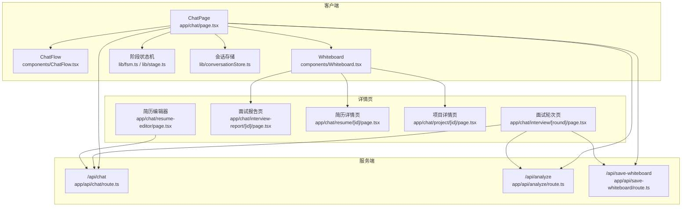
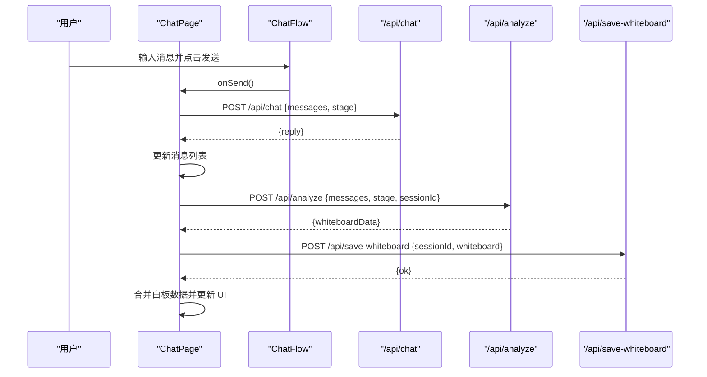
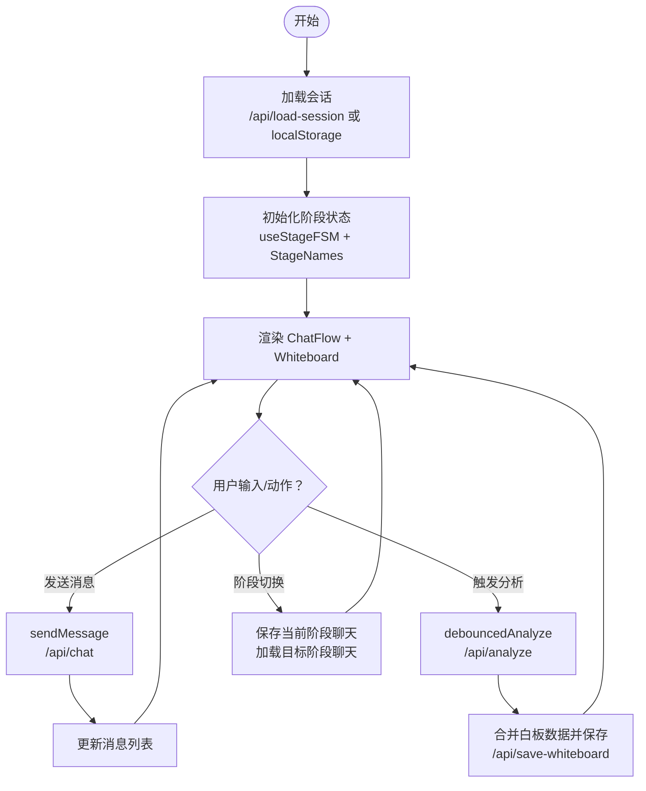
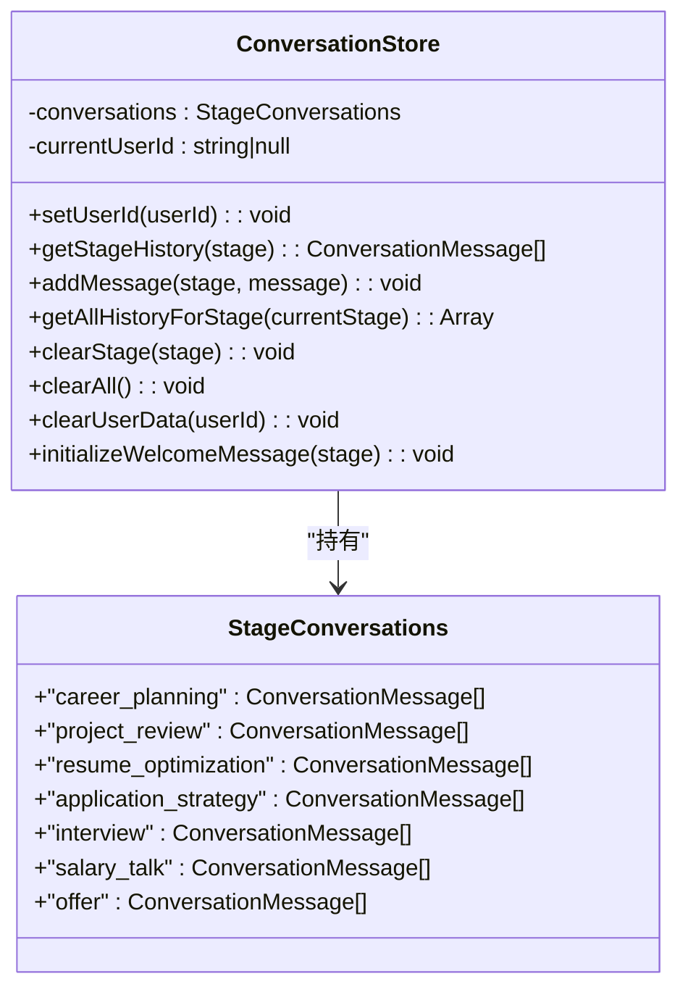
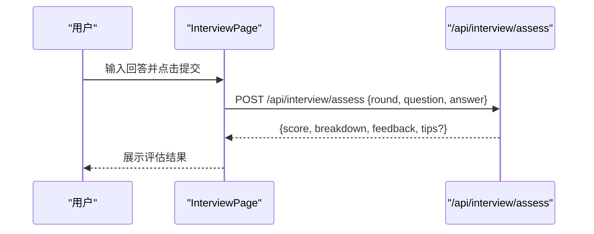
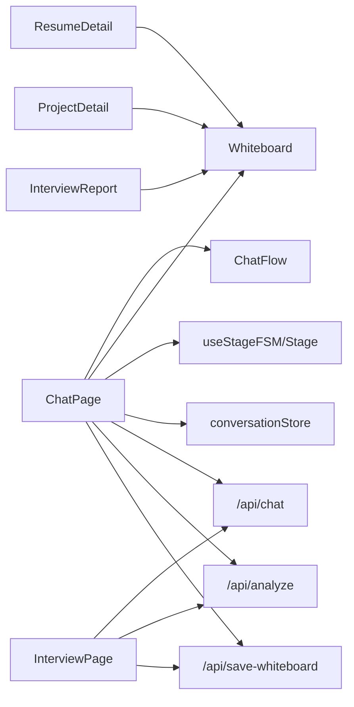

# 核心交互页面

<cite>
**本文引用的文件**
- [app/chat/page.tsx](file://app/chat/page.tsx)
- [lib/conversationStore.ts](file://lib/conversationStore.ts)
- [lib/stage.ts](file://lib/stage.ts)
- [lib/fsm.ts](file://lib/fsm.ts)
- [components/ChatFlow.tsx](file://components/ChatFlow.tsx)
- [components/Whiteboard.tsx](file://components/Whiteboard.tsx)
- [app/api/chat/route.ts](file://app/api/chat/route.ts)
- [app/api/analyze/route.ts](file://app/api/analyze/route.ts)
- [app/api/save-whiteboard/route.ts](file://app/api/save-whiteboard/route.ts)
- [app/chat/interview/[round]/page.tsx](file://app/chat/interview/[round]/page.tsx)
- [app/chat/interview-report/[id]/page.tsx](file://app/chat/interview-report/[id]/page.tsx)
- [app/chat/resume/[id]/page.tsx](file://app/chat/resume/[id]/page.tsx)
- [app/chat/project/[id]/page.tsx](file://app/chat/project/[id]/page.tsx)
- [app/chat/resume-editor/page.tsx](file://app/chat/resume-editor/page.tsx)
</cite>

## 目录
1. [引言](#引言)
2. [项目结构](#项目结构)
3. [核心组件](#核心组件)
4. [架构总览](#架构总览)
5. [详细组件分析](#详细组件分析)
6. [依赖关系分析](#依赖关系分析)
7. [性能考量](#性能考量)
8. [故障排查指南](#故障排查指南)
9. [结论](#结论)
10. [附录](#附录)

## 引言
本文件围绕 chat/ 目录下的核心交互页面进行深入解析，重点阐述 ChatPage 作为主交互界面的架构设计与实现。文档将详细说明 ChatPage 如何通过 Zustand 风格的状态管理（conversationStore）与后端 API（如 /api/chat、/api/analyze、/api/save-whiteboard）进行数据交互，分析页面如何实现会话持久化、白板数据同步与阶段状态管理。同时，结合 app/chat/interview/[round]/page.tsx 说明多轮面试的动态路由实现，解释 resume、project 等模块的 ID 参数化页面如何加载特定用户数据；并说明 resume-editor 的编辑逻辑与实时预览功能，以及 interview-report 的评估结果展示方式。最后提供代码示例路径，展示消息流控制、debounce 分析触发、阶段切换逻辑等关键实现。

## 项目结构
chat/ 目录下包含多个页面与组件，共同构成求职教练的主交互界面与配套功能：
- 主聊天页：app/chat/page.tsx
- 阶段状态机：lib/fsm.ts、lib/stage.ts
- 会话存储：lib/conversationStore.ts
- 交互组件：components/ChatFlow.tsx、components/Whiteboard.tsx
- API 层：app/api/chat/route.ts、app/api/analyze/route.ts、app/api/save-whiteboard/route.ts
- 详情页与编辑器：app/chat/interview/[round]/page.tsx、app/chat/interview-report/[id]/page.tsx、app/chat/resume/[id]/page.tsx、app/chat/project/[id]/page.tsx、app/chat/resume-editor/page.tsx



图表来源
- [app/chat/page.tsx](file://app/chat/page.tsx#L1-L120)
- [components/ChatFlow.tsx](file://components/ChatFlow.tsx#L1-L167)
- [components/Whiteboard.tsx](file://components/Whiteboard.tsx#L1-L120)
- [lib/fsm.ts](file://lib/fsm.ts#L1-L125)
- [lib/stage.ts](file://lib/stage.ts#L1-L85)
- [lib/conversationStore.ts](file://lib/conversationStore.ts#L1-L120)
- [app/api/chat/route.ts](file://app/api/chat/route.ts#L1-L120)
- [app/api/analyze/route.ts](file://app/api/analyze/route.ts#L1-L120)
- [app/api/save-whiteboard/route.ts](file://app/api/save-whiteboard/route.ts#L1-L50)
- [app/chat/interview/[round]/page.tsx](file://app/chat/interview/[round]/page.tsx#L1-L120)
- [app/chat/interview-report/[id]/page.tsx](file://app/chat/interview-report/[id]/page.tsx#L1-L80)
- [app/chat/resume/[id]/page.tsx](file://app/chat/resume/[id]/page.tsx#L1-L80)
- [app/chat/project/[id]/page.tsx](file://app/chat/project/[id]/page.tsx#L1-L80)
- [app/chat/resume-editor/page.tsx](file://app/chat/resume-editor/page.tsx#L1-L120)

章节来源
- [app/chat/page.tsx](file://app/chat/page.tsx#L1-L120)
- [lib/fsm.ts](file://lib/fsm.ts#L1-L125)
- [lib/stage.ts](file://lib/stage.ts#L1-L85)
- [lib/conversationStore.ts](file://lib/conversationStore.ts#L1-L120)
- [components/ChatFlow.tsx](file://components/ChatFlow.tsx#L1-L167)
- [components/Whiteboard.tsx](file://components/Whiteboard.tsx#L1-L120)
- [app/api/chat/route.ts](file://app/api/chat/route.ts#L1-L120)
- [app/api/analyze/route.ts](file://app/api/analyze/route.ts#L1-L120)
- [app/api/save-whiteboard/route.ts](file://app/api/save-whiteboard/route.ts#L1-L50)
- [app/chat/interview/[round]/page.tsx](file://app/chat/interview/[round]/page.tsx#L1-L120)
- [app/chat/interview-report/[id]/page.tsx](file://app/chat/interview-report/[id]/page.tsx#L1-L80)
- [app/chat/resume/[id]/page.tsx](file://app/chat/resume/[id]/page.tsx#L1-L80)
- [app/chat/project/[id]/page.tsx](file://app/chat/project/[id]/page.tsx#L1-L80)
- [app/chat/resume-editor/page.tsx](file://app/chat/resume-editor/page.tsx#L1-L120)

## 核心组件
- ChatPage（主交互页）：负责加载/保存会话、维护阶段状态、触发分析、与后端 API 通信、协调白板与聊天流。
- ChatFlow：聊天消息渲染与输入控制，支持自动高度、回车发送、文件上传触发。
- Whiteboard：根据当前阶段聚合并展示分析结果（意向岗位、核心技能、STAR 项目、简历优化建议、面试报告、目标公司、薪资策略、Offer 列表）。
- 阶段状态机（useStageFSM + Stage 定义）：统一管理阶段前进/后退与名称映射。
- 会话存储（conversationStore）：提供按阶段的对话历史管理与本地持久化。
- API 层：/api/chat（对话）、/api/analyze（白板分析）、/api/save-whiteboard（白板持久化）。

章节来源
- [app/chat/page.tsx](file://app/chat/page.tsx#L1-L200)
- [components/ChatFlow.tsx](file://components/ChatFlow.tsx#L1-L167)
- [components/Whiteboard.tsx](file://components/Whiteboard.tsx#L1-L120)
- [lib/fsm.ts](file://lib/fsm.ts#L1-L125)
- [lib/stage.ts](file://lib/stage.ts#L1-L85)
- [lib/conversationStore.ts](file://lib/conversationStore.ts#L1-L120)
- [app/api/chat/route.ts](file://app/api/chat/route.ts#L1-L120)
- [app/api/analyze/route.ts](file://app/api/analyze/route.ts#L1-L120)
- [app/api/save-whiteboard/route.ts](file://app/api/save-whiteboard/route.ts#L1-L50)

## 架构总览
ChatPage 采用“前端状态 + 后端 API”的双轨架构：
- 前端状态：本地 useState 管理消息、输入、白板数据、阶段、会话标识；同时通过 localStorage 与后端数据库进行持久化。
- 后端 API：/api/chat 提供阶段化对话；/api/analyze 基于当前阶段抽取白板数据；/api/save-whiteboard 异步持久化白板。



图表来源
- [app/chat/page.tsx](file://app/chat/page.tsx#L760-L860)
- [app/api/chat/route.ts](file://app/api/chat/route.ts#L145-L238)
- [app/api/analyze/route.ts](file://app/api/analyze/route.ts#L348-L448)
- [app/api/save-whiteboard/route.ts](file://app/api/save-whiteboard/route.ts#L1-L50)

## 详细组件分析

### ChatPage（主交互界面）
- 会话加载与持久化
  - 首次加载时，优先调用 /api/load-session 恢复消息、白板与阶段；失败则回退到 localStorage。
  - 本地持久化：聊天历史按阶段保存到 localStorage；白板数据与阶段状态也持久化。
- 阶段管理
  - 使用 useStageFSM 与 StageNames/StageOrder 控制阶段前进/后退与名称展示。
  - 切换阶段时，先保存当前阶段聊天记录，再加载目标阶段聊天记录，并同步 FSM。
- 白板分析与同步
  - analyzeConversation：将全部消息转换为 {role,content} 格式，POST /api/analyze，合并返回数据到白板并异步调用 /api/save-whiteboard。
  - debouncedAnalyze：使用 ref 与 setTimeout 实现 1 秒防抖，避免频繁触发分析。
- 消息流控制
  - sendMessage：构建 messages 数组，调用 /api/chat，成功后将 AI 回复加入消息列表。
  - ChatFlow 负责输入控制、自动高度与发送事件。
- 面试与简历入口
  - 面试阶段跳转至 /interview/start；简历优化阶段提供进入编辑器入口。



图表来源
- [app/chat/page.tsx](file://app/chat/page.tsx#L40-L180)
- [app/chat/page.tsx](file://app/chat/page.tsx#L360-L560)
- [app/chat/page.tsx](file://app/chat/page.tsx#L560-L760)
- [app/chat/page.tsx](file://app/chat/page.tsx#L760-L900)
- [components/ChatFlow.tsx](file://components/ChatFlow.tsx#L1-L167)
- [app/api/chat/route.ts](file://app/api/chat/route.ts#L145-L238)
- [app/api/analyze/route.ts](file://app/api/analyze/route.ts#L348-L448)
- [app/api/save-whiteboard/route.ts](file://app/api/save-whiteboard/route.ts#L1-L50)

章节来源
- [app/chat/page.tsx](file://app/chat/page.tsx#L1-L200)
- [app/chat/page.tsx](file://app/chat/page.tsx#L360-L760)
- [app/chat/page.tsx](file://app/chat/page.tsx#L760-L900)
- [components/ChatFlow.tsx](file://components/ChatFlow.tsx#L1-L167)

### 阶段状态机与阶段定义
- useStageFSM：提供 transition/back/getCurrent/getCurrentName/canGoBack，支持任意阶段跳转与历史记录。
- StageNames/StageOrder：提供阶段名称与顺序，用于 UI 展示与逻辑判断。
- isValidStage：校验阶段有效性。

```mermaid
classDiagram
class StageFSM {
+current : Stage
+history : Stage[]
+transition(stage) : boolean
+back() : boolean
+getCurrent() : Stage
+getCurrentName() : string
+canGoBack() : boolean
}
class Stage {
<<enum>>
"career"
"project"
"resume"
"apply"
"interview"
"offer"
}
class StageNames {
+映射 : Record<Stage,string>
}
class StageOrder {
+数组 : Stage[]
}
StageFSM --> Stage : "管理"
StageFSM --> StageNames : "使用"
StageFSM --> StageOrder : "使用"
```

图表来源
- [lib/fsm.ts](file://lib/fsm.ts#L1-L125)
- [lib/stage.ts](file://lib/stage.ts#L1-L85)

章节来源
- [lib/fsm.ts](file://lib/fsm.ts#L1-L125)
- [lib/stage.ts](file://lib/stage.ts#L1-L85)

### 会话存储（conversationStore）
- 按阶段维护对话历史，提供 addMessage/getStageHistory/getAllHistoryForStage/clearStage/clearAll 等接口。
- 通过 localStorage 以用户 ID 为键进行持久化，支持切换用户时加载对应历史。
- 初始化欢迎消息，避免在未设置用户 ID 时保存。



图表来源
- [lib/conversationStore.ts](file://lib/conversationStore.ts#L1-L258)

章节来源
- [lib/conversationStore.ts](file://lib/conversationStore.ts#L1-L258)

### ChatFlow（消息流控制）
- 负责消息渲染、滚动到底部、输入框自动高度、回车发送、文件上传触发。
- 与 ChatPage 的 sendMessage/onSend 协作，保证发送流程可控。

章节来源
- [components/ChatFlow.tsx](file://components/ChatFlow.tsx#L1-L167)

### Whiteboard（白板数据展示与交互）
- 根据当前阶段渲染不同区块：意向岗位、核心技能、STAR 项目、简历优化建议、面试报告、目标公司、薪资策略、Offer 列表。
- 支持点击跳转到详情页（项目、简历、面试报告）。
- 在简历优化阶段提供“进入编辑器”入口。

章节来源
- [components/Whiteboard.tsx](file://components/Whiteboard.tsx#L1-L120)
- [components/Whiteboard.tsx](file://components/Whiteboard.tsx#L120-L220)
- [components/Whiteboard.tsx](file://components/Whiteboard.tsx#L220-L360)
- [components/Whiteboard.tsx](file://components/Whiteboard.tsx#L360-L540)

### API 交互机制
- /api/chat
  - 根据 stage 选择系统提示词，构造消息数组后调用 LLM，返回 AI 回复。
- /api/analyze
  - 根据当前阶段生成特定提示词，提取白板数据并返回 JSON；异步保存到数据库。
- /api/save-whiteboard
  - 基于用户会话 ID upsert 白板数据。

章节来源
- [app/api/chat/route.ts](file://app/api/chat/route.ts#L1-L120)
- [app/api/chat/route.ts](file://app/api/chat/route.ts#L120-L238)
- [app/api/analyze/route.ts](file://app/api/analyze/route.ts#L1-L120)
- [app/api/analyze/route.ts](file://app/api/analyze/route.ts#L120-L240)
- [app/api/analyze/route.ts](file://app/api/analyze/route.ts#L240-L448)
- [app/api/save-whiteboard/route.ts](file://app/api/save-whiteboard/route.ts#L1-L50)

### 多轮面试动态路由（app/chat/interview/[round]/page.tsx）
- 使用 Next.js 动态路由 [round]，从 params 获取轮次编号。
- 从 localStorage 或模拟数据加载面试轮次题目与答题要点，支持前后题切换。
- 调用 /api/interview/assess 提交答案并展示评估结果（总分、分项评分、优缺点、总体评价）。



图表来源
- [app/chat/interview/[round]/page.tsx](file://app/chat/interview/[round]/page.tsx#L1-L160)
- [app/chat/interview/[round]/page.tsx](file://app/chat/interview/[round]/page.tsx#L160-L360)

章节来源
- [app/chat/interview/[round]/page.tsx](file://app/chat/interview/[round]/page.tsx#L1-L200)

### 面试报告详情（app/chat/interview-report/[id]/page.tsx）
- 从 localStorage 或全局状态查找对应面试报告，展示轮次、总分、问题列表、优缺点等。

章节来源
- [app/chat/interview-report/[id]/page.tsx](file://app/chat/interview-report/[id]/page.tsx#L1-L165)

### 简历详情（app/chat/resume/[id]/page.tsx）
- 从 localStorage 或模拟数据加载原始与优化版简历文本，提供接受/编辑能力（编辑后保存到 localStorage）。

章节来源
- [app/chat/resume/[id]/page.tsx](file://app/chat/resume/[id]/page.tsx#L1-L111)

### 项目详情（app/chat/project/[id]/page.tsx）
- 从 localStorage 的白板数据中查找指定项目，按 STAR 结构展示背景、任务、行动、结果。

章节来源
- [app/chat/project/[id]/page.tsx](file://app/chat/project/[id]/page.tsx#L1-L135)

### 简历编辑器（app/chat/resume-editor/page.tsx）
- 从 localStorage/editor/whiteboard/chatHistory 解析并填充简历各分区内容。
- 支持 AI 优化、应用到预览、下载、删除、返回聊天页并保存阶段状态。

章节来源
- [app/chat/resume-editor/page.tsx](file://app/chat/resume-editor/page.tsx#L1-L120)
- [app/chat/resume-editor/page.tsx](file://app/chat/resume-editor/page.tsx#L120-L260)
- [app/chat/resume-editor/page.tsx](file://app/chat/resume-editor/page.tsx#L260-L360)
- [app/chat/resume-editor/page.tsx](file://app/chat/resume-editor/page.tsx#L360-L508)

## 依赖关系分析
- ChatPage 依赖：
  - 阶段状态机：useStageFSM、StageNames、StageOrder、isValidStage
  - 会话存储：conversationStore（用于欢迎消息与历史）
  - 组件：ChatFlow、Whiteboard
  - API：/api/chat、/api/analyze、/api/save-whiteboard
- 详情页依赖：
  - 从 localStorage 读取白板数据或模拟数据，渲染对应详情。
- API 依赖：
  - /api/chat：调用 LLM，注入系统提示词
  - /api/analyze：按阶段提取白板数据
  - /api/save-whiteboard：upsert 白板数据



图表来源
- [app/chat/page.tsx](file://app/chat/page.tsx#L1-L200)
- [lib/fsm.ts](file://lib/fsm.ts#L1-L125)
- [lib/stage.ts](file://lib/stage.ts#L1-L85)
- [lib/conversationStore.ts](file://lib/conversationStore.ts#L1-L120)
- [components/ChatFlow.tsx](file://components/ChatFlow.tsx#L1-L167)
- [components/Whiteboard.tsx](file://components/Whiteboard.tsx#L1-L120)
- [app/api/chat/route.ts](file://app/api/chat/route.ts#L1-L120)
- [app/api/analyze/route.ts](file://app/api/analyze/route.ts#L1-L120)
- [app/api/save-whiteboard/route.ts](file://app/api/save-whiteboard/route.ts#L1-L50)
- [app/chat/interview/[round]/page.tsx](file://app/chat/interview/[round]/page.tsx#L1-L120)
- [app/chat/interview-report/[id]/page.tsx](file://app/chat/interview-report/[id]/page.tsx#L1-L80)
- [app/chat/resume/[id]/page.tsx](file://app/chat/resume/[id]/page.tsx#L1-L80)
- [app/chat/project/[id]/page.tsx](file://app/chat/project/[id]/page.tsx#L1-L80)

章节来源
- [app/chat/page.tsx](file://app/chat/page.tsx#L1-L200)
- [lib/fsm.ts](file://lib/fsm.ts#L1-L125)
- [lib/stage.ts](file://lib/stage.ts#L1-L85)
- [lib/conversationStore.ts](file://lib/conversationStore.ts#L1-L120)
- [components/ChatFlow.tsx](file://components/ChatFlow.tsx#L1-L167)
- [components/Whiteboard.tsx](file://components/Whiteboard.tsx#L1-L120)
- [app/api/chat/route.ts](file://app/api/chat/route.ts#L1-L120)
- [app/api/analyze/route.ts](file://app/api/analyze/route.ts#L1-L120)
- [app/api/save-whiteboard/route.ts](file://app/api/save-whiteboard/route.ts#L1-L50)
- [app/chat/interview/[round]/page.tsx](file://app/chat/interview/[round]/page.tsx#L1-L120)
- [app/chat/interview-report/[id]/page.tsx](file://app/chat/interview-report/[id]/page.tsx#L1-L80)
- [app/chat/resume/[id]/page.tsx](file://app/chat/resume/[id]/page.tsx#L1-L80)
- [app/chat/project/[id]/page.tsx](file://app/chat/project/[id]/page.tsx#L1-L80)

## 性能考量
- 防抖分析：debouncedAnalyze 使用 setTimeout 与 ref，避免高频触发 /api/analyze，减少 LLM 调用次数。
- 异步保存：/api/save-whiteboard 在后台异步 upsert，不影响响应速度。
- 本地持久化：localStorage 作为降级与快速恢复手段，减少首次加载等待。
- 组件渲染：ChatFlow 自动滚动与消息列表渲染优化体验；Whiteboard 按阶段条件渲染，避免无关区块渲染。

[本节为通用指导，无需源码引用]

## 故障排查指南
- 未认证
  - /api/chat 与 /api/save-whiteboard 在服务端进行认证检查，若返回未认证，需检查登录状态与请求头。
- 分析 API 返回空对象
  - /api/analyze 对 JSON 解析失败时会返回空对象，检查前端传参与 LLM 返回格式。
- 白板保存失败
  - /api/save-whiteboard upsert 失败时会记录错误，检查数据库连接与权限。
- 面试评估失败
  - /api/interview/assess 返回错误时，前端会弹窗提示，检查网络与后端服务状态。

章节来源
- [app/api/chat/route.ts](file://app/api/chat/route.ts#L145-L238)
- [app/api/save-whiteboard/route.ts](file://app/api/save-whiteboard/route.ts#L1-L50)
- [app/api/analyze/route.ts](file://app/api/analyze/route.ts#L348-L448)
- [app/chat/interview/[round]/page.tsx](file://app/chat/interview/[round]/page.tsx#L100-L140)

## 结论
ChatPage 通过前端状态与后端 API 的协同，实现了求职流程的主交互闭环：阶段化对话、白板数据抽取与同步、会话持久化与阶段切换。配合详情页与编辑器，形成从“对话—分析—可视化—编辑—评估”的完整链路。防抖分析与异步保存提升了交互流畅度与可靠性。动态路由与参数化页面进一步增强了用户在多轮面试与项目/简历详情场景下的体验。

[本节为总结性内容，无需源码引用]

## 附录
- 关键实现示例路径（仅列路径，不展示代码内容）
  - 消息流控制与发送：[app/chat/page.tsx](file://app/chat/page.tsx#L760-L860)
  - debounce 分析触发：[app/chat/page.tsx](file://app/chat/page.tsx#L560-L760)
  - 阶段切换逻辑：[app/chat/page.tsx](file://app/chat/page.tsx#L400-L480)
  - 白板数据合并与保存：[app/chat/page.tsx](file://app/chat/page.tsx#L470-L560)
  - /api/chat 系统提示词与消息构造：[app/api/chat/route.ts](file://app/api/chat/route.ts#L120-L238)
  - /api/analyze 按阶段提取白板数据：[app/api/analyze/route.ts](file://app/api/analyze/route.ts#L120-L340)
  - /api/save-whiteboard upsert：[app/api/save-whiteboard/route.ts](file://app/api/save-whiteboard/route.ts#L20-L48)
  - 多轮面试动态路由与评估：[app/chat/interview/[round]/page.tsx](file://app/chat/interview/[round]/page.tsx#L100-L160)
  - 简历编辑器加载与优化：[app/chat/resume-editor/page.tsx](file://app/chat/resume-editor/page.tsx#L1-L120)