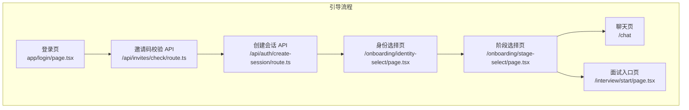
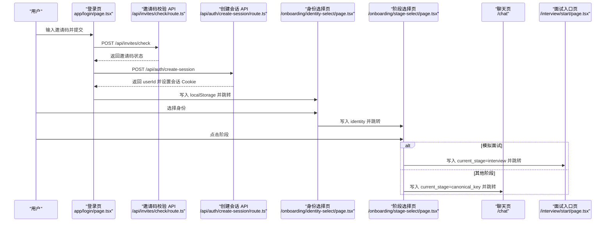
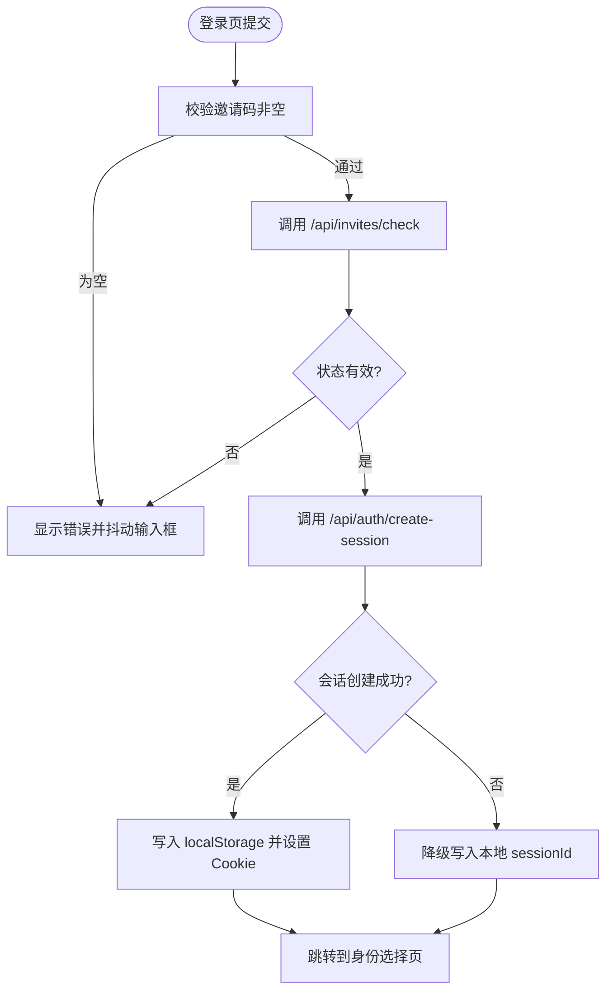
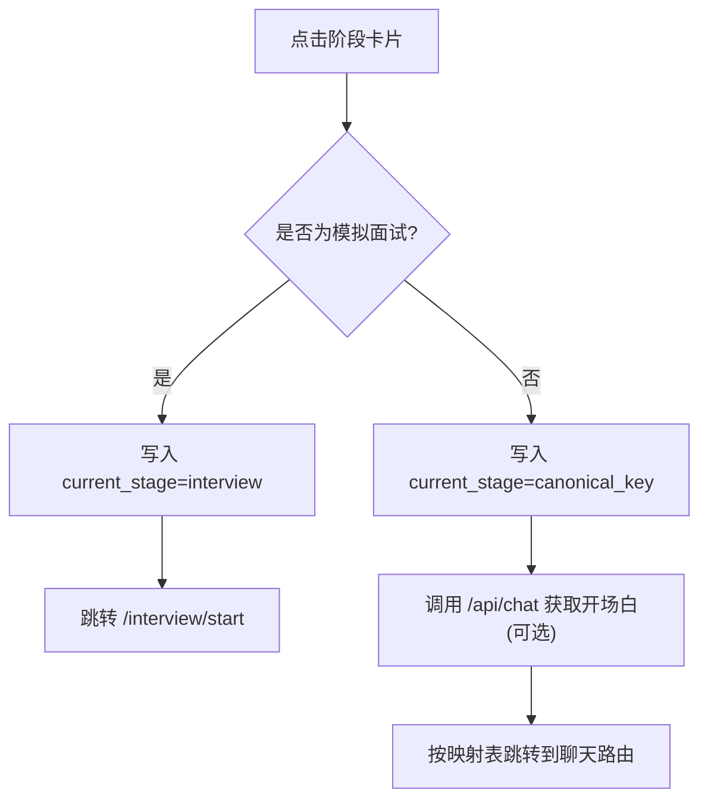
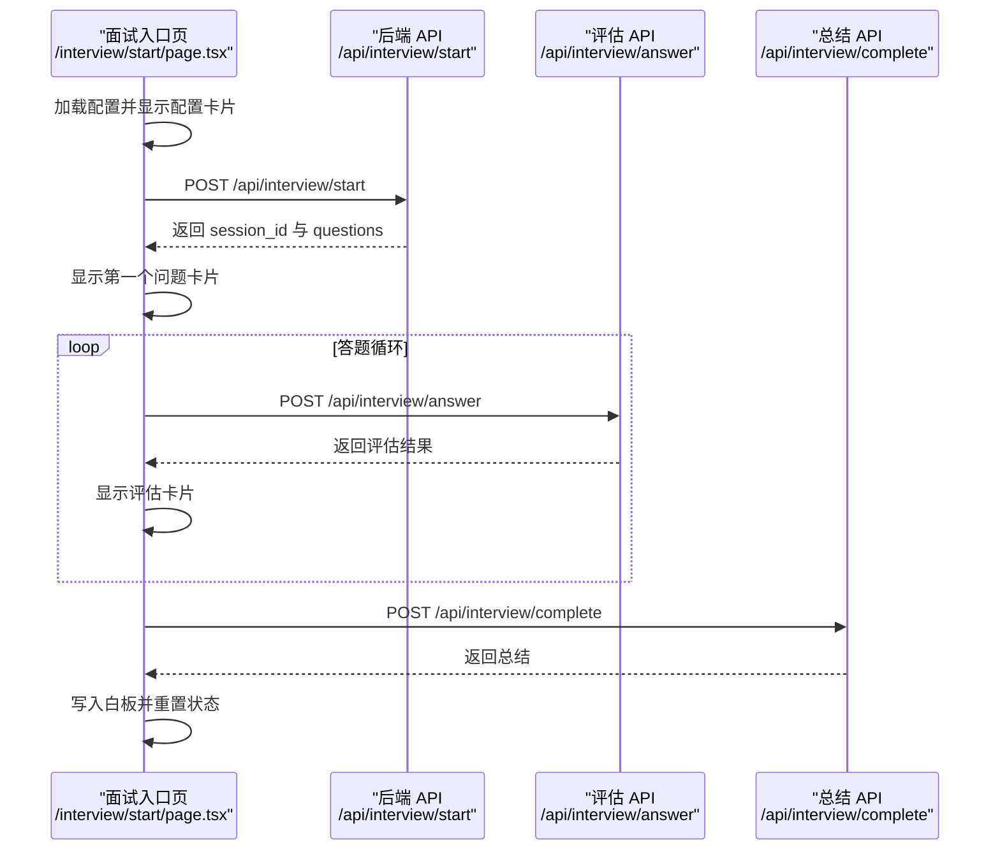
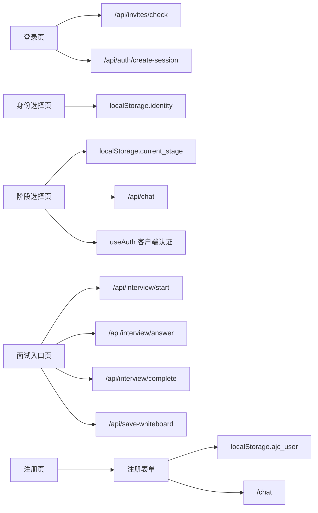

# 用户引导页面

<cite>
**本文引用的文件**
- [app/login/page.tsx](file://app/login/page.tsx)
- [app/register/page.tsx](file://app/register/page.tsx)
- [app/onboarding/identity-select/page.tsx](file://app/onboarding/identity-select/page.tsx)
- [app/onboarding/stage-select/page.tsx](file://app/onboarding/stage-select/page.tsx)
- [app/interview/start/page.tsx](file://app/interview/start/page.tsx)
- [lib/useAuth.ts](file://lib/useAuth.ts)
- [lib/auth.ts](file://lib/auth.ts)
- [components/RegisterForm.tsx](file://components/RegisterForm.tsx)
- [app/api/invites/check/route.ts](file://app/api/invites/check/route.ts)
- [app/api/auth/create-session/route.ts](file://app/api/auth/create-session/route.ts)
- [app/api/interview/start/route.ts](file://app/api/interview/start/route.ts)
- [lib/stage.ts](file://lib/stage.ts)
- [store/interviewStore.tsx](file://store/interviewStore.tsx)
- [middleware.ts](file://middleware.ts)
</cite>

## 目录
1. [简介](#简介)
2. [项目结构](#项目结构)
3. [核心组件](#核心组件)
4. [架构总览](#架构总览)
5. [详细组件分析](#详细组件分析)
6. [依赖关系分析](#依赖关系分析)
7. [性能考量](#性能考量)
8. [故障排查指南](#故障排查指南)
9. [结论](#结论)

## 简介
本文件面向“用户从注册到进入主流程”的完整引导路径，聚焦以下目标：
- login 与 register 页面的认证逻辑与 Supabase Auth 的集成方式
- identity-select 的身份选择机制如何影响后续 AI 交互策略
- stage-select 的阶段选择逻辑及其与全局状态（userStage）的同步方式
- app/interview/start/page.tsx 作为独立面试入口的特殊职责：面试初始化、状态重置与路由跳转
- 结合实际代码展示表单处理、状态传递、localStorage 数据管理及错误处理流程，说明各页面如何协同完成用户初始化配置

## 项目结构
用户引导路径涉及以下关键页面与后端 API：
- 登录与邀请码校验：/login → /api/invites/check → /api/auth/create-session
- 注册与初始配置：/register → /chat（注册表单保存身份与阶段）
- 身份选择：/onboarding/identity-select
- 阶段选择：/onboarding/stage-select（与聊天阶段、面试阶段联动）
- 面试入口：/interview/start（独立面试流程，不依赖聊天阶段）

图表来源
- [app/login/page.tsx](file://app/login/page.tsx#L1-L120)
- [app/api/invites/check/route.ts](file://app/api/invites/check/route.ts#L1-L120)
- [app/api/auth/create-session/route.ts](file://app/api/auth/create-session/route.ts#L1-L120)
- [app/onboarding/identity-select/page.tsx](file://app/onboarding/identity-select/page.tsx#L1-L60)
- [app/onboarding/stage-select/page.tsx](file://app/onboarding/stage-select/page.tsx#L1-L120)
- [app/interview/start/page.tsx](file://app/interview/start/page.tsx#L1-L120)

章节来源
- [app/login/page.tsx](file://app/login/page.tsx#L1-L120)
- [app/api/invites/check/route.ts](file://app/api/invites/check/route.ts#L1-L120)
- [app/api/auth/create-session/route.ts](file://app/api/auth/create-session/route.ts#L1-L120)
- [app/onboarding/identity-select/page.tsx](file://app/onboarding/identity-select/page.tsx#L1-L60)
- [app/onboarding/stage-select/page.tsx](file://app/onboarding/stage-select/page.tsx#L1-L120)
- [app/interview/start/page.tsx](file://app/interview/start/page.tsx#L1-L120)

## 核心组件
- 登录页（邀请码校验 + 会话创建）
  - 负责邀请码输入、校验、异常提示、创建 Supabase 会话并写入 cookie 与 localStorage，随后跳转至身份选择页。
- 身份选择页
  - 选择“在校生/社招生”，写入 localStorage 并跳转至阶段选择页。
- 阶段选择页
  - 基于路径绘制阶段卡片，点击阶段后：
    - 若为“模拟面试”：直接写入 current_stage 为 interview 并跳转到 /interview/start
    - 其他阶段：写入 canonical key（如 career_planning），并尝试获取阶段开场白；随后按路由映射跳转
- 面试入口页（独立面试）
  - 固定使用 interview 阶段，不读取或设置全局阶段状态；负责面试配置、启动、答题、评估、总结与白板写入
- 注册页与注册表单
  - 保存用户身份与初始阶段到 localStorage，并跳转到聊天页
- 认证与中间件
  - 客户端 useAuth 与服务端 middleware 共同保障页面访问权限

章节来源
- [app/login/page.tsx](file://app/login/page.tsx#L1-L120)
- [app/onboarding/identity-select/page.tsx](file://app/onboarding/identity-select/page.tsx#L1-L60)
- [app/onboarding/stage-select/page.tsx](file://app/onboarding/stage-select/page.tsx#L100-L180)
- [app/interview/start/page.tsx](file://app/interview/start/page.tsx#L50-L120)
- [components/RegisterForm.tsx](file://components/RegisterForm.tsx#L1-L111)
- [lib/useAuth.ts](file://lib/useAuth.ts#L1-L59)
- [middleware.ts](file://middleware.ts#L1-L170)

## 架构总览
下图展示了从登录到进入主流程的关键交互与数据流。

图表来源
- [app/login/page.tsx](file://app/login/page.tsx#L30-L120)
- [app/api/invites/check/route.ts](file://app/api/invites/check/route.ts#L160-L306)
- [app/api/auth/create-session/route.ts](file://app/api/auth/create-session/route.ts#L1-L120)
- [app/onboarding/identity-select/page.tsx](file://app/onboarding/identity-select/page.tsx#L1-L60)
- [app/onboarding/stage-select/page.tsx](file://app/onboarding/stage-select/page.tsx#L100-L180)
- [app/interview/start/page.tsx](file://app/interview/start/page.tsx#L1-L120)

## 详细组件分析

### 登录页与 Supabase Auth 集成
- 表单处理
  - 校验邀请码非空，否则触发输入抖动与错误提示
  - 调用 /api/invites/check 校验邀请码状态（valid/remaining/expired/redeemed/invalid）
  - 若状态有效，调用 /api/auth/create-session 创建 Supabase 会话，设置 sb-access-token 与 sb-session-user-id Cookie，并写入 localStorage（inviteCode、sessionId）
  - 若会话创建失败，仍允许降级：写入本地 sessionId 并跳转
- 错误处理
  - 对邀请码校验失败、会话创建失败分别捕获并提示
  - finally 统一关闭 loading 状态

图表来源
- [app/login/page.tsx](file://app/login/page.tsx#L13-L120)
- [app/api/invites/check/route.ts](file://app/api/invites/check/route.ts#L160-L306)
- [app/api/auth/create-session/route.ts](file://app/api/auth/create-session/route.ts#L1-L120)

章节来源
- [app/login/page.tsx](file://app/login/page.tsx#L1-L120)
- [app/api/invites/check/route.ts](file://app/api/invites/check/route.ts#L1-L120)
- [app/api/auth/create-session/route.ts](file://app/api/auth/create-session/route.ts#L1-L120)

### 身份选择与阶段选择
- 身份选择
  - 选择“在校生/社招生”，写入 localStorage.identity，延迟跳转并显示页面离场动画
- 阶段选择
  - 渲染阶段卡片，点击阶段后：
    - 若为“模拟面试”：写入 localStorage.current_stage="interview"，直接跳转到 /interview/start
    - 其他阶段：写入 canonical key（如 career_planning），并尝试调用 /api/chat 获取阶段开场白，随后按映射跳转
  - 该页面还承担客户端认证兜底（useAuth），若无会话则重定向到 /login

图表来源
- [app/onboarding/identity-select/page.tsx](file://app/onboarding/identity-select/page.tsx#L1-L60)
- [app/onboarding/stage-select/page.tsx](file://app/onboarding/stage-select/page.tsx#L100-L180)

章节来源
- [app/onboarding/identity-select/page.tsx](file://app/onboarding/identity-select/page.tsx#L1-L60)
- [app/onboarding/stage-select/page.tsx](file://app/onboarding/stage-select/page.tsx#L1-L180)

### 面试入口页（独立面试）
- 独特性
  - 固定使用 interview 阶段（不读取 localStorage.current_stage），不重定向到 /chat
  - 仅读取面试配置（jd、roundType、questionCount）并显示配置卡片
- 初始化与状态重置
  - 页面加载时从 localStorage 恢复配置，无条件显示配置卡片
  - 重置逻辑：当面试完成时，清空 questions、重置 currentIndex、重置 sessionId，并再次显示配置卡片
- 路由跳转
  - 仅在“模拟面试”场景下跳转到 /interview/start，不依赖聊天阶段
- 白板与总结
  - 生成总结后写入白板 interviewReports，并尝试调用 /api/save-whiteboard 保存

图表来源
- [app/interview/start/page.tsx](file://app/interview/start/page.tsx#L50-L200)
- [app/api/interview/start/route.ts](file://app/api/interview/start/route.ts#L1-L175)

章节来源
- [app/interview/start/page.tsx](file://app/interview/start/page.tsx#L1-L200)
- [app/api/interview/start/route.ts](file://app/api/interview/start/route.ts#L1-L175)

### 注册页与注册表单
- 注册表单收集身份与初始阶段，保存到 localStorage 并跳转到 /chat
- 该流程绕过 Supabase 会话，直接进入聊天流程

章节来源
- [app/register/page.tsx](file://app/register/page.tsx#L1-L26)
- [components/RegisterForm.tsx](file://components/RegisterForm.tsx#L1-L111)

### 认证与中间件
- 客户端 useAuth
  - 检查 Cookie 与 localStorage，若无有效会话则重定向到 /login
- 服务端 middleware
  - 匹配除 /login、/invite、/api/* 与静态资源外的所有路径
  - 通过 Cookie 或 Authorization Header 验证 Supabase 会话有效性，无效则重定向到 /login 并携带 redirect 参数

章节来源
- [lib/useAuth.ts](file://lib/useAuth.ts#L1-L59)
- [middleware.ts](file://middleware.ts#L1-L170)

## 依赖关系分析
- 登录页依赖
  - /api/invites/check：邀请码状态判断
  - /api/auth/create-session：创建 Supabase 会话并设置 Cookie
- 身份选择页依赖
  - localStorage：存储 identity
- 阶段选择页依赖
  - localStorage：存储 current_stage（canonical key）
  - /api/chat：获取阶段开场白（聊天类阶段）
  - useAuth：客户端认证兜底
- 面试入口页依赖
  - /api/interview/start：启动面试
  - /api/interview/answer：提交答案
  - /api/interview/complete：生成总结
  - /api/save-whiteboard：保存白板
- 注册页依赖
  - localStorage：保存 ajc_user（身份与初始阶段）
  - /chat：跳转到聊天页

图表来源
- [app/login/page.tsx](file://app/login/page.tsx#L30-L120)
- [app/api/invites/check/route.ts](file://app/api/invites/check/route.ts#L160-L306)
- [app/api/auth/create-session/route.ts](file://app/api/auth/create-session/route.ts#L1-L120)
- [app/onboarding/identity-select/page.tsx](file://app/onboarding/identity-select/page.tsx#L1-L60)
- [app/onboarding/stage-select/page.tsx](file://app/onboarding/stage-select/page.tsx#L100-L180)
- [app/interview/start/page.tsx](file://app/interview/start/page.tsx#L100-L200)
- [components/RegisterForm.tsx](file://components/RegisterForm.tsx#L1-L111)

章节来源
- [app/login/page.tsx](file://app/login/page.tsx#L1-L120)
- [app/onboarding/stage-select/page.tsx](file://app/onboarding/stage-select/page.tsx#L1-L180)
- [app/interview/start/page.tsx](file://app/interview/start/page.tsx#L1-L200)
- [components/RegisterForm.tsx](file://components/RegisterForm.tsx#L1-L111)

## 性能考量
- 邀请码校验与会话创建
  - 建议在前端对邀请码格式进行基础校验，减少无效请求
  - 会话创建失败时的降级逻辑避免阻断用户体验
- 阶段选择页
  - 使用固定路径点位与 resize 事件更新位置，避免频繁重排
  - 仅在点击阶段时发起网络请求，其他交互为本地动画
- 面试入口页
  - 采用一次性配置卡片展示，减少不必要的渲染
  - 评估与总结采用同步 JSON 响应，避免流式渲染带来的复杂性

## 故障排查指南
- 登录失败
  - 检查 /api/invites/check 返回状态（invalid/expired/redeemed/valid/remaining）
  - 若会话创建失败，确认 Supabase 环境变量配置与 Service Role Key
- 身份选择失败
  - 确认 localStorage 中 identity 是否正确写入
- 阶段选择失败
  - 检查 localStorage.current_stage 是否为 canonical key（如 career_planning）
  - 若调用 /api/chat 获取开场白失败，不影响跳转，页面会继续执行
- 面试入口页
  - 启动失败：检查 jd、roundType、questionCount 参数
  - 提交答案失败：查看 /api/interview/answer 返回格式
  - 生成总结失败：查看 /api/interview/complete 返回格式
  - 白板保存失败：忽略非关键错误，不影响面试流程

章节来源
- [app/login/page.tsx](file://app/login/page.tsx#L1-L120)
- [app/onboarding/stage-select/page.tsx](file://app/onboarding/stage-select/page.tsx#L100-L180)
- [app/interview/start/page.tsx](file://app/interview/start/page.tsx#L100-L200)

## 结论
本引导路径通过邀请码校验与 Supabase 会话创建完成首次认证，随后以身份选择与阶段选择为核心，将用户导向聊天或面试主流程。面试入口页作为独立流程，不依赖聊天阶段，专注于模拟面试体验。整体设计强调：
- 明确的错误处理与降级策略
- 以 localStorage 与 canonical key 为核心的阶段状态管理
- 客户端与服务端双重认证保障
- 清晰的页面职责划分与 API 交互边界