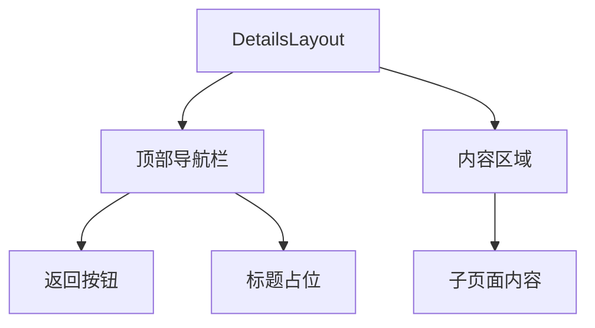
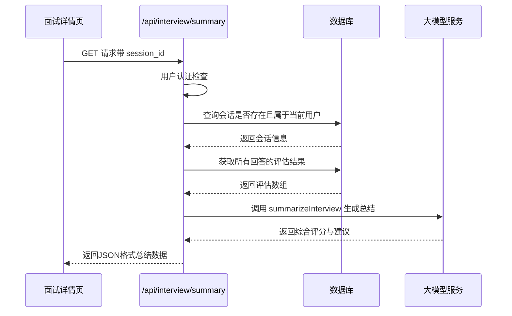
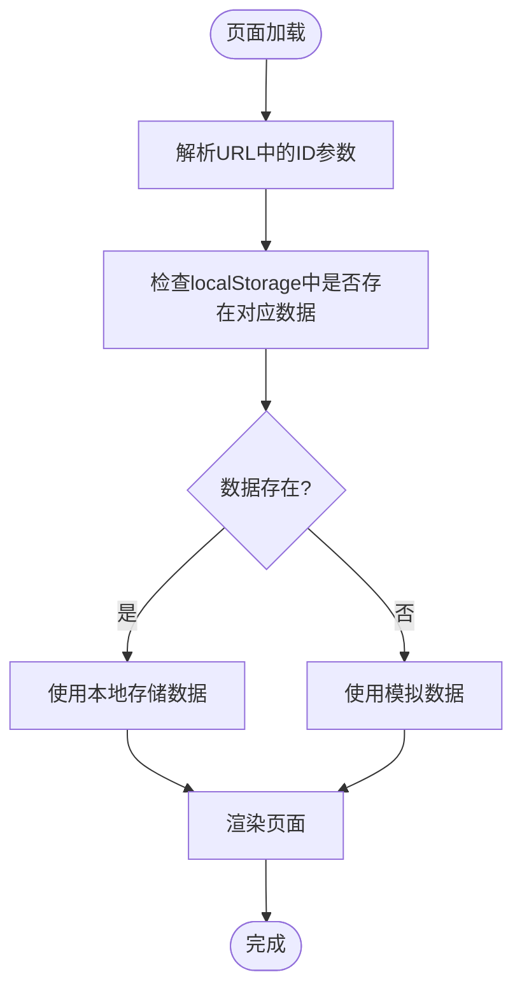
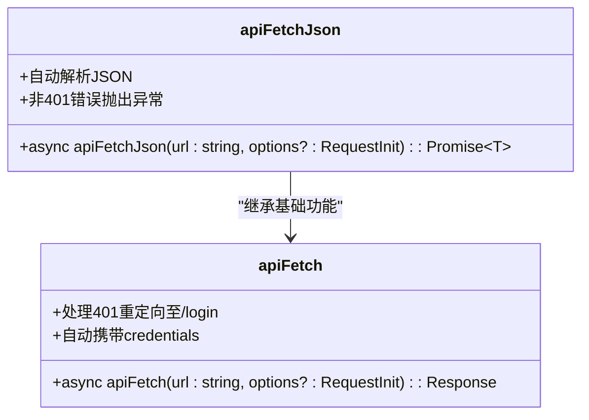

# 详情展示页面

<cite>
**本文档引用文件**  
- [layout.tsx](file://app/details/layout.tsx)
- [interview\[id]\page.tsx](file://app/details/interview/[id]/page.tsx)
- [project\[id]\page.tsx](file://app/details/project/[id]/page.tsx)
- [resume\[id]\page.tsx](file://app/details/resume/[id]/page.tsx)
- [detail-nav.tsx](file://components/detail-nav.tsx)
- [api-client.ts](file://lib/api-client.ts)
- [route.ts](file://app/api/interview/summary/route.ts)
</cite>

## 目录
1. [简介](#简介)
2. [布局复用机制](#布局复用机制)
3. [数据加载逻辑分析](#数据加载逻辑分析)
4. [页面与全局状态交互](#页面与全局状态交互)
5. [结构化展示与交互反馈](#结构化展示与交互反馈)
6. [参数解析与错误处理](#参数解析与错误处理)
7. [最佳实践总结](#最佳实践总结)

## 简介
本系统中的详情展示页面（`/details`）为用户提供统一的导航结构和内容展示框架，支持面试、项目、简历三类资源的动态路由展示。通过嵌套路由与布局组件复用，实现了高内聚、低耦合的前端架构设计。页面从本地存储或API获取数据，结合统一布局组件，确保用户体验的一致性。

## 布局复用机制

`app/details/layout.tsx` 提供了所有详情页共享的布局结构，采用Next.js的嵌套路由特性实现组件复用。该布局包含顶部固定导航栏和内容区域，自动应用于所有子路径页面，避免重复代码。

布局组件通过`useRouter`提供返回功能，点击后跳转至`/chat`主会话页面，保持上下文连贯性。其结构简洁，仅包含基础样式和导航逻辑，便于子页面专注内容渲染。

**布局来源**  
- [layout.tsx](file://app/details/layout.tsx#L1-L39)

**本节来源**  
- [layout.tsx](file://app/details/layout.tsx#L1-L39)

## 数据加载逻辑分析

### 面试详情页数据流
面试详情页通过调用`/api/interview/summary?session_id=xxx`接口获取整轮面试总结。API首先验证用户身份和会话归属，然后从数据库提取所有回答的评估结果，最后由LLM生成综合评分与改进建议。

**接口来源**  
- [route.ts](file://app/api/interview/summary/route.ts#L1-L143)

### 项目详情页数据加载
项目详情页从`localStorage`中读取`ajc_whiteboardData`，并根据URL中的`[id]`参数查找对应的STAR项目。若未找到匹配数据，则展示模拟示例内容作为降级处理。

### 简历详情页数据加载
简历优化详情页优先从`localStorage`读取`resume_[id]`键值，获取原始与优化后的文本对比数据。若本地无数据，则使用内置的模拟数据填充，确保页面始终可渲染。

**本节来源**  
- [interview\[id]\page.tsx](file://app/details/interview/[id]/page.tsx)
- [project\[id]\page.tsx](file://app/details/project/[id]/page.tsx)
- [resume\[id]\page.tsx](file://app/details/resume/[id]/page.tsx)

## 页面与全局状态交互

详情页主要通过`localStorage`与全局状态进行交互。白板数据（`ajc_whiteboardData`）在主应用中生成并持久化，详情页作为消费者读取这些数据进行展示。

对于需要实时更新的场景，页面可通过事件机制通知上游组件刷新数据。例如，当用户在简历对比页修改内容后，可触发事件使白板同步更新。

状态交互遵循单向数据流原则：上游组件负责数据变更，详情页仅负责展示。这种设计降低了组件间的耦合度，提升了系统的可维护性。

**本节来源**  
- [DynamicBoard.tsx](file://components/DynamicBoard.tsx)
- [detail-nav.tsx](file://components/detail-nav.tsx)

## 结构化展示与交互反馈

各类详情页采用结构化方式组织内容：

- **面试总结**：以综合评分、优势、薄弱点、建议四大模块呈现
- **项目详情**：按STAR法则（情境-任务-行动-结果）分区块展示
- **简历优化**：使用差异对比组件高亮修改部分，支持一键下载优化版

交互反馈方面，系统通过`api-client.ts`封装统一的错误处理逻辑。当API返回401未认证状态时，自动跳转至登录页并提示用户重新登录，保障了会话安全性。

**类图来源**  
- [api-client.ts](file://lib/api-client.ts#L1-L62)

**本节来源**  
- [api-client.ts](file://lib/api-client.ts#L1-L62)

## 参数解析与错误处理

动态路由页面通过`useParams()`钩子解析`[id]`参数，确保类型安全。各页面均实现健壮的错误边界处理：

1. **参数验证**：检查`id`是否存在且有效
2. **数据存在性检查**：确认本地存储或API返回的数据完整性
3. **降级机制**：数据缺失时展示模拟内容而非空白页
4. **加载状态**：在数据获取期间显示“加载中”提示

错误处理采用分层策略：组件层捕获运行时异常，API层统一处理HTTP错误，全局层监控未捕获异常，形成完整的错误防御体系。

**本节来源**  
- [interview\[id]\page.tsx](file://app/details/interview/[id]/page.tsx)
- [project\[id]\page.tsx](file://app/details/project/[id]/page.tsx)
- [resume\[id]\page.tsx](file://app/details/resume/[id]/page.tsx)

## 最佳实践总结

1. **布局复用**：利用Next.js嵌套路由特性，通过`layout.tsx`实现UI一致性
2. **数据优先级**：优先使用本地存储数据，降级至模拟数据，保障可用性
3. **错误防御**：全面的参数验证与异常处理，提升用户体验
4. **关注分离**：布局、数据、展示逻辑解耦，提高代码可维护性
5. **API封装**：统一的`api-client`处理认证失效等公共逻辑
6. **路由规范**：统一采用`/details/[type]/[id]`格式，便于维护与扩展

这些实践共同构建了一个稳定、可扩展的详情展示系统，为用户提供流畅、一致的信息获取体验。

**本节来源**  
- [layout.tsx](file://app/details/layout.tsx#L1-L39)
- [api-client.ts](file://lib/api-client.ts#L1-L62)
- [lib/details_pages_implementation.md](file://lib/details_pages_implementation.md)