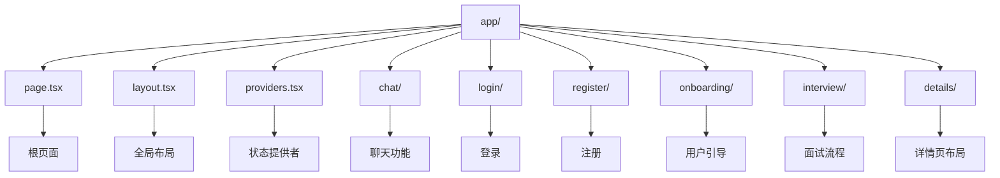
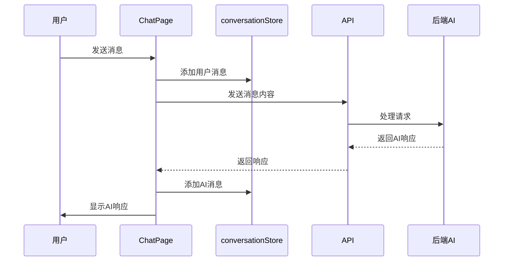
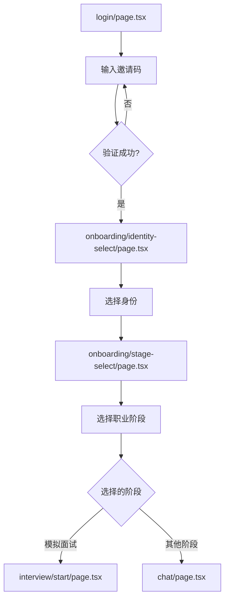
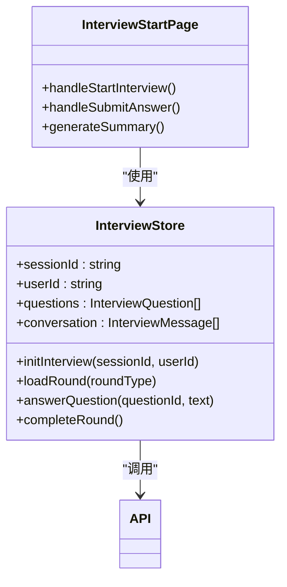

# 页面路由详解

<cite>
**本文档引用的文件**   
- [page.tsx](file://app/page.tsx)
- [layout.tsx](file://app/layout.tsx)
- [providers.tsx](file://app/providers.tsx)
- [chat/page.tsx](file://app/chat/page.tsx)
- [login/page.tsx](file://app/login/page.tsx)
- [register/page.tsx](file://app/register/page.tsx)
- [onboarding/identity-select/page.tsx](file://app/onboarding/identity-select/page.tsx)
- [onboarding/stage-select/page.tsx](file://app/onboarding/stage-select/page.tsx)
- [interview/start/page.tsx](file://app/interview/start/page.tsx)
- [chat/resume/[id]/page.tsx](file://app/chat/resume/[id]/page.tsx)
- [details/layout.tsx](file://app/details/layout.tsx)
- [conversationStore.ts](file://lib/conversationStore.ts)
- [interviewStore.tsx](file://store/interviewStore.tsx)
</cite>

## 目录
1. [项目结构与路由机制](#项目结构与路由机制)
2. [静态页面与动态路由](#静态页面与动态路由)
3. [聊天页面与AI对话流](#聊天页面与ai对话流)
4. [用户引导流程分析](#用户引导流程分析)
5. [嵌套路由与布局复用](#嵌套路由与布局复用)
6. [状态管理与数据交互](#状态管理与数据交互)

## 项目结构与路由机制

本项目采用 Next.js App Router 架构，`app/` 目录下的文件结构直接映射为应用的路由。每个 `page.tsx` 文件作为其所在路径的路由入口，由 Next.js 自动处理路由匹配和页面渲染。根目录下的 `layout.tsx` 定义了全局布局，包含应用的元数据、CSP 安全策略和全局样式，所有页面共享此布局。

`page.tsx` 作为应用的根页面，实现了会话检查逻辑。通过读取 cookie 或 localStorage 中的会话信息，判断用户是否已登录。如果存在有效会话，则自动重定向到 `/chat` 聊天页面；否则，显示应用介绍和功能卡片，引导用户点击“立即开始使用”按钮进入登录流程。



**Diagram sources**
- [page.tsx](file://app/page.tsx#L1-L126)
- [layout.tsx](file://app/layout.tsx#L1-L58)
- [providers.tsx](file://app/providers.tsx#L1-L13)

**Section sources**
- [page.tsx](file://app/page.tsx#L1-L126)
- [layout.tsx](file://app/layout.tsx#L1-L58)
- [providers.tsx](file://app/providers.tsx#L1-L13)

## 静态页面与动态路由

项目中的页面分为静态页面和动态路由页面。静态页面如 `login/page.tsx` 和 `register/page.tsx` 具有固定的路径，用于处理用户认证流程。`login/page.tsx` 实现了带有视觉动效的登录界面，用户输入邀请码后，通过调用 `/api/invites/check` 和 `/api/auth/create-session` API 验证并创建会话，成功后跳转至用户身份选择页。

动态路由页面通过方括号 `[ ]` 定义路径参数。例如，`chat/resume/[id]/page.tsx` 允许通过不同的 `id` 参数访问不同的简历对比页面。该页面使用 `useParams()` 钩子获取 `id` 参数，并根据 `id` 从 localStorage 或模拟数据中加载对应的简历数据，实现简历优化前后的对比展示。

```mermaid
graph TD
A[静态页面] --> B[login/page.tsx]
A --> C[register/page.tsx]
D[动态路由] --> E[chat/resume/[id]/page.tsx]
D --> F[chat/interview/[round]/page.tsx]
D --> G[details/interview[id]/page.tsx]
B --> H[用户登录]
C --> I[用户注册]
E --> J[简历对比]
F --> K[面试轮次]
G --> L[面试报告详情]
```

**Diagram sources**
- [login/page.tsx](file://app/login/page.tsx#L1-L388)
- [register/page.tsx](file://app/register/page.tsx#L1-L26)
- [chat/resume/[id]/page.tsx](file://app/chat/resume/[id]/page.tsx#L1-L111)

**Section sources**
- [login/page.tsx](file://app/login/page.tsx#L1-L388)
- [register/page.tsx](file://app/register/page.tsx#L1-L26)
- [chat/resume/[id]/page.tsx](file://app/chat/resume/[id]/page.tsx#L1-L111)

## 聊天页面与AI对话流

`chat/page.tsx` 是应用的核心交互页面，集成了聊天流、白板和阶段控制器。页面通过 `useStageFSM` 钩子管理用户在不同职业阶段（如职业规划、简历优化、模拟面试等）之间的切换。每个阶段的聊天记录和白板数据被独立存储，当用户切换阶段时，页面会加载对应的历史消息和白板内容。

页面通过 `conversationStore` 管理对话历史，确保不同阶段的对话互不干扰。当用户发送消息时，消息被添加到当前阶段的对话历史中，并通过 API 发送到后端进行处理。后端返回的 AI 响应被格式化后添加到消息列表，实现与 AI 的实时对话。



**Diagram sources**
- [chat/page.tsx](file://app/chat/page.tsx#L1-L800)
- [conversationStore.ts](file://lib/conversationStore.ts#L1-L258)

**Section sources**
- [chat/page.tsx](file://app/chat/page.tsx#L1-L800)
- [conversationStore.ts](file://lib/conversationStore.ts#L1-L258)

## 用户引导流程分析

用户引导流程始于 `login/page.tsx`，用户输入邀请码后跳转至 `onboarding/identity-select/page.tsx`。此页面提供“在校生”和“社招生”两种身份选择，用户选择后，身份信息被保存至 localStorage，并跳转至 `onboarding/stage-select/page.tsx`。

`onboarding/stage-select/page.tsx` 页面通过一个交互式的旅程地图，引导用户选择职业发展路径。页面动态渲染多个阶段卡片，并通过一个可移动的角色动画增强用户体验。当用户点击某个阶段卡片时，页面根据 `STAGE_ROUTER_MAP` 映射表进行路由跳转。例如，点击“模拟面试”会直接跳转到 `/interview/start` 页面，而其他阶段则跳转到 `/chat` 页面并传递相应的阶段参数。



**Diagram sources**
- [onboarding/identity-select/page.tsx](file://app/onboarding/identity-select/page.tsx#L1-L252)
- [onboarding/stage-select/page.tsx](file://app/onboarding/stage-select/page.tsx#L1-L559)

**Section sources**
- [onboarding/identity-select/page.tsx](file://app/onboarding/identity-select/page.tsx#L1-L252)
- [onboarding/stage-select/page.tsx](file://app/onboarding/stage-select/page.tsx#L1-L559)

## 嵌套路由与布局复用

`app/details/` 目录下的页面使用了嵌套路由和布局复用模式。`details/layout.tsx` 定义了一个共享布局，包含一个顶部导航栏，其中有一个“返回对话”按钮，可以一键返回 `/chat` 页面。所有位于 `details/` 目录下的子页面（如 `interview[id]/page.tsx`）都会自动继承此布局，无需重复编写导航逻辑。

这种模式确保了用户体验的一致性，用户在查看任何详情页时，都能方便地返回主聊天界面。同时，它也提高了代码的复用性，避免了在每个详情页中重复实现相同的导航功能。

```mermaid
graph TD
A[details/layout.tsx] --> B[顶部导航栏]
A --> C[返回对话按钮]
A --> D[内容区域]
D --> E[details/interview[id]/page.tsx]
D --> F[details/project[id]/page.tsx]
D --> G[details/resume[id]/page.tsx]
C --> H[router.push("/chat")]
```

**Diagram sources**
- [details/layout.tsx](file://app/details/layout.tsx#L1-L39)

**Section sources**
- [details/layout.tsx](file://app/details/layout.tsx#L1-L39)

## 状态管理与数据交互

应用使用了多种状态管理机制。`providers.tsx` 将 `InterviewProvider` 作为全局状态提供者，为整个应用提供面试相关的状态和方法。`interviewStore.tsx` 使用 React Context API 实现了一个全局的面试状态管理器，集中管理面试会话、问题列表、用户回答和评估结果。

页面组件通过调用 `interviewStore` 提供的方法（如 `answerQuestion`、`completeRound`）与后端 API 进行数据交互。例如，在 `interview/start/page.tsx` 中，当用户提交答案时，`handleSubmitAnswer` 函数会调用 `fetch` 发送 POST 请求到 `/api/interview/answer`，并将用户回答和问题 ID 作为请求体。后端处理后返回评估结果，前端将其更新到状态中并渲染到页面。



**Diagram sources**
- [interviewStore.tsx](file://store/interviewStore.tsx#L1-L789)
- [interview/start/page.tsx](file://app/interview/start/page.tsx#L1-L712)

**Section sources**
- [interviewStore.tsx](file://store/interviewStore.tsx#L1-L789)
- [interview/start/page.tsx](file://app/interview/start/page.tsx#L1-L712)