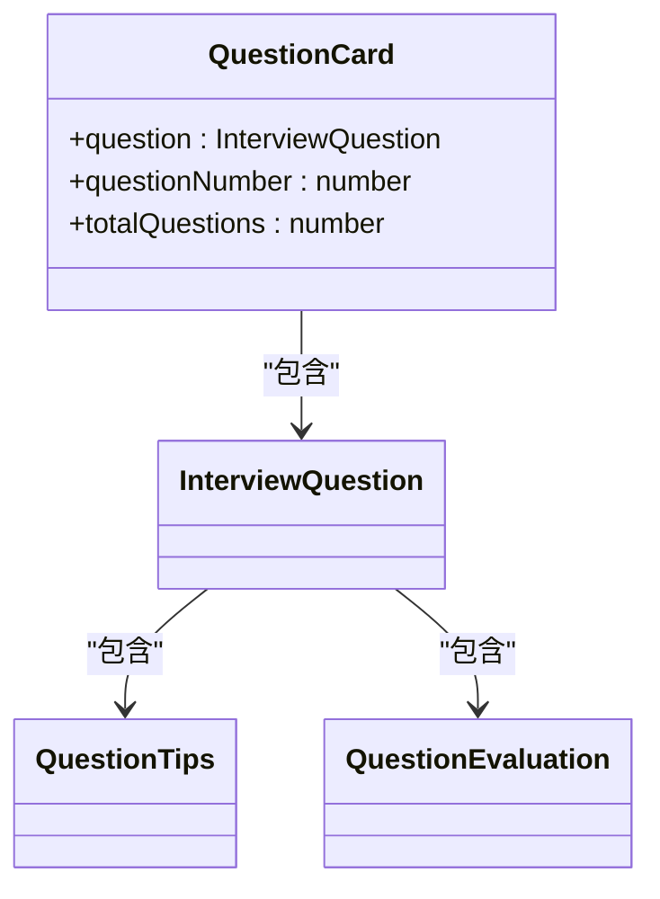
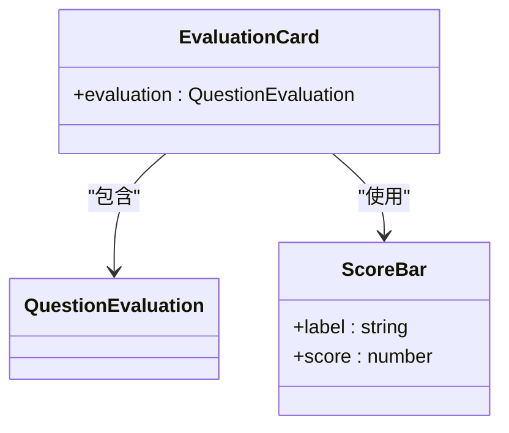
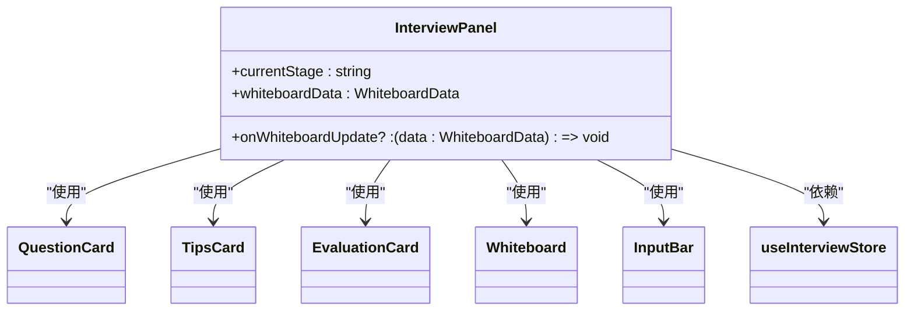
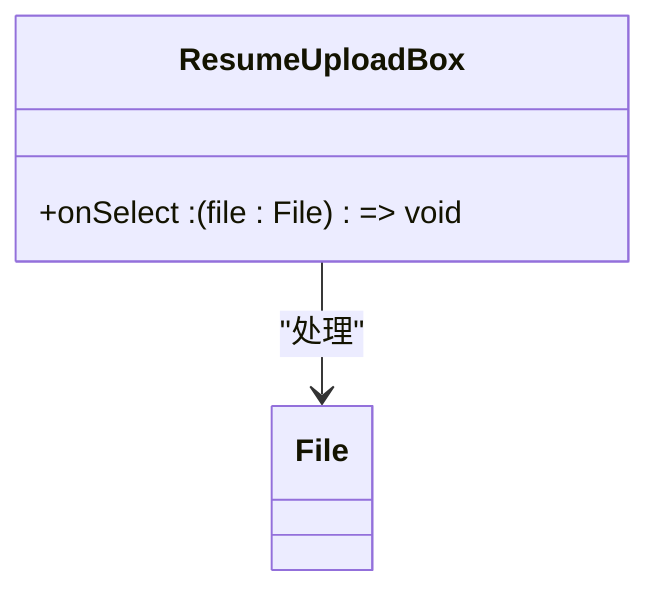
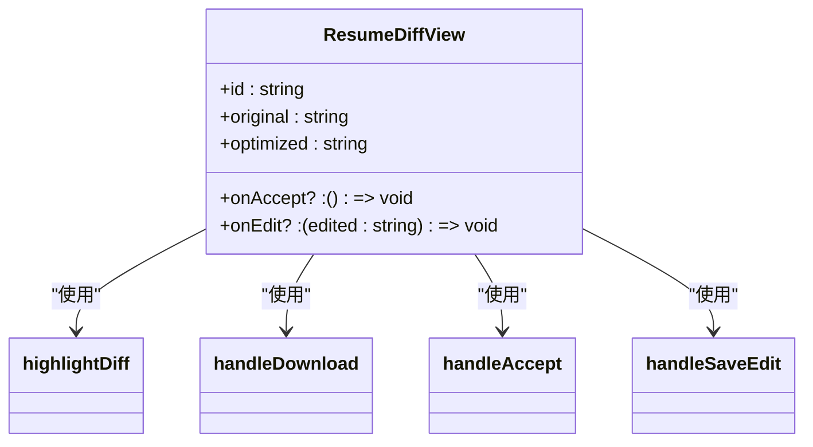
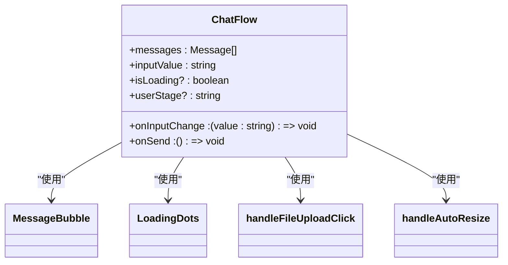
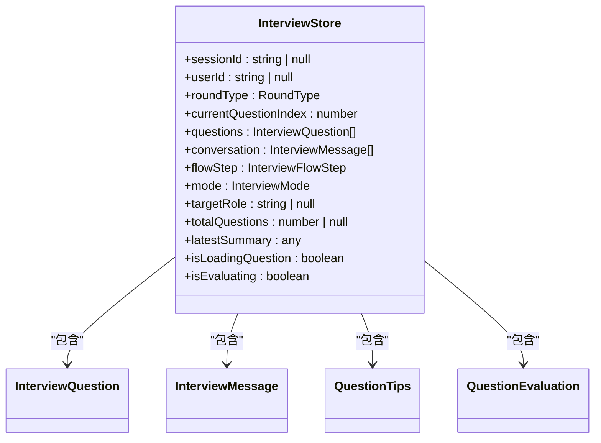
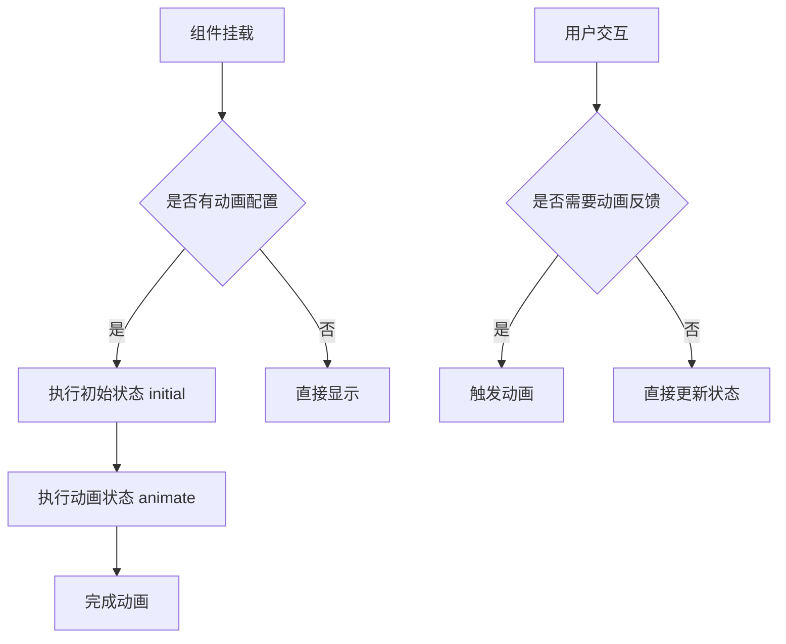
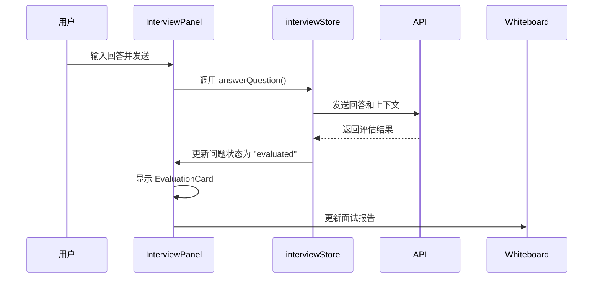

# components 目录详解

<cite>
**本文档引用的文件**   
- [components/interview/InterviewPanel.tsx](file://components/interview/InterviewPanel.tsx)
- [components/interview/QuestionCard.tsx](file://components/interview/QuestionCard.tsx)
- [components/interview/EvaluationCard.tsx](file://components/interview/EvaluationCard.tsx)
- [components/interview/TipsCard.tsx](file://components/interview/TipsCard.tsx)
- [components/resume/ResumeUploadBox.tsx](file://components/resume/ResumeUploadBox.tsx)
- [components/resume/ResumeDiffView.tsx](file://components/resume/ResumeDiffView.tsx)
- [components/ChatFlow.tsx](file://components/ChatFlow.tsx)
- [components/Whiteboard.tsx](file://components/Whiteboard.tsx)
- [components/StageSelector.tsx](file://components/StageSelector.tsx)
- [lib/conversationStore.ts](file://lib/conversationStore.ts)
- [store/interviewStore.tsx](file://store/interviewStore.tsx)
- [lib/stage.ts](file://lib/stage.ts)
</cite>

## 目录

1. [组件组织结构](#组件组织结构)
2. [面试相关UI组件](#面试相关ui组件)
3. [简历相关UI组件](#简历相关ui组件)
4. [通用组件与复用机制](#通用组件与复用机制)
5. [状态管理与数据流](#状态管理与数据流)
6. [UI设计与交互实现](#ui设计与交互实现)
7. [组件集成示例](#组件集成示例)

## 组件组织结构

`components/` 目录采用功能模块化的方式组织UI组件，主要分为三个层次：

1. **子目录分类**：通过 `interview/` 和 `resume/` 子目录分别封装面试和简历相关的专用组件
2. **通用组件**：位于根目录下的跨功能通用组件，如 `ChatFlow.tsx`、`Whiteboard.tsx` 等
3. **状态管理**：通过 `lib/` 和 `store/` 目录中的状态管理器协调组件间的数据流

这种组织结构实现了关注点分离，提高了代码的可维护性和可复用性。

**Section sources**
- [components/interview/InterviewPanel.tsx](file://components/interview/InterviewPanel.tsx)
- [components/resume/ResumeUploadBox.tsx](file://components/resume/ResumeUploadBox.tsx)
- [components/ChatFlow.tsx](file://components/ChatFlow.tsx)

## 面试相关UI组件

`interview/` 子目录封装了模拟面试功能的全套UI组件，形成完整的面试交互流程。

### QuestionCard 组件

`QuestionCard.tsx` 组件用于显示当前面试问题，包含问题编号、状态标识和问题内容。该组件通过 `framer-motion` 实现进入动画效果，并根据问题状态显示不同的视觉反馈。



**Diagram sources **
- [components/interview/QuestionCard.tsx](file://components/interview/QuestionCard.tsx)
- [store/interviewStore.tsx](file://store/interviewStore.tsx#L57-L64)

### EvaluationCard 组件

`EvaluationCard.tsx` 组件展示问题的评估结果，包含准确性、详细度、逻辑性和自信度四个维度的评分。组件使用进度条可视化评分，并通过颜色编码（绿色≥80分，黄色≥60分，红色<60分）提供直观的反馈。



**Diagram sources **
- [components/interview/EvaluationCard.tsx](file://components/interview/EvaluationCard.tsx)
- [store/interviewStore.tsx](file://store/interviewStore.tsx#L48-L54)

### TipsCard 组件

`TipsCard.tsx` 组件提供答题提示，包含考察意图、回答要点、框架建议、行业特性和避坑点等信息。该组件通过丰富的视觉层次帮助用户理解问题背后的考察逻辑。

```mermaid
classDiagram
class TipsCard {
+tips : QuestionTips
}
QuestionTips {
+intent : string
+keyPoints : string[]
+framework : string
+industryNotes? : string
+pitfalls? : string[]
+proTips? : string[]
}
TipsCard --> QuestionTips : "包含"
```

**Diagram sources **
- [components/interview/TipsCard.tsx](file://components/interview/TipsCard.tsx)
- [store/interviewStore.tsx](file://store/interviewStore.tsx#L38-L45)

### InterviewPanel 组件

`InterviewPanel.tsx` 是面试功能的主面板组件，采用三栏布局：
- **左侧**：聊天输入区，包含对话历史和输入栏
- **中间**：动态卡片区，显示问题卡片和评估结果
- **右侧**：白板总结区，实时记录面试关键信息

该组件协调多个子组件的工作流程，是面试功能的核心容器。



**Diagram sources **
- [components/interview/InterviewPanel.tsx](file://components/interview/InterviewPanel.tsx)
- [store/interviewStore.tsx](file://store/interviewStore.tsx)

**Section sources**
- [components/interview/InterviewPanel.tsx](file://components/interview/InterviewPanel.tsx)
- [components/interview/QuestionCard.tsx](file://components/interview/QuestionCard.tsx)
- [components/interview/EvaluationCard.tsx](file://components/interview/EvaluationCard.tsx)
- [components/interview/TipsCard.tsx](file://components/interview/TipsCard.tsx)

## 简历相关UI组件

`resume/` 子目录管理简历编辑与预览相关的UI组件，支持简历上传、解析和优化对比。

### ResumeUploadBox 组件

`ResumeUploadBox.tsx` 组件提供简历上传功能，支持PDF和Word格式。组件采用简洁的拖拽式设计，用户点击即可选择文件，上传后触发回调函数处理文件。



**Diagram sources **
- [components/resume/ResumeUploadBox.tsx](file://components/resume/ResumeUploadBox.tsx)

### ResumeDiffView 组件

`ResumeDiffView.tsx` 组件实现简历优化对比功能，采用双栏布局显示原始文本和优化文本。用户可以编辑优化版本、接受修改或下载结果。



**Diagram sources **
- [components/resume/ResumeDiffView.tsx](file://components/resume/ResumeDiffView.tsx)

**Section sources**
- [components/resume/ResumeUploadBox.tsx](file://components/resume/ResumeUploadBox.tsx)
- [components/resume/ResumeDiffView.tsx](file://components/resume/ResumeDiffView.tsx)

## 通用组件与复用机制

根目录下的通用组件被多个功能模块复用，体现了设计的一致性和效率。

### ChatFlow 组件

`ChatFlow.tsx` 组件实现对话流控制，包含消息列表、输入框和发送按钮。组件支持文件上传、自动调整输入框高度和回车发送消息等交互功能。



**Diagram sources **
- [components/ChatFlow.tsx](file://components/ChatFlow.tsx)
- [components/MessageBubble.tsx](file://components/MessageBubble.tsx)
- [components/LoadingDots.tsx](file://components/LoadingDots.tsx)

### Whiteboard 组件

`Whiteboard.tsx` 组件实现可编辑白板功能，根据不同求职阶段显示相应的信息卡片，如意向岗位、项目经历、简历优化建议等。组件支持动态内容更新和交互操作。

```mermaid
classDiagram
class Whiteboard {
+data? : WhiteboardData
+currentStage? : UserStage
+onUpdate? : (data : WhiteboardData) => void
}
WhiteboardData {
+intentRole? : string
+keySkills? : string[]
+starProjects? : Project[]
+resumeInsights? : Insight[]
+interviewReports? : Report[]
+targetCompanies? : Company[]
+salaryStrategy? : Strategy
+offers? : Offer[]
}
Whiteboard --> WhiteboardData : "使用"
Whiteboard --> router : "导航"
```

**Diagram sources **
- [components/Whiteboard.tsx](file://components/Whiteboard.tsx)
- [lib/stage.ts](file://lib/stage.ts)

### StageSelector 组件

`StageSelector.tsx` 组件实现阶段选择器功能，允许用户在求职流程的不同阶段间切换。组件显示当前阶段、已完成阶段和待开始阶段，并提供直观的视觉反馈。

```mermaid
classDiagram
class StageSelector {
+onSelectStage : (stage : UserStage) => void
+currentStage? : UserStage
+onClose? : () => void
}
UserStage {
+career_planning
+project_review
+resume_optimization
+application_strategy
+interview
+salary_talk
+offer
}
StageSelector --> UserStage : "使用"
StageSelector --> StageNames : "使用"
StageSelector --> StageDescriptions : "使用"
```

**Diagram sources **
- [components/StageSelector.tsx](file://components/StageSelector.tsx)
- [lib/stage.ts](file://lib/stage.ts)

**Section sources**
- [components/ChatFlow.tsx](file://components/ChatFlow.tsx)
- [components/Whiteboard.tsx](file://components/Whiteboard.tsx)
- [components/StageSelector.tsx](file://components/StageSelector.tsx)

## 状态管理与数据流

组件通过Zustand store（实际为自定义Context）实现状态同步，确保数据的一致性和响应性。

### conversationStore 状态管理

`lib/conversationStore.ts` 文件中的 `conversationStore` 管理各阶段的独立对话历史，支持按阶段存储和检索消息。

```mermaid
classDiagram
class ConversationStore {
+conversations : StageConversations
+currentUserId : string | null
+setUserId(userId : string | null) : void
+getStageHistory(stage : UserStage) : ConversationMessage[]
+addMessage(stage : UserStage, message : ConversationMessage) : void
+getAllHistoryForStage(currentStage : UserStage) : Array<{ role : "user" | "assistant", content : string }>
+clearStage(stage : UserStage) : void
+clearAll() : void
}
StageConversations {
+career_planning : ConversationMessage[]
+project_review : ConversationMessage[]
+resume_optimization : ConversationMessage[]
+application_strategy : ConversationMessage[]
+interview : ConversationMessage[]
+salary_talk : ConversationMessage[]
+offer : ConversationMessage[]
}
ConversationMessage {
+id : string
+sender : "user" | "ai"
+text : string
+timestamp : number
+stage : UserStage
}
ConversationStore --> StageConversations : "包含"
StageConversations --> ConversationMessage : "包含"
```

**Diagram sources **
- [lib/conversationStore.ts](file://lib/conversationStore.ts)

### interviewStore 状态管理

`store/interviewStore.tsx` 文件中的 `InterviewStore` 管理模拟面试的全局状态，包括问题列表、用户回答、评估结果和对话流程。



**Diagram sources **
- [store/interviewStore.tsx](file://store/interviewStore.tsx)

**Section sources**
- [lib/conversationStore.ts](file://lib/conversationStore.ts)
- [store/interviewStore.tsx](file://store/interviewStore.tsx)

## UI设计与交互实现

组件通过Tailwind CSS和Framer Motion实现响应式布局与交互动画。

### 响应式布局

组件采用移动优先的响应式设计，使用Tailwind CSS的断点系统（`md:`、`xl:`）适配不同屏幕尺寸。例如，`InterviewPanel` 在移动设备上堆叠显示，在桌面设备上采用三栏布局。

### 交互动画

通过Framer Motion实现流畅的交互动画效果：
- **进入动画**：组件使用 `initial`、`animate` 和 `transition` 属性实现淡入和滑动效果
- **状态变化**：按钮点击、卡片展开等操作都有相应的动画反馈
- **加载状态**：使用 `LoadingDots` 组件提供视觉反馈



**Diagram sources **
- [components/interview/InterviewPanel.tsx](file://components/interview/InterviewPanel.tsx)
- [components/Whiteboard.tsx](file://components/Whiteboard.tsx)
- [components/StageSelector.tsx](file://components/StageSelector.tsx)

**Section sources**
- [components/interview/InterviewPanel.tsx](file://components/interview/InterviewPanel.tsx)
- [components/Whiteboard.tsx](file://components/Whiteboard.tsx)
- [components/StageSelector.tsx](file://components/StageSelector.tsx)

## 组件集成示例

以 `InterviewPanel` 组件为例，展示如何协调LLM响应与用户输入。

### 数据流分析



### 集成要点

1. **状态同步**：`InterviewPanel` 通过 `useInterviewStore` Hook 订阅状态变化
2. **流程控制**：根据 `flowStep` 状态决定下一步操作（如等待角色、轮次选择等）
3. **数据持久化**：面试总结自动同步到 `Whiteboard` 组件并保存到 `localStorage`
4. **错误处理**：网络请求失败时提供友好的用户提示

**Section sources**
- [components/interview/InterviewPanel.tsx](file://components/interview/InterviewPanel.tsx)
- [store/interviewStore.tsx](file://store/interviewStore.tsx)
- [components/Whiteboard.tsx](file://components/Whiteboard.tsx)