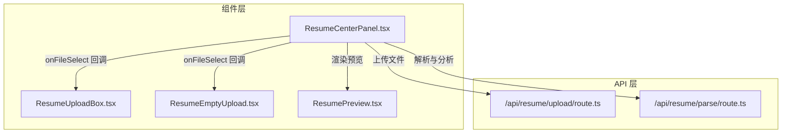
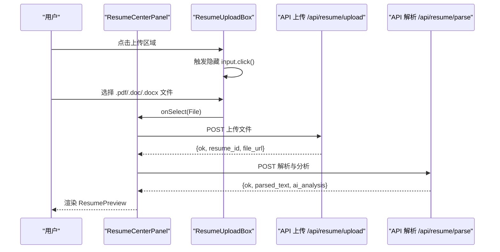
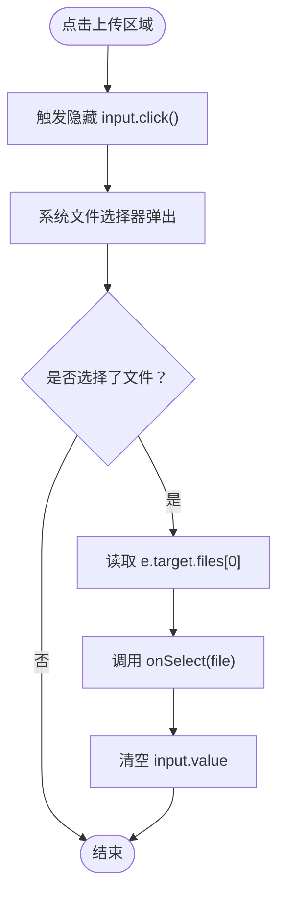
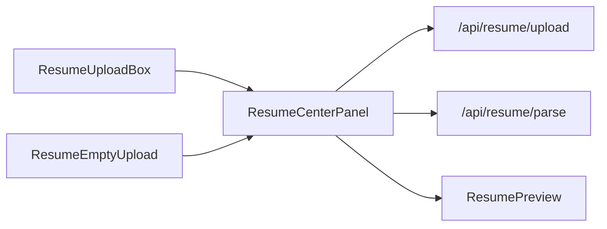

# 简历上传框组件 (ResumeUploadBox)

<cite>
**本文引用的文件列表**
- [components/resume/ResumeUploadBox.tsx](file://components/resume/ResumeUploadBox.tsx)
- [components/resume/ResumeEmptyUpload.tsx](file://components/resume/ResumeEmptyUpload.tsx)
- [components/resume/ResumeCenterPanel.tsx](file://components/resume/ResumeCenterPanel.tsx)
- [components/resume/ResumePreview.tsx](file://components/resume/ResumePreview.tsx)
- [app/api/resume/upload/route.ts](file://app/api/resume/upload/route.ts)
- [app/api/resume/parse/route.ts](file://app/api/resume/parse/route.ts)
</cite>

## 目录
1. [引言](#引言)
2. [项目结构](#项目结构)
3. [核心组件](#核心组件)
4. [架构总览](#架构总览)
5. [详细组件分析](#详细组件分析)
6. [依赖关系分析](#依赖关系分析)
7. [性能考量](#性能考量)
8. [故障排查指南](#故障排查指南)
9. [结论](#结论)
10. [附录](#附录)

## 引言
本文件围绕 ResumeUploadBox 组件进行深入分析，重点解释其通过隐藏的文件输入元素与点击事件实现“点击选择文件”的交互逻辑；说明 accept 属性如何限制用户仅能选择 .pdf、.doc、.docx 格式的简历文件；详述 handleFileChange 回调如何捕获用户选择的文件并通过 onSelect 回调传递给父组件；并结合 UI 设计，阐述该组件如何通过简洁的拖拽区域样式与提示文本引导用户完成上传操作，以及其在简历上传流程中的入口作用。

## 项目结构
ResumeUploadBox 位于组件层的简历模块中，作为简历中心面板（ResumeCenterPanel）的入口占位组件之一，负责接收用户选择的文件并交由上层处理。与之功能相近的还有 ResumeEmptyUpload 组件，它在 UI 上提供了更丰富的拖拽体验，二者共同构成简历上传入口。

图表来源
- [components/resume/ResumeUploadBox.tsx](file://components/resume/ResumeUploadBox.tsx#L1-L56)
- [components/resume/ResumeEmptyUpload.tsx](file://components/resume/ResumeEmptyUpload.tsx#L1-L72)
- [components/resume/ResumeCenterPanel.tsx](file://components/resume/ResumeCenterPanel.tsx#L1-L182)
- [components/resume/ResumePreview.tsx](file://components/resume/ResumePreview.tsx#L1-L296)
- [app/api/resume/upload/route.ts](file://app/api/resume/upload/route.ts#L1-L155)
- [app/api/resume/parse/route.ts](file://app/api/resume/parse/route.ts#L1-L345)

章节来源
- [components/resume/ResumeUploadBox.tsx](file://components/resume/ResumeUploadBox.tsx#L1-L56)
- [components/resume/ResumeEmptyUpload.tsx](file://components/resume/ResumeEmptyUpload.tsx#L1-L72)
- [components/resume/ResumeCenterPanel.tsx](file://components/resume/ResumeCenterPanel.tsx#L1-L182)

## 核心组件
- ResumeUploadBox：一个轻量的点击式上传入口，内部通过隐藏的 file input 实现“点击选择文件”，并通过 accept 限制可选文件类型，最终将 File 对象通过 onSelect 回调交给父组件。
- ResumeEmptyUpload：与 ResumeUploadBox 类似，但额外支持拖拽放置，适合更灵活的上传场景。
- ResumeCenterPanel：简历中心面板，负责管理上传状态、发起上传与解析请求，并在完成后渲染 ResumePreview。
- ResumePreview：展示解析后的简历信息与 AI 分析结果。
- API 路由：/api/resume/upload 与 /api/resume/parse，分别负责文件上传与解析分析。

章节来源
- [components/resume/ResumeUploadBox.tsx](file://components/resume/ResumeUploadBox.tsx#L1-L56)
- [components/resume/ResumeEmptyUpload.tsx](file://components/resume/ResumeEmptyUpload.tsx#L1-L72)
- [components/resume/ResumeCenterPanel.tsx](file://components/resume/ResumeCenterPanel.tsx#L1-L182)
- [components/resume/ResumePreview.tsx](file://components/resume/ResumePreview.tsx#L1-L296)
- [app/api/resume/upload/route.ts](file://app/api/resume/upload/route.ts#L1-L155)
- [app/api/resume/parse/route.ts](file://app/api/resume/parse/route.ts#L1-L345)

## 架构总览
ResumeUploadBox 作为简历上传流程的入口组件，其职责是：
- 提供可视化的“点击选择文件”区域；
- 通过隐藏的 file input 触发系统文件选择器；
- 限制可接受的文件类型；
- 将用户选择的文件传递给父组件（通常为 ResumeCenterPanel）。

父组件（ResumeCenterPanel）随后执行：
- 调用 /api/resume/upload 执行文件上传；
- 成功后调用 /api/resume/parse 执行解析与 AI 分析；
- 在完成后渲染 ResumePreview 展示结果。

图表来源
- [components/resume/ResumeUploadBox.tsx](file://components/resume/ResumeUploadBox.tsx#L1-L56)
- [components/resume/ResumeCenterPanel.tsx](file://components/resume/ResumeCenterPanel.tsx#L1-L182)
- [app/api/resume/upload/route.ts](file://app/api/resume/upload/route.ts#L1-L155)
- [app/api/resume/parse/route.ts](file://app/api/resume/parse/route.ts#L1-L345)

## 详细组件分析

### ResumeUploadBox 组件分析
- 交互逻辑
  - 通过 useRef 持有隐藏的 file input 引用；
  - handleClick 回调触发 fileInputRef.current?.click()，从而唤起系统文件选择器；
  - 用户选择文件后，handleFileChange 读取 e.target.files[0] 并通过 onSelect 回调传递给父组件；
  - 为保证重复选择同一文件仍能触发 onChange，组件会在处理后将 input 的值清空。
- 文件类型限制
  - input 上设置 accept=".pdf,.doc,.docx"，浏览器会过滤掉非目标类型的文件，提升用户体验；
  - 后端同样对扩展名进行校验，确保安全性。
- UI 设计
  - 外层容器采用虚线边框、居中布局与悬停高亮，形成清晰的“拖拽区域”视觉；
  - 包含上传图标、标题与辅助说明文本，明确引导用户点击选择文件；
  - 最大宽度约束与内边距使组件在不同屏幕尺寸下保持良好可读性。

图表来源
- [components/resume/ResumeUploadBox.tsx](file://components/resume/ResumeUploadBox.tsx#L1-L56)

章节来源
- [components/resume/ResumeUploadBox.tsx](file://components/resume/ResumeUploadBox.tsx#L1-L56)

### 与 ResumeEmptyUpload 的对比
- 功能差异
  - ResumeUploadBox 仅支持点击触发选择；
  - ResumeEmptyUpload 额外支持 onDragOver 与 onDrop，提供拖拽上传能力；
  - 两者均通过隐藏 input 与 accept 限制文件类型。
- 适用场景
  - ResumeUploadBox 更简洁，适合快速上传；
  - ResumeEmptyUpload 更灵活，适合多设备与多操作习惯的用户。

章节来源
- [components/resume/ResumeEmptyUpload.tsx](file://components/resume/ResumeEmptyUpload.tsx#L1-L72)

### 在简历上传流程中的入口作用
- ResumeCenterPanel 在 idle 状态下渲染 ResumeUploadBox（或 ResumeEmptyUpload），作为用户上传简历的唯一入口；
- 当用户选择文件后，父组件接管后续流程：上传、解析与分析，并在完成后展示 ResumePreview；
- 该设计将“选择文件”与“上传/解析/展示”解耦，便于维护与扩展。

章节来源
- [components/resume/ResumeCenterPanel.tsx](file://components/resume/ResumeCenterPanel.tsx#L1-L182)

## 依赖关系分析
- 组件间依赖
  - ResumeUploadBox 依赖父组件传入的 onSelect 回调；
  - ResumeCenterPanel 依赖 ResumeUploadBox/ResumeEmptyUpload 的文件选择回调，驱动上传与解析流程；
  - ResumeCenterPanel 依赖 ResumePreview 展示解析结果。
- API 依赖
  - /api/resume/upload：负责文件上传、存储与元数据写入；
  - /api/resume/parse：负责下载文件、解析文本、调用 AI 分析并更新数据库状态。

图表来源
- [components/resume/ResumeUploadBox.tsx](file://components/resume/ResumeUploadBox.tsx#L1-L56)
- [components/resume/ResumeEmptyUpload.tsx](file://components/resume/ResumeEmptyUpload.tsx#L1-L72)
- [components/resume/ResumeCenterPanel.tsx](file://components/resume/ResumeCenterPanel.tsx#L1-L182)
- [components/resume/ResumePreview.tsx](file://components/resume/ResumePreview.tsx#L1-L296)
- [app/api/resume/upload/route.ts](file://app/api/resume/upload/route.ts#L1-L155)
- [app/api/resume/parse/route.ts](file://app/api/resume/parse/route.ts#L1-L345)

章节来源
- [components/resume/ResumeCenterPanel.tsx](file://components/resume/ResumeCenterPanel.tsx#L1-L182)
- [app/api/resume/upload/route.ts](file://app/api/resume/upload/route.ts#L1-L155)
- [app/api/resume/parse/route.ts](file://app/api/resume/parse/route.ts#L1-L345)

## 性能考量
- 事件绑定与回调
  - 使用 useCallback 缓存 handleClick 与 handleFileChange，减少不必要的重渲染；
  - 仅在 onSelect 发生变化时重新创建回调，避免无关依赖导致的重绑。
- 输入重置
  - 选择同一文件时通过清空 input.value 保证 onChange 仍被触发，避免用户重复选择无效。
- UI 响应
  - 外层容器采用过渡与悬停效果，提升交互反馈，但需注意在低端设备上的性能表现。

章节来源
- [components/resume/ResumeUploadBox.tsx](file://components/resume/ResumeUploadBox.tsx#L1-L56)

## 故障排查指南
- 无法选择文件
  - 确认点击的是外层容器而非隐藏 input；
  - 检查 accept 是否正确设置为 ".pdf,.doc,.docx"；
  - 浏览器可能因隐私设置或安全策略阻止文件选择器弹出。
- 选择文件后 onSelect 未触发
  - 确认父组件已正确传入 onSelect；
  - 检查 handleFileChange 是否被调用（可通过浏览器开发者工具断点验证）。
- 上传失败或解析失败
  - 检查 /api/resume/upload 与 /api/resume/parse 的返回状态与错误信息；
  - 确认文件大小与扩展名符合后端限制；
  - 确认 Supabase 存储配置与数据库连接正常。
- UI 无响应
  - 检查外层容器的点击事件是否被其他元素遮挡；
  - 确认 hover 与 transition 样式未被覆盖。

章节来源
- [components/resume/ResumeUploadBox.tsx](file://components/resume/ResumeUploadBox.tsx#L1-L56)
- [app/api/resume/upload/route.ts](file://app/api/resume/upload/route.ts#L1-L155)
- [app/api/resume/parse/route.ts](file://app/api/resume/parse/route.ts#L1-L345)

## 结论
ResumeUploadBox 通过隐藏的 file input 与点击事件实现了简洁高效的“点击选择文件”交互，配合 accept 属性与后端校验，确保了文件类型的安全性与一致性。其作为简历上传流程的入口组件，与 ResumeCenterPanel 协同工作，完成从文件选择到解析展示的完整闭环。该设计在保证易用性的同时，也具备良好的可维护性与扩展性。

## 附录
- 文件类型支持
  - 前端 accept 限制：.pdf、.doc、.docx；
  - 后端扩展名校验：pdf、doc、docx；
  - 注意：解析 API 对 docx 支持良好，对 doc 的支持有限，建议优先使用 .docx。
- 状态流转
  - idle → uploading → parsing → ready；
  - 错误时回退至 idle 并清理状态。

章节来源
- [components/resume/ResumeUploadBox.tsx](file://components/resume/ResumeUploadBox.tsx#L1-L56)
- [components/resume/ResumeCenterPanel.tsx](file://components/resume/ResumeCenterPanel.tsx#L1-L182)
- [app/api/resume/upload/route.ts](file://app/api/resume/upload/route.ts#L1-L155)
- [app/api/resume/parse/route.ts](file://app/api/resume/parse/route.ts#L1-L345)