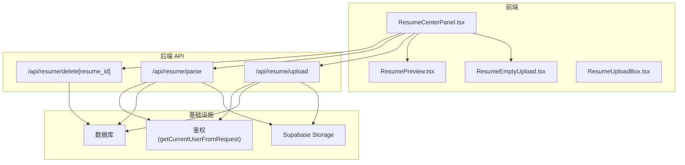
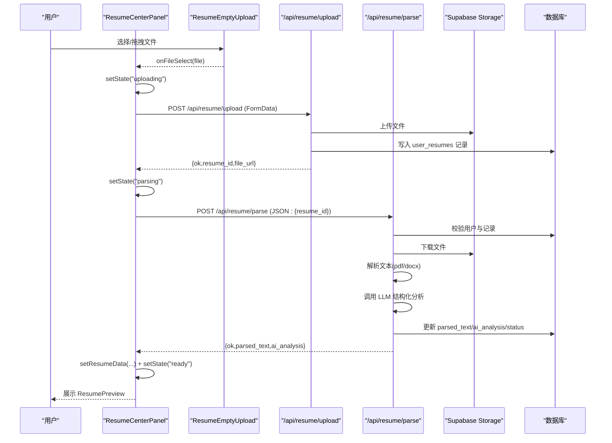
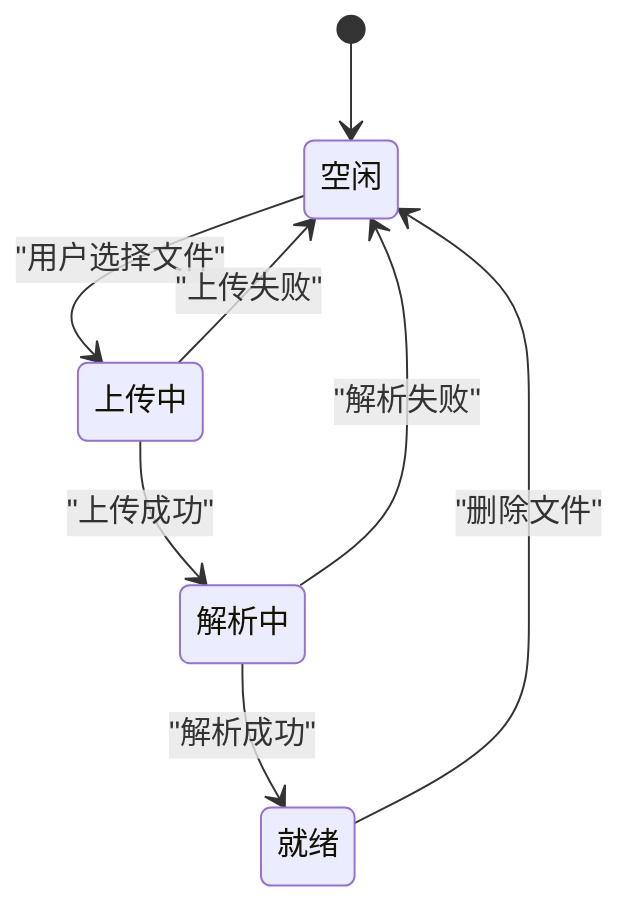
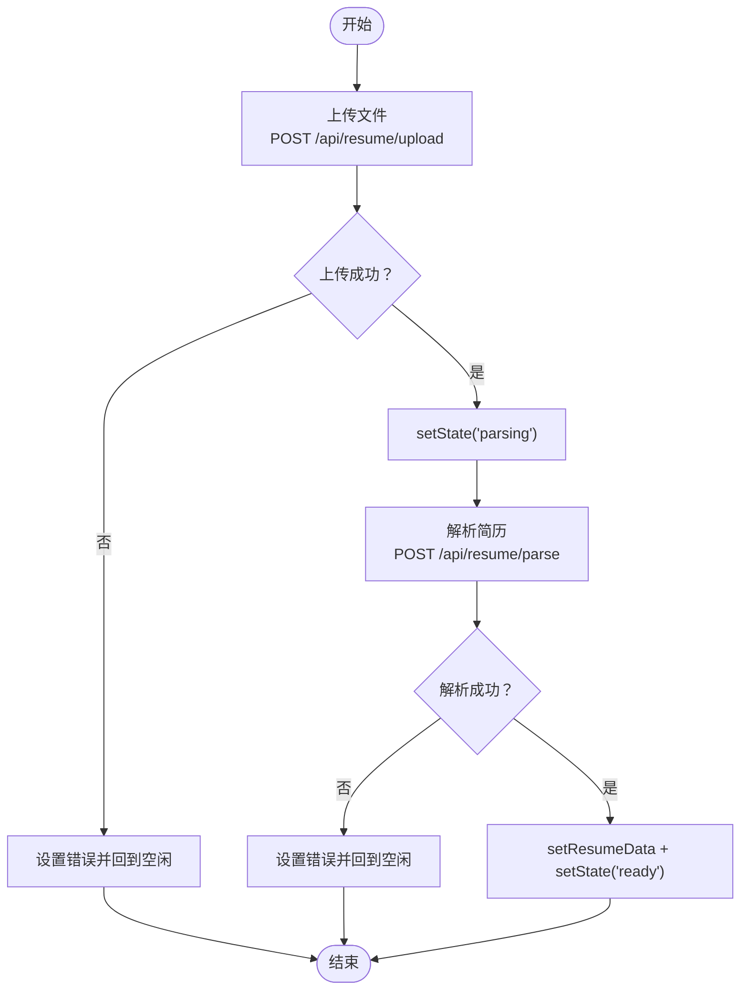
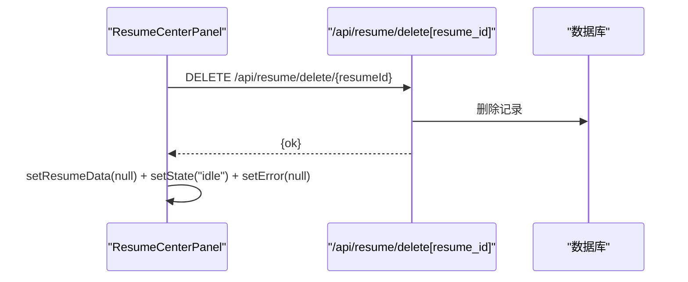
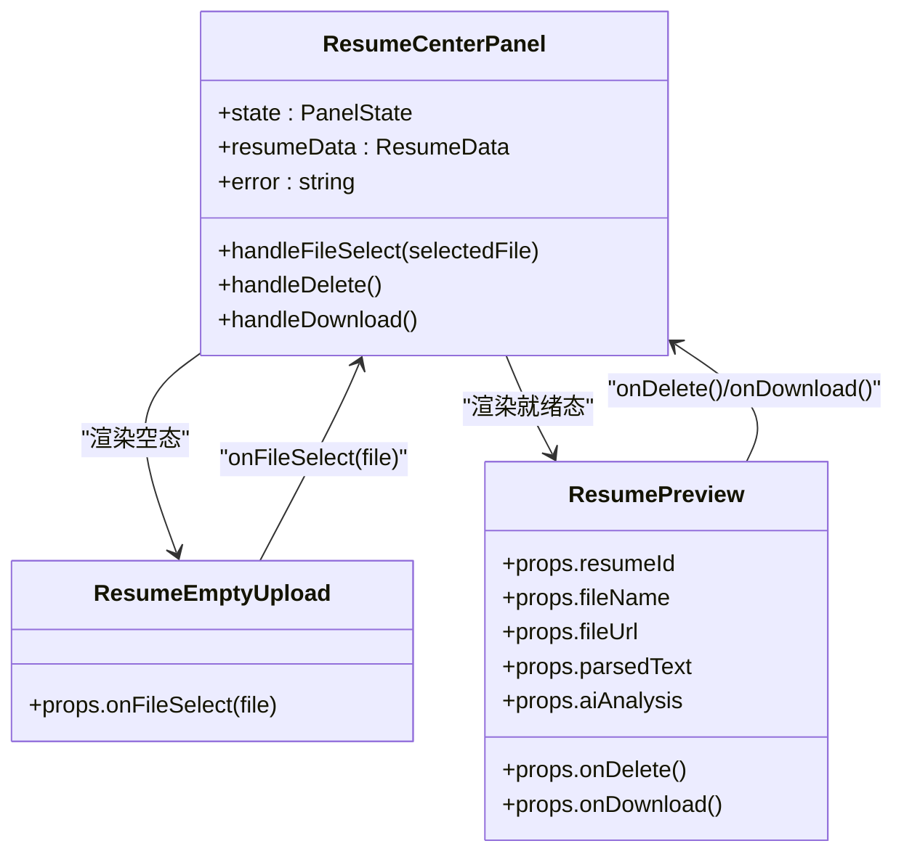
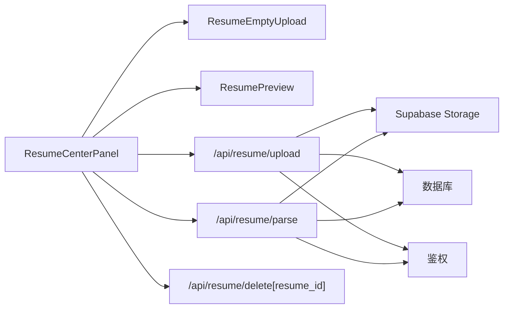

# 简历中心主控组件 (ResumeCenterPanel)

<cite>
**本文引用的文件列表**
- [components/resume/ResumeCenterPanel.tsx](file://components/resume/ResumeCenterPanel.tsx)
- [components/resume/ResumeEmptyUpload.tsx](file://components/resume/ResumeEmptyUpload.tsx)
- [components/resume/ResumePreview.tsx](file://components/resume/ResumePreview.tsx)
- [components/resume/ResumeUploadBox.tsx](file://components/resume/ResumeUploadBox.tsx)
- [app/api/resume/upload/route.ts](file://app/api/resume/upload/route.ts)
- [app/api/resume/parse/route.ts](file://app/api/resume/parse/route.ts)
- [app/api/resume/delete[resume_id]/route.ts](file://app/api/resume/delete[resume_id]/route.ts)
- [lib/db.ts](file://lib/db.ts)
- [lib/auth.ts](file://lib/auth.ts)
</cite>

## 目录
1. [引言](#引言)
2. [项目结构](#项目结构)
3. [核心组件](#核心组件)
4. [架构总览](#架构总览)
5. [详细组件分析](#详细组件分析)
6. [依赖关系分析](#依赖关系分析)
7. [性能考量](#性能考量)
8. [故障排查指南](#故障排查指南)
9. [结论](#结论)

## 引言
本文件围绕 ResumeCenterPanel 作为简历功能的核心控制器进行深入剖析，系统说明其内部状态机（PanelState）如何管理“空闲”、“上传中”、“解析中”、“就绪”四种状态，并驱动 UI 在空状态、加载中和就绪状态之间切换；重点拆解 handleFileSelect 的完整异步流程：先通过 FormData 调用 /api/resume/upload 上传文件，再使用返回的 resume_id 调用 /api/resume/parse 触发内容解析，最终将结果整合到 resumeData 状态；阐述 handleDelete 与 handleDownload 如何分别调用 DELETE 与 GET API 实现文件管理；并说明该组件如何作为容器协调 ResumeEmptyUpload、ResumePreview 等子组件，与后端 API 紧密集成，构成完整的简历处理工作流。

## 项目结构
- 前端简历模块位于 components/resume，包含主控组件与子组件：
  - ResumeCenterPanel.tsx：核心控制器，管理状态机与 UI 切换
  - ResumeEmptyUpload.tsx：空态上传入口，接收文件并回调主控
  - ResumePreview.tsx：就绪态预览面板，展示解析结果与 AI 分析
  - ResumeUploadBox.tsx：通用上传框组件（复用能力）
- 后端简历 API 位于 app/api/resume，包含上传、解析、删除三个路由：
  - upload/route.ts：文件上传、存储至 Supabase Storage、写入数据库
  - parse/route.ts：根据 resume_id 下载文件、解析文本、调用 LLM 结构化分析、更新数据库
  - delete[resume_id]/route.ts：删除简历记录与文件
- 数据库与鉴权辅助：
  - lib/db.ts：统一数据库客户端封装（Supabase）
  - lib/auth.ts：从请求中获取当前用户信息

图表来源
- [components/resume/ResumeCenterPanel.tsx](file://components/resume/ResumeCenterPanel.tsx#L133-L179)
- [components/resume/ResumeEmptyUpload.tsx](file://components/resume/ResumeEmptyUpload.tsx#L1-L72)
- [components/resume/ResumePreview.tsx](file://components/resume/ResumePreview.tsx#L1-L296)
- [app/api/resume/upload/route.ts](file://app/api/resume/upload/route.ts#L1-L155)
- [app/api/resume/parse/route.ts](file://app/api/resume/parse/route.ts#L1-L345)
- [app/api/resume/delete[resume_id]/route.ts](file://app/api/resume/delete[resume_id]/route.ts#L1-L200)
- [lib/db.ts](file://lib/db.ts#L1-L48)
- [lib/auth.ts](file://lib/auth.ts#L1-L40)

章节来源
- [components/resume/ResumeCenterPanel.tsx](file://components/resume/ResumeCenterPanel.tsx#L1-L182)
- [components/resume/ResumeEmptyUpload.tsx](file://components/resume/ResumeEmptyUpload.tsx#L1-L72)
- [components/resume/ResumePreview.tsx](file://components/resume/ResumePreview.tsx#L1-L296)
- [components/resume/ResumeUploadBox.tsx](file://components/resume/ResumeUploadBox.tsx#L1-L56)
- [app/api/resume/upload/route.ts](file://app/api/resume/upload/route.ts#L1-L155)
- [app/api/resume/parse/route.ts](file://app/api/resume/parse/route.ts#L1-L345)
- [app/api/resume/delete[resume_id]/route.ts](file://app/api/resume/delete[resume_id]/route.ts#L1-L200)
- [lib/db.ts](file://lib/db.ts#L1-L48)
- [lib/auth.ts](file://lib/auth.ts#L1-L40)

## 核心组件
- ResumeCenterPanel.tsx
  - 状态机：PanelState = "idle" | "uploading" | "parsing" | "ready"
  - 状态流转：
    - idle → uploading：用户选择文件后进入上传阶段
    - uploading → parsing：上传成功后进入解析阶段
    - parsing → ready：解析成功后进入就绪态，展示 ResumePreview
    - 任一阶段出错 → idle：清空数据并回到空态
  - 数据模型：ResumeData
    - resumeId、fileName、fileUrl、parsedText、aiAnalysis
  - 关键方法：
    - handleFileSelect：串联上传与解析的完整流程
    - handleDelete：调用 DELETE /api/resume/delete/[resume_id]
    - handleDownload：打开 fileUrl（Supabase 公开 URL）

章节来源
- [components/resume/ResumeCenterPanel.tsx](file://components/resume/ResumeCenterPanel.tsx#L7-L39)
- [components/resume/ResumeCenterPanel.tsx](file://components/resume/ResumeCenterPanel.tsx#L40-L179)

## 架构总览
ResumeCenterPanel 作为容器组件，承担以下职责：
- 管理 PanelState 并驱动 UI 切换
- 协调子组件：空态上传框与就绪态预览面板
- 与后端 API 紧密集成：上传、解析、删除
- 错误处理与提示：统一错误状态与用户提示

图表来源
- [components/resume/ResumeCenterPanel.tsx](file://components/resume/ResumeCenterPanel.tsx#L40-L96)
- [app/api/resume/upload/route.ts](file://app/api/resume/upload/route.ts#L1-L155)
- [app/api/resume/parse/route.ts](file://app/api/resume/parse/route.ts#L201-L342)

## 详细组件分析

### ResumeCenterPanel 状态机与 UI 切换
- 状态定义与初始值
  - PanelState = "idle" | "uploading" | "parsing" | "ready"
  - 初始状态：idle
- UI 切换规则
  - state === "idle"：渲染 ResumeEmptyUpload
  - state === "uploading" 或 "parsing"：渲染加载中骨架
  - state === "ready" 且存在 resumeData：渲染 ResumePreview
- 错误提示
  - error 状态通过固定提示条展示，支持关闭

图表来源
- [components/resume/ResumeCenterPanel.tsx](file://components/resume/ResumeCenterPanel.tsx#L133-L179)

章节来源
- [components/resume/ResumeCenterPanel.tsx](file://components/resume/ResumeCenterPanel.tsx#L7-L39)
- [components/resume/ResumeCenterPanel.tsx](file://components/resume/ResumeCenterPanel.tsx#L133-L179)

### handleFileSelect 异步流程详解
- 步骤分解
  1) 上传文件
     - 使用 FormData 附带 file 字段
     - 调用 /api/resume/upload，携带 credentials: "include"
     - 成功后得到 resume_id 与 file_url
  2) 触发解析
     - setState("parsing")
     - 调用 /api/resume/parse，传入 { resume_id }
     - 成功后得到 parsed_text 与 ai_analysis
  3) 更新状态
     - setResumeData(resumeId, fileName, fileUrl, parsedText, aiAnalysis)
     - setState("ready")

- 错误处理
  - 任一步失败均设置 error，回退到 idle 并清空 resumeData

图表来源
- [components/resume/ResumeCenterPanel.tsx](file://components/resume/ResumeCenterPanel.tsx#L40-L96)
- [app/api/resume/upload/route.ts](file://app/api/resume/upload/route.ts#L1-L155)
- [app/api/resume/parse/route.ts](file://app/api/resume/parse/route.ts#L201-L342)

章节来源
- [components/resume/ResumeCenterPanel.tsx](file://components/resume/ResumeCenterPanel.tsx#L40-L96)
- [app/api/resume/upload/route.ts](file://app/api/resume/upload/route.ts#L1-L155)
- [app/api/resume/parse/route.ts](file://app/api/resume/parse/route.ts#L201-L342)

### handleDelete 与 handleDownload
- handleDelete
  - 调用 DELETE /api/resume/delete/[resume_id]
  - 成功后清空 resumeData、恢复 idle、清除错误
- handleDownload
  - 打开 resumeData.fileUrl（Supabase 公开 URL），无需额外下载逻辑

图表来源
- [components/resume/ResumeCenterPanel.tsx](file://components/resume/ResumeCenterPanel.tsx#L98-L131)
- [app/api/resume/delete[resume_id]/route.ts](file://app/api/resume/delete[resume_id]/route.ts#L1-L200)

章节来源
- [components/resume/ResumeCenterPanel.tsx](file://components/resume/ResumeCenterPanel.tsx#L98-L131)
- [app/api/resume/delete[resume_id]/route.ts](file://app/api/resume/delete[resume_id]/route.ts#L1-L200)

### 子组件协作
- ResumeEmptyUpload
  - 提供文件选择入口，支持点击与拖拽
  - 回调 onFileSelect(file)，交由 ResumeCenterPanel 处理
- ResumePreview
  - 展示文件名、下载与删除按钮
  - 展示 AI 分析结果（基本信息、技能、经历、教育、项目、分析建议）
  - 支持查看原始解析文本

图表来源
- [components/resume/ResumeCenterPanel.tsx](file://components/resume/ResumeCenterPanel.tsx#L133-L179)
- [components/resume/ResumeEmptyUpload.tsx](file://components/resume/ResumeEmptyUpload.tsx#L1-L72)
- [components/resume/ResumePreview.tsx](file://components/resume/ResumePreview.tsx#L1-L296)

章节来源
- [components/resume/ResumeCenterPanel.tsx](file://components/resume/ResumeCenterPanel.tsx#L133-L179)
- [components/resume/ResumeEmptyUpload.tsx](file://components/resume/ResumeEmptyUpload.tsx#L1-L72)
- [components/resume/ResumePreview.tsx](file://components/resume/ResumePreview.tsx#L1-L296)

## 依赖关系分析
- 组件耦合
  - ResumeCenterPanel 与 ResumeEmptyUpload/ResumePreview 通过 props 与回调解耦
  - 与 API 的耦合集中在 fetch 调用处，便于替换与测试
- 外部依赖
  - Supabase Storage：文件上传与公开 URL 获取
  - 数据库：用户简历记录的持久化与查询
  - 鉴权：从请求中获取当前用户，保障资源访问控制
- 可能的循环依赖
  - 当前文件结构清晰，未见循环依赖迹象

图表来源
- [components/resume/ResumeCenterPanel.tsx](file://components/resume/ResumeCenterPanel.tsx#L133-L179)
- [app/api/resume/upload/route.ts](file://app/api/resume/upload/route.ts#L1-L155)
- [app/api/resume/parse/route.ts](file://app/api/resume/parse/route.ts#L201-L342)
- [app/api/resume/delete[resume_id]/route.ts](file://app/api/resume/delete[resume_id]/route.ts#L1-L200)
- [lib/db.ts](file://lib/db.ts#L1-L48)
- [lib/auth.ts](file://lib/auth.ts#L1-L40)

章节来源
- [components/resume/ResumeCenterPanel.tsx](file://components/resume/ResumeCenterPanel.tsx#L133-L179)
- [app/api/resume/upload/route.ts](file://app/api/resume/upload/route.ts#L1-L155)
- [app/api/resume/parse/route.ts](file://app/api/resume/parse/route.ts#L201-L342)
- [app/api/resume/delete[resume_id]/route.ts](file://app/api/resume/delete[resume_id]/route.ts#L1-L200)
- [lib/db.ts](file://lib/db.ts#L1-L48)
- [lib/auth.ts](file://lib/auth.ts#L1-L40)

## 性能考量
- 上传与解析耗时
  - 上传阶段受网络与文件大小影响；解析阶段受文件解析与 LLM 调用耗时影响
- UI 响应
  - 通过状态机及时反馈 loading 状态，避免用户误以为卡死
- 存储与缓存
  - 使用 Supabase 公开 URL 直接下载，减少中间层转发
- 可扩展点
  - 解析阶段可引入分片或后台任务队列，避免阻塞主线程
  - 前端可加入节流/防抖，避免重复提交

## 故障排查指南
- 上传失败
  - 检查文件类型与大小限制（仅支持 .pdf/.doc/.docx，最大 10MB）
  - 确认鉴权状态（未登录会返回 401）
  - 查看 Supabase 配置是否正确
- 解析失败
  - 检查文件是否为扫描版 PDF（无法提取文本）
  - 检查 LLM 调用是否超时或返回非 JSON
  - 确认 resume_id 是否有效且属于当前用户
- 删除失败
  - 确认 resume_id 是否存在且属于当前用户
- 下载失败
  - 确认 fileUrl 是否有效（Supabase 公开 URL）

章节来源
- [app/api/resume/upload/route.ts](file://app/api/resume/upload/route.ts#L1-L155)
- [app/api/resume/parse/route.ts](file://app/api/resume/parse/route.ts#L201-L342)
- [app/api/resume/delete[resume_id]/route.ts](file://app/api/resume/delete[resume_id]/route.ts#L1-L200)
- [lib/auth.ts](file://lib/auth.ts#L1-L40)

## 结论
ResumeCenterPanel 以清晰的状态机为核心，串联上传、解析与预览三大环节，通过 ResumeEmptyUpload 与 ResumePreview 实现空态与就绪态的无缝切换。其与 /api/resume/upload、/api/resume/parse、/api/resume/delete[resume_id] 的集成严谨可靠，配合鉴权与数据库校验，保证了安全性与一致性。整体设计具备良好的可维护性与扩展性，适合进一步引入后台任务与缓存策略以优化性能与用户体验。