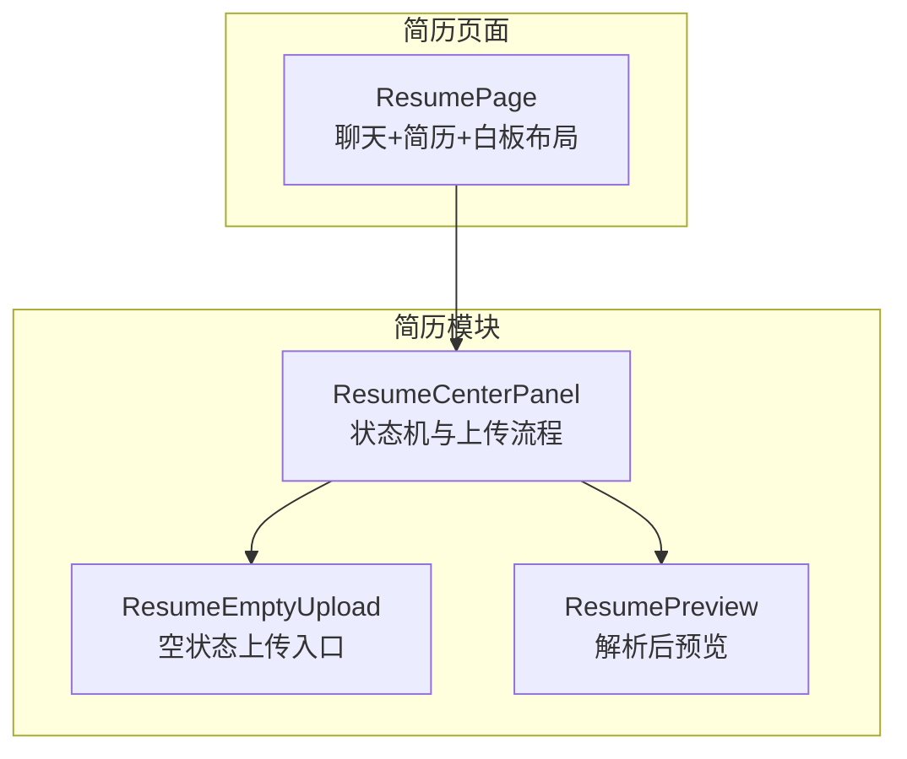
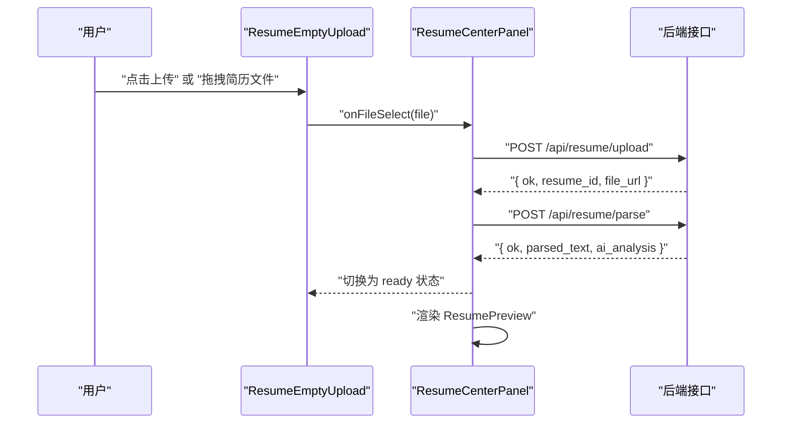
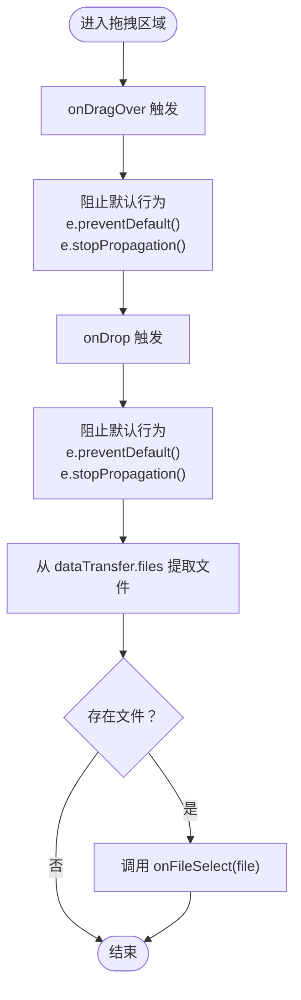
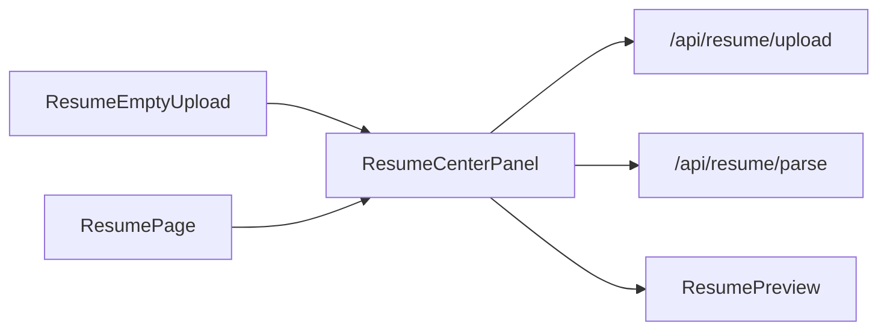
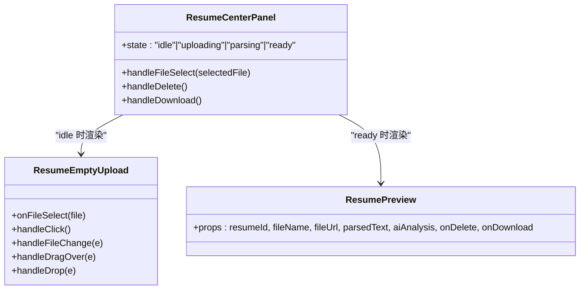

# 简历空状态上传组件 (ResumeEmptyUpload)

<cite>
**本文引用的文件**
- [components/resume/ResumeEmptyUpload.tsx](file://components/resume/ResumeEmptyUpload.tsx)
- [components/resume/ResumeUploadBox.tsx](file://components/resume/ResumeUploadBox.tsx)
- [components/resume/ResumeCenterPanel.tsx](file://components/resume/ResumeCenterPanel.tsx)
- [components/resume/ResumePreview.tsx](file://components/resume/ResumePreview.tsx)
- [app/chat/resume/page.tsx](file://app/chat/resume/page.tsx)
</cite>

## 目录
1. [引言](#引言)
2. [项目结构](#项目结构)
3. [核心组件](#核心组件)
4. [架构总览](#架构总览)
5. [详细组件分析](#详细组件分析)
6. [依赖关系分析](#依赖关系分析)
7. [性能考虑](#性能考虑)
8. [故障排查指南](#故障排查指南)
9. [结论](#结论)
10. [附录](#附录)

## 引言
本文件面向“简历空状态上传组件（ResumeEmptyUpload）”的全面解析，重点说明其作为初始空状态的职责、如何同时支持“点击上传”和“拖拽上传”的两种交互方式；深入阐述 handleDragOver 与 handleDrop 事件处理器如何协同工作以实现拖拽功能并阻止默认行为；解释 onFileSelect 回调如何将选中的文件传递给父组件进行后续处理；并通过与 ResumeUploadBox 的对比，突出 ResumeEmptyUpload 更完整的拖拽支持与更丰富的用户引导提示，使其成为简历上传流程的首选入口组件。

## 项目结构
ResumeEmptyUpload 是简历模块的核心入口组件之一，通常在“简历中心面板（ResumeCenterPanel）”处于空闲状态时展示，用于引导用户上传简历。它通过 onFileSelect 回调将文件交由父组件执行上传、解析与 AI 分析等后续流程。

图表来源
- [app/chat/resume/page.tsx](file://app/chat/resume/page.tsx#L220-L243)
- [components/resume/ResumeCenterPanel.tsx](file://components/resume/ResumeCenterPanel.tsx#L133-L179)
- [components/resume/ResumeEmptyUpload.tsx](file://components/resume/ResumeEmptyUpload.tsx#L48-L68)
- [components/resume/ResumePreview.tsx](file://components/resume/ResumePreview.tsx#L1-L296)

章节来源
- [app/chat/resume/page.tsx](file://app/chat/resume/page.tsx#L220-L243)
- [components/resume/ResumeCenterPanel.tsx](file://components/resume/ResumeCenterPanel.tsx#L133-L179)

## 核心组件
- ResumeEmptyUpload：空状态上传入口，提供点击与拖拽两种上传方式，负责拦截拖拽事件并调用父组件回调。
- ResumeUploadBox：基础上传框，仅支持点击选择文件，无拖拽支持。
- ResumeCenterPanel：简历中心面板，维护上传状态机，接收文件后执行上传与解析。
- ResumePreview：解析完成后的预览与分析结果展示。

章节来源
- [components/resume/ResumeEmptyUpload.tsx](file://components/resume/ResumeEmptyUpload.tsx#L1-L72)
- [components/resume/ResumeUploadBox.tsx](file://components/resume/ResumeUploadBox.tsx#L1-L56)
- [components/resume/ResumeCenterPanel.tsx](file://components/resume/ResumeCenterPanel.tsx#L1-L182)
- [components/resume/ResumePreview.tsx](file://components/resume/ResumePreview.tsx#L1-L296)

## 架构总览
ResumeEmptyUpload 作为初始空状态组件，被 ResumeCenterPanel 在 idle 状态下渲染。当用户触发上传（点击或拖拽），组件通过 onFileSelect 将单个文件传递给父组件；父组件随后发起上传请求、解析请求，并在完成后切换到 ready 状态，展示 ResumePreview。

图表来源
- [components/resume/ResumeEmptyUpload.tsx](file://components/resume/ResumeEmptyUpload.tsx#L10-L15)
- [components/resume/ResumeCenterPanel.tsx](file://components/resume/ResumeCenterPanel.tsx#L40-L96)
- [components/resume/ResumePreview.tsx](file://components/resume/ResumePreview.tsx#L1-L296)

## 详细组件分析

### ResumeEmptyUpload 组件职责与交互
- 空状态职责：在用户尚未上传简历时，提供清晰的上传入口与引导文案，鼓励用户通过点击或拖拽上传。
- 交互方式：
  - 点击上传：通过隐藏的文件输入框与外层容器的点击事件配合，触发文件选择。
  - 拖拽上传：通过 onDragOver 与 onDrop 事件拦截浏览器默认行为，并从 dataTransfer 中提取文件。
- 文件选择回调：onFileSelect 回调将单个文件传给父组件，父组件负责后续上传与解析。
- 用户引导：包含支持的文件类型提示与“点击或拖拽”的明确指引，提升易用性。

章节来源
- [components/resume/ResumeEmptyUpload.tsx](file://components/resume/ResumeEmptyUpload.tsx#L10-L15)
- [components/resume/ResumeEmptyUpload.tsx](file://components/resume/ResumeEmptyUpload.tsx#L17-L29)
- [components/resume/ResumeEmptyUpload.tsx](file://components/resume/ResumeEmptyUpload.tsx#L31-L46)
- [components/resume/ResumeEmptyUpload.tsx](file://components/resume/ResumeEmptyUpload.tsx#L48-L68)

#### 事件处理流程图（拖拽）

图表来源
- [components/resume/ResumeEmptyUpload.tsx](file://components/resume/ResumeEmptyUpload.tsx#L31-L46)

### ResumeCenterPanel 与上传流程
- 状态机：idle → uploading → parsing → ready；在 idle 时渲染 ResumeEmptyUpload。
- onFileSelect 实现：接收文件后构造 FormData 并调用上传接口；成功后再调用解析接口；最终更新状态并渲染 ResumePreview。
- 错误处理：捕获上传/解析异常，设置错误状态并回退到 idle。

章节来源
- [components/resume/ResumeCenterPanel.tsx](file://components/resume/ResumeCenterPanel.tsx#L35-L96)
- [components/resume/ResumeCenterPanel.tsx](file://components/resume/ResumeCenterPanel.tsx#L133-L179)

### 与 ResumeUploadBox 的对比
- 拖拽支持：ResumeEmptyUpload 显式处理 onDragOver 与 onDrop，阻止默认行为并从 dataTransfer 中读取文件；ResumeUploadBox 仅支持点击选择文件，无拖拽支持。
- 用户引导：ResumeEmptyUpload 提供“支持上传 .pdf / .word 简历”“点击或拖拽文件到此处”等更丰富的提示；ResumeUploadBox 提供“上传简历”“支持 PDF 和 Word”等基础提示。
- 使用场景：ResumeEmptyUpload 作为空状态入口，适合初次引导用户上传；ResumeUploadBox 更偏向于通用上传框，适合已有文件选择逻辑的场景。

章节来源
- [components/resume/ResumeEmptyUpload.tsx](file://components/resume/ResumeEmptyUpload.tsx#L48-L68)
- [components/resume/ResumeUploadBox.tsx](file://components/resume/ResumeUploadBox.tsx#L31-L51)

### ResumePreview 与后续流程
- 当解析完成且状态为 ready 时，ResumeCenterPanel 渲染 ResumePreview，展示解析出的文本与 AI 分析结果，并提供下载与删除操作。
- 该组件与 ResumeEmptyUpload 无直接交互，但共同构成“上传→解析→预览”的完整闭环。

章节来源
- [components/resume/ResumePreview.tsx](file://components/resume/ResumePreview.tsx#L1-L296)
- [components/resume/ResumeCenterPanel.tsx](file://components/resume/ResumeCenterPanel.tsx#L133-L179)

## 依赖关系分析
- ResumeEmptyUpload 依赖：
  - 外部回调 onFileSelect，用于将文件交给父组件处理。
  - 浏览器原生拖拽事件（onDragOver、onDrop）与 dataTransfer。
- ResumeCenterPanel 依赖：
  - ResumeEmptyUpload（idle 状态渲染）。
  - 后端接口：/api/resume/upload、/api/resume/parse。
  - ResumePreview（ready 状态渲染）。
- 页面布局：
  - ResumePage 将 ResumeCenterPanel 作为中间列，形成“聊天+简历+白板”的三栏布局。

图表来源
- [components/resume/ResumeEmptyUpload.tsx](file://components/resume/ResumeEmptyUpload.tsx#L10-L15)
- [components/resume/ResumeCenterPanel.tsx](file://components/resume/ResumeCenterPanel.tsx#L40-L96)
- [components/resume/ResumePreview.tsx](file://components/resume/ResumePreview.tsx#L1-L296)
- [app/chat/resume/page.tsx](file://app/chat/resume/page.tsx#L220-L243)

章节来源
- [components/resume/ResumeCenterPanel.tsx](file://components/resume/ResumeCenterPanel.tsx#L133-L179)
- [app/chat/resume/page.tsx](file://app/chat/resume/page.tsx#L220-L243)

## 性能考虑
- 单文件限制：拖拽与点击均只取 dataTransfer.files[0]，避免多文件带来的复杂性与潜在性能开销。
- 重复选择同一文件：通过重置 input.value，允许用户重复选择同一文件而无需刷新页面。
- 事件处理：使用 useCallback 缓存事件处理器，减少不必要的重渲染。
- 状态切换：在上传与解析阶段采用骨架屏提示，避免长时间空白导致的感知卡顿。

章节来源
- [components/resume/ResumeEmptyUpload.tsx](file://components/resume/ResumeEmptyUpload.tsx#L17-L29)
- [components/resume/ResumeEmptyUpload.tsx](file://components/resume/ResumeEmptyUpload.tsx#L31-L46)
- [components/resume/ResumeCenterPanel.tsx](file://components/resume/ResumeCenterPanel.tsx#L139-L153)

## 故障排查指南
- 拖拽无效：
  - 确认 onDragOver 与 onDrop 是否正确绑定到外层容器。
  - 确保在两个事件中均调用 preventDefault 与 stopPropagation。
  - 检查 dataTransfer.files 是否存在且非空。
- 点击无法选择文件：
  - 确认隐藏 input 的 ref 是否正确传递给外层容器的 onClick。
  - 确认 accept 属性与目标文件类型一致。
- 上传/解析失败：
  - 检查父组件 onFileSelect 的实现是否正确构造 FormData 并调用对应接口。
  - 查看错误提示与状态回退逻辑，确认错误信息是否正确显示。
- 预览不显示：
  - 确认状态已切换至 ready 且 resumeData 已填充。
  - 检查 ResumePreview 的 props 是否正确传递。

章节来源
- [components/resume/ResumeEmptyUpload.tsx](file://components/resume/ResumeEmptyUpload.tsx#L31-L46)
- [components/resume/ResumeEmptyUpload.tsx](file://components/resume/ResumeEmptyUpload.tsx#L17-L29)
- [components/resume/ResumeCenterPanel.tsx](file://components/resume/ResumeCenterPanel.tsx#L40-L96)
- [components/resume/ResumeCenterPanel.tsx](file://components/resume/ResumeCenterPanel.tsx#L133-L179)

## 结论
ResumeEmptyUpload 作为简历上传流程的首选入口组件，具备以下优势：
- 完整的拖拽支持：通过 onDragOver 与 onDrop 阻止默认行为并准确提取文件。
- 丰富的用户引导：明确的文件类型提示与“点击或拖拽”的双重入口，降低使用门槛。
- 与父组件解耦：通过 onFileSelect 回调将文件传递给 ResumeCenterPanel，保持职责清晰。
- 与 ResumeUploadBox 对比：后者仅支持点击，缺乏拖拽与丰富提示，更适合已有选择逻辑的场景。

因此，在需要引导用户首次上传简历的空状态场景中，ResumeEmptyUpload 是更优的选择。

## 附录
- 组件关系类图（基于源码）

图表来源
- [components/resume/ResumeEmptyUpload.tsx](file://components/resume/ResumeEmptyUpload.tsx#L10-L68)
- [components/resume/ResumeCenterPanel.tsx](file://components/resume/ResumeCenterPanel.tsx#L35-L179)
- [components/resume/ResumePreview.tsx](file://components/resume/ResumePreview.tsx#L23-L40)