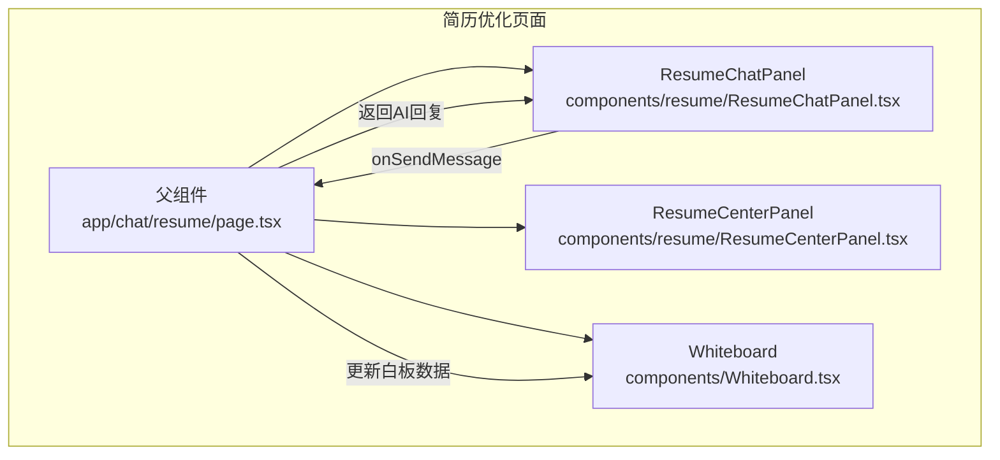
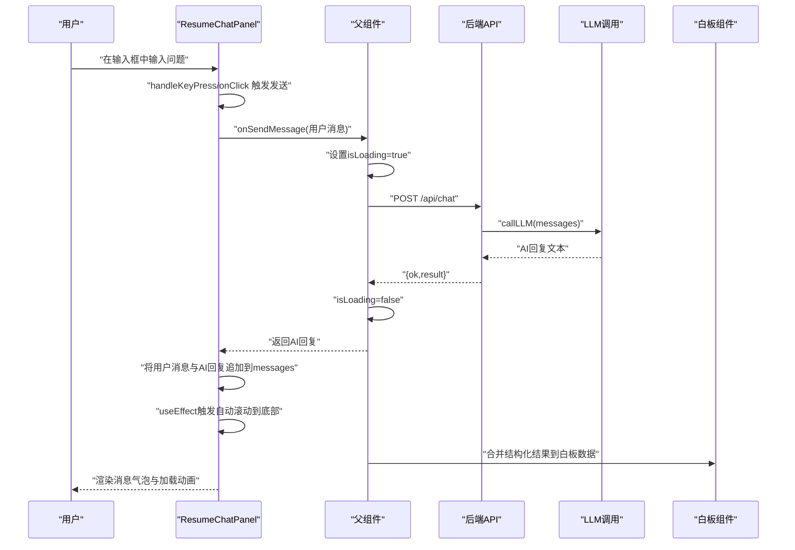
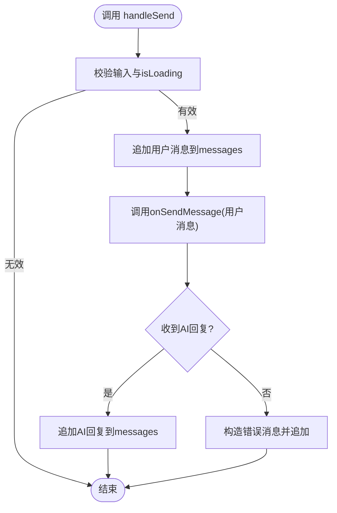
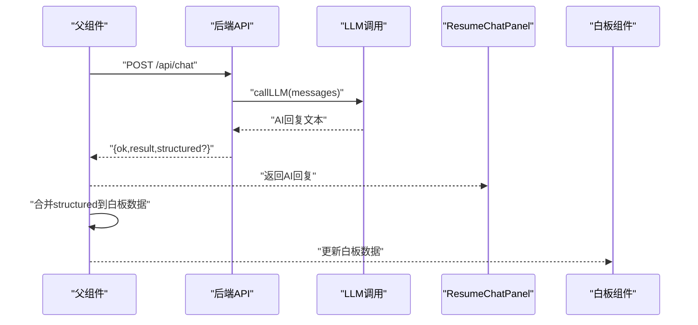
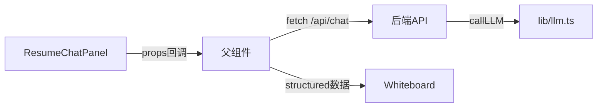

# 简历聊天面板组件 (ResumeChatPanel)

<cite>
**本文引用的文件**
- [components/resume/ResumeChatPanel.tsx](file://components/resume/ResumeChatPanel.tsx)
- [app/chat/resume/page.tsx](file://app/chat/resume/page.tsx)
- [components/LoadingDots.tsx](file://components/LoadingDots.tsx)
- [components/MessageBubble.tsx](file://components/MessageBubble.tsx)
- [app/api/chat/route.ts](file://app/api/chat/route.ts)
- [lib/llm.ts](file://lib/llm.ts)
- [components/Whiteboard.tsx](file://components/Whiteboard.tsx)
</cite>

## 目录
1. [引言](#引言)
2. [项目结构](#项目结构)
3. [核心组件](#核心组件)
4. [架构总览](#架构总览)
5. [详细组件分析](#详细组件分析)
6. [依赖关系分析](#依赖关系分析)
7. [性能考量](#性能考量)
8. [故障排查指南](#故障排查指南)
9. [结论](#结论)

## 引言
本文件围绕 ResumeChatPanel 组件在“简历优化对话”场景中的作用进行深入解析。该组件承担了用户与 AI 在简历优化过程中的主要交互职责：维护对话历史、处理用户输入、触发消息发送、自动滚动至最新消息、支持键盘快捷键、并在加载期间显示加载动画。同时，组件通过 props 与父组件通信，将用户消息交由父组件发起网络请求，再将 AI 回复追加到消息列表中，形成完整的聊天闭环。

## 项目结构
ResumeChatPanel 位于组件层，作为简历优化页面的左侧聊天区，与中间的简历中心面板、右侧的智能白板共同构成三栏布局。父组件负责会话状态、加载状态与消息发送逻辑，并将 AI 回复注入到白板数据中，从而实现“对话即洞察”的效果。

图表来源
- [app/chat/resume/page.tsx](file://app/chat/resume/page.tsx#L205-L242)
- [components/resume/ResumeChatPanel.tsx](file://components/resume/ResumeChatPanel.tsx#L1-L137)

章节来源
- [app/chat/resume/page.tsx](file://app/chat/resume/page.tsx#L205-L242)

## 核心组件
- ResumeChatPanel：负责渲染消息列表、输入框、发送按钮；管理本地状态 messages、inputValue、isLoading；实现自动滚动、键盘事件、错误兜底。
- 父组件（简历优化页面）：维护 isLoading、会话 ID、用户 ID；封装 onSendMessage，调用后端 API 并将结果回填给子组件；同时将结构化结果合并进白板数据。
- 白板组件：根据当前阶段展示不同类型的洞察，包括简历优化建议等，与聊天面板形成“对话—洞察”的闭环。

章节来源
- [components/resume/ResumeChatPanel.tsx](file://components/resume/ResumeChatPanel.tsx#L1-L137)
- [app/chat/resume/page.tsx](file://app/chat/resume/page.tsx#L111-L191)
- [components/Whiteboard.tsx](file://components/Whiteboard.tsx#L1-L120)

## 架构总览
下图展示了从用户输入到 AI 回复并更新 UI 的完整流程，以及加载态与消息气泡的呈现方式。

图表来源
- [components/resume/ResumeChatPanel.tsx](file://components/resume/ResumeChatPanel.tsx#L24-L61)
- [app/chat/resume/page.tsx](file://app/chat/resume/page.tsx#L111-L191)
- [app/api/chat/route.ts](file://app/api/chat/route.ts#L145-L236)
- [lib/llm.ts](file://lib/llm.ts#L81-L161)
- [components/Whiteboard.tsx](file://components/Whiteboard.tsx#L261-L413)

## 详细组件分析

### 组件职责与状态管理
- messages 数组：用于存储对话历史，每个元素包含唯一 id、内容 content、布尔标志 isUser（区分用户消息与 AI 消息）。组件通过 setMessages 追加用户消息与 AI 回复，保证渲染顺序与可追踪性。
- inputValue：受控输入框的本地状态，发送前清空，避免重复提交。
- isLoading：由父组件传递，用于禁用输入与发送按钮、显示加载动画，确保交互一致性。
- 自动滚动：通过 useRef 获取消息容器底部 ref，在 messages 更新后触发 smooth 滚动，使最新消息始终可见。

章节来源
- [components/resume/ResumeChatPanel.tsx](file://components/resume/ResumeChatPanel.tsx#L12-L23)
- [components/resume/ResumeChatPanel.tsx](file://components/resume/ResumeChatPanel.tsx#L16-L22)

### handleSend 函数全流程
- 输入校验：若输入为空或 isLoading 为真则直接返回，防止并发与无效请求。
- 用户消息入队：构造用户消息对象并追加到 messages，立即在 UI 上可见。
- 调用父组件回调：调用 onSendMessage，传入用户消息内容，等待 Promise 返回。
- AI 回复入队：收到 AI 回复后，构造 AI 消息对象并追加到 messages；若发生异常，构造错误消息兜底并追加。
- 错误处理：捕获异常并打印日志，保证 UI 不崩溃，同时向用户反馈错误提示。

图表来源
- [components/resume/ResumeChatPanel.tsx](file://components/resume/ResumeChatPanel.tsx#L24-L61)

章节来源
- [components/resume/ResumeChatPanel.tsx](file://components/resume/ResumeChatPanel.tsx#L24-L61)

### 键盘事件与回车发送
- 支持 Enter 发送：在 textarea 的 onKeyPress 中判断 e.key === "Enter" 且未按下 Shift，阻止默认行为并调用 handleSend。
- Shift+Enter 换行：未满足 Enter 条件时，默认换行，不影响输入体验。

章节来源
- [components/resume/ResumeChatPanel.tsx](file://components/resume/ResumeChatPanel.tsx#L63-L68)

### 加载动画与禁用态
- 父组件 isLoading 控制输入框与按钮的禁用状态，避免并发发送。
- 子组件在 isLoading 为真时渲染加载动画（三个圆点依次弹跳），提示用户等待中。
- 父组件在发送请求前后切换 isLoading，确保 UI 与业务状态一致。

章节来源
- [components/resume/ResumeChatPanel.tsx](file://components/resume/ResumeChatPanel.tsx#L98-L108)
- [components/LoadingDots.tsx](file://components/LoadingDots.tsx#L1-L15)
- [app/chat/resume/page.tsx](file://app/chat/resume/page.tsx#L111-L191)

### 消息气泡样式设计
- 用户消息：右对齐、蓝色背景、白色文字，强调“我方视角”。
- AI 消息：左对齐、灰色背景、深色文字，营造“助手”风格。
- 最大宽度与换行：限制消息宽度并允许换行，兼顾可读性与紧凑布局。
- 底部占位：通过 ref 插入空 div，配合 smooth 滚动，确保新消息可见。

章节来源
- [components/resume/ResumeChatPanel.tsx](file://components/resume/ResumeChatPanel.tsx#L70-L110)

### 与父组件的集成与白板联动
- 父组件封装 onSendMessage：组装消息数组、附加会话与用户标识、调用 /api/chat，解析响应并将 result 返回给子组件。
- 父组件在收到 AI 回复后，若存在结构化字段（如 resumeInsights），将其合并到白板数据中，实现“对话即洞察”的即时可视化。
- 白板组件根据当前阶段渲染不同内容，包括简历优化建议、项目经历、面试报告等，与聊天面板形成互补。

图表来源
- [app/chat/resume/page.tsx](file://app/chat/resume/page.tsx#L111-L191)
- [app/api/chat/route.ts](file://app/api/chat/route.ts#L145-L236)
- [lib/llm.ts](file://lib/llm.ts#L81-L161)
- [components/Whiteboard.tsx](file://components/Whiteboard.tsx#L261-L413)

章节来源
- [app/chat/resume/page.tsx](file://app/chat/resume/page.tsx#L111-L191)
- [components/Whiteboard.tsx](file://components/Whiteboard.tsx#L261-L413)

## 依赖关系分析
- 组件耦合
  - ResumeChatPanel 与父组件通过 onSendMessage 回调解耦，降低耦合度，便于测试与复用。
  - 与 LoadingDots 的关系仅体现在 isLoading 时的渲染，属于 UI 层依赖。
  - 与 MessageBubble 的关系为“样式参考”，组件内部实现了相似的样式逻辑，但未直接复用该组件。
- 外部依赖
  - 后端 API：/api/chat，负责将系统提示与用户消息组合后交给 LLM，返回 AI 回复。
  - LLM 调用：lib/llm.ts 提供带超时与重试的封装，增强稳定性。
  - 白板：父组件将结构化结果写入白板数据，形成“对话—洞察”的闭环。

图表来源
- [components/resume/ResumeChatPanel.tsx](file://components/resume/ResumeChatPanel.tsx#L1-L137)
- [app/chat/resume/page.tsx](file://app/chat/resume/page.tsx#L111-L191)
- [app/api/chat/route.ts](file://app/api/chat/route.ts#L145-L236)
- [lib/llm.ts](file://lib/llm.ts#L81-L161)
- [components/Whiteboard.tsx](file://components/Whiteboard.tsx#L261-L413)

章节来源
- [components/resume/ResumeChatPanel.tsx](file://components/resume/ResumeChatPanel.tsx#L1-L137)
- [app/chat/resume/page.tsx](file://app/chat/resume/page.tsx#L111-L191)
- [app/api/chat/route.ts](file://app/api/chat/route.ts#L145-L236)
- [lib/llm.ts](file://lib/llm.ts#L81-L161)
- [components/Whiteboard.tsx](file://components/Whiteboard.tsx#L261-L413)

## 性能考量
- 渲染优化
  - messages 采用浅拷贝追加，避免不必要的深层复制；消息列表映射时使用稳定 id，有利于 React diff。
  - 自动滚动使用 smooth 滚动，避免强制同步布局，减少重排开销。
- 网络与并发
  - 父组件在请求期间设置 isLoading，防止重复发送；LLM 调用具备超时与重试机制，提升稳定性。
- UI 交互
  - 输入框禁用与按钮禁用同步 isLoading，避免用户误触；加载动画采用简单动画，开销较低。

[本节为通用指导，无需特定文件来源]

## 故障排查指南
- 发送按钮不可用
  - 检查父组件是否设置了 isLoading；确认输入框内容非空且未被禁用。
- 消息未显示或未滚动
  - 确认 messages 是否正确追加；检查 useEffect 依赖是否包含 messages；确认 ref 是否挂载。
- 加载动画不显示
  - 确认父组件在发送请求时将 isLoading 设为 true；子组件在 isLoading 为真时才渲染加载动画。
- AI 回复为空或报错
  - 检查父组件 onSendMessage 的请求体是否包含合法 messages；查看后端 API 返回结构；关注 LLM 调用日志与错误码。
- 白板未更新
  - 确认父组件在收到 AI 回复后是否提取并合并 structured 字段；检查白板数据结构与当前阶段匹配。

章节来源
- [components/resume/ResumeChatPanel.tsx](file://components/resume/ResumeChatPanel.tsx#L24-L61)
- [app/chat/resume/page.tsx](file://app/chat/resume/page.tsx#L111-L191)
- [app/api/chat/route.ts](file://app/api/chat/route.ts#L145-L236)
- [lib/llm.ts](file://lib/llm.ts#L81-L161)
- [components/Whiteboard.tsx](file://components/Whiteboard.tsx#L261-L413)

## 结论
ResumeChatPanel 在简历优化对话中扮演“核心交互界面”的角色：它以简洁的状态管理与事件处理，实现了流畅的消息发送、自动滚动与加载反馈；通过与父组件的清晰职责划分，将网络请求与 UI 更新解耦；结合白板的数据联动，最终形成“对话—洞察—可视化”的闭环体验。该组件的设计体现了良好的可维护性与扩展性，适合在多阶段流程中复用与演进。