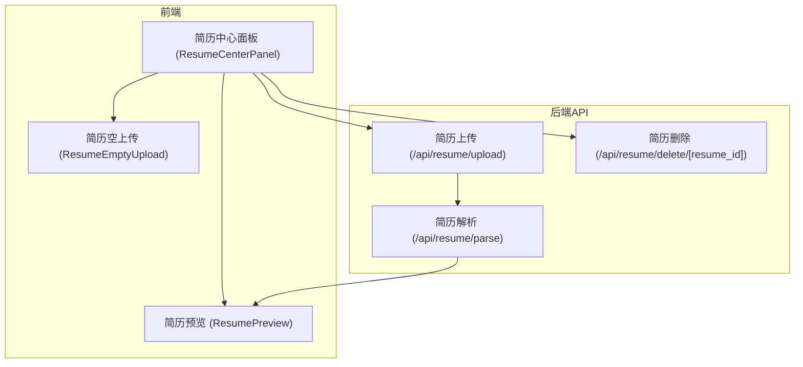
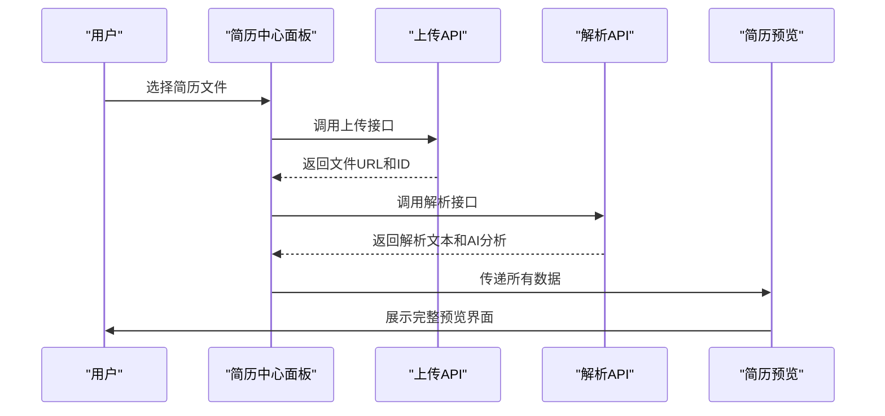
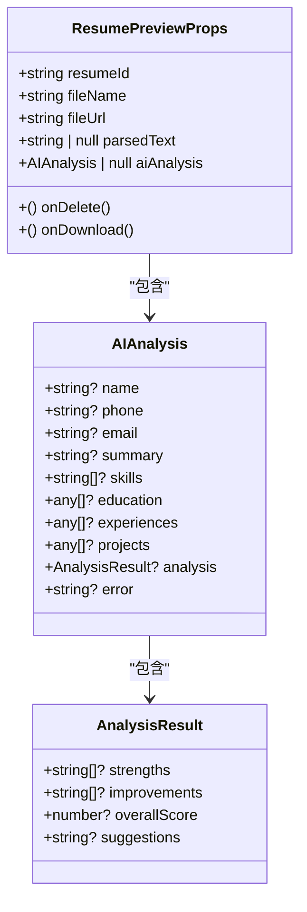
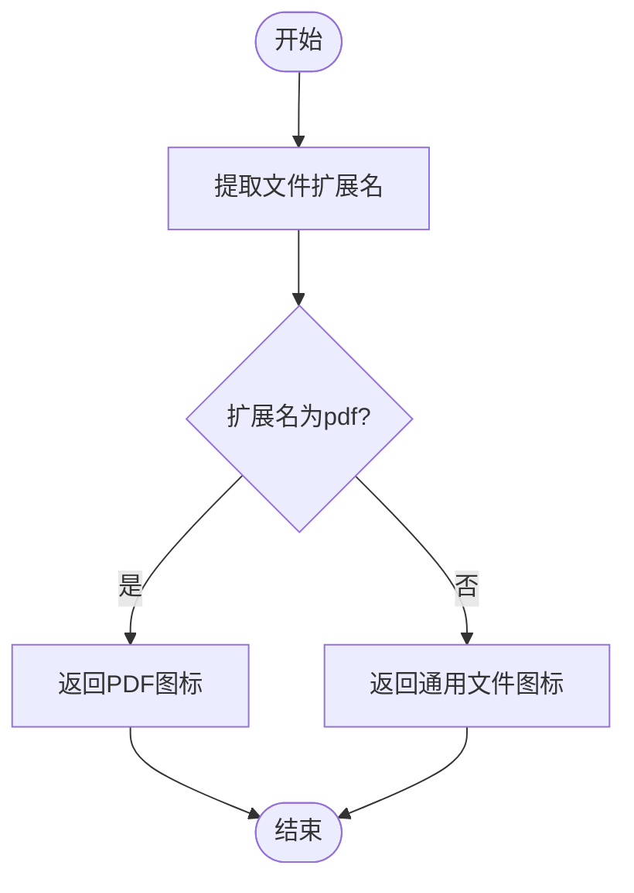
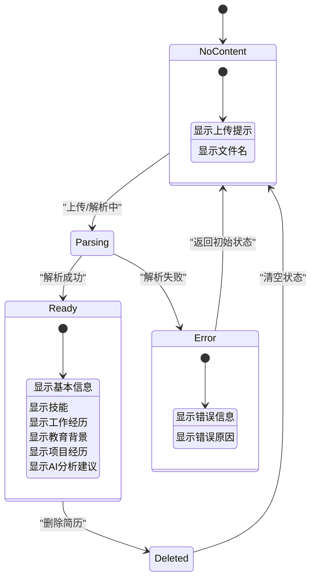
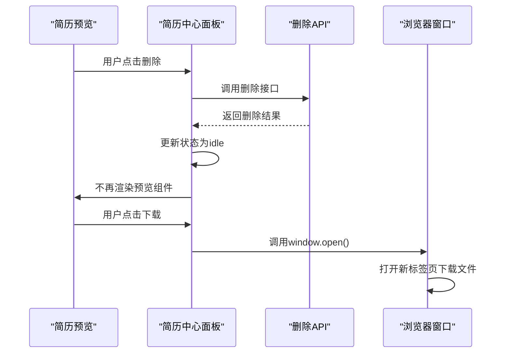
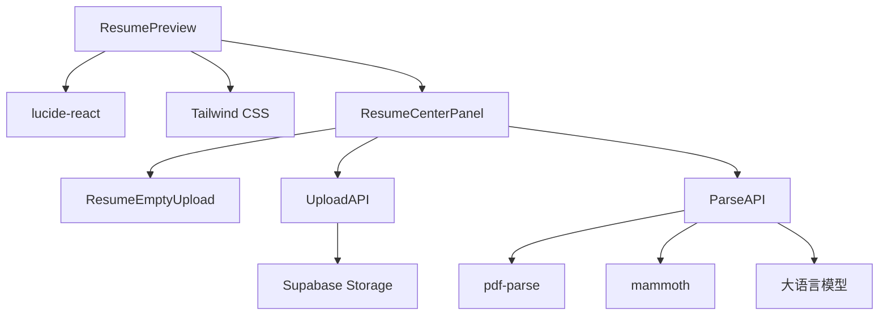

# 简历预览组件 (ResumePreview)

<cite>
**本文档引用的文件**  
- [ResumePreview.tsx](file://components/resume/ResumePreview.tsx)
- [ResumeCenterPanel.tsx](file://components/resume/ResumeCenterPanel.tsx)
- [upload/route.ts](file://app/api/resume/upload/route.ts)
- [parse/route.ts](file://app/api/resume/parse/route.ts)
- [delete/[resume_id]/route.ts](file://app/api/resume/delete/[resume_id]/route.ts)
</cite>

## 目录
1. [简介](#简介)
2. [项目结构](#项目结构)
3. [核心组件](#核心组件)
4. [架构概述](#架构概述)
5. [详细组件分析](#详细组件分析)
6. [依赖分析](#依赖分析)
7. [性能考虑](#性能考虑)
8. [故障排除指南](#故障排除指南)
9. [结论](#结论)

## 简介
简历预览组件（ResumePreview）是AI求职教练系统中的关键界面组件，负责展示用户上传简历的解析结果。该组件通过智能渲染机制，根据简历解析状态动态展示文件信息、AI分析结果和交互功能，为用户提供直观的简历优化反馈。

## 项目结构
简历预览功能主要由前端组件和后端API服务构成，采用分层架构设计，确保功能解耦和可维护性。

**图示来源**  
- [ResumeCenterPanel.tsx](file://components/resume/ResumeCenterPanel.tsx#L35-L182)
- [ResumePreview.tsx](file://components/resume/ResumePreview.tsx#L33-L295)
- [upload/route.ts](file://app/api/resume/upload/route.ts#L1-L155)
- [parse/route.ts](file://app/api/resume/parse/route.ts#L1-L345)
- [delete/[resume_id]/route.ts](file://app/api/resume/delete/[resume_id]/route.ts)

## 核心组件
简历预览组件作为简历处理流程的最终展示层，接收来自父组件的数据和回调函数，实现简历信息的可视化呈现。组件通过`fileName`和`fileUrl`属性渲染简历文件的基本信息，并根据文件扩展名动态显示PDF或通用文件图标。

**组件来源**  
- [ResumePreview.tsx](file://components/resume/ResumePreview.tsx#L23-L31)
- [ResumeCenterPanel.tsx](file://components/resume/ResumeCenterPanel.tsx#L27-L33)

## 架构概述
简历预览组件的实现遵循清晰的单向数据流架构，从文件上传到解析再到预览展示，形成完整的简历处理闭环。

**图示来源**  
- [ResumeCenterPanel.tsx](file://components/resume/ResumeCenterPanel.tsx#L40-L95)
- [upload/route.ts](file://app/api/resume/upload/route.ts#L13-L147)
- [parse/route.ts](file://app/api/resume/parse/route.ts#L201-L342)
- [ResumePreview.tsx](file://components/resume/ResumePreview.tsx#L33-L295)

## 详细组件分析

### 简历预览组件分析
简历预览组件通过props接收多个关键属性，实现灵活的状态管理和内容渲染。

#### 组件属性定义

**图示来源**  
- [ResumePreview.tsx](file://components/resume/ResumePreview.tsx#L23-L31)
- [ResumePreview.tsx](file://components/resume/ResumePreview.tsx#L5-L21)

#### 文件图标动态渲染机制
组件通过`getFileIcon`函数根据文件扩展名动态选择图标，实现用户体验优化。

**图示来源**  
- [ResumePreview.tsx](file://components/resume/ResumePreview.tsx#L41-L47)

#### 解析状态管理
组件通过`parsedText`和`aiAnalysis`属性的组合状态，实现不同展示模式的切换。

**图示来源**  
- [ResumePreview.tsx](file://components/resume/ResumePreview.tsx#L284-L291)
- [ResumePreview.tsx](file://components/resume/ResumePreview.tsx#L91-L257)
- [ResumePreview.tsx](file://components/resume/ResumePreview.tsx#L260-L267)

#### 回调函数集成
组件通过`onDelete`和`onDownload`回调函数与父组件ResumeCenterPanel协同工作，实现交互功能。

**图示来源**  
- [ResumePreview.tsx](file://components/resume/ResumePreview.tsx#L69-L85)
- [ResumeCenterPanel.tsx](file://components/resume/ResumeCenterPanel.tsx#L98-L131)

## 依赖分析
简历预览组件依赖于多个外部库和内部组件，形成完整的功能依赖链。

**图示来源**  
- [ResumePreview.tsx](file://components/resume/ResumePreview.tsx#L3)
- [ResumeCenterPanel.tsx](file://components/resume/ResumeCenterPanel.tsx#L4-L5)
- [upload/route.ts](file://app/api/resume/upload/route.ts#L5)
- [parse/route.ts](file://app/api/resume/parse/route.ts#L6-L7)

## 性能考虑
简历预览组件在设计时考虑了多项性能优化策略，确保在各种设备上都能流畅运行。

1. **条件渲染**：仅在必要时渲染AI分析结果和原始文本，减少DOM节点数量
2. **懒加载**：原始解析文本默认折叠，避免长文本影响初始渲染性能
3. **图标优化**：使用轻量级的Lucide React图标库，减少包体积
4. **状态最小化**：组件本身不维护状态，完全依赖props驱动，提高渲染效率

## 故障排除指南
当简历预览组件出现问题时，可参考以下常见问题及解决方案：

**组件来源**  
- [ResumePreview.tsx](file://components/resume/ResumePreview.tsx#L260-L267)
- [parse/route.ts](file://app/api/resume/parse/route.ts#L180-L197)

### 常见问题

| 问题现象 | 可能原因 | 解决方案 |
|---------|--------|---------|
| 显示"解析中或解析失败" | 文件格式不支持 | 确保上传PDF或DOCX格式文件 |
| AI分析失败 | 文本提取失败 | 检查是否为扫描版PDF或加密文件 |
| 下载功能无效 | 文件URL失效 | 重新上传简历文件 |
| 删除后界面未更新 | 状态同步失败 | 刷新页面或重新登录 |

## 结论
简历预览组件作为AI求职教练系统的核心展示组件，通过精心设计的状态管理和内容渲染机制，为用户提供直观、高效的简历优化体验。组件与父组件ResumeCenterPanel紧密协作，通过清晰的props传递和回调函数集成，实现了完整的简历处理流程。未来可进一步优化UI交互，增加更多简历分析维度，提升用户体验。