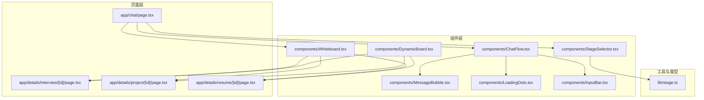
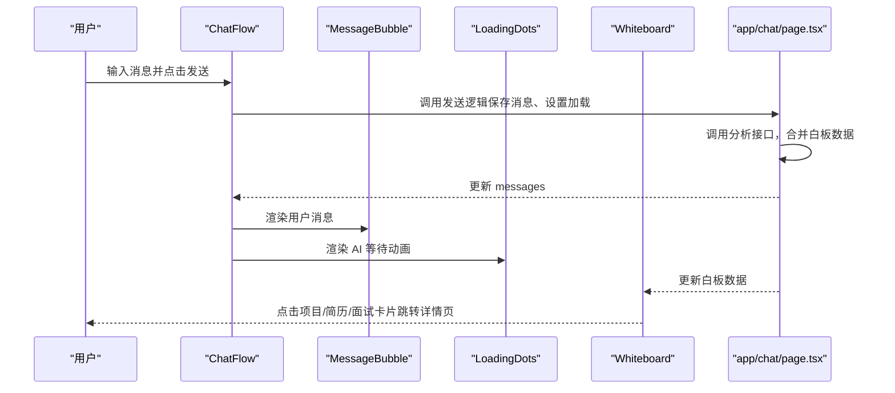
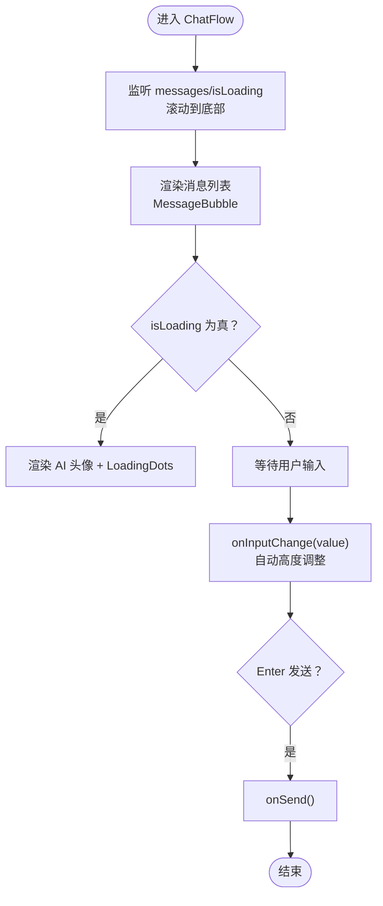
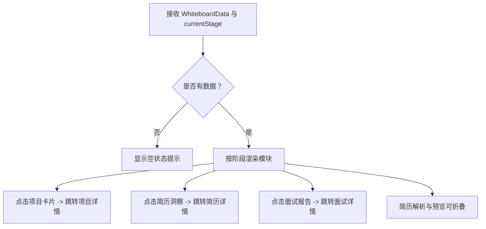
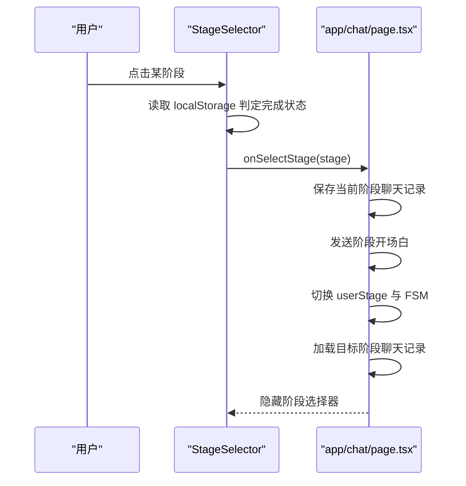
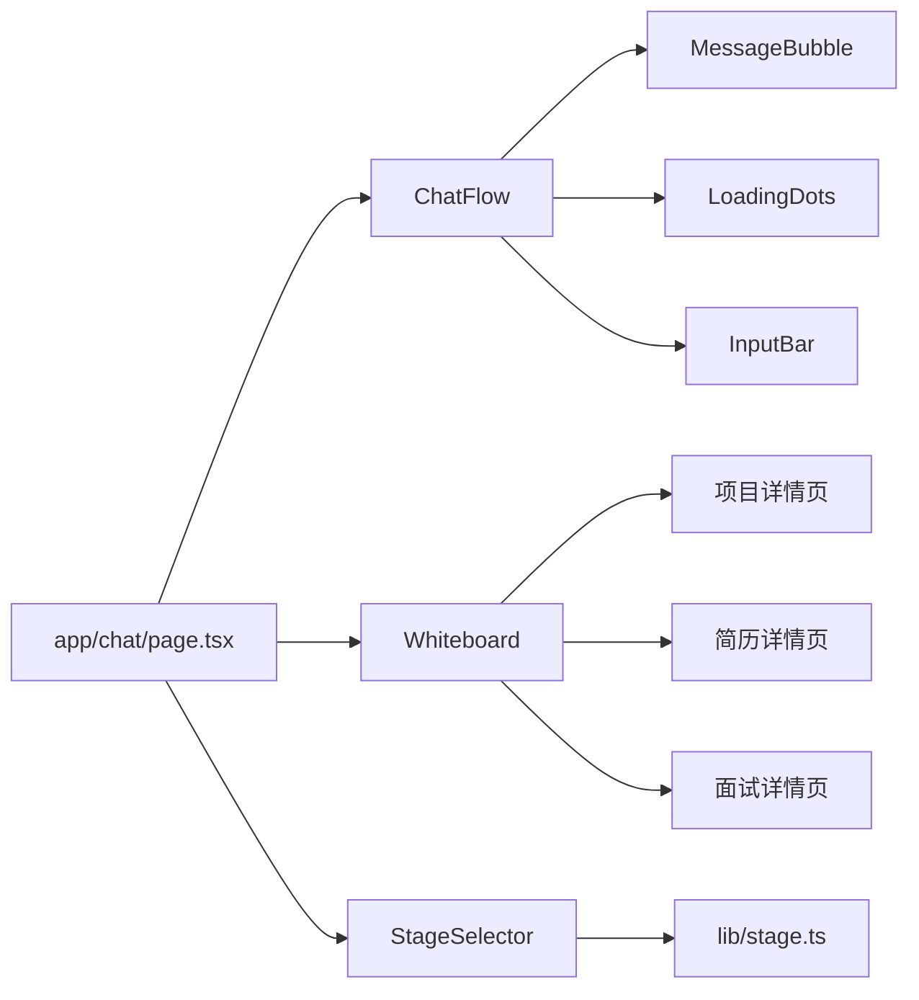

# 通用UI组件

<cite>
**本文引用的文件**
- [ChatFlow.tsx](file://components/ChatFlow.tsx)
- [MessageBubble.tsx](file://components/MessageBubble.tsx)
- [LoadingDots.tsx](file://components/LoadingDots.tsx)
- [InputBar.tsx](file://components/InputBar.tsx)
- [Whiteboard.tsx](file://components/Whiteboard.tsx)
- [StageSelector.tsx](file://components/StageSelector.tsx)
- [DynamicBoard.tsx](file://components/DynamicBoard.tsx)
- [app/chat/page.tsx](file://app/chat/page.tsx)
- [app/details/interview/[id]/page.tsx](file://app/details/interview/[id]/page.tsx)
- [app/details/project/[id]/page.tsx](file://app/details/project/[id]/page.tsx)
- [app/details/resume/[id]/page.tsx](file://app/details/resume/[id]/page.tsx)
- [lib/stage.ts](file://lib/stage.ts)
</cite>

## 目录
1. [简介](#简介)
2. [项目结构](#项目结构)
3. [核心组件](#核心组件)
4. [架构总览](#架构总览)
5. [组件详解](#组件详解)
6. [依赖关系分析](#依赖关系分析)
7. [性能考量](#性能考量)
8. [故障排查指南](#故障排查指南)
9. [结论](#结论)
10. [附录](#附录)

## 简介
本文件系统性地文档化项目中的通用UI组件，重点围绕以下目标：
- 解析 ChatFlow.tsx 作为主对话流容器，如何管理消息列表（messages）、输入框状态（inputValue）与发送逻辑（onSend），并集成 LoadingDots.tsx 实现 AI 响应等待动画。
- 深入分析 Whiteboard.tsx 智能白板组件，如何根据 currentStage 动态渲染不同求职阶段的关键信息（如意向岗位、项目经历、面试报告），并支持与详情页的路由跳转。
- 阐述 StageSelector.tsx 阶段选择器的交互逻辑，如何通过 onSelectStage 回调驱动用户流程跳转。
- 说明 MessageBubble.tsx 消息气泡的样式设计与角色区分（用户/AI），InputBar.tsx 输入栏的自动高度调整与快捷键支持。
- 提供这些组件在 app/chat/page.tsx 等页面中的集成模式。

## 项目结构
通用UI组件位于 components 目录，页面位于 app 目录；组件间通过 props 与回调协作，页面负责状态管理与生命周期，组件负责渲染与交互。

图表来源
- [app/chat/page.tsx](file://app/chat/page.tsx#L1-L120)
- [components/ChatFlow.tsx](file://components/ChatFlow.tsx#L1-L167)
- [components/Whiteboard.tsx](file://components/Whiteboard.tsx#L1-L120)
- [components/StageSelector.tsx](file://components/StageSelector.tsx#L1-L80)
- [lib/stage.ts](file://lib/stage.ts#L1-L85)

章节来源
- [app/chat/page.tsx](file://app/chat/page.tsx#L1-L120)
- [components/ChatFlow.tsx](file://components/ChatFlow.tsx#L1-L167)
- [components/Whiteboard.tsx](file://components/Whiteboard.tsx#L1-L120)
- [components/StageSelector.tsx](file://components/StageSelector.tsx#L1-L80)
- [lib/stage.ts](file://lib/stage.ts#L1-L85)

## 核心组件
- ChatFlow.tsx：主对话流容器，负责消息渲染、输入栏、发送逻辑、滚动行为与加载占位。
- MessageBubble.tsx：消息气泡组件，区分用户与 AI 角色，支持时间戳显示。
- LoadingDots.tsx：AI 响应等待动画，三圆点弹跳效果。
- InputBar.tsx：输入栏组件，支持文件上传、自动高度调整、快捷键发送。
- Whiteboard.tsx：智能白板，按阶段动态渲染关键信息，支持详情页跳转。
- StageSelector.tsx：阶段选择器，基于本地存储判断完成状态，驱动流程跳转。
- DynamicBoard.tsx：动态白板（历史版本），支持可编辑字段与列表，便于演示与调试。

章节来源
- [components/ChatFlow.tsx](file://components/ChatFlow.tsx#L1-L167)
- [components/MessageBubble.tsx](file://components/MessageBubble.tsx#L1-L53)
- [components/LoadingDots.tsx](file://components/LoadingDots.tsx#L1-L15)
- [components/InputBar.tsx](file://components/InputBar.tsx#L1-L122)
- [components/Whiteboard.tsx](file://components/Whiteboard.tsx#L1-L120)
- [components/StageSelector.tsx](file://components/StageSelector.tsx#L1-L80)
- [components/DynamicBoard.tsx](file://components/DynamicBoard.tsx#L1-L120)

## 架构总览
ChatFlow 作为对话主容器，承载消息列表与输入栏；消息由 MessageBubble 渲染，AI 等待由 LoadingDots 展示；Whiteboard 根据 currentStage 动态呈现各阶段关键信息，并在需要时跳转至详情页；StageSelector 用于阶段导航，结合 lib/stage.ts 的阶段常量与顺序。

图表来源
- [app/chat/page.tsx](file://app/chat/page.tsx#L762-L800)
- [components/ChatFlow.tsx](file://components/ChatFlow.tsx#L69-L116)
- [components/MessageBubble.tsx](file://components/MessageBubble.tsx#L1-L53)
- [components/LoadingDots.tsx](file://components/LoadingDots.tsx#L1-L15)
- [components/Whiteboard.tsx](file://components/Whiteboard.tsx#L152-L163)

## 组件详解

### ChatFlow.tsx：主对话流容器
- 状态管理
  - messages：消息数组，包含 id、content、isUser、timestamp。
  - inputValue：输入框文本。
  - isLoading：是否处于 AI 响应中。
  - userStage：当前阶段（用于 UI 展示）。
- 关键行为
  - 自动滚动到底部：监听 messages 与 isLoading 变化，平滑滚动至消息末尾。
  - 输入栏交互：支持 Enter 发送（Shift+Enter 换行），禁用状态下不可发送。
  - 自动高度调整：监听输入变化，按内容高度自适应。
  - 文件上传：通过隐藏 input 触发点击，支持图片/PDF/DOC/DOCX/TXT。
  - 加载占位：当 isLoading 为真时，渲染 AI 头像与 LoadingDots。
- 子组件
  - MessageBubble：按 isUser 渲染用户或 AI 气泡。
  - LoadingDots：AI 等待动画。
- 与页面集成
  - 由 app/chat/page.tsx 传入 messages、inputValue、onSend、onInputChange、isLoading、userStage。
  - 页面负责调用分析接口、保存会话、维护阶段与聊天记录。

图表来源
- [components/ChatFlow.tsx](file://components/ChatFlow.tsx#L33-L68)
- [components/ChatFlow.tsx](file://components/ChatFlow.tsx#L136-L162)
- [components/MessageBubble.tsx](file://components/MessageBubble.tsx#L1-L53)
- [components/LoadingDots.tsx](file://components/LoadingDots.tsx#L1-L15)

章节来源
- [components/ChatFlow.tsx](file://components/ChatFlow.tsx#L1-L167)
- [app/chat/page.tsx](file://app/chat/page.tsx#L762-L800)

### MessageBubble.tsx：消息气泡
- 设计要点
  - 角色区分：isUser 为真时使用用户主题色，否则使用灰色气泡与 AI 头像。
  - 时间戳：可选显示，格式化为本地时间。
  - 布局：用户消息右对齐，AI 消息左对齐，头像与内容间距统一。
- 适用场景
  - 与 ChatFlow 配合，渲染每条消息；也可独立用于其他对话场景。

章节来源
- [components/MessageBubble.tsx](file://components/MessageBubble.tsx#L1-L53)

### LoadingDots.tsx：AI 等待动画
- 行为说明
  - 三个圆点依次弹跳，延迟错开，营造“思考中”的视觉反馈。
- 使用位置
  - ChatFlow 在 isLoading 为真时渲染，作为 AI 气泡内的占位。

章节来源
- [components/LoadingDots.tsx](file://components/LoadingDots.tsx#L1-L15)
- [components/ChatFlow.tsx](file://components/ChatFlow.tsx#L95-L112)

### InputBar.tsx：输入栏（简化版）
- 功能特性
  - 文件上传：限制 PDF、DOCX，支持多选，显示已选文件列表，支持移除。
  - 快捷键：Enter 发送（Shift+Enter 不换行）。
  - 禁用状态：isLoading 或 disabled 时禁用输入与发送。
- 与 ChatFlow 的差异
  - ChatFlow 内置了更丰富的输入体验（自动高度、文件上传、发送按钮等），InputBar 更偏向通用输入组件。

章节来源
- [components/InputBar.tsx](file://components/InputBar.tsx#L1-L122)

### Whiteboard.tsx：智能白板
- 数据结构
  - WhiteboardData：按阶段聚合关键信息，包括意向岗位、核心技能、项目经历、简历洞察、面试报告、目标公司、薪资策略、Offer 列表等。
- 动态渲染
  - 根据 currentStage 与 data 字段条件渲染对应模块。
  - 使用 Framer Motion 实现子块入场动画。
- 交互与路由
  - 项目经历卡片点击跳转至项目详情页。
  - 简历洞察卡片点击跳转至简历详情页。
  - 面试报告卡片点击跳转至面试详情页。
- 简历解析与预览
  - 支持上传 PDF/DOCX/TXT，加载中状态、预览折叠/展开、下载与删除操作。
- 与页面集成
  - app/chat/page.tsx 通过分析接口将对话内容转换为白板数据，合并到现有数据中并持久化。

图表来源
- [components/Whiteboard.tsx](file://components/Whiteboard.tsx#L131-L163)
- [components/Whiteboard.tsx](file://components/Whiteboard.tsx#L222-L259)
- [components/Whiteboard.tsx](file://components/Whiteboard.tsx#L356-L413)
- [components/Whiteboard.tsx](file://components/Whiteboard.tsx#L415-L450)
- [components/Whiteboard.tsx](file://components/Whiteboard.tsx#L452-L505)
- [components/Whiteboard.tsx](file://components/Whiteboard.tsx#L507-L538)

章节来源
- [components/Whiteboard.tsx](file://components/Whiteboard.tsx#L1-L541)
- [app/chat/page.tsx](file://app/chat/page.tsx#L478-L663)

### StageSelector.tsx：阶段选择器
- 状态来源
  - 从 localStorage 读取白板数据与聊天历史，判断已完成阶段集合。
- 视觉状态
  - current：蓝色高亮与箭头标记。
  - completed：绿色完成标记。
  - pending：默认样式。
- 交互逻辑
  - 点击阶段项触发 onSelectStage 回调，页面据此切换阶段、加载聊天记录、发送阶段开场白并更新 FSM。
- 与阶段库集成
  - 使用 lib/stage.ts 的阶段顺序、名称与描述，确保 UI 与业务一致。

图表来源
- [components/StageSelector.tsx](file://components/StageSelector.tsx#L1-L204)
- [lib/stage.ts](file://lib/stage.ts#L1-L85)
- [app/chat/page.tsx](file://app/chat/page.tsx#L409-L448)

章节来源
- [components/StageSelector.tsx](file://components/StageSelector.tsx#L1-L204)
- [lib/stage.ts](file://lib/stage.ts#L1-L85)
- [app/chat/page.tsx](file://app/chat/page.tsx#L409-L448)

### 详情页集成
- 项目详情页：从 localStorage 读取白板数据，定位对应项目并展示 STAR 结构。
- 简历详情页：支持按 id 查找或展示全部简历洞察，提供下载与删除操作。
- 面试详情页：从 localStorage 读取白板数据，定位对应面试报告，展开问题与 AI 反馈。

章节来源
- [app/details/project/[id]/page.tsx](file://app/details/project/[id]/page.tsx#L1-L120)
- [app/details/resume/[id]/page.tsx](file://app/details/resume/[id]/page.tsx#L1-L144)
- [app/details/interview/[id]/page.tsx](file://app/details/interview/[id]/page.tsx#L1-L217)

## 依赖关系分析
- 组件耦合
  - ChatFlow 依赖 MessageBubble 与 LoadingDots；InputBar 为独立输入组件，可替换为 ChatFlow 内置输入。
  - Whiteboard 依赖 Next.js 路由与 Framer Motion，内部使用 router.push 导航至详情页。
  - StageSelector 依赖 lib/stage.ts 的阶段常量与顺序。
- 数据流向
  - app/chat/page.tsx 维护 messages、whiteboardData、userStage 等状态，通过 props 传递给 ChatFlow 与 Whiteboard。
  - 分析接口返回的白板数据与现有数据合并，避免重复与覆盖。
- 外部依赖
  - Framer Motion：用于白板模块的入场动画。
  - Next.js Navigation：用于详情页跳转。

图表来源
- [components/ChatFlow.tsx](file://components/ChatFlow.tsx#L1-L167)
- [components/Whiteboard.tsx](file://components/Whiteboard.tsx#L1-L120)
- [components/StageSelector.tsx](file://components/StageSelector.tsx#L1-L80)
- [lib/stage.ts](file://lib/stage.ts#L1-L85)
- [app/chat/page.tsx](file://app/chat/page.tsx#L1-L120)

章节来源
- [components/ChatFlow.tsx](file://components/ChatFlow.tsx#L1-L167)
- [components/Whiteboard.tsx](file://components/Whiteboard.tsx#L1-L120)
- [components/StageSelector.tsx](file://components/StageSelector.tsx#L1-L80)
- [lib/stage.ts](file://lib/stage.ts#L1-L85)
- [app/chat/page.tsx](file://app/chat/page.tsx#L1-L120)

## 性能考量
- 滚动优化：ChatFlow 使用平滑滚动至底部，避免频繁重排；仅在消息数量或加载状态变化时触发。
- 白板分析：采用防抖（debounce）策略，减少频繁请求；合并数组字段时使用 ID 去重，避免重复项。
- 动画：Framer Motion 的 staggerChildren 仅在白板首次渲染时使用，后续更新不重复触发。
- 本地存储：阶段选择器与聊天记录均使用 localStorage 缓存，降低首屏加载压力。

[本节为通用指导，无需列出章节来源]

## 故障排查指南
- 消息未显示或滚动异常
  - 检查 ChatFlow 的 messages 与 isLoading 是否正确更新。
  - 确认滚动逻辑依赖的消息长度与加载状态变更。
- AI 等待动画不出现
  - 确认 isLoading 为真且 ChatFlow 的消息区域包含 LoadingDots 占位。
- 输入无法发送
  - 检查 ChatFlow 的 Enter 事件与禁用状态；确认 onSend 回调被正确传入。
- 白板数据未更新
  - 确认分析接口返回的数据结构与白板字段一致；检查合并逻辑与去重策略。
- 阶段选择器状态不正确
  - 检查 localStorage 中 ajc_whiteboardData 与 ajc_chatHistory 的格式与完整性。
- 详情页无法跳转
  - 确认 Whiteboard 的点击事件与 router.push 路径正确；检查 params.id 与白板数据中的 ID 一致性。

章节来源
- [components/ChatFlow.tsx](file://components/ChatFlow.tsx#L33-L68)
- [components/ChatFlow.tsx](file://components/ChatFlow.tsx#L95-L112)
- [components/Whiteboard.tsx](file://components/Whiteboard.tsx#L152-L163)
- [components/StageSelector.tsx](file://components/StageSelector.tsx#L21-L70)
- [app/chat/page.tsx](file://app/chat/page.tsx#L478-L663)

## 结论
本项目通过 ChatFlow、MessageBubble、LoadingDots、InputBar、Whiteboard、StageSelector 等组件构建了完整的求职流程对话与白板展示体系。页面层负责状态管理与生命周期，组件层专注渲染与交互，二者配合实现了阶段化的求职引导、智能白板信息沉淀与详情页深度浏览。建议在后续迭代中：
- 将 InputBar 与 ChatFlow 的输入体验进一步整合，统一快捷键与禁用逻辑。
- 优化白板数据的去重与合并策略，提升大体量数据下的性能。
- 扩展详情页的数据来源，支持服务端直连与缓存策略。

[本节为总结性内容，无需列出章节来源]

## 附录
- 阶段常量与顺序参考：lib/stage.ts
- 页面集成参考：app/chat/page.tsx
- 详情页实现参考：项目详情、简历详情、面试详情页

章节来源
- [lib/stage.ts](file://lib/stage.ts#L1-L85)
- [app/chat/page.tsx](file://app/chat/page.tsx#L1-L120)
- [app/details/project/[id]/page.tsx](file://app/details/project/[id]/page.tsx#L1-L120)
- [app/details/resume/[id]/page.tsx](file://app/details/resume/[id]/page.tsx#L1-L144)
- [app/details/interview/[id]/page.tsx](file://app/details/interview/[id]/page.tsx#L1-L217)