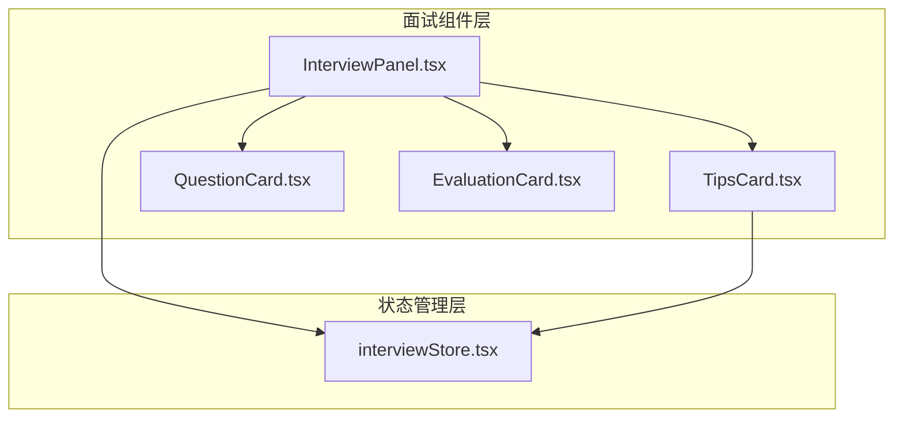
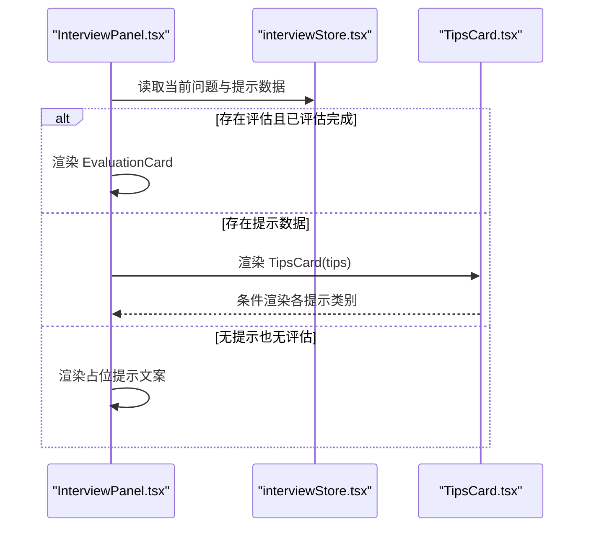
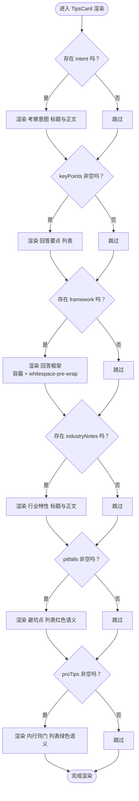
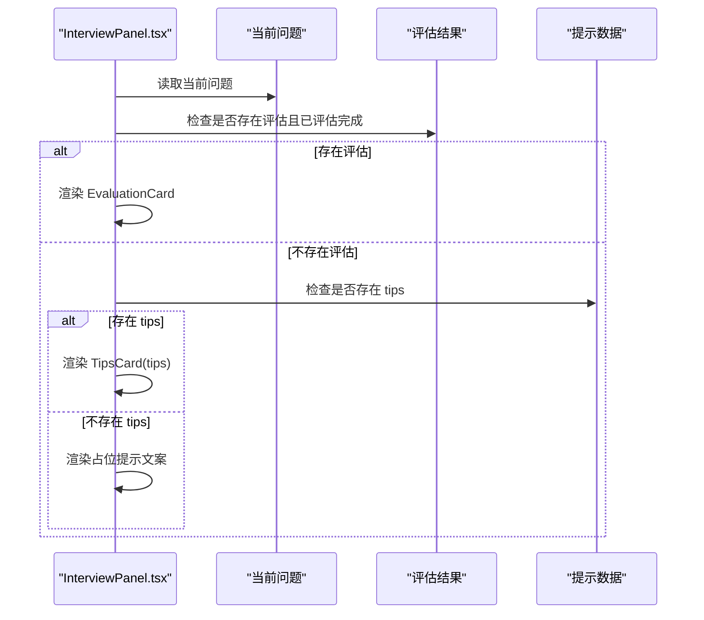
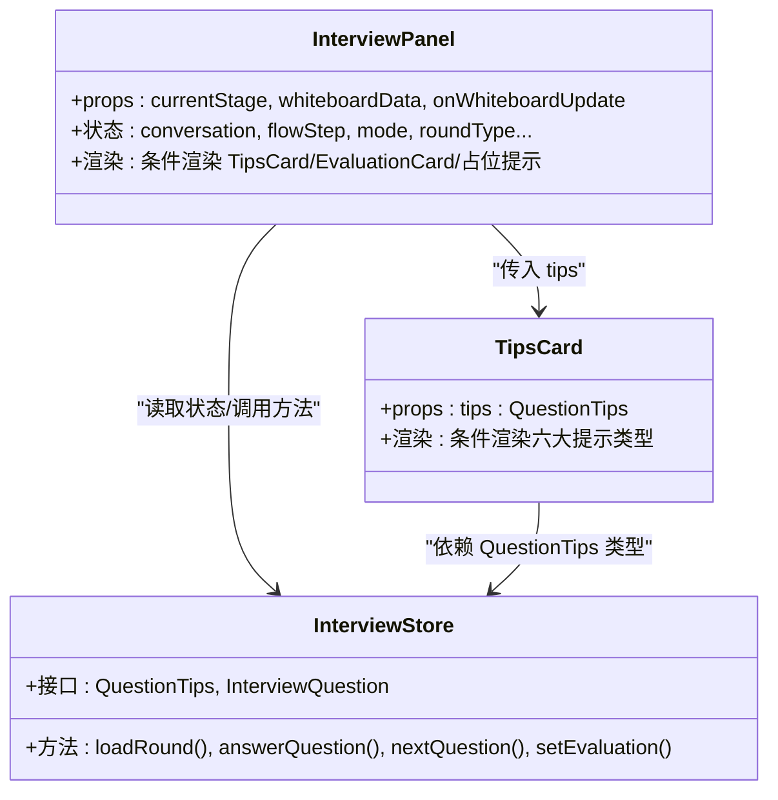

# 提示卡片组件 (TipsCard)

<cite>
**本文引用的文件**
- [TipsCard.tsx](file://components/interview/TipsCard.tsx)
- [InterviewPanel.tsx](file://components/interview/InterviewPanel.tsx)
- [interviewStore.tsx](file://store/interviewStore.tsx)
- [README.md（面试组件说明）](file://components/interview/README.md)
- [page.tsx（面试开始页）](file://app/interview/start/page.tsx)
- [api 文档示例](file://app/api/README.md)
</cite>

## 目录
1. [简介](#简介)
2. [项目结构](#项目结构)
3. [核心组件](#核心组件)
4. [架构总览](#架构总览)
5. [详细组件分析](#详细组件分析)
6. [依赖关系分析](#依赖关系分析)
7. [性能考量](#性能考量)
8. [故障排查指南](#故障排查指南)
9. [结论](#结论)
10. [附录](#附录)

## 简介
本文件深入解析 TipsCard.tsx 组件，作为旧版面试系统中的策略指导模块，用于展示问题的答题提示信息。该组件支持六大提示类型：考察意图、回答要点、回答框架、行业特性、避坑点、内行窍门，并通过条件渲染逻辑按需展示。组件采用渐进式动画与语义化颜色体系，配合 whitespace-pre-wrap 保留文本格式，帮助用户在答题过程中获得结构化提示。

同时，该组件已被废弃，属于旧面试系统的一部分；新版面试系统已在 app/interview/start/page.tsx 中采用新的 UI 展示方式。

章节来源
- file://components/interview/TipsCard.tsx#L1-L107
- file://components/interview/README.md#L1-L323

## 项目结构
TipsCard 位于 components/interview 目录下，与 InterviewPanel、QuestionCard、EvaluationCard 等共同构成旧版面试面板的子组件集合。其数据来源为 store/interviewStore.tsx 中的 QuestionTips 类型，由 InterviewPanel 在渲染时根据当前问题状态决定是否显示。

图表来源
- [InterviewPanel.tsx](file://components/interview/InterviewPanel.tsx#L347-L506)
- [TipsCard.tsx](file://components/interview/TipsCard.tsx#L1-L107)
- [interviewStore.tsx](file://store/interviewStore.tsx#L37-L64)

章节来源
- file://components/interview/README.md#L1-L323
- file://components/interview/TipsCard.tsx#L1-L107
- file://store/interviewStore.tsx#L37-L64

## 核心组件
- TipsCard.tsx：接收 QuestionTips 数据，按类别条件渲染，提供统一的视觉样式与交互体验。
- InterviewPanel.tsx：作为主面板，负责在合适时机显示 TipsCard 或 EvaluationCard，并控制输入与导航。
- interviewStore.tsx：定义 QuestionTips 接口与 InterviewQuestion 结构，提供加载题目、回答问题、获取评估等方法。

章节来源
- file://components/interview/TipsCard.tsx#L1-L107
- file://components/interview/InterviewPanel.tsx#L445-L466
- file://store/interviewStore.tsx#L37-L64

## 架构总览
TipsCard 的渲染路径与 InterviewPanel 的条件渲染机制如下：

图表来源
- [InterviewPanel.tsx](file://components/interview/InterviewPanel.tsx#L445-L466)
- [TipsCard.tsx](file://components/interview/TipsCard.tsx#L1-L107)
- [interviewStore.tsx](file://store/interviewStore.tsx#L37-L64)

## 详细组件分析

### 组件职责与数据模型
- 数据模型：QuestionTips 定义了六类提示字段，其中 intent、framework、industryNotes 为字符串，keyPoints、pitfalls、proTips 为字符串数组。
- 组件职责：接收 tips 参数，按类别条件渲染，提供统一的标题样式、图标与内容层级。

章节来源
- file://store/interviewStore.tsx#L37-L64
- file://components/interview/TipsCard.tsx#L1-L107

### 六大提示类型的条件渲染逻辑
- 考察意图（intent）：当存在时渲染标题与正文。
- 回答要点（keyPoints）：当数组非空时渲染有序列表，每项包含自定义符号与正文。
- 回答框架（framework）：当存在时以带边框的浅色背景容器包裹，使用 whitespace-pre-wrap 保留换行与缩进。
- 行业特性（industryNotes）：当存在时渲染标题与正文。
- 避坑点（pitfalls）：当数组非空时以红色语义化标题与文字渲染，强调风险提示。
- 内行窍门（proTips）：当数组非空时以绿色语义化标题与文字渲染，强调实用建议。

图表来源
- [TipsCard.tsx](file://components/interview/TipsCard.tsx#L1-L107)

章节来源
- file://components/interview/TipsCard.tsx#L1-L107

### UI 结构设计与视觉层次
- 标题样式：统一使用语义化标题层级，图标与标题组合增强可读性。
- 图标使用：💡 用于“答题提示”主标题；⚠️ 用于“避坑点”；✨ 用于“内行窍门”。
- 内容区域：采用分组间距与容器边框，保证阅读节奏；框架文本使用 whitespace-pre-wrap 保留格式。
- 颜色语义：避坑点使用红色系，内行窍门使用绿色系，其他类别使用灰色系，形成直观的视觉区分。

章节来源
- file://components/interview/TipsCard.tsx#L1-L107

### 在 InterviewPanel 中的条件渲染机制
- 当存在评估且问题状态为“已评估”时，优先渲染 EvaluationCard。
- 否则若存在 tips，则渲染 TipsCard。
- 否则渲染占位提示文案，告知用户在第一题生成后将显示提示。

图表来源
- [InterviewPanel.tsx](file://components/interview/InterviewPanel.tsx#L445-L466)

章节来源
- file://components/interview/InterviewPanel.tsx#L445-L466

### 与新版面试系统的对比
- 新版面试系统在 app/interview/start/page.tsx 中采用更简洁的提示展示方式，直接在问题卡片旁以列表形式呈现“考察意图、关键点、结构化建议、常见踩坑、专业建议”，并使用更明确的语义化标题与分隔线。
- TipsCard 属于旧面试系统的一部分，已被新版 UI 替代。

章节来源
- file://app/interview/start/page.tsx#L464-L494
- file://components/interview/TipsCard.tsx#L1-L107

### 组件使用范例（基于仓库现有示例）
- 在页面中引入 InterviewPanel 并传入 userStage="interview"，即可触发旧面试流程与 TipsCard 的条件渲染。
- 通过 useInterviewStore 的 loadRound、answerQuestion 等方法驱动问题与提示数据的加载与更新。

章节来源
- file://components/interview/README.md#L1-L323
- file://store/interviewStore.tsx#L430-L501

## 依赖关系分析
- 组件依赖
  - 动画库：framer-motion，用于淡入与位移动画。
  - 状态类型：QuestionTips，来源于 interviewStore.tsx。
- 组件耦合
  - TipsCard 与 InterviewPanel 通过 props 传递 tips 数据，耦合度低，便于独立维护。
  - 与 store 的交互通过 InterviewPanel 间接完成，避免组件内部直接发起网络请求。

图表来源
- [TipsCard.tsx](file://components/interview/TipsCard.tsx#L1-L107)
- [InterviewPanel.tsx](file://components/interview/InterviewPanel.tsx#L347-L506)
- [interviewStore.tsx](file://store/interviewStore.tsx#L37-L64)

章节来源
- file://components/interview/TipsCard.tsx#L1-L107
- file://components/interview/InterviewPanel.tsx#L347-L506
- file://store/interviewStore.tsx#L37-L64

## 性能考量
- 渲染开销：TipsCard 为纯展示组件，条件渲染减少不必要的 DOM 节点生成，整体开销较低。
- 动画成本：使用轻量级 framer-motion 的基础动画，对性能影响有限。
- 文本格式保留：whitespace-pre-wrap 仅在需要保留格式时使用，避免对长段落造成额外回流压力。

[本节为通用性能讨论，无需特定文件引用]

## 故障排查指南
- 提示内容不显示
  - 检查当前问题是否已加载且包含 tips 字段。
  - 确认 InterviewPanel 的条件渲染分支是否命中“存在 tips”的分支。
  - 若为数组类提示（keyPoints/pitfalls/proTips），需确保数组非空。
- 样式错乱
  - 确认容器边框与背景色未被外层样式覆盖。
  - 检查是否正确使用 whitespace-pre-wrap 以保留框架文本格式。
- 颜色语义异常
  - 避坑点与内行窍门的颜色依赖 Tailwind 颜色类，确保构建产物包含对应类名。
- 与新版系统混淆
  - TipsCard 属于旧系统，新版面试系统在 app/interview/start/page.tsx 中采用新的提示展示方式，避免在同一页面同时渲染两套提示。

章节来源
- file://components/interview/TipsCard.tsx#L1-L107
- file://components/interview/InterviewPanel.tsx#L445-L466
- file://app/interview/start/page.tsx#L464-L494

## 结论
TipsCard 作为旧版面试系统的策略指导组件，提供了清晰的六类提示分类与一致的视觉风格。其条件渲染逻辑简单可靠，配合 InterviewPanel 的状态管理实现了良好的用户体验。由于该组件已被废弃，建议在新功能中参考新版面试系统中的提示展示方式，以获得更一致的交互与更高的可维护性。

[本节为总结性内容，无需特定文件引用]

## 附录

### API 与数据结构参考
- QuestionTips 字段定义与 InterviewQuestion 结构
- API 返回示例中包含 tips 字段的完整结构

章节来源
- file://store/interviewStore.tsx#L37-L64
- file://app/api/README.md#L373-L411