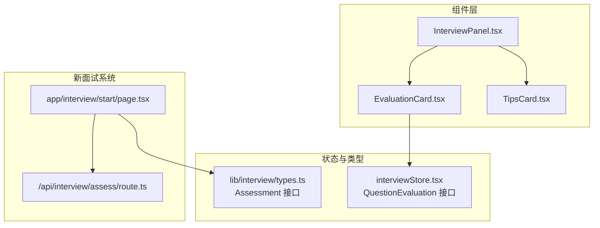
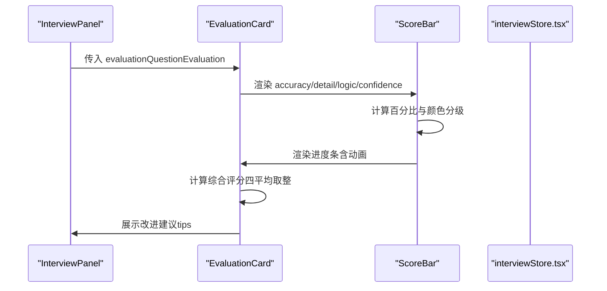
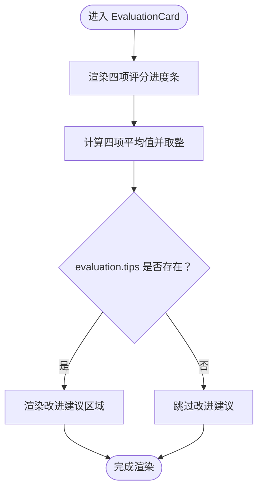
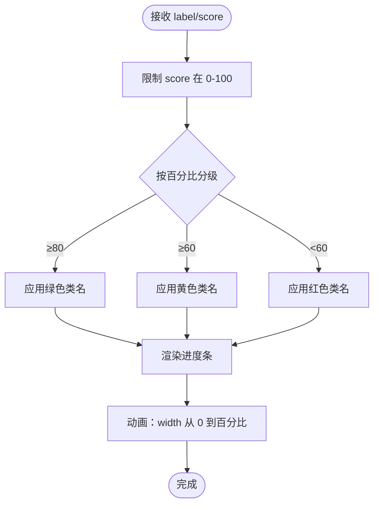
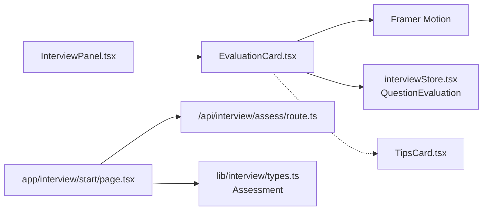

# 评估卡片组件 (EvaluationCard)

<cite>
**本文引用的文件**
- [EvaluationCard.tsx](file://components/interview/EvaluationCard.tsx)
- [TipsCard.tsx](file://components/interview/TipsCard.tsx)
- [InterviewPanel.tsx](file://components/interview/InterviewPanel.tsx)
- [interviewStore.tsx](file://store/interviewStore.tsx)
- [page.tsx](file://app/interview/start/page.tsx)
- [/api/interview/assess/route.ts](file://app/api/interview/assess/route.ts)
- [types.ts](file://lib/interview/types.ts)
</cite>

## 目录
1. [简介](#简介)
2. [项目结构](#项目结构)
3. [核心组件](#核心组件)
4. [架构总览](#架构总览)
5. [详细组件分析](#详细组件分析)
6. [依赖关系分析](#依赖关系分析)
7. [性能考量](#性能考量)
8. [故障排查指南](#故障排查指南)
9. [结论](#结论)
10. [附录](#附录)

## 简介
本文件全面解析 EvaluationCard.tsx 组件，用于展示 AI 对用户回答的多维度评估结果。文档重点覆盖：
- ScoreBar 子组件的实现：基于 accuracy、detail、logic、confidence 四项指标的评分进度条渲染逻辑与颜色分级策略（绿色≥80分，黄色≥60分，红色<60分）。
- 综合评分计算方法（四项平均值取整）及其 UI 展示。
- 改进建议（tips）区域的布局与样式设计。
- 动画效果（opacity、y轴位移）与响应式结构。
- 组件状态来源与数据模型（QuestionEvaluation）。
- 重要说明：该组件属于已废弃的旧面试系统；当前评估功能由新架构实现。

## 项目结构
EvaluationCard 位于 components/interview 目录下，作为旧面试系统的一部分，当前主要通过 InterviewPanel 进行条件渲染，且组件注释明确标注“此组件已禁用 - 旧面试逻辑已移除”。新面试系统位于 app/interview/start/page.tsx，采用全新的评估与展示流程。

图表来源
- [EvaluationCard.tsx](file://components/interview/EvaluationCard.tsx#L1-L109)
- [TipsCard.tsx](file://components/interview/TipsCard.tsx#L1-L116)
- [InterviewPanel.tsx](file://components/interview/InterviewPanel.tsx#L440-L466)
- [interviewStore.tsx](file://store/interviewStore.tsx#L48-L55)
- [types.ts](file://lib/interview/types.ts#L38-L45)
- [page.tsx](file://app/interview/start/page.tsx#L507-L533)
- [/api/interview/assess/route.ts](file://app/api/interview/assess/route.ts#L1-L167)

章节来源
- [EvaluationCard.tsx](file://components/interview/EvaluationCard.tsx#L1-L109)
- [InterviewPanel.tsx](file://components/interview/InterviewPanel.tsx#L440-L466)

## 核心组件
- EvaluationCard：展示单项问题的评估结果，包含四项评分进度条、综合评分与改进建议区域。
- ScoreBar：内部子组件，负责单项评分的进度条绘制与颜色分级。
- TipsCard：展示答题提示（考察意图、回答要点、框架等），与 EvaluationCard 并列存在，用于旧系统提示信息。
- InterviewPanel：旧面试流程的容器，条件渲染 EvaluationCard 或 TipsCard。
- interviewStore.tsx：定义 QuestionEvaluation 接口，包含 accuracy、detail、logic、confidence、tips 字段。
- app/interview/start/page.tsx：新面试系统入口，使用 Assessment 接口与 /api/interview/assess/route.ts 交互。

章节来源
- [EvaluationCard.tsx](file://components/interview/EvaluationCard.tsx#L1-L109)
- [TipsCard.tsx](file://components/interview/TipsCard.tsx#L1-L116)
- [InterviewPanel.tsx](file://components/interview/InterviewPanel.tsx#L440-L466)
- [interviewStore.tsx](file://store/interviewStore.tsx#L48-L55)
- [types.ts](file://lib/interview/types.ts#L38-L45)
- [page.tsx](file://app/interview/start/page.tsx#L507-L533)
- [/api/interview/assess/route.ts](file://app/api/interview/assess/route.ts#L1-L167)

## 架构总览
EvaluationCard 与 ScoreBar 的职责清晰：前者负责整体布局与数据聚合，后者负责单项评分的可视化与动画。两者均使用 Framer Motion 实现平滑过渡动画。

图表来源
- [InterviewPanel.tsx](file://components/interview/InterviewPanel.tsx#L440-L466)
- [EvaluationCard.tsx](file://components/interview/EvaluationCard.tsx#L48-L100)
- [EvaluationCard.tsx](file://components/interview/EvaluationCard.tsx#L21-L46)
- [interviewStore.tsx](file://store/interviewStore.tsx#L48-L55)

## 详细组件分析

### EvaluationCard 组件
- 作用：展示单项问题的评估结果，包含四项评分进度条、综合评分与改进建议区域。
- 数据来源：evaluation 参数为 QuestionEvaluation 类型，字段包括 accuracy、detail、logic、confidence、tips。
- 动画：整体卡片使用 opacity 与 y 轴位移入场，增强视觉层次。
- 综合评分：对四项指标求和后除以 4 并取整，展示为大号加粗数字。
- 改进建议：当 evaluation.tips 存在时渲染，使用浅色背景与边框，便于区分。

图表来源
- [EvaluationCard.tsx](file://components/interview/EvaluationCard.tsx#L48-L100)

章节来源
- [EvaluationCard.tsx](file://components/interview/EvaluationCard.tsx#L48-L100)
- [interviewStore.tsx](file://store/interviewStore.tsx#L48-L55)

### ScoreBar 子组件
- 输入：label（评分项名称）、score（0-100 数值）。
- 边界处理：将 score 限制在 0-100 区间，保证 UI 安全。
- 颜色分级策略：
  - ≥80：绿色
  - ≥60：黄色
  - <60：红色
- 进度条渲染：外层灰色背景条，内部使用对应颜色类名的进度块。
- 动画：初始宽度为 0，动画至实际百分比，持续 0.5 秒，easeOut 缓动。
- 文案：上方显示 label 与分数，下方显示进度条。

图表来源
- [EvaluationCard.tsx](file://components/interview/EvaluationCard.tsx#L21-L46)

章节来源
- [EvaluationCard.tsx](file://components/interview/EvaluationCard.tsx#L21-L46)

### 改进建议（tips）区域
- 条件渲染：仅当 evaluation.tips 存在时才显示。
- 布局与样式：顶部分隔线、浅色背景、白色内边框，文字为灰度系，换行保留。
- 设计目的：突出展示 AI 给出的针对性建议，便于用户对照改进。

章节来源
- [EvaluationCard.tsx](file://components/interview/EvaluationCard.tsx#L86-L97)

### 动画与响应式结构
- EvaluationCard：初始 opacity=0、y=20，动画至 opacity=1、y=0，持续 0.3 秒，营造“从下弹入”的自然感。
- ScoreBar：进度条初始 width=0，动画至百分比，持续 0.5 秒，easeOut 缓动，增强反馈。
- 响应式：组件使用 Tailwind 类名控制尺寸与间距，适配不同屏幕宽度。

章节来源
- [EvaluationCard.tsx](file://components/interview/EvaluationCard.tsx#L48-L100)
- [EvaluationCard.tsx](file://components/interview/EvaluationCard.tsx#L21-L46)

### 与新面试系统的差异
- EvaluationCard 属于旧面试系统，组件注释明确标注“此组件已禁用 - 旧面试逻辑已移除”。
- 新面试系统位于 app/interview/start/page.tsx，使用 Assessment 接口与 /api/interview/assess/route.ts 交互，评估维度与展示方式与 EvaluationCard 不同。
- 新系统评估维度包含 accuracy、grammar、detail（可选）、confidence、tips、exemplarAnswer（可选），并在页面中以卡片形式展示总分、各维度分值与评语。

章节来源
- [EvaluationCard.tsx](file://components/interview/EvaluationCard.tsx#L1-L10)
- [page.tsx](file://app/interview/start/page.tsx#L507-L533)
- [/api/interview/assess/route.ts](file://app/api/interview/assess/route.ts#L1-L167)
- [types.ts](file://lib/interview/types.ts#L38-L45)

## 依赖关系分析
- EvaluationCard 依赖：
  - Framer Motion：用于整体与进度条动画。
  - interviewStore.tsx 的 QuestionEvaluation 接口：定义 evaluation 的字段结构。
  - TipsCard：与 EvaluationCard 并列，用于旧系统提示信息。
- InterviewPanel：条件渲染 EvaluationCard 或 TipsCard，作为 EvaluationCard 的上层容器。
- 新面试系统：app/interview/start/page.tsx 与 /api/interview/assess/route.ts、lib/interview/types.ts 协作，形成新的评估与展示链路。

图表来源
- [InterviewPanel.tsx](file://components/interview/InterviewPanel.tsx#L440-L466)
- [EvaluationCard.tsx](file://components/interview/EvaluationCard.tsx#L1-L109)
- [interviewStore.tsx](file://store/interviewStore.tsx#L48-L55)
- [TipsCard.tsx](file://components/interview/TipsCard.tsx#L1-L116)
- [page.tsx](file://app/interview/start/page.tsx#L507-L533)
- [/api/interview/assess/route.ts](file://app/api/interview/assess/route.ts#L1-L167)
- [types.ts](file://lib/interview/types.ts#L38-L45)

章节来源
- [InterviewPanel.tsx](file://components/interview/InterviewPanel.tsx#L440-L466)
- [EvaluationCard.tsx](file://components/interview/EvaluationCard.tsx#L1-L109)
- [interviewStore.tsx](file://store/interviewStore.tsx#L48-L55)
- [TipsCard.tsx](file://components/interview/TipsCard.tsx#L1-L116)
- [page.tsx](file://app/interview/start/page.tsx#L507-L533)
- [/api/interview/assess/route.ts](file://app/api/interview/assess/route.ts#L1-L167)
- [types.ts](file://lib/interview/types.ts#L38-L45)

## 性能考量
- 动画开销：进度条动画与卡片入场动画均为轻量级，使用 Framer Motion 的默认缓动函数，通常不会造成明显卡顿。
- 渲染复杂度：EvaluationCard 仅包含四个 ScoreBar 与少量文案，渲染成本低。
- 数据边界：ScoreBar 对 score 做了 0-100 的边界约束，避免异常值导致 UI 异常。
- 建议：若在同一页面频繁切换多项评估，可考虑使用 React.memo 或 key 策略减少不必要的重渲染。

## 故障排查指南
- 评分显示异常（如超出范围或为负数）
  - 现象：进度条溢出或颜色异常。
  - 排查：确认上游数据是否正确归一化到 0-100；检查 ScoreBar 的边界处理逻辑是否生效。
  - 参考路径：[EvaluationCard.tsx](file://components/interview/EvaluationCard.tsx#L21-L46)
- 综合评分不正确
  - 现象：综合评分与四项平均不符。
  - 排查：确认四项指标是否全部传入；检查取整逻辑是否一致。
  - 参考路径：[EvaluationCard.tsx](file://components/interview/EvaluationCard.tsx#L71-L84)
- 改进建议内容缺失
  - 现象：tips 区域不显示。
  - 排查：确认 evaluation.tips 是否存在；检查条件渲染逻辑。
  - 参考路径：[EvaluationCard.tsx](file://components/interview/EvaluationCard.tsx#L86-L97)
- 组件未渲染（旧系统）
  - 现象：EvaluationCard 未出现在界面。
  - 排查：确认 InterviewPanel 的 showEvaluation 与 evaluation 状态；注意组件注释中“已禁用”的提示。
  - 参考路径：[InterviewPanel.tsx](file://components/interview/InterviewPanel.tsx#L440-L466)，[EvaluationCard.tsx](file://components/interview/EvaluationCard.tsx#L1-L10)
- 新面试系统评估结果不一致
  - 现象：旧组件与新系统展示不一致。
  - 排查：确认使用的是新系统（app/interview/start/page.tsx 与 /api/interview/assess/route.ts），而非 EvaluationCard。
  - 参考路径：[page.tsx](file://app/interview/start/page.tsx#L507-L533)，[/api/interview/assess/route.ts](file://app/api/interview/assess/route.ts#L1-L167)

章节来源
- [EvaluationCard.tsx](file://components/interview/EvaluationCard.tsx#L21-L100)
- [InterviewPanel.tsx](file://components/interview/InterviewPanel.tsx#L440-L466)
- [page.tsx](file://app/interview/start/page.tsx#L507-L533)
- [/api/interview/assess/route.ts](file://app/api/interview/assess/route.ts#L1-L167)

## 结论
EvaluationCard 是旧面试系统中的单项评估展示组件，具备清晰的评分进度条与颜色分级策略、综合评分计算与改进建议区域。其动画与响应式结构简洁易用。当前评估功能已迁移至新面试系统，EvaluationCard 注释明确标注“已禁用”，建议在新系统中使用 Assessment 接口与对应的页面组件进行评估展示与交互。

## 附录

### 组件集成示例（旧系统）
- 在 InterviewPanel 中根据 showEvaluation 与 evaluation 状态决定渲染 EvaluationCard 或 TipsCard。
- 传入 evaluation 参数需满足 QuestionEvaluation 接口，包含 accuracy、detail、logic、confidence、tips。

参考路径
- [InterviewPanel.tsx](file://components/interview/InterviewPanel.tsx#L440-L466)
- [interviewStore.tsx](file://store/interviewStore.tsx#L48-L55)

### 新面试系统评估数据结构（对比）
- Assessment 接口字段：accuracy、grammar、detail（可选）、confidence、tips、exemplarAnswer（可选）。
- 评估 API 返回结构：score、breakdown（accuracy、completeness、logic、communication）、feedback（strengths、improvements、overall）、tips（intent、keypoints）。

参考路径
- [types.ts](file://lib/interview/types.ts#L38-L45)
- [/api/interview/assess/route.ts](file://app/api/interview/assess/route.ts#L1-L167)