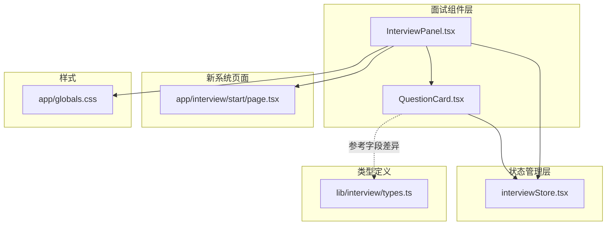
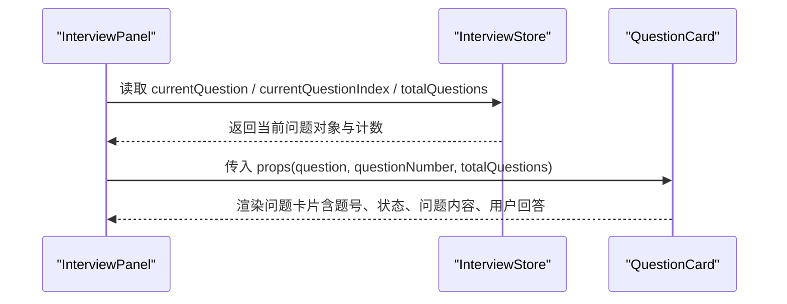
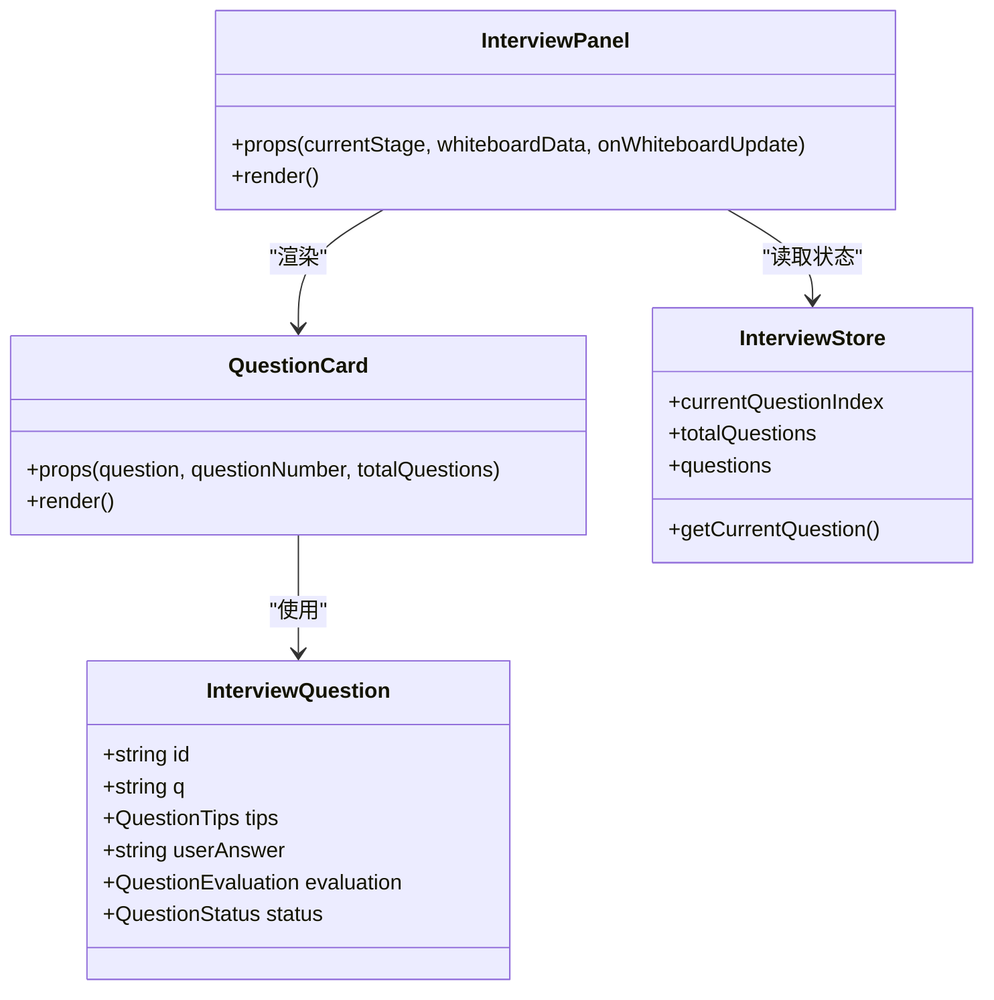

# 问题卡片组件 (QuestionCard)

<cite>
**本文引用的文件**
- [components/interview/QuestionCard.tsx](file://components/interview/QuestionCard.tsx)
- [components/interview/InterviewPanel.tsx](file://components/interview/InterviewPanel.tsx)
- [store/interviewStore.tsx](file://store/interviewStore.tsx)
- [lib/interview/types.ts](file://lib/interview/types.ts)
- [app/interview/start/page.tsx](file://app/interview/start/page.tsx)
- [app/globals.css](file://app/globals.css)
</cite>

## 目录
1. [简介](#简介)
2. [项目结构](#项目结构)
3. [核心组件](#核心组件)
4. [架构总览](#架构总览)
5. [详细组件分析](#详细组件分析)
6. [依赖关系分析](#依赖关系分析)
7. [性能考量](#性能考量)
8. [故障排查指南](#故障排查指南)
9. [结论](#结论)
10. [附录](#附录)

## 简介
本文件面向 QuestionCard.tsx 组件，作为展示当前面试问题的核心 UI 组件，详细说明其功能、实现与集成方式。该组件已标记为禁用，属于旧面试系统的一部分，当前功能已迁移至新页面系统。文档将解析其 props 结构、渲染逻辑、动画效果、状态标签、在 InterviewPanel 中的集成方式、问题内容的换行处理与响应式布局，并提供使用示例与常见问题排查方法。

## 项目结构
- QuestionCard.tsx 位于 components/interview 目录，负责渲染当前问题卡片。
- InterviewPanel.tsx 同目录，作为主面板，负责调度 QuestionCard、TipsCard、EvaluationCard 与白板等区域。
- store/interviewStore.tsx 定义 InterviewQuestion 接口与状态类型，供 QuestionCard 使用。
- lib/interview/types.ts 定义了后端 API 使用的 InterviewQuestion 接口（字段名不同），用于新系统。
- app/interview/start/page.tsx 展示了新系统的面试页面，其中包含问题卡片的样式与交互参考。
- app/globals.css 提供全局响应式布局与固定白板的样式基础。

图表来源
- [components/interview/QuestionCard.tsx](file://components/interview/QuestionCard.tsx#L1-L67)
- [components/interview/InterviewPanel.tsx](file://components/interview/InterviewPanel.tsx#L1-L120)
- [store/interviewStore.tsx](file://store/interviewStore.tsx#L56-L64)
- [lib/interview/types.ts](file://lib/interview/types.ts#L28-L35)
- [app/interview/start/page.tsx](file://app/interview/start/page.tsx#L453-L462)
- [app/globals.css](file://app/globals.css#L235-L517)

章节来源
- [components/interview/QuestionCard.tsx](file://components/interview/QuestionCard.tsx#L1-L67)
- [components/interview/InterviewPanel.tsx](file://components/interview/InterviewPanel.tsx#L397-L443)
- [store/interviewStore.tsx](file://store/interviewStore.tsx#L56-L64)
- [lib/interview/types.ts](file://lib/interview/types.ts#L28-L35)
- [app/interview/start/page.tsx](file://app/interview/start/page.tsx#L453-L462)
- [app/globals.css](file://app/globals.css#L235-L517)

## 核心组件
- 组件名称：QuestionCard
- 功能：展示当前面试问题、题号与状态标签，以及用户的回答（若存在）
- 所属系统：旧面试系统（已禁用），当前功能迁移至新页面系统
- 关键特性：
  - 使用 framer-motion 实现淡入上移入场动画
  - 根据 question.status 显示“待回答”、“已回答”、“已评估”
  - 问题内容与用户回答均使用换行保留 whitespace-pre-wrap
  - 在 InterviewPanel 中按条件渲染，支持无题时的占位提示

章节来源
- [components/interview/QuestionCard.tsx](file://components/interview/QuestionCard.tsx#L1-L67)
- [components/interview/InterviewPanel.tsx](file://components/interview/InterviewPanel.tsx#L422-L443)

## 架构总览
QuestionCard 作为 InterviewPanel 的子组件之一，接收来自状态管理器的数据并渲染。其 props 来源于 InterviewStore 中的当前问题对象与题号计算逻辑。

图表来源
- [components/interview/InterviewPanel.tsx](file://components/interview/InterviewPanel.tsx#L155-L163)
- [components/interview/InterviewPanel.tsx](file://components/interview/InterviewPanel.tsx#L422-L431)
- [store/interviewStore.tsx](file://store/interviewStore.tsx#L166-L171)

## 详细组件分析

### Props 结构与渲染逻辑
- props
  - question: InterviewQuestion（来自状态管理器）
  - questionNumber: number（当前题号，从 1 开始）
  - totalQuestions: number（总题数）
- 渲染要点
  - 题号标识：Q{questionNumber}/{totalQuestions}
  - 状态标签：根据 question.status 切换“待回答”、“已回答”、“已评估”
  - 问题内容：问题标题 + 文本段落，使用 whitespace-pre-wrap 保留换行
  - 用户回答：当存在时渲染“你的回答”区块，同样保留换行

章节来源
- [components/interview/QuestionCard.tsx](file://components/interview/QuestionCard.tsx#L14-L18)
- [components/interview/QuestionCard.tsx](file://components/interview/QuestionCard.tsx#L33-L44)
- [components/interview/QuestionCard.tsx](file://components/interview/QuestionCard.tsx#L46-L66)

### 状态标签逻辑
- question.status 为 QuestionStatus（来自状态管理器）
- 三种状态对应三类标签文案，分别表示“待回答”、“已回答”、“已评估”

章节来源
- [store/interviewStore.tsx](file://store/interviewStore.tsx#L34-L35)
- [components/interview/QuestionCard.tsx](file://components/interview/QuestionCard.tsx#L39-L42)

### 动画效果
- 使用 motion.div 实现入场动画
  - 初始状态：opacity: 0, y: 20
  - 动画结束：opacity: 1, y: 0
  - 过渡时间：0.3 秒

章节来源
- [components/interview/QuestionCard.tsx](file://components/interview/QuestionCard.tsx#L26-L30)

### 在 InterviewPanel 中的集成
- 集成位置：中间动态卡片区域
- 渲染条件：
  - 若有最新总结且轮次完成且问题列表为空：渲染总结卡片
  - 否则若存在 currentQuestion：渲染 QuestionCard
  - 否则渲染“题目尚未生成”的提示卡片
- 题号与总数计算：
  - questionNumber = currentQuestionIndex + 1
  - totalCount = totalQuestions 或 questions.length（若后者大于 0）

章节来源
- [components/interview/InterviewPanel.tsx](file://components/interview/InterviewPanel.tsx#L422-L443)
- [components/interview/InterviewPanel.tsx](file://components/interview/InterviewPanel.tsx#L155-L163)

### 问题内容换行处理
- 问题内容与用户回答均使用 whitespace-pre-wrap，以保留原始换行与缩进
- 该处理在 QuestionCard 中体现于问题段落与回答段落的样式类

章节来源
- [components/interview/QuestionCard.tsx](file://components/interview/QuestionCard.tsx#L49-L61)

### 响应式布局设计
- InterviewPanel 采用三栏布局：左侧对话区、中间卡片区、右侧白板区
- 全局样式通过媒体查询与固定定位实现：
  - 白板固定在右侧，宽度随视口变化
  - 小屏幕下隐藏右侧白板，聊天区宽度自适应
  - 聊天区与白板之间通过 margin/right 保持不重叠
- QuestionCard 所在的中间卡片区在 md 屏以上使用 flex-row 布局，保证内容可滚动

章节来源
- [components/interview/InterviewPanel.tsx](file://components/interview/InterviewPanel.tsx#L348-L505)
- [app/globals.css](file://app/globals.css#L235-L517)

### 字段差异与迁移提示
- 旧系统（QuestionCard 使用）：InterviewQuestion 字段名为 q、userAnswer、evaluation、status
- 新系统（API 类型）：InterviewQuestion 字段名为 question_text、tips 等
- 由于 QuestionCard 已禁用，当前应参考新页面系统中的问题卡片样式与交互

章节来源
- [store/interviewStore.tsx](file://store/interviewStore.tsx#L56-L64)
- [lib/interview/types.ts](file://lib/interview/types.ts#L28-L35)
- [app/interview/start/page.tsx](file://app/interview/start/page.tsx#L453-L462)

## 依赖关系分析

图表来源
- [store/interviewStore.tsx](file://store/interviewStore.tsx#L56-L64)
- [components/interview/QuestionCard.tsx](file://components/interview/QuestionCard.tsx#L14-L18)
- [components/interview/InterviewPanel.tsx](file://components/interview/InterviewPanel.tsx#L155-L163)

章节来源
- [store/interviewStore.tsx](file://store/interviewStore.tsx#L56-L64)
- [components/interview/QuestionCard.tsx](file://components/interview/QuestionCard.tsx#L14-L18)
- [components/interview/InterviewPanel.tsx](file://components/interview/InterviewPanel.tsx#L155-L163)

## 性能考量
- 动画开销：入场动画使用轻量级的 opacity 与 y 变换，对性能影响较小
- 渲染频率：仅在 currentQuestion 或题号/总数变化时更新
- 文本渲染：whitespace-pre-wrap 保留换行，避免额外的字符串处理开销
- 建议：在大量问题列表场景下，可考虑虚拟化或懒加载，但当前组件为单卡片展示，无需过度优化

## 故障排查指南
- 问题内容未显示
  - 检查 props.question 是否存在，且 question.q 是否非空
  - 确认渲染路径是否正确（InterviewPanel 中的条件分支）
  - 参考路径：[components/interview/InterviewPanel.tsx](file://components/interview/InterviewPanel.tsx#L422-L431)
- 题号计算错误
  - 确认 questionNumber = currentQuestionIndex + 1 的逻辑是否被覆盖
  - 检查 totalCount 的来源（totalQuestions 或 questions.length）
  - 参考路径：[components/interview/InterviewPanel.tsx](file://components/interview/InterviewPanel.tsx#L155-L163)
- 状态标签不显示
  - 确认 question.status 的值是否为 pending/answered/evaluated
  - 检查状态管理器中的 QuestionStatus 类型
  - 参考路径：[store/interviewStore.tsx](file://store/interviewStore.tsx#L34-L35)
- 用户回答未显示
  - 确认 question.userAnswer 是否存在
  - 检查渲染条件分支
  - 参考路径：[components/interview/QuestionCard.tsx](file://components/interview/QuestionCard.tsx#L55-L64)
- 换行丢失
  - 确认问题内容与回答段落使用了 whitespace-pre-wrap
  - 参考路径：[components/interview/QuestionCard.tsx](file://components/interview/QuestionCard.tsx#L49-L61)
- 响应式布局异常
  - 检查全局样式中关于固定白板与聊天区的媒体查询
  - 参考路径：[app/globals.css](file://app/globals.css#L235-L517)

章节来源
- [components/interview/InterviewPanel.tsx](file://components/interview/InterviewPanel.tsx#L155-L163)
- [components/interview/QuestionCard.tsx](file://components/interview/QuestionCard.tsx#L39-L66)
- [store/interviewStore.tsx](file://store/interviewStore.tsx#L34-L35)
- [app/globals.css](file://app/globals.css#L235-L517)

## 结论
QuestionCard.tsx 是旧面试系统中的问题展示组件，具备清晰的题号与状态标识、保留换行的问题内容渲染、以及基于 framer-motion 的简单入场动画。尽管该组件已禁用并迁移至新页面系统，但其 props 设计、渲染逻辑与在 InterviewPanel 中的集成方式仍具有参考价值。对于当前实现，建议优先使用新页面系统中的问题卡片样式与交互，并在需要兼容旧数据结构时注意字段差异。

## 附录
- 组件使用示例（路径参考）
  - 在 InterviewPanel 中渲染 QuestionCard 的调用位置
    - [components/interview/InterviewPanel.tsx](file://components/interview/InterviewPanel.tsx#L422-L431)
  - 问题内容换行处理的样式类
    - [components/interview/QuestionCard.tsx](file://components/interview/QuestionCard.tsx#L49-L61)
  - 响应式布局与固定白板样式
    - [app/globals.css](file://app/globals.css#L235-L517)
- 字段差异对照（旧系统 vs 新系统）
  - 旧系统（QuestionCard 使用）：q、userAnswer、evaluation、status
    - [store/interviewStore.tsx](file://store/interviewStore.tsx#L56-L64)
  - 新系统（API 类型）：question_text、tips 等
    - [lib/interview/types.ts](file://lib/interview/types.ts#L28-L35)
  - 新页面系统中的问题卡片样式参考
    - [app/interview/start/page.tsx](file://app/interview/start/page.tsx#L453-L462)