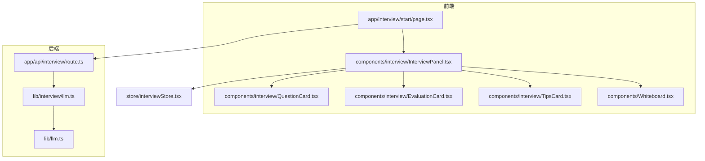
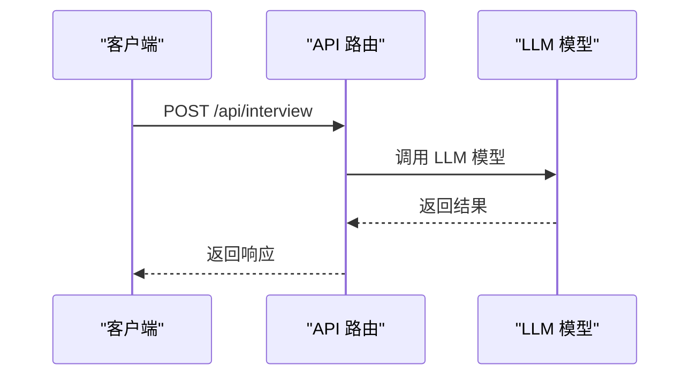
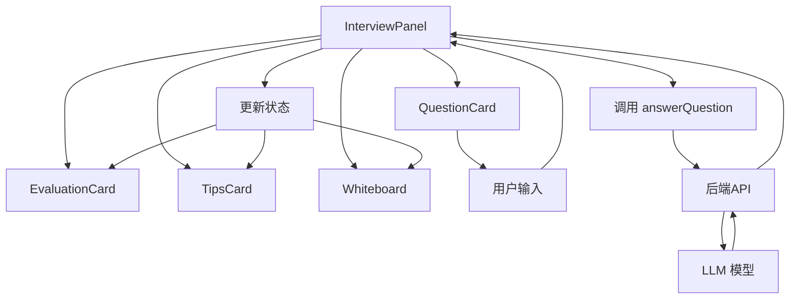
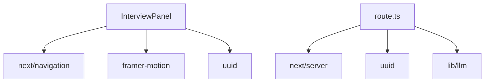

# 面试相关组件

<cite>
**本文档引用的文件**   
- [InterviewPanel.tsx](file://components/interview/InterviewPanel.tsx)
- [QuestionCard.tsx](file://components/interview/QuestionCard.tsx)
- [EvaluationCard.tsx](file://components/interview/EvaluationCard.tsx)
- [TipsCard.tsx](file://components/interview/TipsCard.tsx)
- [interviewStore.tsx](file://store/interviewStore.tsx)
- [page.tsx](file://app/interview/start/page.tsx)
- [route.ts](file://app/api/interview/route.ts)
- [types.ts](file://lib/interview/types.ts)
- [llm.ts](file://lib/interview/llm.ts)
- [Whiteboard.tsx](file://components/Whiteboard.tsx)
</cite>

## 目录
1. [简介](#简介)
2. [项目结构](#项目结构)
3. [核心组件](#核心组件)
4. [架构概述](#架构概述)
5. [详细组件分析](#详细组件分析)
6. [依赖分析](#依赖分析)
7. [性能考虑](#性能考虑)
8. [故障排除指南](#故障排除指南)
9. [结论](#结论)

## 简介
本项目是一个模拟面试系统，旨在为用户提供一个全面的面试准备平台。系统通过集成AI技术，提供从问题生成、回答评估到总结反馈的完整面试流程。用户可以选择不同的面试轮次（如业务面、技术面、HR面等），并根据岗位描述（JD）获得个性化的面试题目。系统还提供了详细的答题提示、评估反馈和改进建议，帮助用户提升面试表现。

## 项目结构
项目采用模块化设计，主要分为以下几个部分：
- `app/`：Next.js应用的页面和API路由。
- `components/`：可复用的UI组件。
- `lib/`：业务逻辑和工具函数。
- `store/`：全局状态管理。
- `docs/`：项目文档。



**图示来源**
- [page.tsx](file://app/interview/start/page.tsx)
- [InterviewPanel.tsx](file://components/interview/InterviewPanel.tsx)
- [QuestionCard.tsx](file://components/interview/QuestionCard.tsx)
- [EvaluationCard.tsx](file://components/interview/EvaluationCard.tsx)
- [TipsCard.tsx](file://components/interview/TipsCard.tsx)
- [Whiteboard.tsx](file://components/Whiteboard.tsx)
- [route.ts](file://app/api/interview/route.ts)
- [llm.ts](file://lib/interview/llm.ts)
- [interviewStore.tsx](file://store/interviewStore.tsx)

## 核心组件

### InterviewPanel.tsx
`InterviewPanel.tsx` 是模拟面试的核心容器组件，负责协调各个子组件和状态管理。它通过 `useInterviewStore` 钩子与全局状态进行交互，并通过 `onWhiteboardUpdate` 回调同步白板数据。

**组件功能**
- **状态管理**：通过 `useInterviewStore` 钩子获取和更新面试状态，包括当前问题、评估结果、轮次类型等。
- **用户交互**：处理用户输入，调用 `answerQuestion` 方法提交答案，并根据状态变化更新UI。
- **数据同步**：通过 `onWhiteboardUpdate` 回调将面试总结同步到白板中。

**组件结构**
```tsx
export default function InterviewPanel({
  currentStage,
  whiteboardData,
  onWhiteboardUpdate,
}: InterviewPanelProps) {
  // 状态管理
  const {
    conversation,
    flowStep,
    mode,
    roundType,
    totalQuestions,
    targetRole,
    currentQuestionIndex,
    questions,
    roundCompleted,
    latestSummary,
    isLoadingQuestion,
    isEvaluating,
    beginInterviewIntro,
    addUserMessage,
    addAssistantMessage,
    setMode,
    setFlowStep,
    setTargetRole,
    setTotalQuestions,
    setRound,
    loadRound,
    getCurrentQuestion,
    answerQuestion,
    nextQuestion,
    retryCurrentQuestion,
  } = useInterviewStore();

  // 用户交互
  const handleSend = async () => {
    // 处理用户输入
  };

  const handleNextQuestion = async () => {
    // 跳转到下一题
  };

  const handleRetry = () => {
    // 重新作答
  };

  // 数据同步
  useEffect(() => {
    if (latestSummary && roundCompleted && questions.length === 0) {
      // 同步面试总结到白板
      onWhiteboardUpdate(updatedBoard);
    }
  }, [latestSummary, whiteboardData, onWhiteboardUpdate, roundType]);

  return (
    // 渲染UI
  );
}
```

**组件间协作**
- `InterviewPanel` 通过 `props` 将 `currentQuestion`、`evaluation` 等状态传递给 `QuestionCard`、`EvaluationCard` 和 `TipsCard`。
- `QuestionCard` 渲染当前问题和用户输入。
- `EvaluationCard` 展示AI评分与反馈。
- `TipsCard` 提供答题策略建议。

**状态变化响应**
- `flowStep` 和 `mode` 状态变化触发不同的交互流程，如从问题展示到回答提交再到评估反馈。
- `currentQuestion` 状态变化触发 `QuestionCard` 的重新渲染。

**Section sources**
- [InterviewPanel.tsx](file://components/interview/InterviewPanel.tsx)

### QuestionCard.tsx
`QuestionCard.tsx` 组件负责渲染当前面试问题，包括问题内容、题号标识和用户回答。

**组件功能**
- **问题展示**：显示当前面试问题的内容。
- **题号标识**：显示当前题号和总题数。
- **用户回答**：显示用户的回答内容。

**组件结构**
```tsx
export default function QuestionCard({
  question,
  questionNumber,
  totalQuestions,
}: QuestionCardProps) {
  return (
    <motion.div>
      {/* 题号标识 */}
      <div>
        <span>Q{questionNumber}/{totalQuestions}</span>
        <span>{question.status}</span>
      </div>

      {/* 问题内容 */}
      <div>
        <h3>问题：</h3>
        <p>{question.q}</p>
      </div>

      {/* 用户回答 */}
      {question.userAnswer && (
        <div>
          <h4>你的回答：</h4>
          <div>{question.userAnswer}</div>
        </div>
      )}
    </motion.div>
  );
}
```

**Section sources**
- [QuestionCard.tsx](file://components/interview/QuestionCard.tsx)

### EvaluationCard.tsx
`EvaluationCard.tsx` 组件负责展示问题的评估结果，包括各项评分和改进建议。

**组件功能**
- **评分展示**：显示准确性、详细度、逻辑性、自信度等评分。
- **综合评分**：计算并显示综合评分。
- **改进建议**：展示AI提供的改进建议。

**组件结构**
```tsx
export default function EvaluationCard({ evaluation }: EvaluationCardProps) {
  return (
    <motion.div>
      <h3>评估结果</h3>

      <div>
        {/* 评分项 */}
        <ScoreBar label="准确性" score={evaluation.accuracy} />
        <ScoreBar label="详细度" score={evaluation.detail} />
        <ScoreBar label="逻辑性" score={evaluation.logic} />
        <ScoreBar label="自信度" score={evaluation.confidence} />
      </div>

      {/* 综合评分 */}
      <div>
        <span>综合评分</span>
        <span>{Math.round((evaluation.accuracy + evaluation.detail + evaluation.logic + evaluation.confidence) / 4)}</span>
      </div>

      {/* 改进建议 */}
      {evaluation.tips && (
        <div>
          <h4>💬 改进建议</h4>
          <div>{evaluation.tips}</div>
        </div>
      )}
    </motion.div>
  );
}
```

**Section sources**
- [EvaluationCard.tsx](file://components/interview/EvaluationCard.tsx)

### TipsCard.tsx
`TipsCard.tsx` 组件负责提供答题策略建议，包括考察意图、回答要点、框架等信息。

**组件功能**
- **考察意图**：显示问题的考察意图。
- **回答要点**：列出回答的关键要点。
- **回答框架**：提供回答的结构化框架。
- **行业特性**：提供行业相关的知识和建议。
- **避坑点**：列出常见的错误和陷阱。
- **内行窍门**：提供专业的建议和技巧。

**组件结构**
```tsx
export default function TipsCard({ tips }: TipsCardProps) {
  return (
    <motion.div>
      <h3>答题提示</h3>

      <div>
        {/* 考察意图 */}
        {tips.intent && (
          <div>
            <h4>考察意图</h4>
            <p>{tips.intent}</p>
          </div>
        )}

        {/* 回答要点 */}
        {tips.keyPoints && tips.keyPoints.length > 0 && (
          <div>
            <h4>回答要点</h4>
            <ul>
              {tips.keyPoints.map((point, index) => (
                <li key={index}>• {point}</li>
              ))}
            </ul>
          </div>
        )}

        {/* 回答框架 */}
        {tips.framework && (
          <div>
            <h4>回答框架</h4>
            <div>{tips.framework}</div>
          </div>
        )}

        {/* 行业特性 */}
        {tips.industryNotes && (
          <div>
            <h4>行业特性</h4>
            <p>{tips.industryNotes}</p>
          </div>
        )}

        {/* 避坑点 */}
        {tips.pitfalls && tips.pitfalls.length > 0 && (
          <div>
            <h4>⚠️ 避坑点</h4>
            <ul>
              {tips.pitfalls.map((pitfall, index) => (
                <li key={index}>• {pitfall}</li>
              ))}
            </ul>
          </div>
        )}

        {/* 内行窍门 */}
        {tips.proTips && tips.proTips.length > 0 && (
          <div>
            <h4>✨ 内行窍门</h4>
            <ul>
              {tips.proTips.map((tip, index) => (
                <li key={index}>• {tip}</li>
              ))}
            </ul>
          </div>
        )}
      </div>
    </motion.div>
  );
}
```

**Section sources**
- [TipsCard.tsx](file://components/interview/TipsCard.tsx)

## 架构概述

### 状态管理
系统使用 `interviewStore.tsx` 进行全局状态管理，通过 `useInterviewStore` 钩子在组件间共享状态。状态管理器包含以下主要状态和方法：

**状态**
- `sessionId`：会话ID。
- `userId`：用户ID。
- `roundType`：当前面试轮次类型。
- `currentQuestionIndex`：当前问题索引。
- `questions`：问题列表。
- `roundCompleted`：轮次是否完成。
- `conversation`：对话记录。
- `flowStep`：当前流程步骤。
- `mode`：当前模式（模拟面试或面试复盘）。
- `targetRole`：目标岗位。
- `totalQuestions`：总题数。
- `latestSummary`：最新总结。
- `isLoadingQuestion`：是否正在加载问题。
- `isEvaluating`：是否正在评估。

**方法**
- `initInterview`：初始化面试会话。
- `loadRound`：加载指定轮次的面试。
- `answerQuestion`：回答当前问题。
- `setEvaluation`：设置问题评估结果。
- `nextQuestion`：跳转到下一题。
- `prevQuestion`：返回上一题。
- `retryCurrentQuestion`：重置当前题目的回答。
- `completeRound`：完成当前轮次，生成总结。
- `resetRound`：重置当前轮次。
- `getCurrentQuestion`：获取当前问题。
- `beginInterviewIntro`：开始面试介绍。
- `addAssistantMessage`：添加AI助手消息。
- `addUserMessage`：添加用户消息。
- `setMode`：设置当前模式。
- `setFlowStep`：设置当前流程步骤。
- `setTargetRole`：设置目标岗位。
- `setTotalQuestions`：设置总题数。
- `setRound`：设置当前轮次。
- `resetInterviewConversation`：重置面试对话。

```mermaid
classDiagram
class InterviewStore {
+sessionId : string | null
+userId : string | null
+roundType : RoundType
+currentQuestionIndex : number
+questions : InterviewQuestion[]
+roundCompleted : boolean
+conversation : InterviewMessage[]
+flowStep : InterviewFlowStep
+mode : InterviewMode
+targetRole : string | null
+totalQuestions : number | null
+latestSummary : any
+isLoadingQuestion : boolean
+isEvaluating : boolean
+initInterview(sessionId : string, userId : string, suggestedRound? : RoundType) : void
+loadRound(roundType : RoundType) : Promise<void>
+answerQuestion(questionId : string, text : string) : Promise<void>
+setEvaluation(questionId : string, evaluationData : QuestionEvaluation) : void
+nextQuestion() : Promise<void>
+prevQuestion() : void
+retryCurrentQuestion() : void
+completeRound() : Promise<void>
+resetRound() : void
+getCurrentQuestion() : InterviewQuestion | null
+beginInterviewIntro(context : { intentRole? : string | null; projectNames? : string[]; }) : void
+addAssistantMessage(content : string) : string
+addUserMessage(content : string) : string
+setMode(mode : InterviewMode) : void
+setFlowStep(step : InterviewFlowStep) : void
+setTargetRole(role : string | null) : void
+setTotalQuestions(count : number | null) : void
+setRound(round : RoundType) : void
+resetInterviewConversation() : void
}
```

**图示来源**
- [interviewStore.tsx](file://store/interviewStore.tsx)

### API 路由
系统通过 `/api/interview` 路由与后端进行交互，支持多种操作，包括开始面试、回答问题、获取下一题和完成轮次。

**请求格式**
```typescript
{
  sessionId?: string;
  userId?: string;
  action: string;
  roundType?: string;
  questionId?: string;
  answer?: string;
  recentMessages?: Array<{
    role: "user" | "assistant";
    content: string;
  }>;
}
```

**响应格式**
```typescript
{
  type: "next-question" | "evaluation" | "round-complete" | "error";
  payload: any;
  debug?: any;
}
```

**操作类型**
- `start_round`：开始一轮面试。
- `answer`：回答问题。
- `next_question`：获取下一题。
- `finish_round`：完成轮次。



**图示来源**
- [route.ts](file://app/api/interview/route.ts)

## 详细组件分析

### 组件间协作机制
组件间通过 `props` 传递状态，实现协作。`InterviewPanel` 作为核心容器组件，协调 `QuestionCard`、`EvaluationCard` 和 `TipsCard` 的工作。

**状态传递**
- `InterviewPanel` 通过 `props` 将 `currentQuestion`、`evaluation` 等状态传递给子组件。
- `QuestionCard` 接收 `currentQuestion` 并渲染问题内容。
- `EvaluationCard` 接收 `evaluation` 并展示评分和改进建议。
- `TipsCard` 接收 `tips` 并提供答题策略建议。

**交互流程**
1. 用户在 `InterviewPanel` 中输入答案。
2. `InterviewPanel` 调用 `answerQuestion` 方法提交答案。
3. `answerQuestion` 方法调用后端API，获取评估结果。
4. `InterviewPanel` 更新状态，触发 `EvaluationCard` 和 `TipsCard` 的重新渲染。



**图示来源**
- [InterviewPanel.tsx](file://components/interview/InterviewPanel.tsx)
- [QuestionCard.tsx](file://components/interview/QuestionCard.tsx)
- [EvaluationCard.tsx](file://components/interview/EvaluationCard.tsx)
- [TipsCard.tsx](file://components/interview/TipsCard.tsx)
- [Whiteboard.tsx](file://components/Whiteboard.tsx)

## 依赖分析

### 前端依赖
- `next/navigation`：用于页面导航。
- `framer-motion`：用于动画效果。
- `uuid`：用于生成唯一ID。

### 后端依赖
- `next/server`：Next.js服务器端API。
- `uuid`：用于生成唯一ID。
- `lib/llm`：调用LLM模型。



**图示来源**
- [InterviewPanel.tsx](file://components/interview/InterviewPanel.tsx)
- [route.ts](file://app/api/interview/route.ts)

## 性能考虑
- **状态管理**：使用 `useCallback` 和 `useMemo` 优化性能，避免不必要的重新渲染。
- **API 调用**：合理使用缓存和批量请求，减少网络延迟。
- **动画效果**：使用 `framer-motion` 提供流畅的动画效果，但避免过度使用导致性能下降。

## 故障排除指南

### 问题加载失败
- **检查网络连接**：确保网络连接正常。
- **检查API密钥**：确保 `DEEPSEEK_API_KEY` 环境变量已正确设置。
- **查看日志**：检查后端日志，查找错误信息。

### 评分未更新
- **检查状态管理**：确保 `useInterviewStore` 钩子正确更新状态。
- **检查API响应**：确保后端API返回正确的评估结果。
- **查看日志**：检查前端和后端日志，查找错误信息。

**Section sources**
- [InterviewPanel.tsx](file://components/interview/InterviewPanel.tsx)
- [route.ts](file://app/api/interview/route.ts)

## 结论
本项目通过模块化设计和高效的组件协作，提供了一个完整的模拟面试系统。系统利用AI技术生成个性化面试题目，并提供详细的评估反馈和改进建议，帮助用户提升面试表现。通过合理的状态管理和API设计，系统实现了高效的数据同步和用户交互。未来可以进一步优化性能，增加更多面试轮次和功能，提升用户体验。