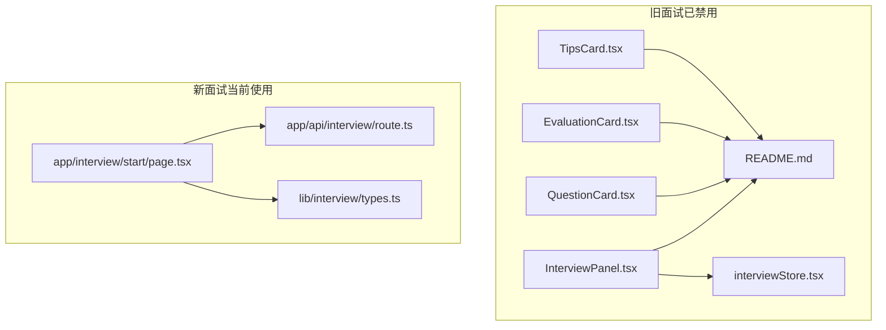
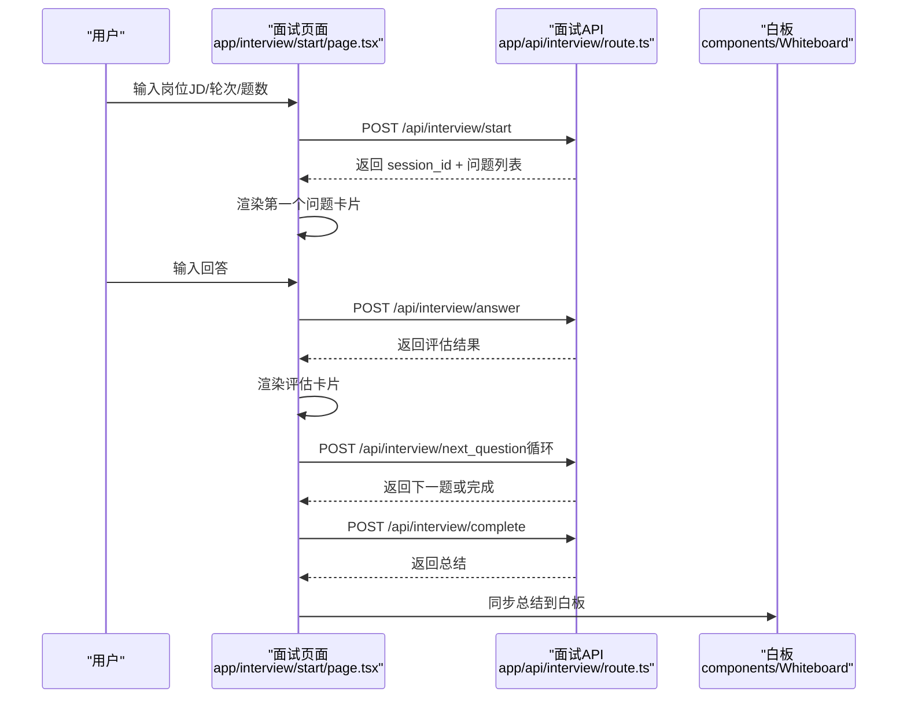
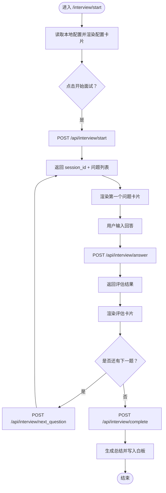
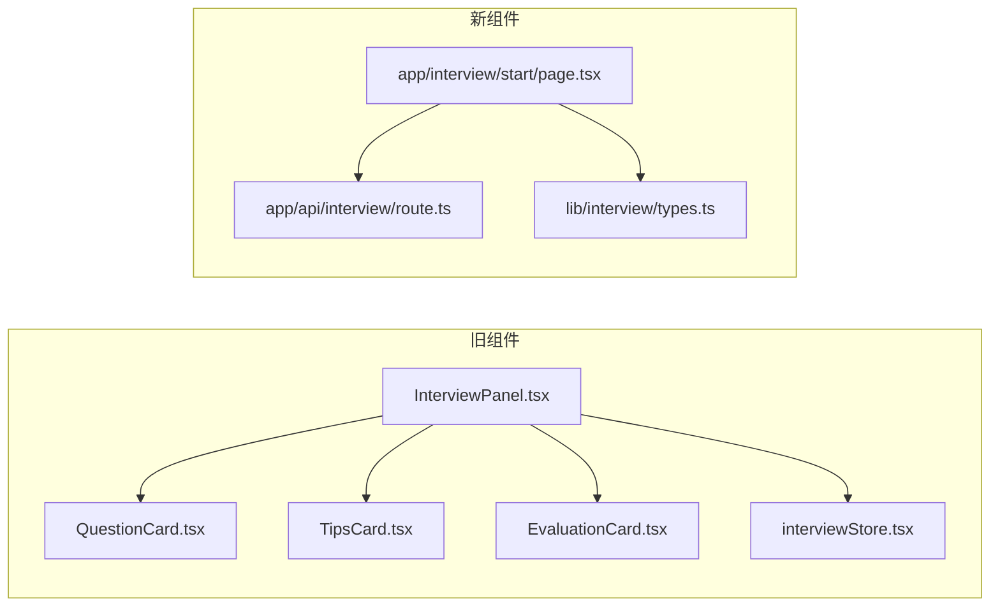

# 面试组件文档说明

<cite>
**本文引用的文件**
- [components/interview/README.md](file://components/interview/README.md)
- [components/interview/InterviewPanel.tsx](file://components/interview/InterviewPanel.tsx)
- [components/interview/QuestionCard.tsx](file://components/interview/QuestionCard.tsx)
- [components/interview/EvaluationCard.tsx](file://components/interview/EvaluationCard.tsx)
- [components/interview/TipsCard.tsx](file://components/interview/TipsCard.tsx)
- [app/interview/start/page.tsx](file://app/interview/start/page.tsx)
- [app/api/interview/route.ts](file://app/api/interview/route.ts)
- [store/interviewStore.tsx](file://store/interviewStore.tsx)
- [lib/interview/types.ts](file://lib/interview/types.ts)
</cite>

## 目录
1. [简介](#简介)
2. [项目结构](#项目结构)
3. [核心组件](#核心组件)
4. [架构总览](#架构总览)
5. [详细组件分析](#详细组件分析)
6. [依赖关系分析](#依赖关系分析)
7. [性能考量](#性能考量)
8. [故障排查指南](#故障排查指南)
9. [结论](#结论)
10. [附录](#附录)

## 简介
本文件旨在解读 components/interview 目录下的组件与文档，明确这些组件当前处于“已禁用”状态，属于已被移除的旧面试逻辑。当前系统已迁移至 app/interview/start/page.tsx 的新面试系统。本文档强调以下要点：
- components/interview 下的 InterviewPanel、QuestionCard、EvaluationCard、TipsCard 均标注为“已禁用”，不再参与当前运行时流程。
- 新面试系统通过 app/interview/start/page.tsx 提供端到端体验，配合 app/api/interview/route.ts 的后端接口与 lib/interview/types.ts 的类型定义。
- 保留旧组件与文档的目的是便于历史回溯与对比，避免新功能开发误用废弃代码。
- 文档末尾提供新旧系统对比指引与清理建议，帮助团队理解架构演进路径。

## 项目结构
components/interview 目录包含四个面试相关组件与一份使用说明文档；app/interview/start/page.tsx 为新面试系统的入口页面；app/api/interview/route.ts 提供统一的面试 API；store/interviewStore.tsx 为旧面试状态管理；lib/interview/types.ts 定义新面试系统的类型。

图表来源
- [components/interview/README.md](file://components/interview/README.md#L1-L323)
- [components/interview/InterviewPanel.tsx](file://components/interview/InterviewPanel.tsx#L1-L509)
- [components/interview/QuestionCard.tsx](file://components/interview/QuestionCard.tsx#L1-L76)
- [components/interview/EvaluationCard.tsx](file://components/interview/EvaluationCard.tsx#L1-L109)
- [components/interview/TipsCard.tsx](file://components/interview/TipsCard.tsx#L1-L116)
- [store/interviewStore.tsx](file://store/interviewStore.tsx#L1-L789)
- [app/interview/start/page.tsx](file://app/interview/start/page.tsx#L1-L712)
- [app/api/interview/route.ts](file://app/api/interview/route.ts#L1-L809)
- [lib/interview/types.ts](file://lib/interview/types.ts#L1-L117)

章节来源
- [components/interview/README.md](file://components/interview/README.md#L1-L323)
- [app/interview/start/page.tsx](file://app/interview/start/page.tsx#L1-L712)

## 核心组件
- InterviewPanel.tsx：三层布局的主面板（左侧对话输入、中间问题与提示卡片、右侧白板总结），当前标注为“已禁用”，不再作为新系统入口。
- QuestionCard.tsx：展示当前面试问题与用户回答，标注为“已禁用”。
- EvaluationCard.tsx：展示评估结果（含多项评分与建议），标注为“已禁用”。
- TipsCard.tsx：展示问题的考察意图、回答要点、框架等提示信息，标注为“已禁用”。

这些组件均带有“已禁用”的注释与说明，表明它们属于旧面试逻辑，当前系统已迁移到 app/interview/start/page.tsx。

章节来源
- [components/interview/InterviewPanel.tsx](file://components/interview/InterviewPanel.tsx#L1-L509)
- [components/interview/QuestionCard.tsx](file://components/interview/QuestionCard.tsx#L1-L76)
- [components/interview/EvaluationCard.tsx](file://components/interview/EvaluationCard.tsx#L1-L109)
- [components/interview/TipsCard.tsx](file://components/interview/TipsCard.tsx#L1-L116)

## 架构总览
新面试系统采用“页面驱动 + API 驱动”的模式：
- 页面层：app/interview/start/page.tsx 负责配置输入、消息流渲染、输入框交互、白板联动与流程控制。
- API 层：app/api/interview/route.ts 提供统一的面试动作（start_round、answer、next_question、finish_round），支持 stub 模式与 LLM 模式。
- 类型层：lib/interview/types.ts 定义会话、题目、评估、答案、总结等数据结构，保证前后端一致。

图表来源
- [app/interview/start/page.tsx](file://app/interview/start/page.tsx#L1-L712)
- [app/api/interview/route.ts](file://app/api/interview/route.ts#L1-L809)

章节来源
- [app/interview/start/page.tsx](file://app/interview/start/page.tsx#L1-L712)
- [app/api/interview/route.ts](file://app/api/interview/route.ts#L1-L809)

## 详细组件分析

### 旧组件共同状态与警示
- 组件状态：四个组件均标注为“已禁用”，表示当前系统不再使用这些组件。
- 警示作用：README.md 明确指出“InterviewPanel 会自动检测 userStage === 'interview'，如果不是面试阶段，组件会返回 null，不渲染任何内容”，并强调“所有交互都在 InterviewPanel 内部处理”，这些说明来自旧系统设计，当前已由新页面接管。
- 迁移提示：README.md 最后明确“现在使用 /app/interview/start/page.tsx 中的新面试系统”，提醒开发者避免在新功能中使用这些旧组件。

章节来源
- [components/interview/README.md](file://components/interview/README.md#L295-L323)
- [components/interview/InterviewPanel.tsx](file://components/interview/InterviewPanel.tsx#L1-L509)

### 新面试系统关键流程
- 配置阶段：页面读取本地存储的岗位、轮次、题数，渲染配置卡片并提供“开始面试”按钮。
- 启动面试：调用 /api/interview/start，接收 session_id 与问题列表，渲染第一个问题卡片。
- 回答与评估：提交答案到 /api/interview/answer，接收评估结果并渲染评估卡片。
- 下一题与完成：循环调用 /api/interview/next_question，直至完成，调用 /api/interview/complete 生成总结并写入白板。
- 白板联动：页面将总结写入白板，支持持久化保存。

图表来源
- [app/interview/start/page.tsx](file://app/interview/start/page.tsx#L1-L712)
- [app/api/interview/route.ts](file://app/api/interview/route.ts#L1-L809)

章节来源
- [app/interview/start/page.tsx](file://app/interview/start/page.tsx#L1-L712)
- [app/api/interview/route.ts](file://app/api/interview/route.ts#L1-L809)

### 旧面试状态管理（对比参考）
- store/interviewStore.tsx 定义了旧面试的状态与方法，包括会话、轮次、问题、对话、流程步骤、评估、历史等，当前已不再由新页面使用。
- 该文件可作为新旧系统对比的参考，帮助理解数据结构与交互流程的演进。

章节来源
- [store/interviewStore.tsx](file://store/interviewStore.tsx#L1-L789)

### 新面试类型定义（对比参考）
- lib/interview/types.ts 定义了新面试系统的类型，包括 RoundType、InterviewSession、InterviewQuestion、Assessment、InterviewAnswer、InterviewSummary 等，与旧面试状态管理形成对照。

章节来源
- [lib/interview/types.ts](file://lib/interview/types.ts#L1-L117)

## 依赖关系分析
- 旧组件依赖关系：InterviewPanel.tsx 依赖 QuestionCard.tsx、TipsCard.tsx、EvaluationCard.tsx 与 store/interviewStore.tsx；README.md 提供使用说明与注意事项。
- 新组件依赖关系：app/interview/start/page.tsx 依赖 components/Whiteboard、components/InputBar、components/MessageBubble、lib/interview/types.ts；与 app/api/interview/route.ts 交互。

图表来源
- [components/interview/InterviewPanel.tsx](file://components/interview/InterviewPanel.tsx#L1-L509)
- [components/interview/QuestionCard.tsx](file://components/interview/QuestionCard.tsx#L1-L76)
- [components/interview/EvaluationCard.tsx](file://components/interview/EvaluationCard.tsx#L1-L109)
- [components/interview/TipsCard.tsx](file://components/interview/TipsCard.tsx#L1-L116)
- [store/interviewStore.tsx](file://store/interviewStore.tsx#L1-L789)
- [app/interview/start/page.tsx](file://app/interview/start/page.tsx#L1-L712)
- [app/api/interview/route.ts](file://app/api/interview/route.ts#L1-L809)
- [lib/interview/types.ts](file://lib/interview/types.ts#L1-L117)

章节来源
- [components/interview/README.md](file://components/interview/README.md#L1-L323)
- [app/interview/start/page.tsx](file://app/interview/start/page.tsx#L1-L712)

## 性能考量
- 旧系统（store/interviewStore.tsx）：使用 React Context 管理状态，避免引入第三方状态库，但交互仍依赖后端 API，存在网络延迟。
- 新系统（app/interview/start/page.tsx）：页面内维护消息流与状态，减少不必要的全局状态依赖；API 采用一次性 JSON 响应，避免流式渲染带来的复杂性。
- 建议：新功能开发优先使用新页面与 API，避免在新页面中引入旧状态管理逻辑，以降低耦合与维护成本。

[本节为通用建议，无需特定文件引用]

## 故障排查指南
- 新系统常见问题
  - 启动失败：检查 /api/interview/start 是否返回正确的 session_id 与问题列表；若返回错误，页面会渲染错误卡片并提示。
  - 提交答案失败：检查 /api/interview/answer 的响应格式；若失败，页面会渲染错误卡片。
  - 完成总结失败：检查 /api/interview/complete 的响应；若失败，页面会渲染错误卡片。
- 旧系统问题定位
  - 若误用旧组件或状态管理，可能出现流程中断或状态不一致；应切换到新页面与 API。

章节来源
- [app/interview/start/page.tsx](file://app/interview/start/page.tsx#L1-L712)
- [app/api/interview/route.ts](file://app/api/interview/route.ts#L1-L809)

## 结论
- components/interview 下的四个组件与 README 均标注为“已禁用”，当前系统已完全迁移到 app/interview/start/page.tsx。
- 新系统通过统一 API 与类型定义，提供了更清晰的流程与更强的可维护性。
- 保留旧组件与文档有助于历史回溯与对比，但新功能开发应避免使用这些废弃代码。
- 建议在后续代码清理中移除旧组件与旧状态管理文件，集中精力维护新系统。

[本节为总结性内容，无需特定文件引用]

## 附录

### 新旧系统对比指引
- 旧系统（已禁用）
  - 组件：InterviewPanel、QuestionCard、EvaluationCard、TipsCard
  - 状态：store/interviewStore.tsx
  - 页面：components/interview/README.md 提供使用说明
- 新系统（当前使用）
  - 页面：app/interview/start/page.tsx
  - API：app/api/interview/route.ts
  - 类型：lib/interview/types.ts

章节来源
- [components/interview/README.md](file://components/interview/README.md#L1-L323)
- [store/interviewStore.tsx](file://store/interviewStore.tsx#L1-L789)
- [app/interview/start/page.tsx](file://app/interview/start/page.tsx#L1-L712)
- [app/api/interview/route.ts](file://app/api/interview/route.ts#L1-L809)
- [lib/interview/types.ts](file://lib/interview/types.ts#L1-L117)

### 迁移至新面试系统的建议步骤
- 替换入口：将旧入口（如 app/chat/page.tsx 中对 InterviewPanel 的条件渲染）替换为新页面路由。
- 替换状态：移除对 store/interviewStore.tsx 的依赖，改为直接调用 app/api/interview/route.ts。
- 替换组件：移除对 QuestionCard、EvaluationCard、TipsCard 的直接使用，使用新页面的消息卡片渲染。
- 类型对齐：使用 lib/interview/types.ts 中的类型定义，确保前后端一致。
- 白板联动：沿用新页面的白板更新逻辑，确保总结写入白板。
- 测试验证：覆盖启动、回答、评估、下一题、完成等全流程测试。

章节来源
- [app/interview/start/page.tsx](file://app/interview/start/page.tsx#L1-L712)
- [app/api/interview/route.ts](file://app/api/interview/route.ts#L1-L809)
- [lib/interview/types.ts](file://lib/interview/types.ts#L1-L117)