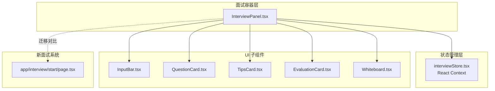
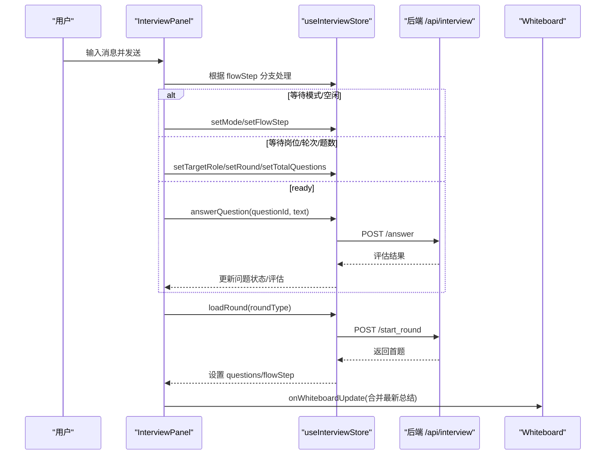
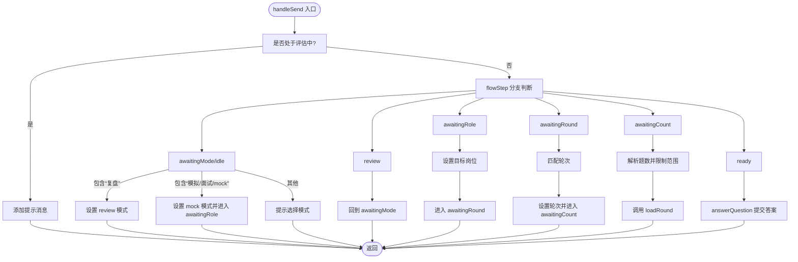
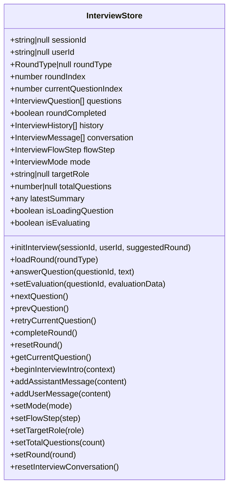
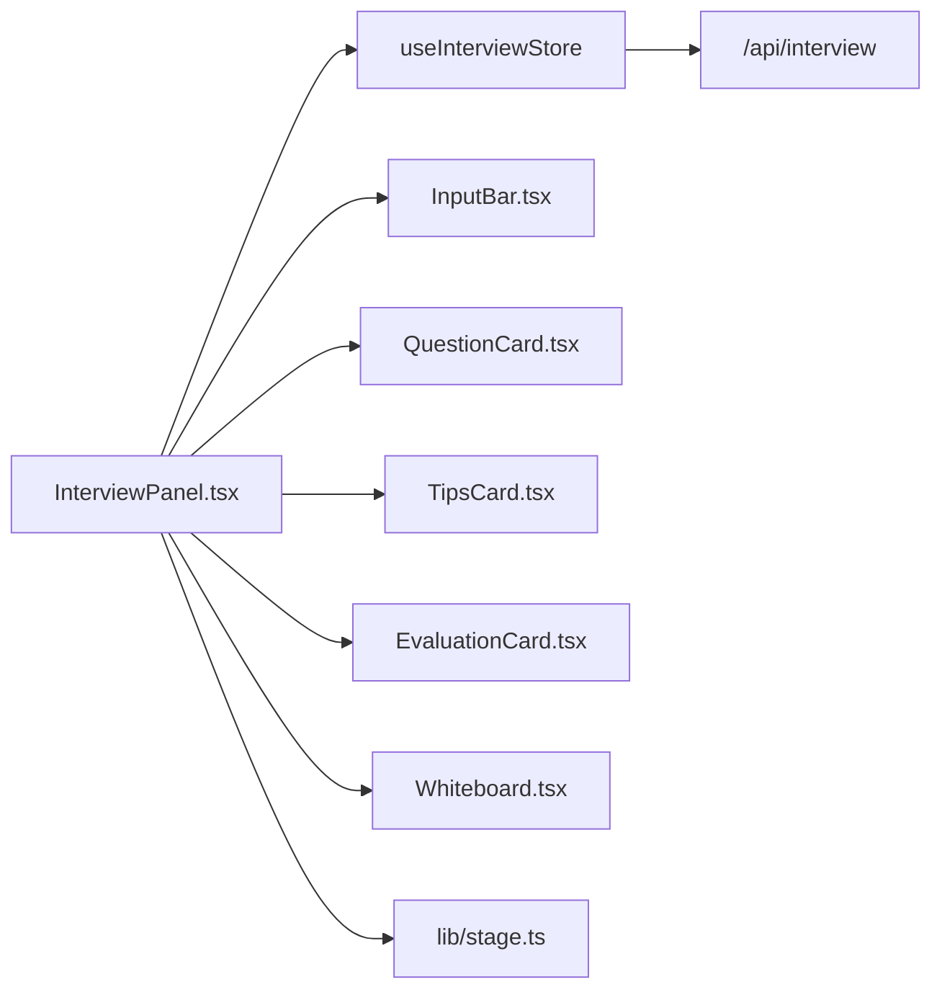

# 面试面板组件 (InterviewPanel)

<cite>
**本文引用的文件**
- [InterviewPanel.tsx](file://components/interview/InterviewPanel.tsx)
- [interviewStore.tsx](file://store/interviewStore.tsx)
- [InputBar.tsx](file://components/InputBar.tsx)
- [Whiteboard.tsx](file://components/Whiteboard.tsx)
- [QuestionCard.tsx](file://components/interview/QuestionCard.tsx)
- [TipsCard.tsx](file://components/interview/TipsCard.tsx)
- [EvaluationCard.tsx](file://components/interview/EvaluationCard.tsx)
- [page.tsx](file://app/interview/start/page.tsx)
- [stage.ts](file://lib/stage.ts)
- [README.md](file://components/interview/README.md)
- [providers.tsx](file://app/providers.tsx)
</cite>

## 目录
1. [简介](#简介)
2. [项目结构](#项目结构)
3. [核心组件](#核心组件)
4. [架构总览](#架构总览)
5. [详细组件分析](#详细组件分析)
6. [依赖关系分析](#依赖关系分析)
7. [性能考量](#性能考量)
8. [故障排查指南](#故障排查指南)
9. [结论](#结论)
10. [附录](#附录)

## 简介
InterviewPanel.tsx 是旧版模拟面试的核心容器组件，采用三层布局：左侧为对话输入区，中间为问题与提示展示区，右侧为白板总结区。该组件通过 useInterviewStore（React Context 实现）协调多轮面试流程，包括面试阶段控制（flowStep）、模式切换（mode）、问题加载（loadRound）、答案提交（answerQuestion）等。组件会响应 currentStage、whiteboardData 等 props，并通过 onWhiteboardUpdate 回调实现白板数据的实时同步。

该组件已被标记为禁用，当前系统使用 /app/interview/start/page.tsx 中的新面试系统。本文提供迁移指引与版本对比说明，并针对状态未更新、白板不同步等问题提供调试方案。

## 项目结构
InterviewPanel 所属模块位于 components/interview，配合 store/interviewStore.tsx 提供全局状态管理；右侧白板组件 Whiteboard.tsx 与输入组件 InputBar.tsx、问题卡片 QuestionCard.tsx、提示卡片 TipsCard.tsx、评估卡片 EvaluationCard.tsx 协同工作；新面试系统入口位于 app/interview/start/page.tsx。

图表来源
- [InterviewPanel.tsx](file://components/interview/InterviewPanel.tsx#L1-L509)
- [interviewStore.tsx](file://store/interviewStore.tsx#L1-L789)
- [InputBar.tsx](file://components/InputBar.tsx#L1-L122)
- [Whiteboard.tsx](file://components/Whiteboard.tsx#L1-L541)
- [QuestionCard.tsx](file://components/interview/QuestionCard.tsx#L1-L76)
- [TipsCard.tsx](file://components/interview/TipsCard.tsx#L1-L116)
- [EvaluationCard.tsx](file://components/interview/EvaluationCard.tsx#L1-L109)
- [page.tsx](file://app/interview/start/page.tsx#L1-L712)

章节来源
- [InterviewPanel.tsx](file://components/interview/InterviewPanel.tsx#L1-L509)
- [interviewStore.tsx](file://store/interviewStore.tsx#L1-L789)

## 核心组件
- InterviewPanel.tsx：三层布局容器，负责对话、问题与提示展示、白板同步，协调面试流程状态。
- interviewStore.tsx：面试全局状态管理（React Context），提供 loadRound、answerQuestion、nextQuestion、completeRound 等方法。
- InputBar.tsx：输入与发送组件，支持文件上传、回车发送、禁用态控制。
- Whiteboard.tsx：右侧白板组件，按阶段渲染不同数据结构，支持点击跳转详情。
- QuestionCard.tsx、TipsCard.tsx、EvaluationCard.tsx：问题、提示、评估卡片，分别展示问题与答题建议。
- app/interview/start/page.tsx：新面试系统入口，采用独立的消息流与白板写入逻辑。

章节来源
- [InterviewPanel.tsx](file://components/interview/InterviewPanel.tsx#L1-L509)
- [interviewStore.tsx](file://store/interviewStore.tsx#L1-L789)
- [InputBar.tsx](file://components/InputBar.tsx#L1-L122)
- [Whiteboard.tsx](file://components/Whiteboard.tsx#L1-L541)
- [QuestionCard.tsx](file://components/interview/QuestionCard.tsx#L1-L76)
- [TipsCard.tsx](file://components/interview/TipsCard.tsx#L1-L116)
- [EvaluationCard.tsx](file://components/interview/EvaluationCard.tsx#L1-L109)
- [page.tsx](file://app/interview/start/page.tsx#L1-L712)

## 架构总览
InterviewPanel 通过 useInterviewStore 获取面试状态与方法，驱动对话、问题卡片、提示/评估卡片与白板的联动。组件内部维护 draft 输入、消息滚动、最新总结同步等逻辑；右侧白板通过 onWhiteboardUpdate 回调实现双向同步。

图表来源
- [InterviewPanel.tsx](file://components/interview/InterviewPanel.tsx#L171-L301)
- [interviewStore.tsx](file://store/interviewStore.tsx#L430-L501)
- [interviewStore.tsx](file://store/interviewStore.tsx#L503-L576)
- [interviewStore.tsx](file://store/interviewStore.tsx#L588-L667)
- [Whiteboard.tsx](file://components/Whiteboard.tsx#L1-L541)

## 详细组件分析

### InterviewPanel.tsx：三层布局与流程控制
- 三层布局
  - 左侧：对话输入区，包含 InputBar、消息列表、时间戳与滚动行为。
  - 中间：问题与提示展示区，包含 QuestionCard、TipsCard、EvaluationCard、操作按钮（再次作答、下一题）。
  - 右侧：白板总结区，包含 Whiteboard，支持点击跳转详情。
- 状态与 props
  - props：currentStage（字符串，经 isValidStage 校验转换为 UserStage）、whiteboardData、onWhiteboardUpdate。
  - 状态：draft（输入草稿）、messagesEndRef（滚动）、selectedRoundRef（轮次记忆）、introContext（从 whiteboardData 解析目标岗位/项目名）。
- 流程控制（flowStep）
  - idle/awaitingMode/awaitingRole/awaitingRound/awaitingCount/ready/review 多阶段引导。
  - beginInterviewIntro：首次对话时根据 introContext 初始化引导。
- 关键逻辑
  - handleSend：根据 flowStep 分支处理“模拟面试/面试复盘”、“目标岗位”、“轮次”、“题数”，并触发 loadRound。
  - answerQuestion：在 ready 且非评估中时提交答案，等待后端评估结果并更新问题状态。
  - nextQuestion/retryCurrentQuestion：控制下一题与重答。
  - 白板同步：监听 latestSummary，计算平均分与问题明细，合并到 whiteboardData 并通过 onWhiteboardUpdate 回调同步。
  - 进度标签：基于 currentQuestionIndex 与 totalQuestions 计算“第 X 题 / 共 Y 题”。

图表来源
- [InterviewPanel.tsx](file://components/interview/InterviewPanel.tsx#L171-L301)

章节来源
- [InterviewPanel.tsx](file://components/interview/InterviewPanel.tsx#L1-L509)

### useInterviewStore：面试状态与 API 协调
- 状态字段
  - 会话与轮次：sessionId、userId、roundType、roundIndex、currentQuestionIndex、roundCompleted、history。
  - 问题列表：questions（InterviewQuestion[]），包含 id、q、tips、userAnswer、evaluation、status。
  - 对话与引导：conversation、flowStep、mode、targetRole、totalQuestions、latestSummary、isLoadingQuestion、isEvaluating。
- 核心方法
  - 初始化：initInterview。
  - 轮次：loadRound（POST /api/interview?action=start_round），completeRound（POST /api/interview?action=finish_round）。
  - 问题：answerQuestion（POST /api/interview?action=answer），nextQuestion（POST /api/interview?action=next_question），retryCurrentQuestion，setEvaluation，resetRound，resetInterviewConversation。
  - 辅助：beginInterviewIntro、addAssistantMessage、addUserMessage、setMode、setFlowStep、setTargetRole、setTotalQuestions、setRound、getCurrentQuestion。
- 数据流
  - loadRound/answerQuestion/nextQuestion 均通过 fetch 调用后端 API，成功后更新 questions、flowStep、latestSummary 等状态，驱动 UI 更新。

图表来源
- [interviewStore.tsx](file://store/interviewStore.tsx#L74-L186)
- [interviewStore.tsx](file://store/interviewStore.tsx#L700-L789)

章节来源
- [interviewStore.tsx](file://store/interviewStore.tsx#L1-L789)

### 子组件集成
- InputBar.tsx
  - props：value、onChange、onSend、isLoading、disabled。
  - 行为：支持文件上传（.pdf/.docx）、回车发送、禁用态控制。
- Whiteboard.tsx
  - props：data、currentStage、onUpdate、resumeData、isResumeProcessing、isPreviewCollapsed、onFileUpload、onDeleteResume、onDownloadResume、onTogglePreview、onToggle、isVisible。
  - 行为：按阶段渲染不同数据结构，支持点击跳转详情、下载/删除简历、展开/收起预览。
- QuestionCard.tsx、TipsCard.tsx、EvaluationCard.tsx
  - QuestionCard：展示问题、题号、状态、用户回答。
  - TipsCard：展示考察意图、关键点、回答框架、行业特性、避坑点、内行窍门。
  - EvaluationCard：展示四项评分与综合评分、改进建议。

章节来源
- [InputBar.tsx](file://components/InputBar.tsx#L1-L122)
- [Whiteboard.tsx](file://components/Whiteboard.tsx#L1-L541)
- [QuestionCard.tsx](file://components/interview/QuestionCard.tsx#L1-L76)
- [TipsCard.tsx](file://components/interview/TipsCard.tsx#L1-L116)
- [EvaluationCard.tsx](file://components/interview/EvaluationCard.tsx#L1-L109)

### 新面试系统对比与迁移指引
- 新系统入口：/app/interview/start/page.tsx
- 新系统特点
  - 固定阶段：始终使用 interview 阶段，不读取或恢复全局阶段状态。
  - 独立消息流：以消息卡片形式组织配置、问题、评估、总结，支持滚动到底部。
  - 白板写入：在生成总结时将 summary 合并到 whiteboardData 并可持久化保存。
  - 交互流程：开始面试 -> 获取首题 -> 提交答案 -> 评估卡片 -> 下一题 -> 完成 -> 总结 -> 新一轮配置。
- 迁移建议
  - 将旧 InterviewPanel 的对话与流程迁移到新页面的消息流与卡片渲染。
  - 将旧 store 的 loadRound/answerQuestion/nextQuestion/completeRound 等方法替换为新页面的 /api/interview/start、/api/interview/answer、/api/interview/complete。
  - 将旧白板数据结构与渲染逻辑迁移至新 Whiteboard 组件，保持 interviewReports 字段一致性。
  - 保留 InputBar 的输入能力，但将发送逻辑绑定到新页面的 handleSubmitAnswer。

章节来源
- [page.tsx](file://app/interview/start/page.tsx#L1-L712)
- [providers.tsx](file://app/providers.tsx#L1-L12)
- [README.md](file://components/interview/README.md#L88-L322)

## 依赖关系分析
- 组件耦合
  - InterviewPanel 依赖 useInterviewStore 的状态与方法，耦合度高但职责清晰。
  - 子组件之间低耦合，通过 props 传递数据，便于复用与测试。
- 外部依赖
  - 后端 API：/api/interview（start_round、answer、next_question、finish_round）。
  - 白板数据结构：WhiteboardData，包含 interviewReports 等字段。
- 阶段类型
  - UserStage 来源于 lib/stage.ts，InterviewPanel 将字符串 currentStage 安全转换为 UserStage。

图表来源
- [InterviewPanel.tsx](file://components/interview/InterviewPanel.tsx#L1-L509)
- [interviewStore.tsx](file://store/interviewStore.tsx#L1-L789)
- [stage.ts](file://lib/stage.ts#L1-L85)

章节来源
- [InterviewPanel.tsx](file://components/interview/InterviewPanel.tsx#L1-L509)
- [stage.ts](file://lib/stage.ts#L1-L85)

## 性能考量
- 渲染优化
  - 使用 useMemo 缓存 introContext，避免不必要的重渲染。
  - 使用 useRef 保存 draft、滚动锚点、最近处理的总结 ID，减少无效更新。
  - 使用 framer-motion 的动画在初次渲染时平滑出现，避免阻塞主线程。
- 状态更新
  - 通过 latestSummary 触发白板更新时，使用 ref 防止重复处理相同 reportId。
  - isLoadingQuestion/isEvaluating 控制输入禁用与按钮禁用，避免并发请求。
- 网络请求
  - loadRound/answerQuestion/nextQuestion/completeRound 均为异步，使用 try/catch 与 finally 控制 isLoading/isEvaluating，保证 UI 状态一致。

[本节为通用指导，无需特定文件引用]

## 故障排查指南
- 常见问题与定位
  - 状态未更新：检查 useInterviewStore 的方法调用链（loadRound/answerQuestion/nextQuestion/completeRound）是否被正确触发，确认 fetch 请求返回的数据结构与 store 期望一致。
  - 白板不同步：确认 onWhiteboardUpdate 回调是否被调用，检查 latestSummary 是否存在，以及 summaryHandledRef 是否阻止了重复处理。
  - 输入不可用：检查 isEvaluating 与 isLoadingQuestion 的状态，确保在评估或加载题过程中禁用输入。
  - 问题未显示：确认 currentQuestion 是否存在，totalQuestions 与 currentQuestionIndex 是否正确计算。
- 调试步骤
  - 在 handleSend 中打印 flowStep 与分支判断，确认进入正确的流程。
  - 在 useEffect 监听 latestSummary 的回调中打印 whiteboardData 与 reportId，确认合并逻辑。
  - 在 InputBar 中检查 disabled 与 isLoading 的传入值，确认按钮与输入框状态一致。
  - 在新系统 page.tsx 中对比白板写入逻辑，确保字段对齐（如 round、overallScore、strengths、improvements、questions 等）。

章节来源
- [InterviewPanel.tsx](file://components/interview/InterviewPanel.tsx#L83-L147)
- [InterviewPanel.tsx](file://components/interview/InterviewPanel.tsx#L171-L301)
- [InputBar.tsx](file://components/InputBar.tsx#L1-L122)
- [page.tsx](file://app/interview/start/page.tsx#L276-L361)

## 结论
InterviewPanel.tsx 通过 useInterviewStore 协调旧版模拟面试流程，具备完善的三层布局与白板同步机制。尽管该组件已被标记为禁用，但其设计模式与数据流仍具有参考价值。当前系统已迁移至 /app/interview/start/page.tsx，采用更清晰的消息流与白板写入逻辑。迁移时应重点关注 API 调用差异、白板数据结构一致性与输入交互的统一。

[本节为总结，无需特定文件引用]

## 附录
- 关键路径参考
  - beginInterviewIntro：[InterviewPanel.tsx](file://components/interview/InterviewPanel.tsx#L83-L87)
  - getCurrentQuestion：[InterviewPanel.tsx](file://components/interview/InterviewPanel.tsx#L68-L68)
  - handleSend：[InterviewPanel.tsx](file://components/interview/InterviewPanel.tsx#L171-L301)
  - loadRound/answerQuestion/nextQuestion/completeRound：[interviewStore.tsx](file://store/interviewStore.tsx#L430-L667)
  - 白板更新回调：[InterviewPanel.tsx](file://components/interview/InterviewPanel.tsx#L149-L147)
  - 新系统入口与白板写入：[page.tsx](file://app/interview/start/page.tsx#L118-L361)