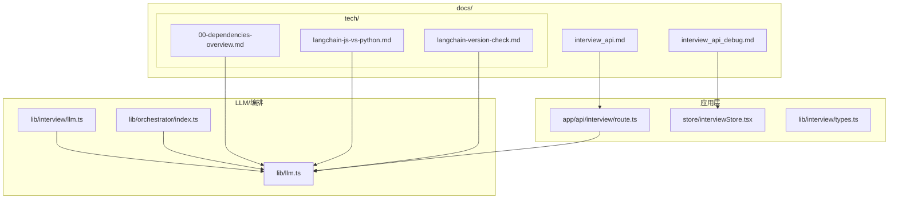
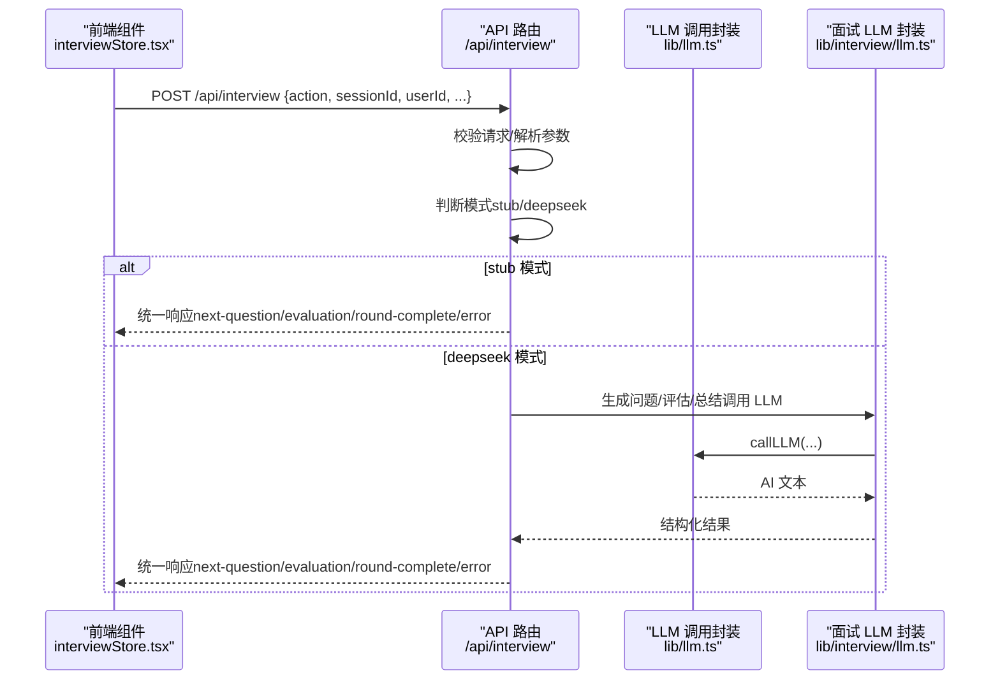
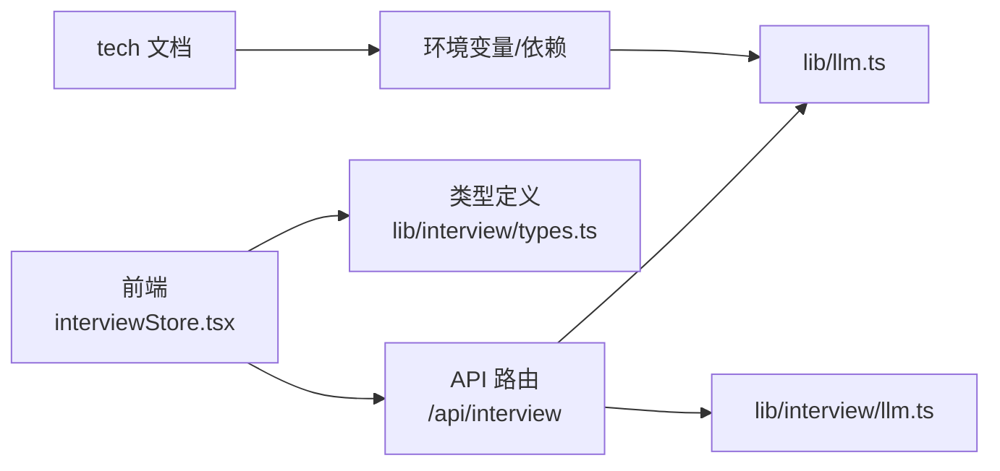

# docs 目录详解

<cite>
**本文引用的文件**
- [docs/interview_api.md](file://docs/interview_api.md)
- [docs/interview_api_debug.md](file://docs/interview_api_debug.md)
- [docs/tech/00-dependencies-overview.md](file://docs/tech/00-dependencies-overview.md)
- [docs/tech/langchain-js-vs-python.md](file://docs/tech/langchain-js-vs-python.md)
- [docs/tech/langchain-version-check.md](file://docs/tech/langchain-version-check.md)
- [app/api/interview/route.ts](file://app/api/interview/route.ts)
- [store/interviewStore.tsx](file://store/interviewStore.tsx)
- [lib/interview/types.ts](file://lib/interview/types.ts)
- [lib/llm.ts](file://lib/llm.ts)
- [lib/interview/llm.ts](file://lib/interview/llm.ts)
- [lib/orchestrator/index.ts](file://lib/orchestrator/index.ts)
</cite>

## 目录
1. [简介](#简介)
2. [项目结构](#项目结构)
3. [核心组件](#核心组件)
4. [架构总览](#架构总览)
5. [详细组件分析](#详细组件分析)
6. [依赖关系分析](#依赖关系分析)
7. [性能考量](#性能考量)
8. [故障排查指南](#故障排查指南)
9. [结论](#结论)
10. [附录](#附录)

## 简介
本文件系统性梳理 docs/ 目录的技术文档内容，重点围绕“模拟面试 API”接口规范与调试指南，辅以 tech/ 子目录下的依赖概览与 LangChain 版本对比，帮助开发者快速理解并搭建一致、可靠的开发环境；同时阐明该目录作为内部知识沉淀的价值，为新成员快速掌握系统关键路径（如面试流程、LLM 集成）提供支持。

## 项目结构
docs/ 目录由三部分组成：
- interview_api.md：统一的模拟面试 API 接口规范，覆盖请求/响应结构、动作类型、工作模式与错误处理。
- interview_api_debug.md：前端调试与测试指南，涵盖浏览器控制台测试、React 组件调试、Postman/curl 使用与常见问题排查。
- tech/：技术环境与依赖说明，包括依赖概览、LangChain JS vs Python 的选择分析、LangChain 版本检查与更新建议。

图表来源
- [docs/interview_api.md](file://docs/interview_api.md#L1-L342)
- [docs/interview_api_debug.md](file://docs/interview_api_debug.md#L1-L433)
- [docs/tech/00-dependencies-overview.md](file://docs/tech/00-dependencies-overview.md#L1-L179)
- [docs/tech/langchain-js-vs-python.md](file://docs/tech/langchain-js-vs-python.md#L1-L235)
- [docs/tech/langchain-version-check.md](file://docs/tech/langchain-version-check.md#L1-L75)
- [app/api/interview/route.ts](file://app/api/interview/route.ts#L1-L809)
- [store/interviewStore.tsx](file://store/interviewStore.tsx#L1-L789)
- [lib/interview/types.ts](file://lib/interview/types.ts#L1-L117)
- [lib/llm.ts](file://lib/llm.ts#L1-L163)
- [lib/interview/llm.ts](file://lib/interview/llm.ts#L1-L849)
- [lib/orchestrator/index.ts](file://lib/orchestrator/index.ts#L1-L126)

章节来源
- [docs/interview_api.md](file://docs/interview_api.md#L1-L342)
- [docs/interview_api_debug.md](file://docs/interview_api_debug.md#L1-L433)
- [docs/tech/00-dependencies-overview.md](file://docs/tech/00-dependencies-overview.md#L1-L179)
- [docs/tech/langchain-js-vs-python.md](file://docs/tech/langchain-js-vs-python.md#L1-L235)
- [docs/tech/langchain-version-check.md](file://docs/tech/langchain-version-check.md#L1-L75)

## 核心组件
- 模拟面试 API：统一入口 /api/interview，支持 start_round、answer、next_question、finish_round 四类动作；内置 stub 模式与 DeepSeek 模式，自动降级保证可用性。
- 前端状态与交互：interviewStore.tsx 提供面试流程的全局状态管理，与 API 交互并驱动 UI。
- LLM 调用与编排：lib/llm.ts 提供带超时与重试的 LLM 调用封装；lib/interview/llm.ts 提供面试场景专用的题目生成、评估与总结；lib/orchestrator/index.ts 保留多模型编排入口（当前禁用）。
- 类型与数据契约：lib/interview/types.ts 定义面试相关类型，确保前后端一致的数据结构。

章节来源
- [app/api/interview/route.ts](file://app/api/interview/route.ts#L1-L809)
- [store/interviewStore.tsx](file://store/interviewStore.tsx#L1-L789)
- [lib/llm.ts](file://lib/llm.ts#L1-L163)
- [lib/interview/llm.ts](file://lib/interview/llm.ts#L1-L849)
- [lib/orchestrator/index.ts](file://lib/orchestrator/index.ts#L1-L126)
- [lib/interview/types.ts](file://lib/interview/types.ts#L1-L117)

## 架构总览
面试流程从前端发起，经由 Next.js API Route 调用 LLM，返回统一响应结构，前端据此更新状态并渲染 UI。tech/ 文档为环境搭建与依赖管理提供参考。

图表来源
- [app/api/interview/route.ts](file://app/api/interview/route.ts#L675-L800)
- [lib/llm.ts](file://lib/llm.ts#L81-L163)
- [lib/interview/llm.ts](file://lib/interview/llm.ts#L246-L426)

## 详细组件分析

### 模拟面试 API 接口规范（interview_api.md）
- 端点与请求格式
  - 端点：POST /api/interview
  - 通用请求体字段：sessionId、userId、action（必需）、roundType、questionId、answer、recentMessages（可选）
  - 支持的动作：start_round、answer、next_question、finish_round
- 响应格式
  - 统一响应结构：type（next-question、evaluation、round-complete、error）、payload、debug（可选）
- 动作详情
  - start_round：返回首轮问题及 tips
  - answer：返回评估结果（accuracy、grammar、detail、confidence、tips）
  - next_question：返回下一道题或 round-complete
  - finish_round：返回总结（scores、highlights、gaps、practiceSuggestions）
- 工作模式
  - Stub 模式：无 DEEPSEEK_API_KEY 时启用，返回硬编码 mock 数据，便于开发与测试
  - DeepSeek 模式：有 DEEPSEEK_API_KEY 时启用，调用 LLM 生成动态内容；失败自动降级到 stub
- 轮次类型
  - 业务面、项目深挖、技术面、HR面、总监面
- 错误处理
  - 统一错误格式：type="error"，payload.message
  - 常见错误：400 缺少必需参数、500 服务器内部错误
- 与 interviewStore 的集成
  - API 返回的数据结构与 interviewStore 期望一致，便于直接消费

章节来源
- [docs/interview_api.md](file://docs/interview_api.md#L1-L342)
- [app/api/interview/route.ts](file://app/api/interview/route.ts#L1-L809)
- [store/interviewStore.tsx](file://store/interviewStore.tsx#L321-L739)

### 前端调试与测试（interview_api_debug.md）
- 快速开始
  - 检查 DEEPSEEK_API_KEY：有则使用 DeepSeek 模式，无则使用 Stub 模式
- 浏览器控制台测试
  - start_round、answer、next_question、finish_round 的 fetch 示例
  - 预期响应（Stub 模式）与字段校验
- React 组件调试
  - 使用 interviewStore 的方法（initInterview、loadRound、answerQuestion、getCurrentQuestion、questions）进行端到端测试
- Postman/curl
  - 提供 curl 示例，便于离线或自动化测试
- 调试技巧
  - 检查响应类型与 debug 字段
  - 验证数据结构（如 question.id、question.q、tips、evaluation 的范围）
  - 监控网络请求与响应时间
  - 检查 .env.local 中 DEEPSEEK_API_KEY
- 常见问题
  - 为什么返回 stub 数据？
  - 如何切换到 DeepSeek 模式？
  - 响应格式不符合预期？
  - 如何查看详细调试信息？

章节来源
- [docs/interview_api_debug.md](file://docs/interview_api_debug.md#L1-L433)
- [store/interviewStore.tsx](file://store/interviewStore.tsx#L372-L739)

### 技术环境与依赖（tech/）
- 依赖概览（00-dependencies-overview.md）
  - 核心架构依赖：LangChain、LangGraph、ChromaDB、HuggingFace Hub、PDF/DOCX 解析、文件上传、UUID、Zod、node-fetch、dotenv
  - 版本兼容性：Node.js 18+/20+/22+
  - 安装命令：npm/yarn
  - 架构说明：状态机驱动、共享 Memory、RAG 增强、模型适配（DeepSeek/Qwen/Baichuan/OpenAI）
- LangChain JS vs Python（langchain-js-vs-python.md）
  - 当前项目使用 JavaScript 版本的理由：架构一致性、类型安全、部署简单、开发效率、性能优势
  - Python 版本的优势：功能更完整、模型支持更丰富、数据处理能力强
  - 混合方案：保持 JS 主体，按需调用 Python 服务或微服务
  - 推荐：继续使用 JS 版本，必要时采用混合架构
- LangChain 版本检查（langchain-version-check.md）
  - 当前状态：langchain ^0.3.0，@langchain/langgraph ^0.2.0
  - 版本说明：JS/Python 版本独立维护，版本号不同步
  - 检查与更新：npm view、更新 package.json、安装验证
  - 兼容性：升级时需同步更新相关依赖

章节来源
- [docs/tech/00-dependencies-overview.md](file://docs/tech/00-dependencies-overview.md#L1-L179)
- [docs/tech/langchain-js-vs-python.md](file://docs/tech/langchain-js-vs-python.md#L1-L235)
- [docs/tech/langchain-version-check.md](file://docs/tech/langchain-version-check.md#L1-L75)

### LLM 调用与面试 LLM 封装
- lib/llm.ts
  - callLLM：统一的 LLM 调用封装，支持 DeepSeek/OpenAI，带超时与重试；显式 LLM_STUB=1 时返回 mock
  - 错误处理：鉴权错误、配额不足、超时等分类处理
- lib/interview/llm.ts
  - generateInterviewQuestions：生成面试题（支持 stub 模式自动降级）
  - evaluateAnswer：评估回答（支持 stub 模式自动降级）
  - summarizeInterview：生成面试总结（支持 stub 模式自动降级）
- lib/orchestrator/index.ts
  - 多模型编排入口（当前禁用），保留按阶段选择模型的结构

章节来源
- [lib/llm.ts](file://lib/llm.ts#L1-L163)
- [lib/interview/llm.ts](file://lib/interview/llm.ts#L1-L849)
- [lib/orchestrator/index.ts](file://lib/orchestrator/index.ts#L1-L126)

### 前端状态管理（interviewStore.tsx）
- 职责：管理面试会话、轮次、问题、对话与流程步骤；与 /api/interview 交互
- 关键方法：initInterview、loadRound、answerQuestion、setEvaluation、nextQuestion、completeRound、resetRound、getCurrentQuestion 等
- 与 API 的对接：buildRecentMessages、调用 fetch 发起请求、解析响应并更新状态

章节来源
- [store/interviewStore.tsx](file://store/interviewStore.tsx#L1-L789)

### 类型与数据契约（lib/interview/types.ts）
- 定义轮次类型、会话、题目、评估、答案、总结等类型
- 为面试 API 的请求/响应提供类型约束，确保前后端一致

章节来源
- [lib/interview/types.ts](file://lib/interview/types.ts#L1-L117)

## 依赖关系分析
- 前端依赖
  - interviewStore.tsx 依赖 /api/interview（Next.js API Routes）
  - interviewStore.tsx 依赖 interview 类型定义（lib/interview/types.ts）
- API 依赖
  - app/api/interview/route.ts 依赖 lib/llm.ts（统一 LLM 调用）
  - app/api/interview/route.ts 依赖 lib/interview/llm.ts（面试场景专用）
- LLM 依赖
  - lib/llm.ts 依赖环境变量（DEEPSEEK_API_KEY、OPENAI_API_KEY、LLM_STUB）
  - lib/interview/llm.ts 依赖 lib/llm.ts
- 技术文档依赖
  - tech/ 文档为环境搭建与依赖管理提供参考，影响 LLM 调用与 API 行为（如 stub 模式）

图表来源
- [store/interviewStore.tsx](file://store/interviewStore.tsx#L372-L739)
- [app/api/interview/route.ts](file://app/api/interview/route.ts#L675-L800)
- [lib/llm.ts](file://lib/llm.ts#L81-L163)
- [lib/interview/llm.ts](file://lib/interview/llm.ts#L246-L426)
- [lib/interview/types.ts](file://lib/interview/types.ts#L1-L117)
- [docs/tech/00-dependencies-overview.md](file://docs/tech/00-dependencies-overview.md#L1-L179)

## 性能考量
- 模式选择
  - Stub 模式：无需网络调用，响应快，适合开发与测试
  - DeepSeek 模式：动态生成内容，可能有网络延迟与超时风险，需合理设置超时与重试
- 超时与重试
  - lib/llm.ts 提供统一的超时与重试机制，避免阻塞与抖动
- 降级策略
  - API 层在 DeepSeek 调用失败时自动降级到 stub，保障服务可用性
- 建议
  - 开发阶段优先使用 Stub 模式，提高迭代速度
  - 生产环境配置合理的超时与重试参数，避免长尾请求

[本节为通用指导，不直接分析具体文件]

## 故障排查指南
- 症状：返回 stub 数据
  - 检查 .env.local 是否配置 DEEPSEEK_API_KEY
  - 若需显式 stub，可在环境变量中设置 LLM_STUB=1
- 症状：响应格式不符合预期
  - 检查 data.type 字段，确保是 next-question、evaluation、round-complete 或 error
  - 校验 payload 字段（如 question.id、question.q、tips、evaluation 的范围）
- 症状：网络请求耗时过长
  - 检查网络状况与 LLM 服务可用性
  - 调整超时与重试参数（lib/llm.ts）
- 症状：API 报错
  - 查看统一错误格式：type="error"，payload.message
  - 常见原因：缺少 action、参数无效、鉴权失败、配额不足、超时

章节来源
- [docs/interview_api_debug.md](file://docs/interview_api_debug.md#L281-L353)
- [lib/llm.ts](file://lib/llm.ts#L1-L163)
- [app/api/interview/route.ts](file://app/api/interview/route.ts#L675-L800)

## 结论
docs/ 目录为开发者提供了从接口规范到调试实践、从依赖概览到 LangChain 版本策略的完整知识体系。通过遵循 interview_api.md 的接口约定与 interview_api_debug.md 的调试流程，结合 tech/ 文档的环境与依赖说明，新成员能够快速理解并参与面试流程与 LLM 集成的关键路径，提升开发效率与系统稳定性。

[本节为总结性内容，不直接分析具体文件]

## 附录
- 快速对照
  - 接口规范：参见 [docs/interview_api.md](file://docs/interview_api.md#L1-L342)
  - 调试指南：参见 [docs/interview_api_debug.md](file://docs/interview_api_debug.md#L1-L433)
  - 依赖概览：参见 [docs/tech/00-dependencies-overview.md](file://docs/tech/00-dependencies-overview.md#L1-L179)
  - LangChain 选择：参见 [docs/tech/langchain-js-vs-python.md](file://docs/tech/langchain-js-vs-python.md#L1-L235)
  - 版本检查：参见 [docs/tech/langchain-version-check.md](file://docs/tech/langchain-version-check.md#L1-L75)
- 关键实现参考
  - API 路由：参见 [app/api/interview/route.ts](file://app/api/interview/route.ts#L1-L809)
  - 前端状态：参见 [store/interviewStore.tsx](file://store/interviewStore.tsx#L1-L789)
  - LLM 调用：参见 [lib/llm.ts](file://lib/llm.ts#L1-L163)
  - 面试 LLM 封装：参见 [lib/interview/llm.ts](file://lib/interview/llm.ts#L1-L849)
  - 类型定义：参见 [lib/interview/types.ts](file://lib/interview/types.ts#L1-L117)