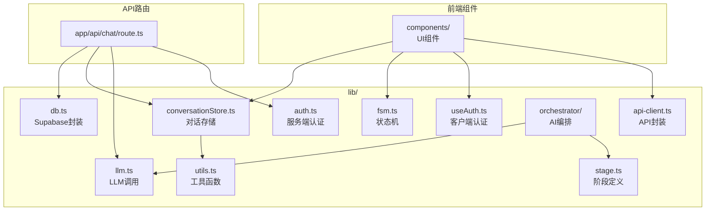
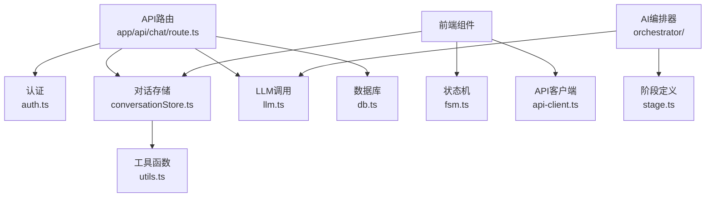

# lib 目录详解

<cite>
**本文档引用的文件**   
- [db.ts](file://lib/db.ts)
- [stage.ts](file://lib/stage.ts)
- [conversationStore.ts](file://lib/conversationStore.ts)
- [orchestrator/stageAgent.ts](file://lib/orchestrator/stageAgent.ts)
- [orchestrator/index.ts](file://lib/orchestrator/index.ts)
- [orchestrator/models/career_planning.ts](file://lib/orchestrator/models/career_planning.ts)
- [orchestrator/prompts/career_planning.ts](file://lib/orchestrator/prompts/career_planning.ts)
- [fsm.ts](file://lib/fsm.ts)
- [auth.ts](file://lib/auth.ts)
- [useAuth.ts](file://lib/useAuth.ts)
- [api-client.ts](file://lib/api-client.ts)
- [llm.ts](file://lib/llm.ts)
- [utils.ts](file://lib/utils.ts)
- [app/api/chat/route.ts](file://app/api/chat/route.ts)
</cite>

## 目录

1. [项目结构](#项目结构)
2. [核心模块分析](#核心模块分析)
3. [状态机与流程控制](#状态机与流程控制)
4. [对话状态管理](#对话状态管理)
5. [AI行为编排机制](#ai行为编排机制)
6. [认证与安全机制](#认证与安全机制)
7. [服务分层与依赖关系](#服务分层与依赖关系)

## 项目结构

`lib/` 目录作为业务逻辑核心层，集中管理数据库操作、用户状态、对话存储、AI编排、认证等关键功能。其设计体现了清晰的服务分层架构。

**图示来源**
- [db.ts](file://lib/db.ts)
- [stage.ts](file://lib/stage.ts)
- [conversationStore.ts](file://lib/conversationStore.ts)
- [fsm.ts](file://lib/fsm.ts)
- [auth.ts](file://lib/auth.ts)
- [useAuth.ts](file://lib/useAuth.ts)
- [api-client.ts](file://lib/api-client.ts)
- [orchestrator/index.ts](file://lib/orchestrator/index.ts)
- [llm.ts](file://lib/llm.ts)
- [utils.ts](file://lib/utils.ts)
- [app/api/chat/route.ts](file://app/api/chat/route.ts)

**本节来源**
- [lib/](file://lib/)
- [app/api/chat/route.ts](file://app/api/chat/route.ts)

## 核心模块分析

### 数据库操作封装 (db.ts)

`db.ts` 文件实现了对 Supabase 数据库操作的统一封装，为应用提供持久化能力。其设计考虑了 Vercel 部署的兼容性，仅使用 Supabase 客户端。

- **客户端初始化**：`getDbClient()` 函数通过环境变量 `SUPABASE_URL` 和 `SUPABASE_ANON_KEY` 创建 Supabase 客户端，并将其包装为自定义的 `DbClient` 类型。若数据库不可用，函数返回 `null` 并记录警告，允许应用降级使用 `localStorage`。
- **数据表操作**：封装了对 `conversation_messages`、`whiteboard_states`、`user_progress` 和 `resumes` 四张核心数据表的 CRUD 操作。
  - `saveMessage` / `getMessages`：管理会话消息的持久化。
  - `saveWhiteboard` / `getWhiteboard`：管理白板状态的持久化，使用 `upsert` 操作并包含冲突处理逻辑。
  - `setUserStage` / `getUserStage`：管理用户当前求职阶段的持久化。
  - `saveResume`：生成 UUID 保存简历解析结果。

该模块通过返回 `Promise<void>` 和 `Promise<T[]>` 等类型，确保了异步操作的类型安全，并在错误时抛出异常，由上层调用者处理。

**本节来源**
- [db.ts](file://lib/db.ts)

### 用户阶段状态机 (stage.ts)

`stage.ts` 文件定义了用户求职流程的有限状态机模型，是整个应用流程控制的核心。

- **阶段类型定义**：`UserStage` 联合类型枚举了用户可能经历的七个求职阶段：职业规划、项目梳理、简历优化、投递策略、模拟面试、薪资沟通和 Offer。
- **阶段顺序**：`StageOrder` 数组定义了阶段的线性流程顺序，为 `getNextStage` 和 `getPrevStage` 函数提供了依据。
- **辅助函数**：
  - `getNextStage` / `getPrevStage`：根据当前阶段和 `StageOrder` 计算下一个或上一个阶段，用于流程导航。
  - `isValidStage`：类型谓词函数，用于运行时验证字符串是否为有效的 `UserStage`，确保数据安全。

此模块为上层的状态机和 AI 编排提供了基础的数据结构和逻辑。

**本节来源**
- [stage.ts](file://lib/stage.ts)

## 状态机与流程控制

### 前端状态机实现 (fsm.ts)

`fsm.ts` 文件在客户端实现了基于 React Hook 的有限状态机，用于管理用户在前端界面的导航状态。

- **Hook 设计**：`useStageFSM` 是一个自定义 Hook，接收初始阶段作为参数，返回一个包含当前状态、历史记录和转换方法的对象。
- **状态转换**：`transition` 函数接受目标阶段（支持字符串映射），验证其有效性后更新状态，并将新状态推入历史栈。它通过 `STAGE_ORDER` 和 `stageMap` 对象处理不同命名约定的阶段。
- **历史管理**：使用 `useRef` 存储状态历史，支持 `back` 操作以返回上一状态，并通过 `canGoBack` 提供回退能力的判断。
- **性能优化**：返回对象使用 `useMemo` 进行缓存，避免不必要的组件重渲染。

该 Hook 被前端组件（如 `StageController`）使用，实现了用户在不同求职阶段间的平滑切换。

**本节来源**
- [fsm.ts](file://lib/fsm.ts)

## 对话状态管理

### 基于 Zustand 的对话存储 (conversationStore.ts)

`conversationStore.ts` 实现了一个单例模式的对话存储管理器，负责在内存和 `localStorage` 中维护用户的对话历史。

- **数据结构**：`StageConversations` 类型是一个以 `UserStage` 为键、消息数组为值的映射，确保每个阶段的对话历史独立存储。
- **核心方法**：
  - `addMessage` / `getStageHistory`：向指定阶段添加消息或获取其历史。
  - `getAllHistoryForStage`：为 AI 提供上下文，按阶段顺序合并所有历史消息，并插入阶段分隔标记，帮助 AI 理解上下文。
  - `setUserId`：设置当前用户 ID，并触发从 `localStorage` 加载该用户的对话历史。
- **持久化**：通过 `saveToLocalStorage` 和 `loadFromLocalStorage` 方法，将对话数据与用户 ID 关联，实现跨会话的持久化。`clearUserData` 方法用于用户登出时清理数据。

该模块是连接前端 UI 和后端数据库的桥梁，前端组件订阅其状态以更新 UI，而 `db.ts` 模块则负责将其数据同步到远程数据库。

**本节来源**
- [conversationStore.ts](file://lib/conversationStore.ts)

## AI行为编排机制

### 动态AI行为调度 (orchestrator/)

`orchestrator/` 模块是 AI 行为的核心调度中心，根据用户当前阶段动态选择并执行相应的 AI 模型。

- **编排器入口**：`index.ts` 中的 `runOrchestrator` 函数是主要入口，接收用户阶段和消息历史，理论上应通过 `switch` 语句路由到不同的模型函数（如 `runDeepSeekCareer`）。
- **阶段代理**：`stageAgent.ts` 中的 `runStageModel` 函数提供了更细粒度的路由，同样基于阶段选择模型。`normalizeStage` 函数用于处理阶段名称的变体。
- **模型实现**：每个模型（如 `career_planning.ts`）都封装了特定领域的逻辑：
  - **系统提示词**：通过 `prompts/` 目录下的文件（如 `CAREER_PLANNING_SYSTEM_PROMPT`）注入领域知识和行为规范。
  - **LLM 调用**：使用 `callLLM` 函数调用大语言模型。
  - **结构化输出**：解析模型回复，提取结构化数据（如 `intentRole`, `keySkills`），用于更新应用状态（如白板）。
- **当前状态**：代码中大量使用 `/* LangChain disabled */` 注释，表明该模块的完整功能（可能依赖 LangChain）已被禁用，目前 `runStageModel` 和 `runOrchestrator` 仅返回传入消息的回显（passthrough），作为占位实现。

尽管功能被禁用，其设计清晰地展示了“一个阶段，一个模型，一个提示词”的编排思想。

**本节来源**
- [orchestrator/index.ts](file://lib/orchestrator/index.ts)
- [orchestrator/stageAgent.ts](file://lib/orchestrator/stageAgent.ts)
- [orchestrator/models/career_planning.ts](file://lib/orchestrator/models/career_planning.ts)
- [orchestrator/prompts/career_planning.ts](file://lib/orchestrator/prompts/career_planning.ts)
- [llm.ts](file://lib/llm.ts)

## 认证与安全机制

### 认证流程处理

认证机制分为服务端和客户端两部分，共同保障应用安全。

- **服务端认证 (auth.ts)**：
  - `getCurrentUserFromRequest`：在 API 路由中使用，通过 `createRouteHandlerClient` 读取 Supabase 的认证 cookie，验证用户身份并返回用户 ID 和邮箱。
  - `getCurrentUserId`：便捷函数，仅返回用户 ID。
- **客户端认证 (useAuth.ts)**：
  - `useAuth` Hook：在客户端组件中使用，通过 `useEffect` 定期检查 `document.cookie` 中是否存在 Supabase 的会话 cookie 或 `localStorage` 中的 `sessionId` 和 `inviteCode`。若检查失败，则使用 `useRouter` 将用户重定向到登录页 `/login`。
- **API 安全封装 (api-client.ts)**：
  - `apiFetch` / `apiFetchJson`：封装了 `fetch` 请求，自动携带 `credentials: "include"` 以发送 cookie。当收到 `401` 响应时，自动弹出提示并重定向到登录页，实现了统一的未认证处理。

这种双端认证检查确保了即使客户端状态被篡改，服务端 API 仍能有效拦截未授权请求。

**本节来源**
- [auth.ts](file://lib/auth.ts)
- [useAuth.ts](file://lib/useAuth.ts)
- [api-client.ts](file://lib/api-client.ts)

## 服务分层与依赖关系

整个 `lib/` 目录体现了清晰的分层架构：

1.  **数据访问层 (DAL)**：`db.ts` 位于最底层，直接与 Supabase 交互。
2.  **状态管理层**：`conversationStore.ts` 和 `fsm.ts` 管理应用的客户端状态。
3.  **业务逻辑层 (BLL)**：`orchestrator/` 模块包含核心的 AI 业务逻辑。
4.  **认证与工具层**：`auth.ts`, `useAuth.ts`, `api-client.ts`, `utils.ts` 提供跨领域的支持功能。
5.  **API 接口层**：`app/api/chat/route.ts` 作为入口，协调调用 `auth.ts` 进行认证，调用 `conversationStore.ts` 获取上下文，调用 `llm.ts` 进行推理，并通过 `db.ts` 进行持久化。

各模块间依赖关系明确，低层模块不依赖高层模块，形成了稳定、可维护的代码结构。

**图示来源**
- [app/api/chat/route.ts](file://app/api/chat/route.ts)
- [auth.ts](file://lib/auth.ts)
- [conversationStore.ts](file://lib/conversationStore.ts)
- [llm.ts](file://lib/llm.ts)
- [db.ts](file://lib/db.ts)
- [utils.ts](file://lib/utils.ts)
- [fsm.ts](file://lib/fsm.ts)
- [api-client.ts](file://lib/api-client.ts)
- [orchestrator/index.ts](file://lib/orchestrator/index.ts)
- [stage.ts](file://lib/stage.ts)

**本节来源**
- [app/api/chat/route.ts](file://app/api/chat/route.ts)
- [lib/](file://lib/)