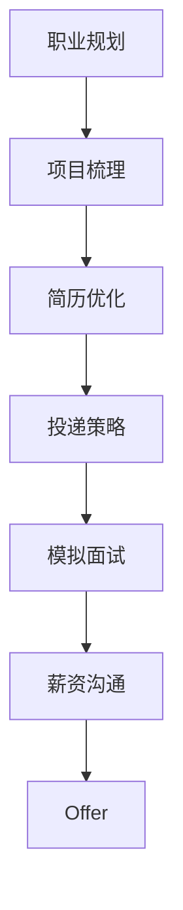
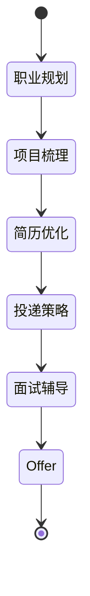
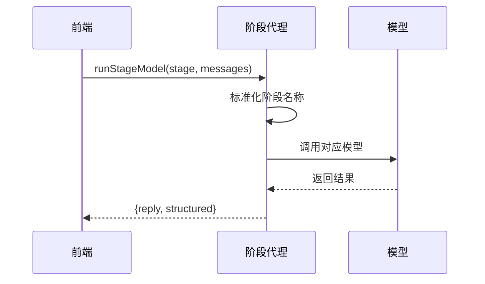
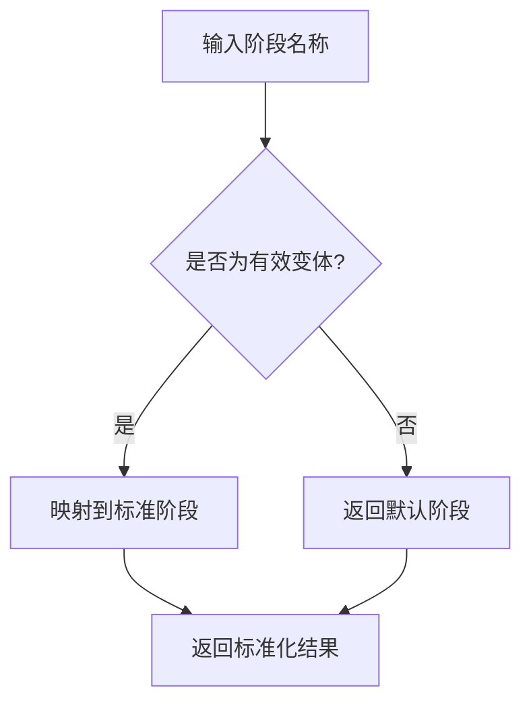
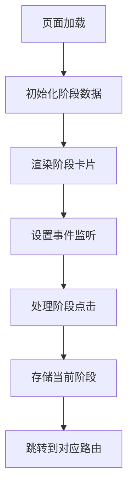
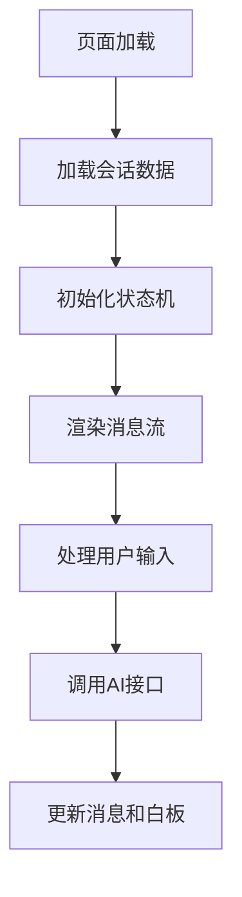

# 工作流控制

<cite>
**本文档引用的文件**   
- [stage.ts](file://lib/stage.ts)
- [fsm.ts](file://lib/fsm.ts)
- [stageAgent.ts](file://lib/orchestrator/stageAgent.ts)
- [page.tsx](file://app/onboarding/stage-select/page.tsx)
- [page.tsx](file://app/chat/page.tsx)
- [route.ts](file://app/api/chat/route.ts)
- [route.ts](file://app/api/stage-greeting/route.ts)
- [index.ts](file://lib/orchestrator/index.ts)
- [application_strategy.ts](file://lib/orchestrator/models/application_strategy.ts)
- [application_strategy.ts](file://lib/orchestrator/prompts/application_strategy.ts)
- [page.tsx](file://app/interview/start/page.tsx)
- [StageController.tsx](file://components/StageController.tsx)
- [StageSelector.tsx](file://components/StageSelector.tsx)
</cite>

## 目录
1. [引言](#引言)
2. [核心阶段定义](#核心阶段定义)
3. [有限状态机实现](#有限状态机实现)
4. [阶段代理调度机制](#阶段代理调度机制)
5. [前端状态流转](#前端状态流转)
6. [流程跳转与异常恢复](#流程跳转与异常恢复)
7. [状态持久化方案](#状态持久化方案)
8. [扩展新阶段的技术路径](#扩展新阶段的技术路径)
9. [总结](#总结)

## 引言
本项目通过一套完整的状态控制系统，实现了用户求职流程的智能化引导。系统采用分层架构设计，将阶段定义、状态管理、AI行为调度和前端交互分离，确保了流程的完整性和可扩展性。核心机制包括基于枚举的阶段定义、React Hook实现的有限状态机、动态模型调度的阶段代理，以及前后端协同的状态持久化方案。

## 核心阶段定义
系统通过`lib/stage.ts`文件定义了用户求职流程的七个核心阶段，这些阶段构成了用户与AI教练交互的基础框架。每个阶段都有明确的语义定义和顺序关系，确保了求职流程的逻辑完整性。



**图示来源**
- [stage.ts](file://lib/stage.ts#L6-L13)

**阶段定义与映射**

| 阶段标识 | 中文名称 | 阶段描述 |
|--------|--------|--------|
| career_planning | 职业规划 | 引导用户明确职业方向，确定目标岗位和求职意向 |
| project_review | 项目梳理 | 按照 STAR 格式帮助用户梳理项目经历，深挖项目细节、成果和影响 |
| resume_optimization | 简历优化 | 提供简历填写或优化建议，突出核心技能和项目成果 |
| application_strategy | 投递策略 | 制定简历投递策略，匹配目标岗位要求 |
| interview | 模拟面试 | 进行模拟面试并给出回答建议，提升面试表现 |
| salary_talk | 薪资沟通 | 制定薪资谈判策略，帮助用户获得理想薪资 |
| offer | Offer | 协助用户评估和选择 offer，提供决策建议 |

**阶段转换工具函数**

系统提供了`getNextStage`和`getPrevStage`两个工具函数，用于在阶段序列中进行前后导航。这些函数基于`StageOrder`数组的索引位置进行计算，确保了转换的正确性。

```typescript
export function getNextStage(current: UserStage): UserStage | null {
  const idx = StageOrder.indexOf(current);
  if (idx === -1 || idx === StageOrder.length - 1) return null;
  return StageOrder[idx + 1];
}

export function getPrevStage(current: UserStage): UserStage | null {
  const idx = StageOrder.indexOf(current);
  if (idx <= 0) return null;
  return StageOrder[idx - 1];
}
```

**阶段验证机制**

`isValidStage`函数用于验证给定的字符串是否为有效的阶段标识，通过检查其是否存在于`StageOrder`数组中来实现。

**本节来源**
- [stage.ts](file://lib/stage.ts#L6-L83)

## 有限状态机实现
系统在`lib/fsm.ts`中实现了一个基于React Hook的有限状态机（FSM），用于管理前端的阶段状态。这个状态机不仅维护当前状态，还记录了状态转换的历史，支持回退操作。



**图示来源**
- [fsm.ts](file://lib/fsm.ts#L5-L14)

**状态机接口定义**

状态机通过`StageFSM`接口定义了其公开的方法和属性：

```typescript
interface StageFSM {
  current: Stage;
  history: Stage[];
  transition: (stage: Stage | string) => boolean;
  back: () => boolean;
  getCurrent: () => Stage;
  getCurrentName: () => string;
  canGoBack: () => boolean;
}
```

**状态转换逻辑**

`transition`方法是状态机的核心，它处理了从字符串到阶段类型的映射，验证目标状态的有效性，并更新当前状态和历史记录。该方法使用`useCallback`进行优化，避免不必要的重新渲染。

```typescript
const transition = useCallback((stage: Stage | string): boolean => {
  // 字符串到阶段类型的映射
  const stageMap: Record<string, Stage> = {
    planning: "career",
    career: "career",
    project: "project",
    resume: "resume",
    apply: "apply",
    interview: "interview",
    salary: "offer",
    offer: "offer",
  };
  
  // 验证并执行状态转换
  if (!STAGE_ORDER.includes(targetStage)) {
    console.warn(`无效的阶段: ${stage}, 映射为: ${targetStage}`);
    return false;
  }
  
  if (targetStage === current) {
    return false;
  }
  
  setCurrent(targetStage);
  // 更新历史记录
  if (historyRef.current[historyRef.current.length - 1] !== targetStage) {
    historyRef.current.push(targetStage);
    // 限制历史记录长度
    if (historyRef.current.length > 10) {
      historyRef.current = historyRef.current.slice(-10);
    }
  }
  
  return true;
}, [current]);
```

**回退功能实现**

`back`方法允许用户返回到上一个状态，它通过操作历史记录栈来实现。当历史记录长度小于等于1时，无法回退。

**本节来源**
- [fsm.ts](file://lib/fsm.ts#L20-L123)

## 阶段代理调度机制
`lib/orchestrator/stageAgent.ts`文件实现了阶段代理的核心逻辑，根据用户当前阶段动态调度相应的AI模型。这一机制是系统智能化服务的关键，确保了不同阶段能够获得针对性的AI支持。



**图示来源**
- [stageAgent.ts](file://lib/orchestrator/stageAgent.ts#L35-L70)

**模型路由逻辑**

`runStageModel`函数是阶段代理的主要入口，它接收当前阶段和消息数组作为参数，根据阶段标识调用相应的模型处理函数。

```typescript
export async function runStageModel(
  stage: UserStage | string,
  messages: Array<{ role: "user" | "assistant"; content: string }>
) {
  // 标准化阶段名称
  const normalizedStage = normalizeStage(stage);

  switch (normalizedStage) {
    case "career_planning":
      return await runDeepSeekCareer(messages);
    case "project_review":
      return await runDeepSeekProjectReview(messages);
    // ... 其他阶段
    default:
      // 默认使用职业规划模型
      return await runDeepSeekCareer(messages);
  }
}
```

**阶段名称标准化**

`normalizeStage`函数处理了阶段名称的各种变体，将其映射到标准的`UserStage`类型，提高了系统的容错能力。



**本节来源**
- [stageAgent.ts](file://lib/orchestrator/stageAgent.ts#L73-L96)

## 前端状态流转
系统通过`app/onboarding/stage-select/page.tsx`和`app/chat/page.tsx`两个主要页面实现了前端的状态流转逻辑。这两个页面共同构成了用户与系统交互的主要界面。

**阶段选择页面**

`stage-select/page.tsx`页面提供了用户选择求职阶段的界面。该页面通过动态渲染阶段卡片和角色动画，为用户提供了直观的视觉引导。



**聊天页面**

`chat/page.tsx`页面是用户与AI教练交互的主要场所。该页面集成了消息流、白板、输入栏等多个组件，实现了丰富的交互体验。



**状态同步机制**

聊天页面通过`useEffect`钩子实现了状态的同步和持久化。当用户阶段发生变化时，系统会自动保存聊天记录并加载新阶段的内容。

```typescript
useEffect(() => {
  // 保存当前阶段的聊天记录
  saveStageChatHistory(userStage, messages);
  
  // 切换到选中的阶段
  setUserStage(stage);
  
  // 同步更新 FSM
  const fsmStage = fsmStageMap[stage];
  if (fsmStage) {
    fsm.transition(fsmStage);
  }
  
  // 加载该阶段的聊天记录
  loadStageChatHistory(stage);
}, [stage]);
```

**本节来源**
- [page.tsx](file://app/onboarding/stage-select/page.tsx#L28-L558)
- [page.tsx](file://app/chat/page.tsx#L13-L800)

## 流程跳转与异常恢复
系统实现了完善的流程跳转和异常恢复机制，确保了用户在各种情况下都能获得流畅的使用体验。

**跳转逻辑**

在`stage-select/page.tsx`中，系统通过`handleStageClick`函数处理阶段跳转。对于模拟面试阶段，系统会直接跳转到专门的面试页面，而对于其他阶段，则通过路由映射表进行跳转。

```typescript
async function handleStageClick(stage: StageItem) {
  // 获取 canonical key
  const canonicalKey = stagePromptKeyMap[stage.title] || stage.title;
  
  // 如果是模拟面试，直接跳转
  if (canonicalKey === "interview" || stage.title === "模拟面试") {
    localStorage.setItem("current_stage", "interview");
    router.push("/interview/start");
    return;
  }
  
  // 存储阶段信息
  localStorage.setItem("current_stage", canonicalKey);
  
  // 获取对应路由
  const route = STAGE_ROUTER_MAP[canonicalKey] || STAGE_ROUTER_MAP[stage.title] || "/chat";
  
  // 跳转到目标页面
  router.push(route);
}
```

**异常恢复**

系统在跳转过程中实现了异常恢复机制。当API调用失败时，系统会捕获异常并执行降级方案，确保用户操作不会中断。

```typescript
catch (err) {
  console.error("阶段初始化失败:", err);
  
  // 出错时跳转到默认路由
  const defaultRoute = STAGE_ROUTER_MAP[canonicalKey] || STAGE_ROUTER_MAP[stage.title] || "/chat";
  router.push(defaultRoute);
}
```

**本节来源**
- [page.tsx](file://app/onboarding/stage-select/page.tsx#L109-L180)

## 状态持久化方案
系统通过多种机制实现了用户状态的持久化，确保了用户数据的安全和连续性。

**本地存储**

系统使用`localStorage`来持久化用户的关键状态信息，包括当前阶段、聊天记录和白板数据。

```typescript
// 保存当前阶段
localStorage.setItem("ajc_userStage", userStage);

// 保存聊天记录
localStorage.setItem("ajc_chatHistory", JSON.stringify(chatHistory));

// 保存白板数据
localStorage.setItem("ajc_whiteboardData", JSON.stringify(whiteboardData));
```

**数据库同步**

除了本地存储，系统还通过API与后端数据库进行同步，确保了数据的可靠性和跨设备一致性。

```typescript
// 从数据库加载会话
const response = await fetch("/api/load-session", {
  method: "POST",
  headers: { "Content-Type": "application/json" },
  body: JSON.stringify({ userId, sessionId, inviteCode }),
});

// 保存白板数据到数据库
fetch("/api/save-whiteboard", {
  method: "POST",
  headers: { "Content-Type": "application/json" },
  body: JSON.stringify({ sessionId, whiteboard }),
});
```

**数据结构**

系统定义了清晰的数据结构来组织用户信息，包括消息、白板数据等。

```typescript
interface Message {
  id: string;
  content: string;
  isUser: boolean;
  timestamp: Date;
}

interface WhiteboardData {
  intentRole?: string;
  keySkills?: string[];
  starProjects?: Array<{ id: string; title: string; description: string }>;
  resumeInsights?: Array<{ id: string; insight: string }>;
  interviewReports?: Array<{ id: string; round: string; overallScore: number }>;
  targetCompanies?: Array<{ name: string; position: string }>;
  salaryStrategy?: string;
  offers?: Array<{ id: string; company: string; salary: string }>;
}
```

**本节来源**
- [page.tsx](file://app/chat/page.tsx#L43-L136)
- [page.tsx](file://app/chat/page.tsx#L286-L291)

## 扩展新阶段的技术路径
系统设计具有良好的可扩展性，添加新阶段相对简单且不会影响现有功能。

**阶段定义扩展**

要添加新阶段，首先需要在`stage.ts`中更新`UserStage`类型和`StageOrder`数组。

```typescript
export type UserStage =
  | "career_planning"
  | "project_review"
  | "resume_optimization"
  | "application_strategy"
  | "interview"
  | "salary_talk"
  | "offer"
  | "new_stage"; // 新增阶段

export const StageOrder: UserStage[] = [
  "career_planning",
  "project_review",
  "resume_optimization",
  "application_strategy",
  "interview",
  "salary_talk",
  "offer",
  "new_stage" // 新增阶段
];
```

**提示词配置**

在`lib/orchestrator/prompts/`目录下创建新的提示词文件，并在`STAGE_PROMPTS`映射中添加对应的配置。

```typescript
const STAGE_PROMPTS: Record<string, string> = {
  // ... existing prompts
  new_stage: `【角色设定】
你是一位专业的[新阶段]顾问。
你的任务是帮助用户完成[具体任务]。
...`
};
```

**模型实现**

在`lib/orchestrator/models/`目录下创建新的模型实现文件，定义具体的AI处理逻辑。

```typescript
export async function runDeepSeekNewStage(
  messages: Array<{ role: "user" | "assistant"; content: string }>
): Promise<NewStageResult> {
  // 构建消息数组
  const llmMessages = [
    { role: "system" as const, content: NEW_STAGE_SYSTEM_PROMPT },
    ...messages,
  ];

  // 调用 LLM
  const response = await callLLM(llmMessages, {
    temperature: 0.7,
    maxTokens: 600,
    provider: "deepseek",
  });

  return {
    reply: response,
    structured: {}
  };
}
```

**阶段代理集成**

在`stageAgent.ts`中导入新的模型实现，并在`runStageModel`函数的switch语句中添加新的case。

```typescript
import { runDeepSeekNewStage } from "./models/new_stage";

switch (normalizedStage) {
  // ... existing cases
  case "new_stage":
    return await runDeepSeekNewStage(messages);
}
```

**前端集成**

创建新的前端页面或组件，并在路由配置中添加相应的路径映射。

**本节来源**
- [stage.ts](file://lib/stage.ts#L6-L25)
- [route.ts](file://app/api/chat/route.ts#L9-L122)
- [stageAgent.ts](file://lib/orchestrator/stageAgent.ts#L35-L62)

## 总结
本系统通过精心设计的分层架构，实现了用户求职流程的智能化控制。核心的阶段定义和有限状态机确保了流程的完整性和正确性，而阶段代理机制则实现了AI行为的动态调度。前后端协同的状态持久化方案保证了用户体验的连续性，而模块化的设计使得系统具有良好的可扩展性。整体架构清晰，职责分离明确，为求职辅导类应用提供了优秀的参考实现。