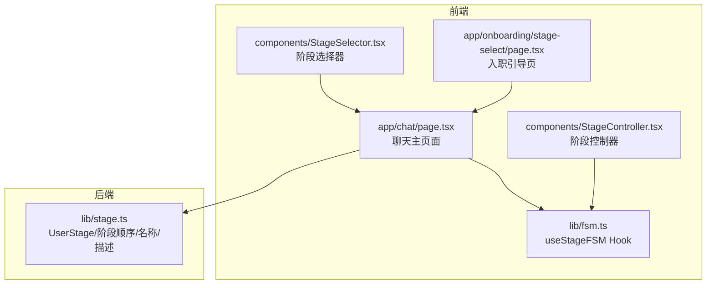
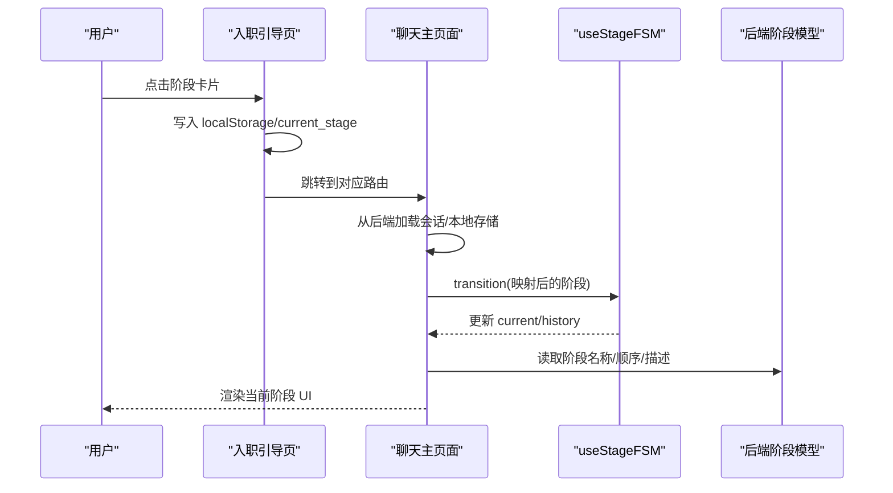
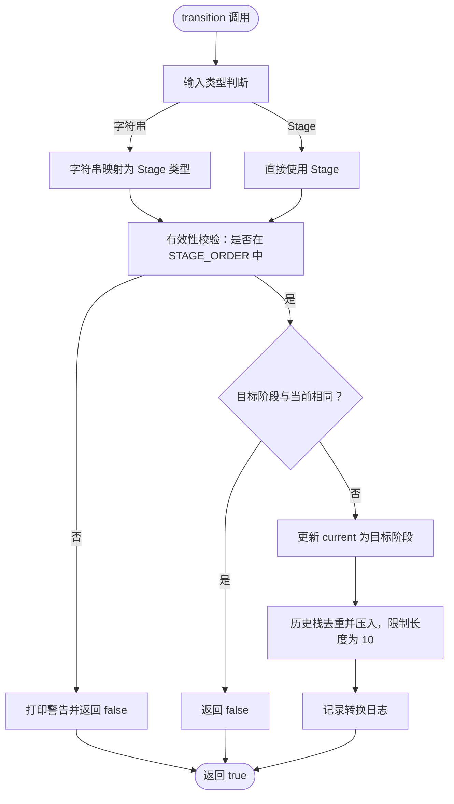
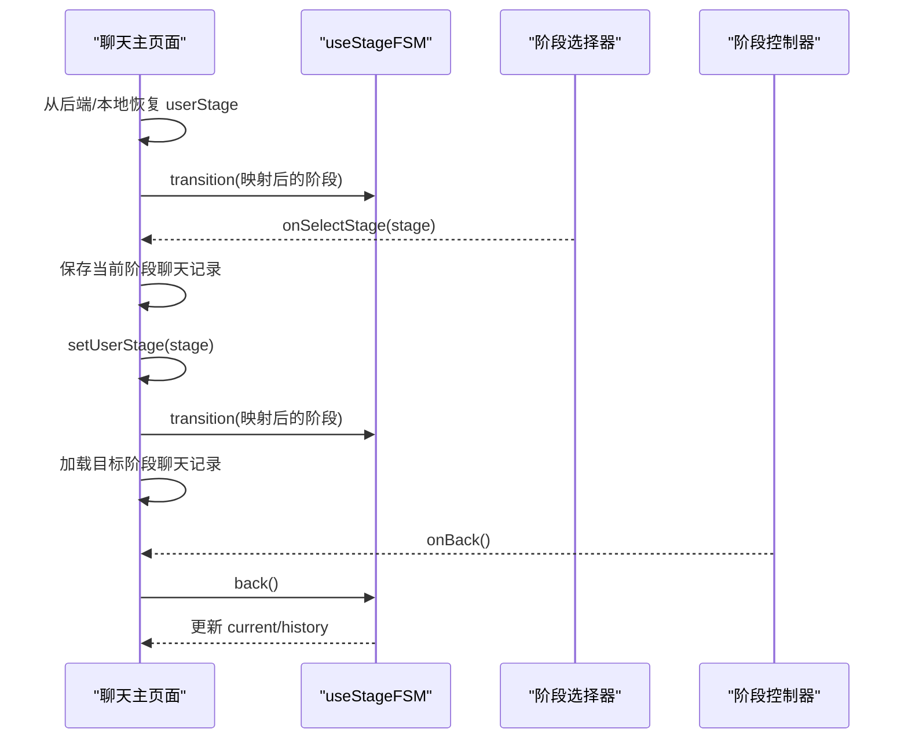
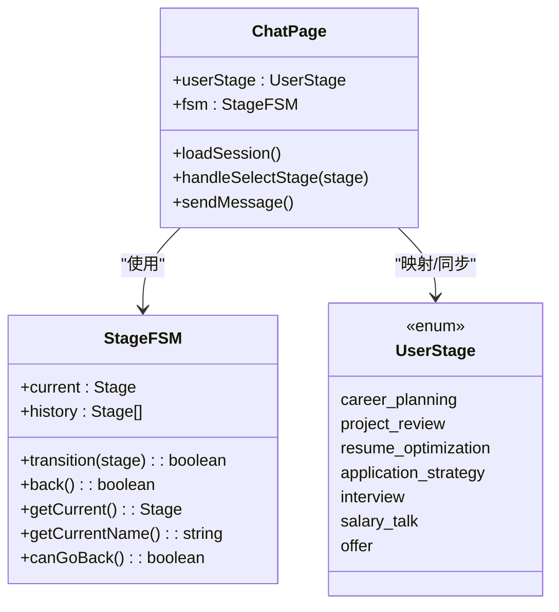
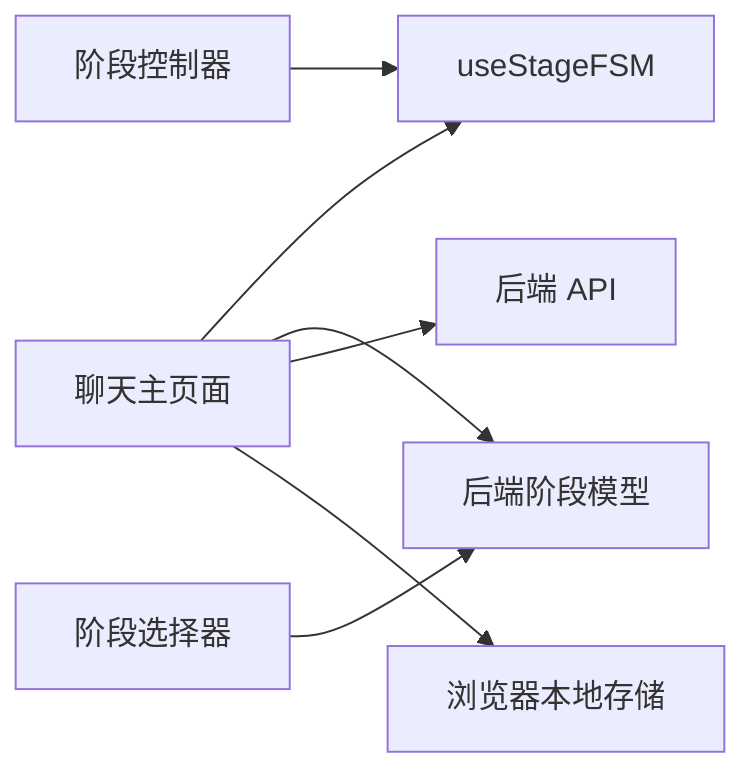

# 有限状态机实现

<cite>
**本文引用的文件**
- [lib/fsm.ts](file://lib/fsm.ts)
- [lib/stage.ts](file://lib/stage.ts)
- [app/chat/page.tsx](file://app/chat/page.tsx)
- [app/onboarding/stage-select/page.tsx](file://app/onboarding/stage-select/page.tsx)
- [components/StageController.tsx](file://components/StageController.tsx)
- [components/StageSelector.tsx](file://components/StageSelector.tsx)
</cite>

## 目录
1. [简介](#简介)
2. [项目结构](#项目结构)
3. [核心组件](#核心组件)
4. [架构总览](#架构总览)
5. [详细组件分析](#详细组件分析)
6. [依赖分析](#依赖分析)
7. [性能考量](#性能考量)
8. [故障排查指南](#故障排查指南)
9. [结论](#结论)

## 简介
本文件围绕基于 React Hooks 的有限状态机（StageFSM）进行深入解析，重点说明 useStageFSM Hook 如何通过 useState 和 useRef 管理阶段状态与历史记录；阐述 transition 方法的阶段映射逻辑（字符串到 Stage 类型的转换规则与有效性验证）；说明 back 方法的回退逻辑与历史栈管理策略；解释 getCurrent、canGoBack 等状态查询接口的实现。同时结合前端页面与组件的实际调用，展示如何利用该状态机实现用户流程导航，并分析其与后端 stage.ts 的映射关系与数据同步机制。

## 项目结构
本项目采用分层与功能模块化组织：
- lib/fsm.ts：前端侧的 StageFSM 实现，提供阶段状态与历史管理能力
- lib/stage.ts：后端侧阶段模型与工具函数（顺序、名称、描述、前后阶段推导、有效性校验）
- app/chat/page.tsx：聊天主页面，集成 FSM 并与后端 API 协作
- app/onboarding/stage-select/page.tsx：入职引导页，负责阶段入口与路由跳转
- components/StageController.tsx、StageSelector.tsx：阶段控制器与阶段选择器组件

图表来源
- [lib/fsm.ts](file://lib/fsm.ts#L1-L125)
- [lib/stage.ts](file://lib/stage.ts#L1-L85)
- [app/chat/page.tsx](file://app/chat/page.tsx#L1-L1114)
- [app/onboarding/stage-select/page.tsx](file://app/onboarding/stage-select/page.tsx#L1-L559)
- [components/StageController.tsx](file://components/StageController.tsx#L1-L76)
- [components/StageSelector.tsx](file://components/StageSelector.tsx#L1-L204)

章节来源
- [lib/fsm.ts](file://lib/fsm.ts#L1-L125)
- [lib/stage.ts](file://lib/stage.ts#L1-L85)
- [app/chat/page.tsx](file://app/chat/page.tsx#L1-L1114)
- [app/onboarding/stage-select/page.tsx](file://app/onboarding/stage-select/page.tsx#L1-L559)
- [components/StageController.tsx](file://components/StageController.tsx#L1-L76)
- [components/StageSelector.tsx](file://components/StageSelector.tsx#L1-L204)

## 核心组件
- useStageFSM Hook：提供 current、history、transition、back、getCurrent、getCurrentName、canGoBack 等接口，内部以 useState 管理当前阶段，以 useRef 维护历史栈
- StageFSM 接口：定义状态机对外暴露的方法签名
- STAGE_ORDER/STAGE_NAMES：前端阶段顺序与中文名称映射
- UserStage/StageOrder/StageNames/StageDescriptions：后端阶段模型与工具函数

章节来源
- [lib/fsm.ts](file://lib/fsm.ts#L1-L125)
- [lib/stage.ts](file://lib/stage.ts#L1-L85)

## 架构总览
前端通过 useStageFSM 在聊天主页面维护阶段状态，配合 StageController 展示当前阶段名称，StageSelector 提供阶段跳转入口；入职引导页负责将用户引导至不同阶段并触发相应 API。后端 stage.ts 提供阶段顺序、名称、描述与前后阶段推导，前端在与后端交互时进行阶段映射与有效性校验。

图表来源
- [app/onboarding/stage-select/page.tsx](file://app/onboarding/stage-select/page.tsx#L1-L559)
- [app/chat/page.tsx](file://app/chat/page.tsx#L1-L1114)
- [lib/fsm.ts](file://lib/fsm.ts#L1-L125)
- [lib/stage.ts](file://lib/stage.ts#L1-L85)

## 详细组件分析

### useStageFSM Hook 实现与状态管理
- 状态与历史
  - current：通过 useState 管理当前阶段
  - historyRef：通过 useRef 维护历史栈，避免每次渲染导致对象引用变化
- transition 方法
  - 字符串到 Stage 类型映射：将 API 返回的字符串（如 planning、career、project、resume、apply、interview、salary、offer）映射为前端 Stage 类型；若无法识别则回落为原值
  - 有效性验证：确保目标阶段属于 STAGE_ORDER，否则打印警告并返回 false
  - 相同阶段检测：若目标阶段与当前相同，直接返回 false
  - 状态转换：更新 current，并将目标阶段压入历史栈（去重），限制历史长度为 10
  - 日志输出：记录转换前后的中文名称
- back 方法
  - 若历史栈长度小于等于 1，返回 false
  - 弹出当前阶段，取历史栈倒数第二个阶段作为目标阶段，更新 current
  - 日志输出：记录回退前后的中文名称
- 查询接口
  - getCurrent：返回 current
  - getCurrentName：返回 STAGE_NAMES[current]
  - canGoBack：判断历史栈长度是否大于 1
- 返回对象稳定性
  - 使用 useMemo 包裹返回对象，稳定引用以减少子组件重渲染

图表来源
- [lib/fsm.ts](file://lib/fsm.ts#L30-L123)

章节来源
- [lib/fsm.ts](file://lib/fsm.ts#L1-L125)

### 阶段映射与有效性验证
- 字符串到 Stage 的映射规则
  - planning → career
  - career → career
  - project → project
  - resume → resume
  - apply → apply
  - interview → interview
  - salary → offer
  - offer → offer
- 有效性验证
  - 通过 STAGE_ORDER 包含性判断目标阶段是否合法
- 与后端阶段模型的映射关系
  - 前端 Stage：career、project、resume、apply、interview、offer
  - 后端 UserStage：career_planning、project_review、resume_optimization、application_strategy、interview、salary_talk、offer
  - 映射关系（聊天主页面中使用）：
    - career_planning → career
    - project_review → project
    - resume_optimization → resume
    - application_strategy → apply
    - interview → interview
    - salary_talk → offer
    - offer → offer

章节来源
- [lib/fsm.ts](file://lib/fsm.ts#L34-L84)
- [app/chat/page.tsx](file://app/chat/page.tsx#L107-L124)
- [app/chat/page.tsx](file://app/chat/page.tsx#L429-L441)
- [app/chat/page.tsx](file://app/chat/page.tsx#L935-L947)
- [lib/stage.ts](file://lib/stage.ts#L1-L85)

### 历史栈管理与回退逻辑
- 历史栈策略
  - 使用 useRef 维护 historyRef，避免每次渲染导致引用变化
  - 压入历史时进行去重，防止重复阶段多次入栈
  - 限制历史长度为 10，超出部分丢弃最旧记录
- back 方法
  - 当历史栈长度小于等于 1 时，返回 false
  - 弹出当前阶段，取历史栈倒数第二项作为目标阶段，更新 current
  - 返回 true 表示成功回退

章节来源
- [lib/fsm.ts](file://lib/fsm.ts#L73-L100)

### 状态查询接口实现
- getCurrent：返回当前阶段
- getCurrentName：返回当前阶段的中文名称
- canGoBack：判断历史栈长度是否大于 1

章节来源
- [lib/fsm.ts](file://lib/fsm.ts#L101-L112)

### 前端页面与组件中的实际调用

#### 聊天主页面（app/chat/page.tsx）
- 初始化与会话恢复
  - 从后端 /api/load-session 或本地存储恢复 userStage 与消息、白板数据
  - 若后端返回 currentStage，使用映射表将其转换为前端 Stage 并调用 fsm.transition
- 阶段选择与跳转
  - StageSelector 组件触发 handleSelectStage，保存当前阶段聊天记录，切换 userStage，映射并调用 fsm.transition，加载目标阶段聊天记录
- 阶段推进与回退
  - 当后端返回 shouldAdvance 且 nextStage 有效时，更新 userStage，并映射后调用 fsm.transition
  - StageController 通过 canGoBack 控制返回按钮显示
- 全局调试接口
  - 将 fsm 的 transition/back/getCurrent/getCurrentName/canGoBack 暴露到 window.fsm，便于控制台调试

图表来源
- [app/chat/page.tsx](file://app/chat/page.tsx#L1-L1114)
- [lib/fsm.ts](file://lib/fsm.ts#L1-L125)

章节来源
- [app/chat/page.tsx](file://app/chat/page.tsx#L1-L1114)
- [components/StageController.tsx](file://components/StageController.tsx#L1-L76)
- [components/StageSelector.tsx](file://components/StageSelector.tsx#L1-L204)

#### 入职引导页（app/onboarding/stage-select/page.tsx）
- 阶段入口与路由映射
  - 将中文标题映射为 canonical key（用于 API 与 localStorage）
  - 通过 STAGE_ROUTER_MAP 将 canonical key 或中文标题映射到路由
  - 某些阶段（如面试）直接跳转，不使用映射表
- 开场白获取
  - 对聊天相关路由，尝试调用 /api/chat 获取阶段开场白并存入 localStorage
- 本地存储
  - 将 canonical key 写入 localStorage.current_stage

章节来源
- [app/onboarding/stage-select/page.tsx](file://app/onboarding/stage-select/page.tsx#L1-L559)

### 与后端 stage.ts 的映射关系与数据同步机制
- 阶段模型
  - 后端 UserStage：career_planning、project_review、resume_optimization、application_strategy、interview、salary_talk、offer
  - StageOrder：按求职流程顺序排列
  - StageNames/StageDescriptions：阶段中文名称与描述
- 前后端数据同步
  - 前端从后端加载会话时，若返回 currentStage，使用映射表转换为前端 Stage 并调用 fsm.transition
  - 前端向后端发送消息时携带 userStage，以便后端选择对应提示词与逻辑
  - 前端将白板数据与聊天记录持久化到本地存储，并异步保存到后端 /api/save-whiteboard 与 /api/save-session

图表来源
- [lib/fsm.ts](file://lib/fsm.ts#L20-L123)
- [lib/stage.ts](file://lib/stage.ts#L1-L85)
- [app/chat/page.tsx](file://app/chat/page.tsx#L1-L1114)

章节来源
- [lib/stage.ts](file://lib/stage.ts#L1-L85)
- [app/chat/page.tsx](file://app/chat/page.tsx#L1-L1114)

## 依赖分析
- 组件耦合
  - ChatPage 依赖 useStageFSM 与后端阶段模型，负责阶段推进、回退与 UI 同步
  - StageController 依赖 FSM 的 getCurrentName 与 canGoBack
  - StageSelector 依赖后端阶段模型（StageOrder/StageNames/StageDescriptions），用于阶段状态展示
- 外部依赖
  - 后端 API：/api/load-session、/api/save-session、/api/save-whiteboard、/api/chat、/api/stage-greeting
  - 浏览器本地存储：localStorage（current_stage、ajc_userStage、ajc_chatHistory、ajc_whiteboardData）

图表来源
- [app/chat/page.tsx](file://app/chat/page.tsx#L1-L1114)
- [lib/fsm.ts](file://lib/fsm.ts#L1-L125)
- [lib/stage.ts](file://lib/stage.ts#L1-L85)

章节来源
- [app/chat/page.tsx](file://app/chat/page.tsx#L1-L1114)
- [lib/fsm.ts](file://lib/fsm.ts#L1-L125)
- [lib/stage.ts](file://lib/stage.ts#L1-L85)

## 性能考量
- 稳定对象引用
  - 使用 useMemo 包裹返回的 StageFSM 对象，避免子组件因引用变化而频繁重渲染
- 历史栈长度限制
  - 历史栈最大长度为 10，降低内存占用并保证回退操作的可控性
- 去重策略
  - 历史栈压入前进行去重，避免重复阶段多次入栈
- 异步保存
  - 白板数据与会话保存采用异步方式，避免阻塞 UI

[本节为通用性能讨论，无需列出具体文件来源]

## 故障排查指南
- transition 返回 false
  - 检查传入的阶段是否为有效值（属于 STAGE_ORDER）
  - 检查是否与当前阶段相同
  - 查看控制台警告信息
- back 返回 false
  - 检查历史栈长度是否大于 1
  - 确认历史栈是否被正确维护
- 阶段名称显示异常
  - 检查 STAGE_NAMES 与 getCurrentName 的调用
- 与后端数据不同步
  - 确认映射表是否正确（career_planning→career、project_review→project、resume_optimization→resume、application_strategy→apply、interview→interview、salary_talk→offer、offer→offer）
  - 检查 /api/load-session 与 /api/save-session 的返回与错误处理

章节来源
- [lib/fsm.ts](file://lib/fsm.ts#L56-L84)
- [lib/fsm.ts](file://lib/fsm.ts#L86-L100)
- [app/chat/page.tsx](file://app/chat/page.tsx#L107-L124)
- [app/chat/page.tsx](file://app/chat/page.tsx#L429-L441)
- [app/chat/page.tsx](file://app/chat/page.tsx#L935-L947)

## 结论
useStageFSM 通过 useState 与 useRef 简洁地实现了前端阶段状态与历史管理，提供了稳定的接口与良好的扩展性。其与后端阶段模型的映射清晰明确，配合聊天主页面的会话恢复与阶段推进逻辑，形成了完整的用户流程导航体系。通过合理的去重与长度限制策略，既保证了用户体验，又兼顾了性能与可维护性。