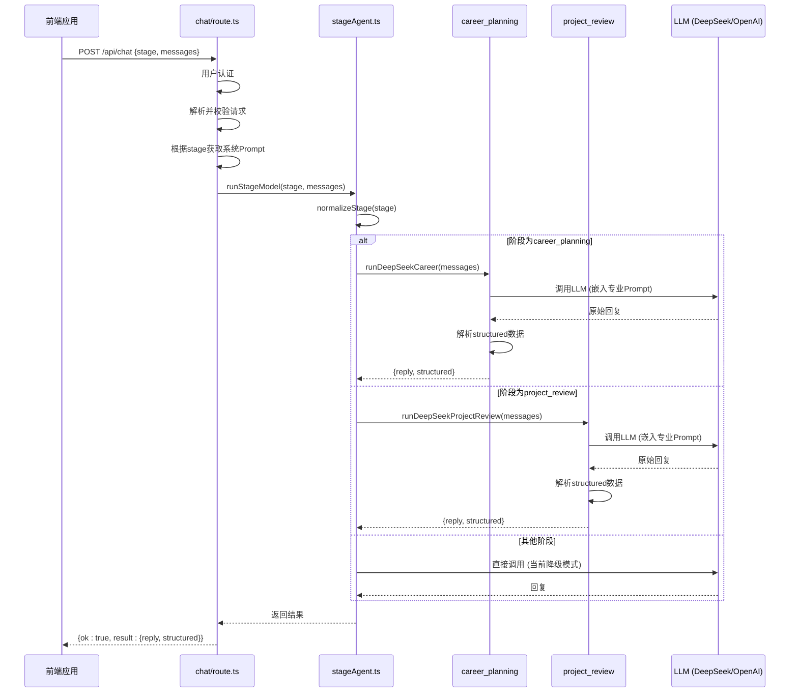

# 阶段代理路由

<cite>
**本文档引用文件**  
- [stageAgent.ts](file://lib/orchestrator/stageAgent.ts)
- [chat/route.ts](file://app/api/chat/route.ts)
- [career_planning.ts](file://lib/orchestrator/models/career_planning.ts)
- [project_review.ts](file://lib/orchestrator/models/project_review.ts)
- [interview.ts](file://lib/orchestrator/models/interview.ts)
- [application_strategy.ts](file://lib/orchestrator/models/application_strategy.ts)
- [resume_optimization.ts](file://lib/orchestrator/models/resume_optimization.ts)
- [salary_talk.ts](file://lib/orchestrator/models/salary_talk.ts)
- [offer.ts](file://lib/orchestrator/models/offer.ts)
- [prompts/career_planning.ts](file://lib/orchestrator/prompts/career_planning.ts)
- [prompts/project_review.ts](file://lib/orchestrator/prompts/project_review.ts)
- [prompts/interview.ts](file://lib/orchestrator/prompts/interview.ts)
- [llm.ts](file://lib/llm.ts)
</cite>

## 目录
1. [简介](#简介)
2. [核心路由机制](#核心路由机制)
3. [模型模块职责与提示词策略](#模型模块职责与提示词策略)
4. [结构化响应设计](#结构化响应设计)
5. [API调用上下文分析](#apicall-context)
6. [迁移指南：重新启用LangChain模块](#migration-guide)

## 简介
`stageAgent.ts` 中的 `runStageModel` 函数是AI求职教练系统的核心路由层，负责根据用户所处的职业发展阶段动态调用相应的AI模型处理函数。尽管当前代码中所有LangChain相关调用已被注释禁用，但其设计意图清晰：通过标准化阶段名称（normalizeStage）处理前端传入的多种输入变体，并在switch语句中精确路由到对应的模块（如runDeepSeekCareer、runDeepSeekInterview等）。该机制实现了对话流程的模块化与可扩展性，为不同求职阶段提供定制化的AI服务。

## 核心路由机制

`runStageModel` 函数作为统一的阶段代理路由器，接收用户当前阶段（`stage`）和对话消息数组（`messages`），并根据阶段类型决定调用哪个具体的AI模型函数。其核心设计包含三个关键环节：类型定义、标准化处理和条件路由。

首先，通过 `UserStage` 联合类型明确定义了系统支持的所有职业发展阶段，确保了阶段值的类型安全。当函数接收到阶段参数后，设计意图是调用 `normalizeStage` 函数进行标准化处理。该函数通过一个映射表（`stageMap`）将多种可能的输入变体（如 "career"、"career_planning"）统一映射到标准的阶段枚举值，解决了前端传参不一致的问题。

路由的核心是 `switch` 语句，它根据标准化后的阶段值，决定调用哪个具体的 `runDeepSeekXxx` 函数。这种设计实现了清晰的职责分离，每个阶段模型独立封装其业务逻辑。对于未知阶段，函数提供优雅的降级处理，自动回退到默认的“职业规划”模型，保证了系统的健壮性。

**当前状态**：由于LangChain被禁用，实际代码中整个路由逻辑被注释，函数直接返回传入的最后一条消息内容作为回复（passthrough），`structured` 字段为空对象。这表明系统目前处于调试或降级模式。

**Section sources**
- [stageAgent.ts](file://lib/orchestrator/stageAgent.ts#L18-L97)

## 模型模块职责与提示词策略

系统将不同的求职任务拆分为独立的模型模块，每个模块都遵循相同的实现模式：导入统一的LLM调用函数、加载特定的系统提示词、定义结构化响应类型，并实现一个异步处理函数。这种设计保证了代码的一致性和可维护性。

### 职业规划模块 (career_planning)
**职责边界**：引导用户明确职业方向，确定目标岗位，识别核心技能和优势。
**提示词注入策略**：使用 `CAREER_PLANNING_SYSTEM_PROMPT`，强调通过开放性问题深入了解用户的兴趣、能力和价值观，语气温和鼓励，输出简洁。
**Section sources**
- [career_planning.ts](file://lib/orchestrator/models/career_planning.ts)
- [prompts/career_planning.ts](file://lib/orchestrator/prompts/career_planning.ts)

### 项目梳理模块 (project_review)
**职责边界**：运用STAR法则（背景、任务、行动、结果）深度挖掘和梳理用户的项目经历，帮助提炼亮点。
**提示词注入策略**：使用 `PROJECT_REVIEW_SYSTEM_PROMPT`，要求模型针对每个项目逐一深挖STAR四要素，引导用户提供具体细节和量化成果。
**Section sources**
- [project_review.ts](file://lib/orchestrator/models/project_review.ts)
- [prompts/project_review.ts](file://lib/orchestrator/prompts/project_review.ts)

### 模拟面试模块 (interview)
**职责边界**：作为面试官进行模拟面试，评估用户回答，并提供专业反馈和改进建议。
**提示词注入策略**：使用 `INTERVIEW_SYSTEM_PROMPT`，要求模型设计针对性问题，使用STAR法则评估回答，并从准确性、完整性、逻辑性等维度评分。
**Section sources**
- [interview.ts](file://lib/orchestrator/models/interview.ts)
- [prompts/interview.ts](file://lib/orchestrator/prompts/interview.ts)

### 投递策略模块 (application_strategy)
**职责边界**：帮助用户确定目标公司列表，分析岗位匹配度，并制定投递优先级。
**提示词注入策略**：使用 `APPLICATION_STRATEGY_SYSTEM_PROMPT`，强调根据用户技能匹配目标公司，分析匹配度，并提供投递顺序建议。
**Section sources**
- [application_strategy.ts](file://lib/orchestrator/models/application_strategy.ts)
- [prompts/application_strategy.ts](file://lib/orchestrator/prompts/application_strategy.ts)

### 简历优化模块 (resume_optimization)
**职责边界**：诊断简历痛点，提供具体的改写示范，将口语化描述转化为专业术语。
**提示词注入策略**：提示词要求必须给出“修改前 vs 修改后”的直观对比，每次只聚焦一个具体段落进行打磨。
**Section sources**
- [resume_optimization.ts](file://lib/orchestrator/models/resume_optimization.ts)
- [prompts/resume_optimization.ts](file://lib/orchestrator/prompts/resume_optimization.ts)

### 薪资沟通模块 (salary_talk)
**职责边界**：提供薪资谈判策略，包括期望薪资范围、谈判要点和市场行情参考。
**提示词注入策略**：引导模型帮助用户明确自己的价值，并提供具体的谈判话术和策略点。
**Section sources**
- [salary_talk.ts](file://lib/orchestrator/models/salary_talk.ts)
- [prompts/salary_talk.ts](file://lib/orchestrator/prompts/salary_talk.ts)

### Offer评估模块 (offer)
**职责边界**：帮助用户评估收到的Offer，在薪资、发展空间、工作生活平衡等维度进行对比分析。
**提示词注入策略**：要求模型引导用户理清自己的核心诉求（如更看重钱、闲还是成长），并生成结构化的对比报告。
**Section sources**
- [offer.ts](file://lib/orchestrator/models/offer.ts)
- [prompts/offer.ts](file://lib/orchestrator/prompts/offer.ts)

## 结构化响应设计

每个模型模块都定义了特定的响应类型（如 `CareerPlanningResult`, `ProjectReviewResult`），其结构统一为：
```typescript
{
  reply: string; // AI生成的自然语言回复
  structured: { /* 模块特定的结构化数据 */ }
}
```
这种设计将自然语言交互与结构化数据提取相结合。`reply` 字段用于前端直接展示给用户，而 `structured` 字段则包含了从对话中解析出的关键信息，可供前端应用进行二次处理、持久化存储或用于后续的自动化流程。

例如，`career_planning` 模块的 `structured` 字段会尝试提取 `intentRole`（意向岗位）和 `keySkills`（核心技能）；`project_review` 模块则会提取完整的 `starProjects` 数组。这些结构化数据是实现“智能对话”而非“简单问答”的关键，使得系统能够记住用户的关键信息，并在后续对话中提供连贯的服务。

**Section sources**
- [career_planning.ts](file://lib/orchestrator/models/career_planning.ts#L8-L14)
- [project_review.ts](file://lib/orchestrator/models/project_review.ts#L8-L20)
- [interview.ts](file://lib/orchestrator/models/interview.ts#L8-L25)

## API调用上下文分析

`runStageModel` 的核心作用在 `app/api/chat/route.ts` 的POST接口中得以体现。该API是前端与AI模型交互的唯一入口。

1.  **认证与安全**：API首先通过 `getCurrentUserFromRequest` 进行用户认证，并严格阻止客户端提交API密钥，确保密钥安全。
2.  **请求解析与校验**：解析请求体，校验 `messages` 数组的有效性，并过滤非法消息。
3.  **系统提示词注入**：这是关键一步。API根据请求中的 `stage` 参数，通过 `getSystemPrompt` 函数查找并注入对应的系统提示词（如 `career`, `interview`）。这与 `stageAgent` 中每个模型加载自己的提示词是互补的，`stageAgent` 的提示词更深入、更专业，而API层的提示词更多是角色设定和基础指令。
4.  **调用路由层**：虽然当前代码直接调用 `callLLM`，但其设计意图是调用 `runStageModel(stage, messages)`。`runStageModel` 将作为中间层，根据 `stage` 决定是直接调用底层LLM，还是执行更复杂的、包含提示词注入和结构化解析的模型函数。
5.  **返回结果**：将AI的回复封装后返回给前端。



**Diagram sources**
- [chat/route.ts](file://app/api/chat/route.ts)
- [stageAgent.ts](file://lib/orchestrator/stageAgent.ts)
- [career_planning.ts](file://lib/orchestrator/models/career_planning.ts)

## 迁移指南：重新启用LangChain模块

要将系统从当前的降级模式恢复到完整的路由功能，需按以下步骤操作：

1.  **移除注释块**：删除 `stageAgent.ts` 文件中所有被 `/* LangChain disabled ... */` 和 `*/` 包裹的代码块。这将恢复 `import` 语句、`normalizeStage` 函数和 `runStageModel` 函数中的 `switch` 语句。
2.  **验证依赖**：确保 `lib/orchestrator/models/` 目录下的所有 `runDeepSeekXxx` 函数文件都存在且功能正常。检查它们对 `callLLM` 和各自 `SYSTEM_PROMPT` 的导入是否正确。
3.  **更新API调用**：修改 `app/api/chat/route.ts` 中的 `POST` 处理函数。将第222行 `const reply = await callLLM(messagesToSend);` 替换为：
    ```typescript
    // 假设已导入 runStageModel
    const result = await runStageModel(stage, messagesToSend);
    const reply = result.reply;
    ```
    这样，API层将把控制权交给 `runStageModel` 路由器，由其决定后续调用。
4.  **环境变量配置**：确保 `.env` 文件中正确配置了 `DEEPSEEK_API_KEY` 或 `OPENAI_API_KEY`，并根据 `callLLM` 函数中的 `provider` 参数选择正确的密钥。
5.  **测试与验证**：在不同阶段（career_planning, interview等）下进行端到端测试，验证：
    *   路由是否正确，`switch` 语句能否匹配到正确的模型函数。
    *   各模型函数是否能成功调用LLM并返回结果。
    *   `structured` 字段是否能按预期从回复中解析出结构化数据。
    *   前端是否能正确处理并展示 `reply` 和 `structured` 数据。

完成以上步骤后，系统的完整路由功能将被重新激活，实现根据不同求职阶段提供专业化、结构化AI服务的设计目标。

**Section sources**
- [stageAgent.ts](file://lib/orchestrator/stageAgent.ts)
- [chat/route.ts](file://app/api/chat/route.ts)
- [llm.ts](file://lib/llm.ts)